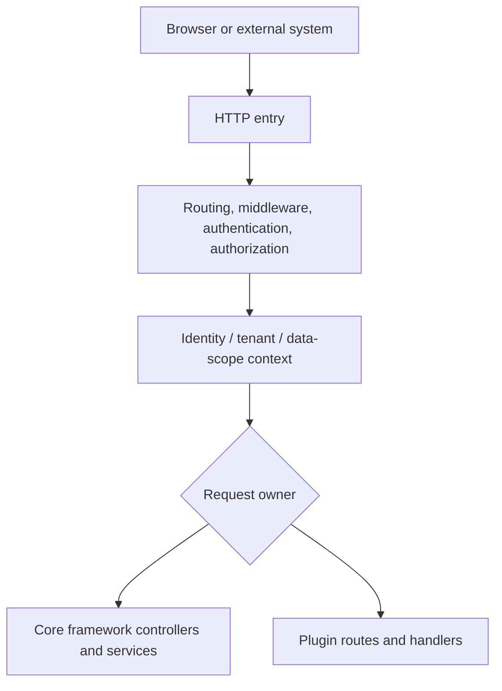

## Introduction

`lina-core` is the backend core framework of `LinaPro` and the stable foundation for platform-level capabilities. It owns the `HTTP` entry point, authentication, authorization, permission governance, runtime configuration, API documentation aggregation, scheduled tasks, internationalization, multi-tenant context, plugin governance, cluster coordination, and health probes.

This page explains where the core framework sits in the overall system and how it collaborates with other parts. It does not expand every capability's full configuration and usage details. Use the capability matrix below to jump into the dedicated pages when you need deeper guidance.

The core principle of `lina-core` is: **the core framework provides stable shared capabilities, and business domains extend through plugins**. The core framework does not directly embed project-specific business modules. Instead, it publishes stable extension surfaces through `pluginhost`, `pluginbridge`, and `pluginservice`, allowing source plugins and `WASM` dynamic plugins to enter a unified governance plane.

## Core Framework Boundaries

The core framework's job is not to contain every feature. Its job is to govern cross-business shared capabilities and provide a reusable runtime environment for business plugins.

| Scope | Core framework responsibility | Boundary |
|-------|-------------------------------|----------|
| <span style={{whiteSpace: 'nowrap'}}><strong>Platform control plane</strong></span> | Manage foundational resources such as users, roles, menus, sessions, configuration, files, plugins, and tasks | Does not carry industry-specific or project-specific business models |
| <span style={{whiteSpace: 'nowrap'}}><strong>Request flow</strong></span> | Handle routing, middleware, authentication, permissions, tenant context, data scope, and auditing in one chain | Does not place business rules in global middleware |
| <span style={{whiteSpace: 'nowrap'}}><strong>API extension</strong></span> | Publish `pluginhost` and `pluginservice` to source plugins, and `pluginbridge` plus `hostServices` to dynamic plugins | Plugins must not depend on core framework `internal/` implementation |
| <span style={{whiteSpace: 'nowrap'}}><strong>Runtime governance</strong></span> | Discover, install, enable, disable, upgrade, uninstall, sync menus and permissions, and refresh caches | Plugin domain logic, frontend pages, and private configuration remain plugin-owned |
| <span style={{whiteSpace: 'nowrap'}}><strong>Deployment coordination</strong></span> | Provide in-process coordination in single-node mode and connect to a cluster coordinator in cluster mode | Business data remains in the database and in plugin-owned table structures |

## Runtime Architecture

When a request enters the core framework, it first passes through the unified entry point and governance chain, then lands on either a core framework controller or a plugin route. Plugins see identity, tenant, permission, and configuration context prepared by the core framework, not internal core framework objects.



The main path shows how requests are governed and dispatched. Side dependencies are easier to understand through this table:

| Relationship | Description |
|--------------|-------------|
| Core framework service -> `PostgreSQL` | Stores users, roles, menus, configuration, plugin governance, task logs, session projections, and related data |
| Plugin handler -> `PostgreSQL` | Reads and writes plugin-owned tables; table structure and business data are owned by the plugin |
| Plugin handler -> `hostServices` | Dynamic plugins access authorized host capabilities such as configuration, storage, locks, and notifications through authorization snapshots |
| Core framework service -> cluster coordinator | In cluster mode, handles leader election, distributed locks, cache revisions, online-session hot state, and cross-node events |

## Directory Structure

`lina-core` is organized around contracts, controllers, services, declarative resources, and public extension interfaces:

```text
apps/lina-core/
├── api/                     # API DTOs and route contracts
├── internal/
│   ├── cmd/                 # Service startup, route binding, plugin scanning
│   ├── controller/          # HTTP controllers
│   ├── dao/                 # Data access objects
│   ├── model/               # Data models
│   ├── packed/              # Embedded core framework resources
│   └── service/             # Core framework internal services
│       ├── auth/            # Authentication service
│       ├── bizctx/          # Request identity and tenant context
│       ├── cron/            # Scheduling entry point
│       ├── i18n/            # Internationalization runtime
│       ├── plugin/          # Plugin governance and lifecycle
│       └── ...              # Other core services
├── manifest/
│   ├── config/              # Configuration templates and framework metadata
│   ├── i18n/                # Core framework runtime language packs
│   └── sql/                 # Core framework DDL and seed data
└── pkg/
    ├── pluginhost/          # Source plugin extension interfaces
    ├── pluginbridge/        # WASM dynamic plugin bridge protocol
    ├── pluginservice/       # Foundational capability implementations
    └── ...                  # Other public components
```

Directory boundaries also define development boundaries: core framework internals live under `internal/`, while plugins depend only on stable contracts published under `pkg/`.

## Built-in Platform Capabilities

The core framework provides many platform capabilities, but this overview keeps only the map. Each topic's configuration, data structures, development patterns, and caveats belong in the dedicated page.

| Capability | Core framework responsibility | Read more |
|------------|-------------------------------|-----------|
| <span style={{whiteSpace: 'nowrap'}}><strong>Routing and middleware</strong></span> | Register core framework `API` routes, host the unified plugin entry, and run authentication, permission, audit, and related middleware | <span style={{whiteSpace: 'nowrap'}}>[Routing and Middleware](/docs/routing)</span> |
| <span style={{whiteSpace: 'nowrap'}}><strong>Authentication and permissions</strong></span> | Issue and validate `JWT`s, maintain online sessions, and enforce API and menu permissions through `RBAC` | <span style={{whiteSpace: 'nowrap'}}>[Permission Management](/docs/permission)</span> |
| <span style={{whiteSpace: 'nowrap'}}><strong>Configuration</strong></span> | Load host configuration, expose a public host-config allowlist, and provide plugin-scoped configuration services | <span style={{whiteSpace: 'nowrap'}}>[Service Configuration](/docs/configuration)</span> |
| <span style={{whiteSpace: 'nowrap'}}><strong>API documentation</strong></span> | Aggregate `OpenAPI` contracts from the core framework, source plugins, and dynamic plugins, publish `/api.json`, and support workspace debugging | <span style={{whiteSpace: 'nowrap'}}>[Unified API Reference](/docs/api-reference)</span> |
| <span style={{whiteSpace: 'nowrap'}}><strong>Scheduled tasks</strong></span> | Manage persistent tasks, task handlers, execution logs, manual triggers, cluster execution scope, and concurrency strategies | <span style={{whiteSpace: 'nowrap'}}>[Scheduled Tasks](/docs/cron-tasks)</span> |
| <span style={{whiteSpace: 'nowrap'}}><strong>I18N internationalization</strong></span> | Load core framework language packs, merge plugin language packs, and provide multilingual resources for runtime copy and API docs | <span style={{whiteSpace: 'nowrap'}}>[Framework-Level I18N](/docs/i18n)</span> |
| <span style={{whiteSpace: 'nowrap'}}><strong>Multi-tenant foundation</strong></span> | Provide `bizctx`, identity snapshots, `tenant_id` filtering interfaces, and plugin multi-tenant metadata | <span style={{whiteSpace: 'nowrap'}}>[Native Multi-Tenancy](/docs/multi-tenant)</span> |
| <span style={{whiteSpace: 'nowrap'}}><strong>Plugin runtime</strong></span> | Discover plugin manifests, execute lifecycles, and project routes, menus, permissions, hooks, tasks, and public static assets | <span style={{whiteSpace: 'nowrap'}}>[Dual-Mode Plugin System](/docs/plugin-system)</span> |
| <span style={{whiteSpace: 'nowrap'}}><strong>Cluster coordination</strong></span> | In cluster mode, use the coordinator for leader election, distributed locks, cache revisions, key-value caches, and cross-node events | <span style={{whiteSpace: 'nowrap'}}>[Native Distributed Architecture](/docs/distributed-architecture)</span> |
| <span style={{whiteSpace: 'nowrap'}}><strong>Static assets</strong></span> | Serve embedded core framework resources, admin workspace assets, and plugin-declared public resources | <span style={{whiteSpace: 'nowrap'}}>[Static Assets and Frontend Assets](/docs/static-assets)</span> |

## Startup and Loading Flow

At startup, the core framework first establishes the host runtime, then connects plugin capabilities into the unified governance plane. This sequence is the recommended way to understand the relationship between the core framework and plugins:

1. Load configuration and framework metadata.
2. Initialize database connections and `DDL`.
3. Load core framework language packs.
4. Scan source plugin and dynamic plugin declarations.
5. Check plugin dependencies, versions, and governance resources.
6. Project routes, menus, permissions, `Hook`s, `Cron`s, and public assets.
7. Build runtime caches and cluster revision state.
8. Start scheduled task execution.
9. Start the `HTTP` service and health probes.

This flow reflects the core framework's orchestration role: it first makes its own control plane available, then turns plugin declarations into runtime capabilities. Plugin enablement, disablement, upgrade, and uninstallation follow the same governance pipeline to refresh routes, permissions, menus, language packs, API documentation, and caches.

## Relationship With Other Components

`lina-core` is the backend runtime center, but it does not monopolize system capability. It collaborates with other components through public contracts:

| Component | Collaboration model |
|-----------|---------------------|
| Admin workspace | Reads menus, permissions, configuration, plugin status, API documentation, and task data through public core framework `API`s |
| Source plugins | Compile with the core framework and register routes, hooks, tasks, lifecycle callbacks, and frontend assets through `pluginhost` |
| `WASM` dynamic plugins | Upload as runtime artifacts, process requests through `pluginbridge`, and access authorized capabilities through `hostServices` |
| `PostgreSQL` | Stores core framework governance data, plugin governance data, task logs, session projections, and plugin business tables |
| `Redis` coordinator | Handles leader election, locks, cache revisions, online-session hot state, and cross-node events in cluster mode |

From a dependency-direction perspective, the workspace and plugins depend on the core framework's public contracts. The core framework does not depend back on the internal implementation of any concrete business plugin.
