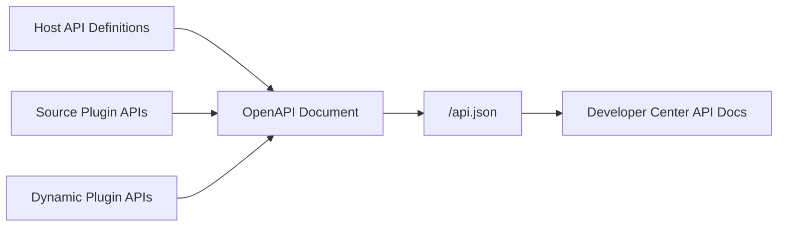

## Introduction

`lina-core` is `LinaPro`'s backend host and the stable foundation for all general platform capabilities. Built in `Go`, it provides `RESTful API` contracts, authentication, authorization, runtime configuration, API documentation, scheduling, internationalization, multi-tenant context, plugin lifecycle management, and cluster coordination.

The host's design principle: **the host provides general capabilities; business domains extend through plugins**. Therefore, `lina-core` does not bundle specific business modules directly — instead, it exposes stable extension seams for source plugins and `WASM` dynamic plugins to plug into.

## Directory Structure

```text
apps/lina-core/
├── api/                     # API DTOs and route contracts
├── internal/
│   ├── cmd/                 # Service startup, route binding, plugin scanning
│   ├── controller/          # HTTP controllers
│   └── service/             # Business service layer
│       ├── apidoc/          # OpenAPI document aggregation
│       ├── auth/            # Authentication service
│       ├── bizctx/          # Request identity and tenant context
│       ├── cluster/         # Cluster runtime state
│       ├── coordination/    # Redis coordination abstraction
│       ├── cron/            # Scheduling entry point
│       ├── i18n/            # Internationalization runtime
│       ├── jobmgmt/         # Persistent task management
│       └── plugin/          # Plugin governance and runtime
├── manifest/
│   ├── config/              # Configuration templates and framework metadata
│   ├── i18n/                # Host runtime language packs
│   └── sql/                 # Host DDL and seed data
└── pkg/
    ├── pluginhost/          # Source plugin extension seams
    ├── pluginbridge/        # WASM dynamic plugin bridge protocol
    ├── pluginservice/       # Host service contracts published to source plugins
    └── sourceupgrade/       # Source plugin runtime upgrade facade
```

## API Contract Layer

The host API layer uses `g.Meta` struct tags to declare paths, methods, permissions, summaries, and parameters. Interface definitions, permission identifiers, and documentation metadata share a single source, preventing documentation and implementation from diverging.

```go
type UserListReq struct {
    g.Meta   `path:"/users" method:"get" tags:"User" summary:"List users" permission:"user:list"`
    Page     int `json:"page" v:"min:1"`
    PageSize int `json:"pageSize" v:"min:1,max:100"`
}
```

This approach brings three advantages:

| Capability | Description |
|------------|-------------|
| **Centralized contracts** | Paths, methods, requests, responses, and permission declarations are all in the `api/` directory |
| **Auditable permissions** | `permission` identifiers bind directly to interfaces, facilitating role and button permission governance |
| **Generatable documentation** | The host automatically aggregates `OpenAPI` documents after startup |

## Governance Services

### Authentication and Sessions

The host uses `JWT` for request authentication. After a successful login, it issues a token whose validity is controlled by `jwt.expire`. The session service tracks online status, login time, device info, and expiry, and supports forced logout.

Key configuration:

```yaml
jwt:
  secret: "lina-jwt-secret-key-change-in-production"
  expire: 24h

session:
  timeout: 24h
  cleanupInterval: 5m
```

You must replace `jwt.secret` in production and avoid logging sensitive information.

### RBAC Authorization

`LinaPro` uses a declarative `RBAC` permission system. Roles acquire access scope through menus, pages, and button permissions. API requests are validated by authentication and permission middleware.

The permission topology is cached in the host runtime. After changes, it takes effect quickly through a cache revision mechanism. In cluster mode, the permission version is synchronized to each node through the coordination service.

### Operation Auditing

The host middleware audits write operations, recording the request path, operator, parameter summary, and execution result. Sensitive fields like passwords should be masked by middleware or the service layer to avoid being written to logs.

## Runtime Configuration

The host default configuration is located at:

```text
apps/lina-core/manifest/config/config.yaml
```

Main configuration groups:

| Group | Description |
|-------|-------------|
| `server` | `HTTP` listen address, route map dump, `/api.json` path |
| `logger` | Log path, level, structured logging, and `TraceID` |
| `database` | Default database connection; production recommends `PostgreSQL 14+` |
| `jwt` | Signing secret and token expiry |
| `session` | Online session timeout and cleanup interval |
| `scheduler` | Default timezone for scheduled tasks |
| `i18n` | Default language, multi-language toggle, and locale list |
| `cluster` | Single-node/cluster mode, `Redis` coordinator, and leader election lease |
| `upload` | File upload directory and single-file size limit |
| `plugin` | Force-uninstall policy, dynamic plugin artifact directory, and auto-enable plugins |

The database defaults to `PostgreSQL`:

```yaml
database:
  default:
    link: "pgsql:postgres:postgres@tcp(127.0.0.1:5432)/linapro?sslmode=disable"
```

`SQLite` is only suitable for single-node local demos or smoke testing — not recommended for production and does not support cluster deployment.

See [Configuration](/docs/configuration) for the full configuration groups, production checklist, and plugin auto-enable details.

## API Documentation Aggregation

After startup, the host automatically aggregates interfaces from the host and enabled plugins into an `OpenAPI` document:

```text
http://localhost:8080/api.json
```

The admin workspace embeds a browsing and debugging interface in "Developer Center → API Documentation." The API documentation shows request parameters, response structures, permission identifiers, and multi-language descriptions, facilitating frontend-backend integration.



API documentation translations are located in `manifest/i18n/<locale>/apidoc/`. When a plugin is enabled, its own API documentation translations are included in the aggregation.

See [API Reference](/docs/api-reference) for contract declarations, `permission` tags, and how source and dynamic plugin documentation is projected.

## Scheduling

The host provides a persistent scheduling subsystem where task configurations and execution logs are stored in the database. Tasks support two execution types:

| Type | Description | Use Case |
|------|-------------|----------|
| `Go` handler | Calls a handler registered by the host or a plugin | Data cleanup, statistics, synchronization |
| `Shell` command | Executes a system command | File processing, system maintenance scripts |

Source plugins can register custom task handlers through `pluginhost`, then select them as invocation targets in the admin workspace. Tasks also support grouping, manual triggering, pause/resume, timeout control, and execution logs.

In cluster mode, task scheduling behavior is controlled by execution scope:

| Scope | Description |
|-------|-------------|
| `master_only` | Only the primary node executes; suitable for globally unique tasks |
| `all_node` | Every node executes; suitable for node-local tasks |

See [Scheduled Tasks](/docs/cron-tasks) for built-in tasks, execution logs, concurrency strategies, and plugin task registration.

## Internationalization Runtime

The host ships `zh-CN` and `en-US` runtime language resources by default. Language packs are located at:

```text
apps/lina-core/manifest/i18n/<locale>/
```

Resources are split by semantic domain — for example, `menu.json`, `error.json`, `plugin.json`, `job.json`, and `apidoc/`. Plugins maintain their own language packs in `manifest/i18n/`, which the host automatically merges when the plugin is enabled.

I18N configuration example:

```yaml
i18n:
  default: zh-CN
  enabled: true
  locales:
    - locale: en-US
      nativeName: English
    - locale: zh-CN
      nativeName: 简体中文
```

After modifying language packs, restart the service in development. In production, use the runtime cache invalidation API to flush by language or plugin scope — avoid full flushes that cause brief translation flicker.

See [I18N Internationalization](/docs/i18n) for language pack directories, runtime resource loading, plugin language packs, and API documentation translation rules.

## Multi-Tenant Foundation

The host natively embeds multi-tenant foundation seams, but the full tenant control plane is provided by the official `multi-tenant` source plugin. When that plugin is not enabled, the system defaults to the `tenant_id = 0` platform tenant context, maintaining a single-tenant out-of-the-box experience.

| Layer | Responsibility |
|-------|---------------|
| Host | `bizctx` request context, identity snapshots, `tenant_id` filtering seam, plugin multi-tenant metadata |
| `multi-tenant` plugin | Tenant entities, membership, tenant resolution, tenant impersonation, tenant plugin governance |
| Tenant-aware plugins | Declare multi-tenant capabilities in their manifest and isolate data by `tenant_id` in their own tables |

The current isolation model is `Pool` shared-database, using `tenant_id` to distinguish data. `Schema-per-tenant`, `database-per-tenant`, quotas, billing, and branding are reserved for future evolution.

See [Multi-Tenancy](/docs/multi-tenant) for tenant context, tenant filter service, the `multi-tenant` plugin, and tenant-scoped plugin governance.

## Plugin Runtime

The host loads and governs two types of plugins through the plugin runtime:

- **Source plugins**: Compiled with the host, using `pluginhost` to register routes, hooks, scheduled tasks, and lifecycle callbacks.
- **`WASM` dynamic plugins**: Uploaded as runtime artifacts, using `pluginbridge` to handle requests in a sandbox, accessing authorized host capabilities through `hostServices`.

The plugin runtime handles manifest discovery, dependency checking, installation and upgrade SQL execution, menu permission synchronization, route and hook projection, cache refresh, and business entry control in abnormal states.

## Cluster Coordination

In single-node mode, the host runs with only `PostgreSQL` and in-process coordination. When cluster mode is enabled, a distributed coordinator must be configured (built-in support for `Redis`; users can adapt to other backends):

```yaml
cluster:
  enabled: true
  coordination: redis
  redis:
    address: "127.0.0.1:6379"
```

`Redis` handles leader election, distributed locks, cache revision, and cross-node events. `PostgreSQL` continues to handle business and governance data persistence. See [Native Distributed Architecture](/docs/distributed-architecture) for deployment details.

## Health Probes

The host provides a `/health` endpoint for load balancers, container orchestrators, and monitoring systems to check service status. It checks database connectivity by default, with a timeout controlled by `health.timeout`:

```yaml
health:
  timeout: 5s
```

The health probe returns standard `HTTP` status codes — `200` for normal, `503` for abnormal.
