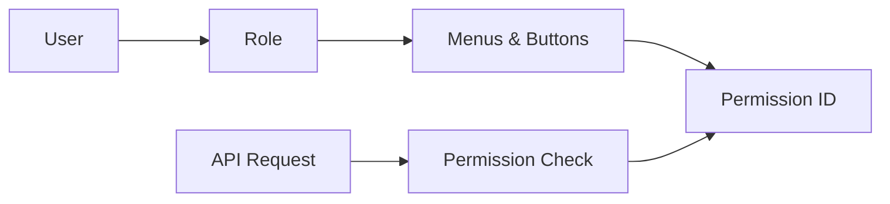
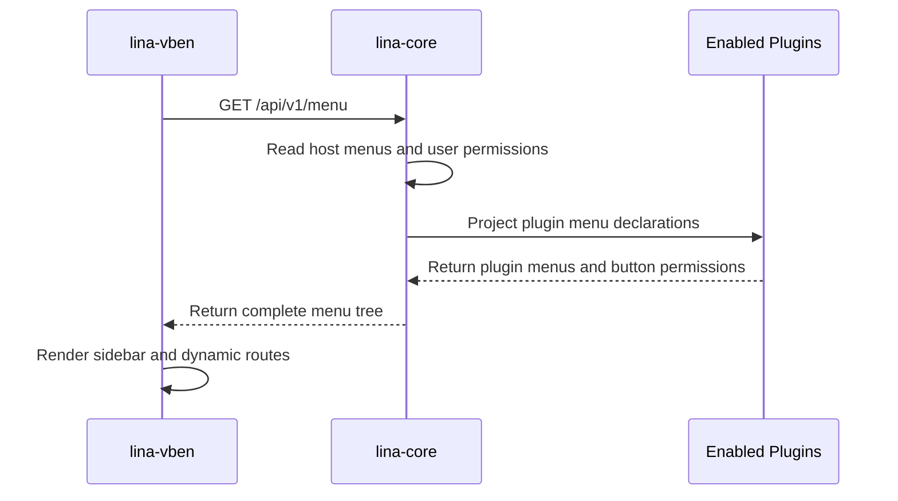

## Introduction

`lina-vben` is `LinaPro`'s built-in admin workspace, built on `Vue 3 + Vben5 + Ant Design Vue + TypeScript`. It is not the definer of business logic — it is the standard `UI` expression layer for the `lina-core` host `API` and all enabled plugin `APIs`.

Developers can build business applications directly on top of it, or replace it with a custom frontend. As long as the new frontend follows the host's public `RESTful API` and permission model, it can plug into the same backend capabilities.

## Technology Stack

| Technology | Description |
|------------|-------------|
| `Vue 3` | Frontend framework |
| `Vben5` | Enterprise-grade admin workspace foundation |
| `Ant Design Vue` | Admin UI component library |
| `TypeScript` | Type safety and frontend engineering quality |
| `Vite` | Frontend build tool |
| `Pinia` | Frontend state management |
| `TailwindCSS` | Utility-first CSS toolkit |

## Design Boundaries

### The workspace consumes contracts, not defines them

The workspace reads menus, permissions, users, roles, configuration, tasks, plugin status, and API documentation from the host. Interface behavior is defined by backend `API` contracts — the workspace only organizes the interaction experience.

### Menus come from host governance data

The sidebar is not a pure frontend hardcode. When the host returns the menu tree, it merges built-in menus with menus declared by enabled plugins, and filters based on the current user's permissions. When a plugin is disabled, its menu and route entries disappear automatically.

### Plugin pages load through a dynamic page shell

Both source plugins and dynamic plugins can declare frontend pages. The workspace loads plugin pages through the `system/plugin/dynamic-page` shell, reducing the need for plugins to modify workspace code.

## Functional Modules

The workspace provides visual entry points for host and plugin capabilities. Different modules have different backend owners, but users get a unified experience in the interface.

| Module | Key Capabilities | Source |
|--------|-----------------|--------|
| **Access control** | Users, roles, menus, button permissions, permission assignment | Host |
| **System settings** | Dictionaries, parameters, file management, runtime configuration | Host |
| **Job scheduling** | Tasks, groups, execution logs, manual triggers | Host |
| **Multi-tenant management** | Tenants, membership, tenant switching, tenant plugin governance | `multi-tenant` plugin |
| **Organization management** | Departments, positions | `org-center` plugin |
| **Content management** | Notices and announcements | `content-notice` plugin |
| **System monitoring** | Online users, service monitoring, operation logs, login logs | `monitor-*` plugins |
| **Extension center** | Plugin discovery, installation, enablement, disablement, upgrade, uninstallation | Host and plugin system |
| **Developer center** | API documentation, system information | Host |

## Access Control Experience

Access control revolves around the `RBAC` model:

User management, role management, and menu management handle accounts, authorization sets, and permission tree maintenance respectively. After a role selects menu or button permissions, the permission topology takes effect quickly. In cluster mode, the host notifies other nodes to refresh through a cache revision mechanism.

## Dynamic Plugin Menu Injection

The plugin menu injection flow:

This design lets plugin enablement, disablement, and permission changes be driven by host governance data, without the workspace needing to change code for each plugin.

## Extension Center

The Extension Center is the primary interface for plugin runtime governance. It displays plugin type, version, status, runtime upgrade status, dependencies, and available operations.

Common operations:

| Operation | Description |
|-----------|-------------|
| **Install** | Runs dependency checks, installation `SQL`, and writes governance records |
| **Enable** | Registers menus, routes, hooks, scheduled tasks, and activates business entry points |
| **Disable** | Hides menus and routes; retains plugin data |
| **Uninstall** | Cleans up governance records; optionally cleans plugin-owned data based on user choice |
| **Upgrade** | Executes explicit runtime upgrade for `pending_upgrade` or `upgrade_failed` plugins |
| **Upload dynamic plugin** | Uploads a `.wasm` artifact, entering the dynamic plugin discovery and governance flow |

## Developer Center

The Developer Center aggregates host and plugin API documentation. Developers can view `OpenAPI` documents, request parameters, response structures, and permission identifiers, and issue debug requests directly. Online debugging uses the current logged-in user's authentication state — write operations produce real data changes and should be used cautiously in test environments.

## Default Account

Local demo environments typically use the following default credentials:

| Field | Value |
|-------|-------|
| Username | `admin` |
| Password | `admin123` |
| Default frontend URL | `http://localhost:5666` |

Production environments should change the default password immediately after initialization and configure roles and permissions according to organizational security policies.

## Extension Recommendations

To extend business functionality on the built-in workspace, prefer declaring menus, pages, and `APIs` through plugins rather than directly modifying workspace internal modules. Only modify `lina-vben` itself when you need to adjust the global layout, theme, login page, or common interaction patterns.
