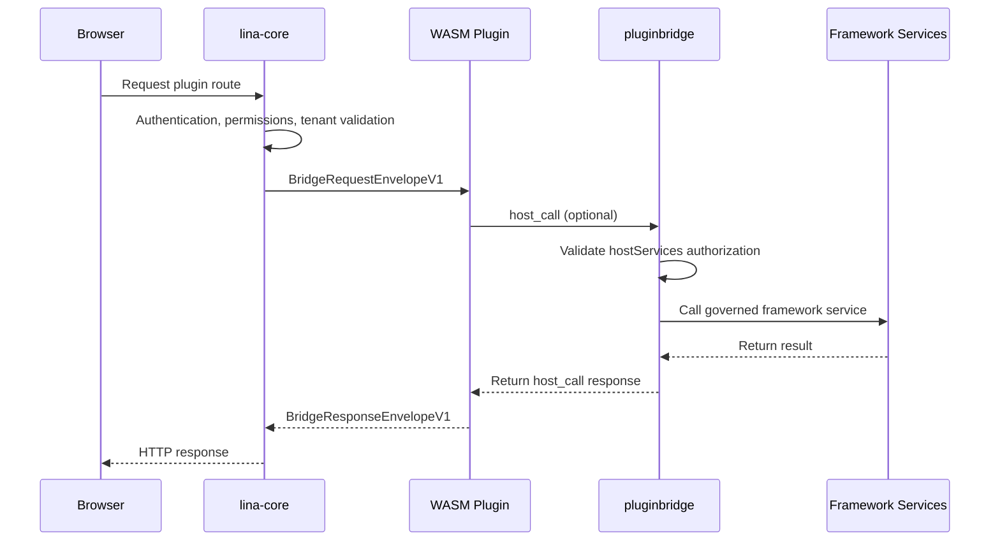

## Introduction

Dynamic plugins are LinaPro's runtime-extensible plugin form. They compile plugins into `.wasm` artifacts and support uploading, installing, enabling, disabling, uninstalling, and explicitly upgrading them at runtime without recompiling the core framework.

Dynamic plugins run inside a WASM sandbox. They cannot directly access the core framework's filesystem, network, or database. All access to framework capabilities must go through `pluginbridge` and `hostServices` authorization.

### Use Cases

| Scenario | Description |
|------|------|
| **Runtime hot-reloading** | Upload a `.wasm` artifact and it enters the plugin governance pipeline |
| **Rapid capability validation** | Quickly deploy a proof-of-concept feature; convert to a source plugin after validation |
| **Commercial plugin distribution** | Deliver only binary artifacts without exposing source code |
| **Controlled external integration** | Network, storage, and data access are all governed through authorization snapshots |

Long-term core business capabilities should still prefer source plugins; dynamic plugins are better suited for hot-reloading and scenarios with stricter isolation requirements.

### WebAssembly Overview

WebAssembly (WASM) is a stack-based virtual machine binary instruction format standardized by the W3C. Originally designed for browsers, it is now widely used in server-side, edge computing, and plugin system scenarios.

- **Cross-platform portability**: WASM modules are platform-agnostic binary formats. The same `.wasm` artifact can run on Linux, macOS, Windows, and across instruction sets like x86 and ARM without recompilation.

- **Security sandboxing**: WASM runs in a strictly isolated sandbox environment and cannot access the core framework's filesystem, network, memory, or system calls by default. All framework capabilities must be accessed through explicit interface authorization, fundamentally limiting the spread of malicious code or vulnerabilities.

- **Near-native performance**: WASM uses a compact binary format that can be just-in-time (JIT) compiled to native machine code at runtime, achieving near-native execution efficiency while maintaining sandbox isolation.

- **Hot-reloading support**: WASM modules can be dynamically loaded and unloaded at runtime without restarting the core framework process. This provides a natural hot-update capability for the plugin system -- new module versions can go live or roll back without affecting overall system operation.

- **Multi-language ecosystem**: Mainstream languages including Go, Rust, C/C++, and AssemblyScript can all compile to WASM, so plugin developers are not locked into a single technology stack. LinaPro currently uses Go as the primary plugin development language and extends the sandbox-to-framework communication contract based on WASI (WebAssembly System Interface).

## Runtime Model



The core framework first completes authentication, permission, and tenant context processing, then passes a request snapshot into the WASM instance. Dynamic plugins receive a structured request envelope rather than raw core framework internal objects.


## Directory Structure

The source directory structure for dynamic plugins is the same as for source plugins, but with an additional `main.go` as the WASM entry point:

```text
apps/lina-plugins/<plugin-id>/
├── main.go                          # WASM export function entry point
├── plugin.yaml
├── plugin_embed.go
├── backend/
│   ├── api/                         # API DTOs and route contracts
│   ├── internal/
│   │   ├── controller/              # HTTP controllers
│   │   ├── service/                 # Business service layer
│   │   ├── dao/                     # Generated by gf gen dao
│   │   └── model/                   # do/entity models
│   └── plugin.go                    # Plugin registration entry point
├── frontend/
│   └── pages/                       # Dynamic plugin frontend assets
├── manifest/
│   ├── config/
│   │   ├── config.yaml              # Default config carried by the dynamic artifact
│   │   └── config.example.yaml      # Config template, not used as runtime default
│   ├── sql/                         # Installation and upgrade SQL
│   │   ├── mock-data/               # Demo data, optional
│   │   └── uninstall/               # Uninstallation SQL
│   └── i18n/                        # Plugin language packs
└── README.md
```

The build tool prioritizes reading plugin embedded resources, falling back to directory scanning when needed. It writes `plugin.yaml`, `frontend/` assets, `manifest/sql`, `manifest/i18n`, `manifest/config/config.yaml`, `manifest/config/config.example.yaml`, and other resources under `manifest/` into the dynamic artifact. Runtime resources are bound to the current effective release's checksum and build number. Install, enable, disable, uninstall, upgrade, or same-version refresh operations all trigger the corresponding cache invalidation.

The configuration and manifest resource path semantics for dynamic plugins are consistent with source plugins. `manifest/config/config.yaml` serves as the default configuration snapshot carried by the dynamic artifact and is only used as a fallback when there is no production external configuration or development-time config file. `manifest/config/config.example.yaml` is only a template. Files like `profile.yaml`, `resources/policy.yaml`, `config/config.example.yaml`, `sql/*.sql`, and `i18n/*.json` can all be read verbatim through the manifest-type hostServices, but must be authorized in `resources.paths`. Raw reading does not replace the configuration, SQL, or internationalization pipelines. For complete configuration management details, see [Plugin Configuration Management](/docs/plugin-config). For manifest resource reading, see [Manifest Delivery Resources](/docs/plugin-manifest).

## WASM Entry Point

Dynamic plugins must export the functions specified by the core framework. Using an official example:

```go
var guestRuntime = pluginbridge.NewGuestRuntime(dynamicbackend.HandleRequest)

//go:wasmexport lina_dynamic_route_alloc
func linaDynamicRouteAlloc(size uint32) uint32 {
    return guestRuntime.Alloc(size)
}

//go:wasmexport lina_dynamic_route_execute
func linaDynamicRouteExecute(size uint32) uint64 {
    responsePointer, responseLength, err := guestRuntime.Execute(size)
    if err != nil {
        fallback, _ := pluginbridge.EncodeResponseEnvelope(
            pluginbridge.NewInternalErrorResponse(err.Error()),
        )
        responsePointer, responseLength, _ = guestRuntime.ExposeResponseBuffer(fallback)
    }
    return uint64(responsePointer)<<32 | uint64(responseLength)
}

//go:wasmexport lina_host_call_alloc
func linaHostCallAlloc(size uint32) uint32 {
    return guestRuntime.HostCallAlloc(size)
}

func main() {}
```

Business routing is typically delegated to `pluginbridge.MustNewGuestControllerRouteDispatcher`, with controller methods handling specific requests. `linactl` injects the contract metadata required for zero-reflection dispatch into `wasip1` builds.

## hostServices Authorization

Dynamic plugins must declare the framework services, methods, and resource scopes they need to access in `plugin.yaml`. The core framework writes the authorization into the release snapshot at install or enable time; any unauthorized call at runtime will be rejected.

| Service | Typical Capabilities |
|------|----------|
| `runtime` | Log writing, plugin state, time, UUID, node information |
| `data` | Database read/write constrained by table scope and tenant filtering |
| `storage` | File read/write within the plugin namespace |
| `network` | External HTTP requests constrained by target address |
| `cache` | Cluster-aware cache read/write |
| `lock` | Distributed lock acquisition, renewal, and release |
| `jobs` | Scheduled task metadata reading and dynamic task registration |
| `hostconfig` | Host authorized configuration key reading |
| `manifest` | Raw resource reading from the current plugin's manifest/ |
| `notifications` | Notification message reading and governed notification sending |
| `ai` | AI sub-capabilities including text, image, vector, audio, vision, document, safety review, and video |
| `plugins` | Plugin registry, plugin config, enable state, and lifecycle |
| `auth` | Tenant token selection or switching, acting on behalf of user token |
| `authz` | Batch permission retrieval, permission checks, platform admin checks |
| `users` | Batch user reading, search, and visibility confirmation |
| `bizctx` | Current request business context |
| `dict` | Dictionary label resolution |
| `files` | Batch file reading and visibility confirmation |
| `i18n` | Read locale, translate messages, and look up message keys |
| `infra` | Infrastructure component status |
| `route` | Current dynamic route metadata |
| `sessions` | Online session search and batch reading |
| `org` | Organization projections such as departments and positions |
| `tenant` | Tenant context, visibility, member validation, and switching |
| `apidoc` | API documentation localization |
| `secret` | Secret resolution (reserved) |
| `event` | Event publishing (reserved) |
| `queue` | Queue enqueue (reserved) |

Example:

```yaml
hostServices:
  - service: runtime
    methods: [log.write, info.now, info.node]
  - service: jobs
    methods: [jobs.register]
  - service: data
    methods: [list, get, create, update, delete]
    resources:
      tables:
        - plugin_demo_dynamic_record
  - service: network
    methods: [request]
    resources:
      - url: https://api.example.com
  - service: hostconfig
    methods: [get]
    resources:
      keys:
        - workspace.basePath
        - i18n.default
  - service: manifest
    methods: [get]
    resources:
      paths:
        - profile.yaml
```

When `methods` is omitted for `hostconfig` and `manifest`, `get` is used by default. The convenience functions provided by the guest-side SDK such as `String`, `Bool`, `Int`, `Duration`, and `Scan` are translated into `get` calls and do not need to be -- nor can they be -- declared as manifest authorization methods. `hostconfig` must declare `resources.keys`, and `manifest` must declare `resources.paths`. Manifest resource paths are relative to the `manifest/` directory; for example, `profile.yaml` in the example above should not be written as `manifest/profile.yaml`.

## Building Dynamic Plugins

Dynamic plugins use the standard Go toolchain to compile to the `wasip1/wasm` target. The project also provides `make` commands to simplify the build process:

```bash
make wasm
make wasm p=plugin-demo-dynamic
```

Build artifacts are output to `temp/output/<plugin-id>.wasm` and include the plugin manifest, route contracts, public frontend assets, installation and uninstallation scripts, language packs, plugin default configuration, and manifest resources. The default configuration in build artifacts is only used as a fallback when there is no production external configuration or development-time configuration.

## Frontend Assets

Dynamic plugins declare public resources through `public_assets` in `plugin.yaml`, and the core framework hosts them at `/x-assets/{plugin-id}/{version}/...`:

```yaml
public_assets:
  - source: frontend/pages
    mount: /
    index: index.html

menus:
  - key: plugin:linapro-demo-dynamic:main-entry
    path: /x-assets/linapro-demo-dynamic/v0.1.0/mount.js
    component: system/plugin/dynamic-page
    query:
      pluginAccessMode: embedded-mount
```

Frontend files present in a dynamic plugin artifact are not automatically all made public. Only resources that match the `public_assets` declarations will be served through `/x-assets`. Public assets return 404 by default when the plugin is disabled, not installed, unavailable for the tenant, or the accessed version does not match.

## Installation, Enablement, and Upgrades

The runtime flow for dynamic plugins:

1. Build the `.wasm` artifact.
2. Upload the dynamic plugin package in the admin workspace's extension center.
3. The core framework validates the WASM file header, custom sections, embedded manifest, ABI version, and resources.
4. The administrator confirms the `hostServices` authorization. If resource-type declarations exist (e.g., `storage` resource paths, `network` URLs, `data` tables, `hostconfig` keys, or `manifest` paths), the resource scope must also be confirmed.
5. Installation SQL is executed and governance records are written.
6. After enablement, the core framework loads the WASM sandbox and projects routes, menus, public assets, and resource snapshots.

When a higher version is uploaded, the core framework does not immediately switch the effective version. Instead, it marks the plugin as `pending_upgrade`. The administrator previews the diff and explicitly performs the runtime upgrade from the plugin management page. On upgrade failure, the old effective version is preserved and failure diagnostics are recorded for later retry.

Dynamic plugin APIs are ultimately exposed under the unified plugin namespace. The core framework only prepends the `/x/{plugin-id}` prefix; subsequent paths come from the plugin's own route contract, so external access paths look like:

```text
/x/linapro-demo-dynamic/demo-records
/x/linapro-demo-dynamic/backend-summary
```

## Dynamic Plugin-Specific Capabilities

`Runtime()`, `Network()`, and `RecordStore()` are capabilities specific to dynamic plugins on `pluginbridge.Services`. They are not part of `capability.Services` because source plugins already run in the host process and can use the host's native equivalents.

| Capability | Public Entry | Description |
|------|----------|------|
| `Runtime()` | `pluginbridge.Services.Runtime()` | Dynamic plugins write logs, read/write state, read time, generate UUIDs, and read node identity through WASI host-service clients; source plugins use the host's native logging and runtime context directly |
| `Network()` | `pluginbridge.Services.Network()` | Dynamic plugins access governed outbound HTTP through host-service authorization; source plugins use the host's native HTTP client or injected domain services |
| `RecordStore()` | `pluginbridge.Services.RecordStore()` | Dynamic plugins use a guest-side facade that wraps the data host-service protocol and typed query plans; source plugins use their own DAOs or provider seams |

## Differences from Source Plugins

| Dimension | Source Plugin | WASM Dynamic Plugin |
|------|----------|----------------|
| Delivery form | Source code compiled with the core framework | `.wasm` runtime artifact |
| Hot-reloading | Requires deploying a new core framework | Supports runtime upload and enablement |
| Performance | Native Go performance | Sandbox and bridging overhead |
| Framework capability access | `pluginhost.Services` embeds `capability.Services`, with additional `Admin()` and `TenantFilter()` | `pluginbridge.Services` bridges through `hostServices` authorization, with additional `Runtime()`, `Network()`, and `RecordStore()` |
| Isolation strength | Namespace isolation | WASM sandbox isolation |
| Debugging experience | Standard Go debugging chain | More reliant on logging and bridge diagnostics |
| Use cases | Long-term business modules | Commercial distribution, hot-reloading, temporary extensions |

## Best Practices

- Only request the `hostServices` methods and resource scopes you actually need.
- Use the plugin ID namespace for database table names to avoid conflicts with the core framework and other plugins.
- For outbound network access, specify explicit target addresses and avoid overly broad authorization.
- Prepare rollback-ready, idempotent upgrade SQL for runtime upgrades.
- Graduate long-term, high-frequency business logic into source plugins; use dynamic plugins for hot-reloading and isolation scenarios.
