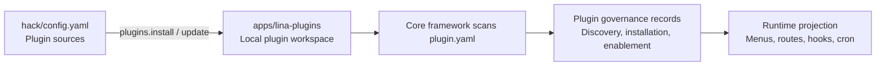

## Introduction

Plugin management connects two pipelines:

- **Development pipeline**: Reads plugin sources from `hack/config.yaml` and syncs source plugins to the `apps/lina-plugins/` workspace.
- **Runtime pipeline**: After the core framework scans plugin manifests, the admin workspace handles discovery, installation, enablement, disablement, uninstallation, and upgrades.

These two pipelines have clearly separated responsibilities. Code sync only means plugin files appear in the local workspace; whether a plugin is installed, enabled, or successfully upgraded is determined by the core framework's runtime governance records.



The plugin management page reads the complete plugin list projection built by the core framework. The list includes discovered version, effective version, dependency checks, `hostServices` authorization, declared routes, demo data availability, runtime upgrade status, and tenant provisioning policies. Frontend filtering only derives from the full projection and does not cause the API to lose detail fields.

## Plugin Source Configuration

Plugin sources are configured in `hack/config.yaml` at the repository root:

```yaml
plugins:
  sources:
    official:
      repo: "https://github.com/linaproai/official-plugins.git"
      root: "."
      ref: "main"
      items:
        - "*"
```

| Field | Description |
|------|------|
| `repo` | Plugin source repository URL |
| `root` | Root path of the plugin directory within the source repository |
| `ref` | Branch, tag, or commit |
| `items` | List of plugins to install; `"*"` means all plugins |

Multiple sources can be configured, such as an official plugin source and an enterprise internal plugin source. Commands support filtering via `source=<name>`.

:::info Note
The current version only supports open-source repositories as plugin sources. Support for private repositories and dynamic plugin source installation mechanisms is planned for future releases.
:::

## Plugin Workspace

`apps/lina-plugins/` is the fixed plugin workspace. Official plugins are typically mounted as Git submodules. If you want to manage plugin source code yourself, you can convert it to a regular directory first:

```bash
make plugins.init
```

This command removes the submodule association while preserving existing plugin code. If the directory does not exist, it creates an empty workspace.

:::info Note
This command is optional; the directory conversion is automatically performed when running the install command. After execution, `apps/lina-plugins/` becomes a regular directory where you can directly add, modify, or delete plugin source code.
:::

## Installing and Updating Source Plugins

Install plugins:

```bash
make plugins.install
```

Update plugins:

```bash
make plugins.update
```

Before updating, the tool checks whether the local plugin directory has uncommitted changes. By default, local changes will block the update to avoid overwriting developer modifications. If you truly need to overwrite:

```bash
make plugins.update force=1
```

Check status:

```bash
make plugins.status
```

Status output displays the plugin ID, source, version, local installation status, whether local changes exist, and remote sync status.

## Admin-Side Lifecycle

Once plugin code enters the workspace, the core framework scans `plugin.yaml` at startup and presents the plugin as "discovered." Administrators then perform runtime lifecycle operations from the extension center:

| Operation | Runtime Behavior |
|------|------------|
| **Install** | Check dependencies, execute installation SQL, write plugin governance records |
| **Enable** | Project menus, permissions, routes, hooks, scheduled tasks, and frontend resources |
| **Disable** | Hide menus and business routes; preserve data and governance records |
| **Uninstall** | Clean up governance records; optionally preserve or clean up plugin-owned data |
| **Upgrade** | Preview, confirm, migrate, switch versions, and invalidate caches for the plugin being upgraded |

The distinction between disable and uninstall is important: disabling only removes the runtime entry points while data remains; uninstalling enters a cleanup process, and if data cleanup is chosen, plugin-owned data may be unrecoverable.

`GET /api/v1/plugins` is a read-only API and does not trigger implicit sync writes when the list is opened. Plugin sync, dynamic plugin upload, installation, uninstallation, enablement, disablement, source plugin upgrade, dynamic plugin upgrade, and tenant plugin provisioning policy changes all actively invalidate the list cache. In cluster mode, other nodes are notified to refresh via plugin runtime revisions. After startup, the core framework asynchronously warms the list cache; warming failures only log an error, and the cache can still be rebuilt on demand when requests arrive.

## Dynamic Plugin Upload

WASM dynamic plugins do not depend on the source workspace for delivery. The build artifact is a `.wasm` file. After an administrator uploads it from the extension center, the core framework validates the artifact and reads the embedded manifest, routes, resources, and authorization declarations.

During dynamic plugin installation, the administrator must confirm the `hostServices` authorization. Only after authorization is confirmed will the core framework allow the plugin to access the corresponding services and resource scopes through `pluginbridge`.

If a dynamic plugin declares resource-type `hostServices` -- such as `storage` resource paths, `network` URLs, `data` tables, `hostconfig` keys, or `manifest` paths -- automatic enablement at startup also requires a confirmed authorization snapshot; otherwise the core framework will not bypass governance to enable the plugin.

## Runtime Upgrades

When plugin files are updated, the core framework may detect that the "effective version" and "discovered version" are inconsistent. The plugin then enters a runtime upgrade state:

| State | Description |
|------|------|
| `normal` | Effective version matches discovered version |
| `pending_upgrade` | A higher version has been discovered; awaiting explicit administrator upgrade |
| `upgrade_running` | Upgrade in progress |
| `upgrade_failed` | Upgrade failed; the old effective version is preserved and diagnostics are recorded |
| `abnormal` | File version is lower than the effective version or status is anomalous; requires manual intervention |

Before upgrading, you can preview the diff including version differences, dependency checks, SQL count, `hostServices` differences, and risk warnings. When executing the upgrade, the core framework performs confirmation validation, acquires a runtime upgrade lock, executes lifecycle callbacks, runs upgrade SQL, synchronizes governance resources, switches the effective version, and invalidates caches.

## Startup Auto-Enablement

The core framework supports automatically installing and enabling specified plugins at startup through `plugin.autoEnable` in `config.yaml`:

```yaml
plugin:
  autoEnable:
    - id: "linapro-demo-source"
      withMockData: false
    - id: "linapro-demo-dynamic"
      withMockData: true
```

`autoEnable` entries must be object structures `{id, withMockData}` and no longer accept bare strings. `withMockData` defaults to `false`. When set to `true`, demo data from the plugin's `manifest/sql/mock-data` is loaded only during the startup auto-install phase and will not be reloaded for already-installed plugins. Duplicate plugin IDs are deduplicated based on the first occurrence.

For tenant-scoped plugins, startup auto-enablement also synchronizes provisioning policies such as `autoEnableForNewTenants` and requests the tenant Provider to backfill provisioning status for existing tenants. Use demo data cautiously in production environments, and ensure that authorization snapshots are confirmed for dynamic plugins.

## Multi-Tenant Governance

Tenant-aware plugins can choose between global enablement and tenant-scoped enablement:

| Mode | Behavior |
|------|------|
| `global` | Plugin is installed and enabled once; applies to the platform or all tenants |
| `tenant_scoped` | Plugin can be independently enabled or disabled per tenant |

The specific enablement policy is determined by the core framework's governance records and the multi-tenant plugin, not by the frontend alone.

## Admin UI Presentation

The extension center's list display is based on actual governance fields. The plugin type column shows "Source Plugin" or "Dynamic Plugin." Even though the underlying dynamic artifact is WASM, the governance type is still classified as "Dynamic Plugin." The list now emphasizes install time, update time, version, and runtime upgrade status. Older concepts like "delivery mode," "integration mode," and "entry point" -- which were easily confused with governance state -- have been de-emphasized.

## Common Recommendations

- After syncing plugin code during development, you still need to install and enable the plugin from the admin side.
- Before updating plugin source code, check for local changes to avoid accidentally using `force=1` to overwrite development work.
- After uploading a higher version of a dynamic plugin, do not assume the new version is active; you need to perform a runtime upgrade.
- Do not rely on plugin list requests to trigger sync; use explicit sync operations when you need to refresh discovery results.
- `plugin.autoEnable` is only suitable for development, demos, or controlled initialization flows. Production environments should explicitly review `hostServices` and the demo data toggle.
- Before uninstalling a production plugin, confirm whether to preserve data and check for reverse dependencies.
- Pin plugin sources to stable branches, tags, or commits; avoid using uncontrollable floating versions in production.
