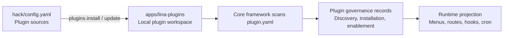

## Introduction

Plugin management connects two distinct pipelines:

- **Development pipeline**: Reads plugin sources from `hack/config.yaml` and synchronizes source plugins into the `apps/lina-plugins/` workspace.
- **Runtime pipeline**: The core framework scans plugin manifests and then performs discovery, installation, enablement, disablement, uninstallation, and upgrade through the admin console.

These two pipelines have clear separation of concerns. Code synchronization only means plugin files appear in the local workspace; whether a plugin is installed, enabled, or successfully upgraded is determined by the core framework's runtime governance records.



The plugin management page reads the complete plugin list projection built by the core framework. The list includes discovered version, effective version, dependency checks, `hostServices` authorization, declared routes, demo data availability, runtime upgrade status, and tenant provisioning policy. Front-end filtering only derives views from the full projection and does not cause the API to lose detail fields.

## Plugin Source Configuration

Plugin sources are configured in `hack/config.yaml` at the repository root:

```yaml
plugins:
  sources:
    official:
      repo: "https://github.com/linaproai/official-plugins.git"
      root: "."
      ref: "main"
      items:
        - "*"
```

| Field | Description |
|-------|-------------|
| `repo` | Plugin source repository URL |
| `root` | Root path of plugin directories within the source repository |
| `ref` | Branch, tag, or commit |
| `items` | List of plugins to install; `"*"` means all plugins |

Multiple sources can be configured, such as an official plugin source and an internal enterprise source. Commands support filtering by `source=<name>`.

:::info
The current version only supports open-source repositories as plugin sources. Support for private repositories and dynamic plugin source installation is planned for future releases.
:::

## Plugin Workspace

`apps/lina-plugins/` is the fixed plugin workspace. Official plugins are typically mounted as `Git submodules`. If you want to manage plugin source code yourself, convert the workspace to a regular directory first:

```bash
make plugins.init
```

This command removes the submodule association while preserving existing plugin code. If the directory does not exist, it creates an empty workspace.

:::info
This command is optional — the directory conversion is performed automatically when you run the installation command. After execution, `apps/lina-plugins/` becomes a regular directory where you can freely add, modify, or delete plugin source code.
:::

## Installing and Updating Source Plugins

Install plugins:

```bash
make plugins.install
```

Update plugins:

```bash
make plugins.update
```

Before updating, the tool checks whether the local plugin directory has uncommitted changes. By default, local changes block the update to avoid overwriting developer modifications. If you need to force the update:

```bash
make plugins.update force=1
```

Check status:

```bash
make plugins.status
```

The status output displays each plugin's `ID`, source, version, local installation state, whether local changes exist, and remote synchronization status.

## Admin-Side Lifecycle

Once plugin code enters the workspace, the core framework scans `plugin.yaml` at startup and presents the plugin as "discovered." Administrators then perform runtime lifecycle operations through the Extensions Center:

| Operation | Runtime Behavior |
|-----------|-----------------|
| **Install** | Checks dependencies, executes installation `SQL`, writes plugin governance records |
| **Enable** | Projects menus, permissions, routes, hooks, scheduled tasks, and front-end resources |
| **Disable** | Hides menus and business routes; retains data and governance records |
| **Uninstall** | Cleans governance records and optionally retains or cleans plugin-owned data |
| **Upgrade** | Runs preview, confirmation, migration, version switching, and cache invalidation for the target plugin |

The distinction between disable and uninstall is important: disable only removes runtime entry points while data remains intact; uninstall triggers a cleanup flow, and if data cleanup is chosen, plugin-owned data may be irrecoverable.

`GET /api/v1/plugins` is a read-only endpoint — opening the list does not implicitly trigger any synchronization writes. Plugin synchronization, dynamic plugin uploads, installation, uninstallation, enablement, disablement, source plugin upgrades, dynamic plugin upgrades, and tenant plugin provisioning policy changes all proactively invalidate the list cache. In cluster mode, other nodes are notified to refresh through plugin runtime revision broadcasts. After startup, the core framework asynchronously pre-warms the list cache; if pre-warming fails, only a log entry is recorded and the cache can still be rebuilt on demand when requests arrive.

## Dynamic Plugin Upload

`WASM` dynamic plugins do not depend on the source workspace for delivery. The build artifact is a `.wasm` file. After an administrator uploads it through the Extensions Center, the core framework validates the artifact and reads the embedded manifest, routes, resources, and authorization declarations.

When installing a dynamic plugin, the administrator must confirm `hostServices` authorization. Only after the authorization is confirmed does the core framework allow the plugin to access the corresponding services and resource scopes through `pluginbridge`.

If a dynamic plugin declares resource-scoped `hostServices` — such as `storage.resources.paths`, `network` targets, `data.resources.tables`, `hostConfig.resources.keys`, or `manifest.resources.paths` — auto-enablement at startup also requires a confirmed authorization snapshot; otherwise the plugin will not be enabled by bypassing governance.

## Runtime Upgrades

After plugin files are updated, the core framework may detect that the "effective version" and "discovered version" are inconsistent. At this point the plugin enters a runtime upgrade state:

| State | Description |
|-------|-------------|
| `normal` | Effective version matches the discovered version |
| `pending_upgrade` | A higher version has been discovered, awaiting explicit administrator upgrade |
| `upgrade_running` | Upgrade is in progress |
| `upgrade_failed` | Upgrade failed; the previous effective version is retained with diagnostics recorded |
| `abnormal` | File version is lower than the effective version or the state is anomalous, requiring manual intervention |

Before upgrading, you can view a preview that includes version differences, dependency checks, `SQL` count, `hostServices` differences, and risk warnings. When executing the upgrade, the core framework performs confirmation validation, acquires a runtime upgrade lock, runs lifecycle callbacks, executes upgrade `SQL`, synchronizes governance resources, switches the effective version, and invalidates the cache.

## Auto-Enablement at Startup

The core framework supports automatically installing and enabling specified plugins at startup through `plugin.autoEnable` in `config.yaml`:

```yaml
plugin:
  autoEnable:
    - id: "linapro-demo-source"
      withMockData: false
    - id: "linapro-demo-dynamic"
      withMockData: true
```

Each `autoEnable` entry must be an object with `{id, withMockData}` — bare strings are no longer accepted. `withMockData` defaults to `false`; when set to `true`, demo data from the plugin's `manifest/sql/mock-data` directory is loaded only during the startup auto-install phase and will not be reloaded for already-installed plugins. Duplicate plugin `ID`s are deduplicated, with the first occurrence taking effect.

For tenant-scoped plugins, startup auto-enablement also synchronizes tenant provisioning policies such as `autoEnableForNewTenants` and requests that the tenant provider backfill provisioning status for existing tenants. Use demo data cautiously in production environments, and for dynamic plugins ensure the authorization snapshot is confirmed before enabling.

## Multi-Tenant Governance

Tenant-aware plugins can be enabled globally or per tenant:

| Mode | Behavior |
|------|----------|
| `global` | Plugin is installed and enabled once, effective for the platform or all tenants |
| `tenant_scoped` | Plugin can be independently enabled or disabled per tenant |

The specific enablement policy is determined by the core framework's governance records and the `multi-tenant` plugin, not solely by the front end.

## Admin Interface Display

The Extensions Center list displays data based on actual governance fields. The plugin type column shows "Source Plugin" or "Dynamic Plugin" — even when the underlying dynamic artifact is `WASM`, the governance type remains "Dynamic Plugin." The list emphasizes installation time, update time, version, and runtime upgrade status, and has de-emphasized legacy concepts such as "delivery mode," "integration mode," and "entry point" that were easily confused with governance state.

## Best Practices

- After synchronizing plugin code during development, you still need to install and enable the plugin through the admin console.
- Check for local changes before updating plugin source code to avoid accidentally using `force=1` and overwriting development work.
- After uploading a higher version of a dynamic plugin, do not assume the new version is active — a runtime upgrade must be executed.
- Do not rely on plugin list requests to trigger synchronization; use explicit sync operations when you need to refresh discovery results.
- `plugin.autoEnable` is suitable for development, demos, or controlled initialization flows; in production, explicitly review `hostServices` and demo data settings.
- Before uninstalling a production plugin, confirm whether to retain data and check for reverse dependencies.
- Pin plugin sources to stable branches, tags, or commits to avoid uncontrolled floating versions in production.
