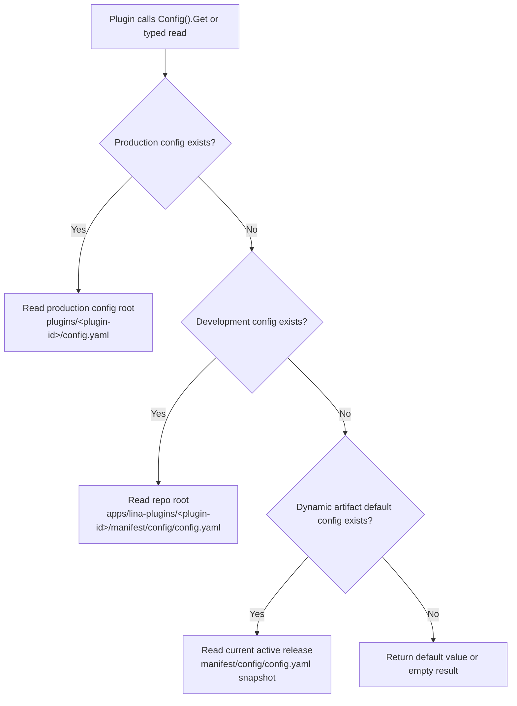

## Introduction

`LinaPro` uses a decoupled design for plugin configuration and `manifest` resources. Each plugin can own its own configuration files and `manifest` resources without injecting business configuration into the core framework `config.yaml` or requiring the core framework to add dedicated configuration fields for each plugin.

This design applies to both source plugins and dynamic plugins:

- **Plugin configuration**: Lives in the plugin's own `manifest/config/config.yaml` and is read at runtime through the plugin-scoped `Config()` service.
- **Configuration template**: Lives in `manifest/config/config.example.yaml` and documents available options; it is not used as a runtime default.
- **Manifest resources**: Live under `manifest/` as plugin-owned files — such as `profile.yaml`, `resources/policy.yaml`, `config/config.example.yaml`, `sql/*.sql`, or `i18n/*.json` — and are read at runtime through the plugin-scoped `Manifest()` service as raw bytes.

Plugin configuration answers the question "how does this plugin run in the current deployment?" while `manifest` resources answer "what resources does this plugin version carry, and how does the plugin read them?" Both are owned by the plugin, but they have different lifecycles: configuration allows production environment overrides, while `manifest` resources are more closely tied to the plugin version itself.

## Directory Structure

A typical plugin directory looks like this:

```text
apps/lina-plugins/<plugin-id>/
├── plugin.yaml
├── manifest/
│   ├── config/
│   │   ├── config.yaml
│   │   └── config.example.yaml
│   ├── profile.yaml
│   ├── resources/
│   │   └── policy.yaml
│   ├── sql/
│   └── i18n/
└── backend/
```

| Path | Primary Purpose | `Manifest()` Read Path |
|------|-----------------|------------------------|
| `manifest/config/config.yaml` | Plugin default runtime configuration; `Config()` determines whether it takes effect as the default | `config/config.yaml` |
| `manifest/config/config.example.yaml` | Configuration template and documentation; not used as a runtime default | `config/config.example.yaml` |
| `manifest/profile.yaml` | Example custom `YAML` resource for the plugin | `profile.yaml` |
| `manifest/resources/*.yaml` | Plugin-owned resources | `resources/*.yaml` |
| `manifest/sql/` | Install, upgrade, and uninstall scripts; execution is determined by the lifecycle pipeline | `sql/*.sql` |
| `manifest/i18n/` | Plugin language packs; loading is determined by the i18n pipeline | `i18n/*.json` |

`Manifest()` read paths are always relative to `manifest/`. For example, to read `manifest/profile.yaml`, the call path should be `profile.yaml`, not `manifest/profile.yaml`.

## Configuration Read Order

The plugin configuration service only reads `config.yaml` within the current plugin scope. The read order is as follows:



### Production Deployment Configuration Path

The production override configuration path is not the fixed repository root path. Instead, it reads the plugin configuration under the "production configuration path":

```text
working-directory/plugins/<plugin-id>/config.yaml
```

### Development-Stage Default Configuration

During local development, the plugin default configuration lives directly in the plugin source directory:

```text
apps/lina-plugins/<plugin-id>/manifest/config/config.yaml
```

This allows plugin developers to maintain their own default behavior, demo toggles, external service addresses, or scheduling parameters within the plugin directory. The core framework does not need to know the business configuration options for each plugin.

### Dynamic Plugin Default Configuration

When a dynamic plugin is built into a `.wasm` artifact, the build tool writes `manifest/config/config.yaml` into the dynamic artifact. At runtime, if there is no production override configuration and no development-stage configuration file, the core framework uses the default configuration snapshot carried in the current active release.

This allows dynamic plugins to ship a self-describing default configuration with each version, while still allowing the production environment to override it with external configuration. After a plugin upgrade, the default configuration also switches with the active release version and does not depend on the source directory.

### Configuration Templates Do Not Participate in Reads

`manifest/config/config.example.yaml` is only used to display configuration options and example values. It does not participate in runtime default value resolution. Do not treat values that exist only in `config.example.yaml` as the plugin's runtime default configuration.

The recommended practice is:

```text
manifest/config/config.yaml          # Runnable default configuration
manifest/config/config.example.yaml  # Configuration template for operations or end users
```

## HostServices Configuration Services

Plugins obtain plugin-scoped core framework services through `registrar.HostServices()`. Three services are primarily related to configuration and `manifest` resources:

| Service | Read Scope | Typical Use |
|---------|-----------|-------------|
| `Config()` | Current plugin's own configuration | Business toggles, external service addresses, timeouts, scheduling parameters |
| `HostConfig()` | Allowlisted public host configuration | Workspace base path, default language, enabled languages, and other limited public keys |
| `Manifest()` | Raw resources under the current plugin's `manifest/` | Read `YAML`, `JSON`, `SQL`, configuration templates, and other files carried with the plugin version |

In source plugins, you can read configuration like this:

```go
func registerRoutes(ctx context.Context, registrar pluginhost.HTTPRegistrar) error {
    services := registrar.HostServices()

    endpoint, err := services.Config().String(ctx, "sync.endpoint", "")
    if err != nil {
        return err
    }

    interval, err := services.Config().Duration(ctx, "sync.interval", 30*time.Second)
    if err != nil {
        return err
    }

    workspaceBase, err := services.HostConfig().String(ctx, "workspace.basePath", "/admin")
    if err != nil {
        return err
    }

    _ = endpoint
    _ = interval
    _ = workspaceBase
    return nil
}
```

Dynamic plugins access the same `hostServices` through the `pluginbridge` guest-side capabilities. Dynamic plugins must first declare authorization in `plugin.yaml`:

```yaml
hostServices:
  - service: config
    methods: [get]
  - service: hostConfig
    methods: [get]
    resources:
      keys:
        - workspace.basePath
        - i18n.default
```

`config` only reads the current plugin's own configuration. `hostConfig` only reads allowlisted public host keys. Plugins should not scan the host's full configuration tree through the global `g.Cfg()`, nor should they ask users to write plugin business configuration into the core framework `config.yaml`.

## Manifest Resources

Plugins can read raw resources under the current plugin's `manifest/` directory through `Manifest()`. `Manifest().Get()` returns file bytes, `Manifest().Exists()` checks whether a file exists, and `Manifest().Scan()` scans a `YAML` resource or a specific nested key into a struct.

Custom declarative `YAML` is just one common use case for `manifest` resources. File names have no framework-level special semantics — `profile.yaml`, `resources/policy.yaml`, or any team-convention name works as long as the path is safe. For example:

```yaml
category: content
display:
  icon: ant-design:file-text-outlined
  accentColor: '#1677ff'
features:
  import: true
  export: true
external:
  provider: example-cms
  docsUrl: https://example.com/docs
```

### Read Sources

Source plugins and dynamic plugins use different read sources, but path semantics are the same: call paths are always relative to the current plugin's `manifest/` root.

| Plugin Type | `Manifest()` Read Source | Boundary |
|-------------|--------------------------|----------|
| Source plugin | Embedded filesystem bound to the current plugin; falls back to the repo development directory `apps/lina-plugins/<plugin-id>/manifest/` when missing | Can only read the current plugin's own `manifest/` resources; does not read host or other plugin directories |
| Dynamic plugin | `manifest/` resource snapshot carried in the current active release `artifact` | Must pass the `plugin.yaml` `service: manifest` and `resources.paths` authorization snapshot validation |

After a dynamic plugin upgrade, rollback, or same-version refresh, `Manifest()` sees the resource snapshot bound to the current active release. This ensures that the raw resources read by a dynamic plugin are consistent with the actually effective release version.

### YAML Convenience Scanning

When reading custom `YAML` resources, you can use `Manifest().Scan()`:

```go
type PluginProfile struct {
    Category string `yaml:"category"`
    Display  struct {
        Icon        string `yaml:"icon"`
        AccentColor string `yaml:"accentColor"`
    } `yaml:"display"`
    Features struct {
        Import bool `yaml:"import"`
        Export bool `yaml:"export"`
    } `yaml:"features"`
}

func loadProfile(ctx context.Context, services pluginhost.Services) (*PluginProfile, error) {
    profile := &PluginProfile{}
    if err := services.Manifest().Scan(ctx, "profile.yaml", "", profile); err != nil {
        return nil, err
    }
    return profile, nil
}
```

You can also scan only a specific nested key:

```go
var features struct {
    Import bool `yaml:"import"`
    Export bool `yaml:"export"`
}

if err := services.Manifest().Scan(ctx, "profile.yaml", "features", &features); err != nil {
    return err
}
```

Or read raw text or byte content:

```go
content, err := services.Manifest().Get(ctx, "config/config.example.yaml")
if err != nil {
    return err
}
if len(content) > 0 {
    _ = string(content)
}
```

### Dynamic Plugin Authorization

Dynamic plugins that need to read `manifest` resources must also declare resource scopes in `plugin.yaml`:

```yaml
hostServices:
  - service: manifest
    methods: [get]
    resources:
      paths:
        - profile.yaml
        - resources/*.yaml
        - config/config.example.yaml
        - sql/*.sql
        - i18n/zh-CN/*.json
```

Dynamic plugin `manifest` resource paths support exact paths and controlled wildcard patterns. Paths are still relative to `manifest/` — do not write `manifest/profile.yaml`.

Source plugins do not require additional authorization through `plugin.yaml`'s `resources.paths` because they are compiled and delivered with the host as trusted extensions. However, source plugins are still subject to path safety constraints and plugin scope constraints. Dynamic plugins connect through `WASM` and must explicitly declare paths and receive host confirmation before reading the corresponding resources.

### Reading Content from Dedicated Directories

`Manifest()` reads the raw content of files; it does not cause those files to "take effect" automatically. For example:

| Read Path | What You Get from `Manifest()` | How It Actually Takes Effect |
|-----------|-------------------------------|------------------------------|
| `config/config.yaml` | Raw content of the configuration file carried with the source code or dynamic `artifact` | Runtime configuration is still read by `Config()` following the production, development, and dynamic default order |
| `config/config.example.yaml` | Configuration template content | Serves only as a template and documentation; does not participate in default value resolution |
| `sql/*.sql` | Install, upgrade, or uninstall script text | Whether to execute is determined by the plugin lifecycle pipeline |
| `i18n/*.json` | Plugin language pack content | Whether to load is determined by the i18n pipeline |

Therefore, `Manifest()` is suitable for resource inspection, preview, diagnostics, custom parsing, or plugin-internal customization logic. Do not use it as an entry point for executing `SQL`, loading language packs, or overriding runtime configuration.

### Path Safety

`Manifest()` only accepts slash-delimited paths relative to the current plugin's `manifest/` root. The following patterns are rejected:

| Invalid Path | Rejection Reason |
|-------------|-----------------|
| `manifest/profile.yaml` | Contains redundant `manifest/` prefix |
| `../other-plugin/profile.yaml` | Attempts to escape the current plugin's `manifest/` directory |
| `/etc/passwd` | Absolute path |
| `C:\secret.yaml` | Windows drive path |
| `https://example.com/config.yaml` | URL; does not trigger network reads |

When reading a missing resource, `Get()` returns empty content, `Exists()` returns `false`, and `Scan()` does not modify the target struct. Plugins should decide based on their own business semantics whether a missing resource should fall back gracefully or raise an error.

## Design Benefits

### Decoupling Between Plugins and Core Framework Configuration

The core framework only publishes stable plugin-scoped read services and does not need to add configuration structs for each plugin. When a plugin adds new configuration options, it only needs to update its own `config.yaml`, `config.example.yaml`, and read logic.

### Independent Production Environment Overrides

The production environment can maintain `plugins/<plugin-id>/config.yaml` under an external configuration root, avoiding direct modification of the plugin source directory. For containerized and multi-environment deployments, this approach is easier to mount, audit, and roll back.

### Dynamic Plugins Carry Default Configuration with Each Version

The default configuration of a dynamic plugin is bound to the `.wasm` active release version. During plugin upgrades, rollbacks, or same-version refreshes, the core framework uses the resource snapshot from the current active release, without depending on the developer's local directory.

### Raw Reading Does Not Replace Dedicated Pipelines

`Manifest()` can read raw resources under `manifest/`, but configuration, `SQL`, and language packs are still governed by their own dedicated pipelines at runtime. This allows plugins to inspect files carried with their version when needed, while avoiding the misconception that "reading a file" is the same as "making the file take effect."

## Common Pitfalls

| Pitfall | Correct Approach |
|---------|-----------------|
| Writing plugin business configuration into the core framework `config.yaml` | Write it into the plugin's own `manifest/config/config.yaml`; use `plugins/<plugin-id>/config.yaml` under the production config root to override |
| Relying on `config.example.yaml` to provide defaults | Write real defaults into `config.yaml`; use the template only for documentation |
| Using `Manifest()` to read `config/config.yaml` and treating it as the current runtime configuration | Use `Config()` to read plugin runtime configuration; `Manifest()` only returns raw file content |
| Using `Manifest()` to read `sql/` or `i18n/` and expecting automatic execution or loading | Let the plugin lifecycle and i18n pipelines handle these resources; `Manifest()` only reads raw content |
| Passing `manifest/profile.yaml` to `Manifest()` | Pass the relative path `profile.yaml` |
| Dynamic plugins requesting broad `manifest` access scope | Declare only the paths actually needed, such as `profile.yaml`, `config/config.example.yaml`, or `resources/*.yaml` |
