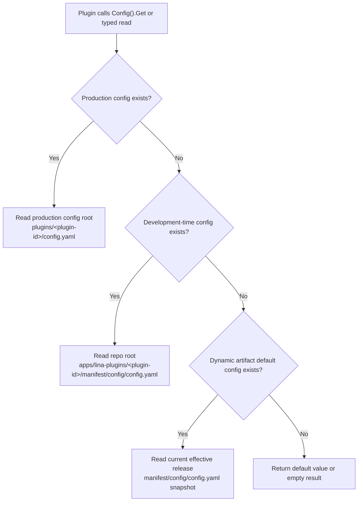

## Introduction

LinaPro's plugin configuration uses an independent scoped design. Each plugin has its own configuration files, eliminating the need to stuff business configuration into the core framework's `config.yaml`. The core framework also does not need to add dedicated configuration fields for each plugin.

Plugin configuration answers the question "how does this plugin run in the current deployment." It differs from Manifest delivery resources: configuration allows production environment overrides, while Manifest resources are more like a part of the plugin version. For Manifest resource management and reading, see [Manifest Delivery Resources](/docs/plugin-manifest).

Plugin configuration comes from three sources, ordered by priority from highest to lowest:

| Priority | Source | Description |
|--------|------|------|
| 1 | `plugins/<plugin-id>/config.yaml` under the production config root | Operations-side override for the current plugin's configuration |
| 2 | `apps/lina-plugins/<plugin-id>/manifest/config/config.yaml` | Development-time plugin default configuration |
| 3 | `manifest/config/config.yaml` in the dynamic plugin artifact | Default configuration carried by the dynamic plugin's release version |

`manifest/config/config.example.yaml` is only a configuration template, not a runtime default value.

## Configuration Reading Order

The plugin configuration service only reads `config.yaml` within the current plugin's scope, in the following order:



### Production Deployment Config Path

The production override config path is not a fixed repository root path; it is the plugin configuration under the "production configuration path":

```text
<working-directory>/plugins/<plugin-id>/config.yaml
```

### Development-Time Default Configuration

During local development, the plugin's default configuration lives directly in the plugin source directory:

```text
apps/lina-plugins/<plugin-id>/manifest/config/config.yaml
```

This allows plugin developers to maintain the plugin's own default behaviors, demo toggles, external service default addresses, or scheduling parameters within the plugin directory. The core framework does not need to know which business configuration keys each plugin has.

### Dynamic Plugin Default Configuration

When a dynamic plugin is built into a `.wasm` artifact, the build tool writes `manifest/config/config.yaml` into the dynamic artifact. At runtime, if there is no production override configuration and no development-time configuration file, the core framework uses the default configuration snapshot carried by the current effective release.

This allows dynamic plugins to carry a self-describing default configuration with each version while still allowing production environments to override it with external configuration. After a plugin upgrade, the default configuration also switches with the effective release version and does not depend on the source directory.

### Configuration Templates Do Not Participate in Reading

`manifest/config/config.example.yaml` is only used to display configuration keys and example values; it does not participate in runtime default value reading. Do not treat values that only exist in `config.example.yaml` as the plugin's runtime default configuration.

The recommended practice is:

```text
manifest/config/config.yaml          # Runnable default configuration
manifest/config/config.example.yaml  # Configuration template for operations or users
```

## Configuration Services in Services

Plugins obtain plugin-scoped framework services through `registrar.Services()`. There are two main configuration-related services:

| Service | Reading Scope | Typical Usage |
|------|----------|----------|
| `Plugins().Config()` | The current plugin's own configuration | Plugin business toggles, external system addresses, timeouts, scheduling parameters |
| `HostConfig()` | Host-convention configuration keys | A small set of public keys such as workspace base path, default language, and enabled languages |

`Plugins().Config()` only reads the current plugin's own `config.yaml`; `HostConfig()` reads the host's public configuration keys. The two have different responsibilities and should not be used interchangeably.

### Source Plugin Usage

Source plugins read configuration through `services.Plugins().Config()` and `services.HostConfig()`:

```go
func registerRoutes(ctx context.Context, registrar pluginhost.HTTPRegistrar) error {
    services := registrar.Services()

    endpoint, err := services.Plugins().Config().String(ctx, "sync.endpoint", "")
    if err != nil {
        return err
    }

    interval, err := services.Plugins().Config().Duration(ctx, "sync.interval", 30*time.Second)
    if err != nil {
        return err
    }

    workspaceBase, err := services.HostConfig().String(ctx, "workspace.basePath", "/admin")
    if err != nil {
        return err
    }

    _ = endpoint
    _ = interval
    _ = workspaceBase
    return nil
}
```

### Dynamic Plugin Usage

Dynamic plugins access the same services through pluginbridge's guest-side capabilities. Dynamic plugins must first declare authorization in `plugin.yaml`:

```yaml
hostServices:
  - service: plugins
    methods: [config.get]
  - service: hostconfig
    methods: [get]
    resources:
      keys:
        - workspace.basePath
        - i18n.default
```

`plugins.config.get` only reads the current plugin's own configuration; `hostconfig` can only read authorized host configuration keys. Plugins should not scan the host's complete configuration tree via global `g.Cfg()`, nor should they require users to write plugin business configuration into the core framework's `config.yaml`.

## Design Benefits

### Decoupled Plugin and Core Framework Configuration

The core framework only publishes a stable plugin-scoped configuration reading service and does not need to add configuration structs for each plugin. When a plugin adds new configuration keys, it only needs to update its own `config.yaml`, `config.example.yaml`, and reading logic.

### Independent Production Environment Overrides

Production environments can maintain `plugins/<plugin-id>/config.yaml` under an external configuration root, avoiding direct modification of the plugin source directory. For containerized and multi-environment deployments, this approach makes it easier to mount, audit, and roll back configuration.

## Common Mistakes

| Mistake | Correct Approach |
|------|----------|
| Writing plugin business configuration into the core framework's `config.yaml` | Write it into the plugin's own `manifest/config/config.yaml`; override with `plugins/<plugin-id>/config.yaml` under the production config root in production |
| Relying on `config.example.yaml` to provide default values | Write real default values in `config.yaml`; use the template for documentation only |
| Using `Manifest()` to read `config/config.yaml` and treating it as the current runtime configuration | Use `Plugins().Config()` to read plugin runtime configuration; `Manifest()` can only retrieve raw file content |
| Declaring a `config.get` method in `plugin.yaml` for dynamic plugins | Plugin configuration is read through the `config.get` method of the `plugins` service, not a standalone `config` service |
