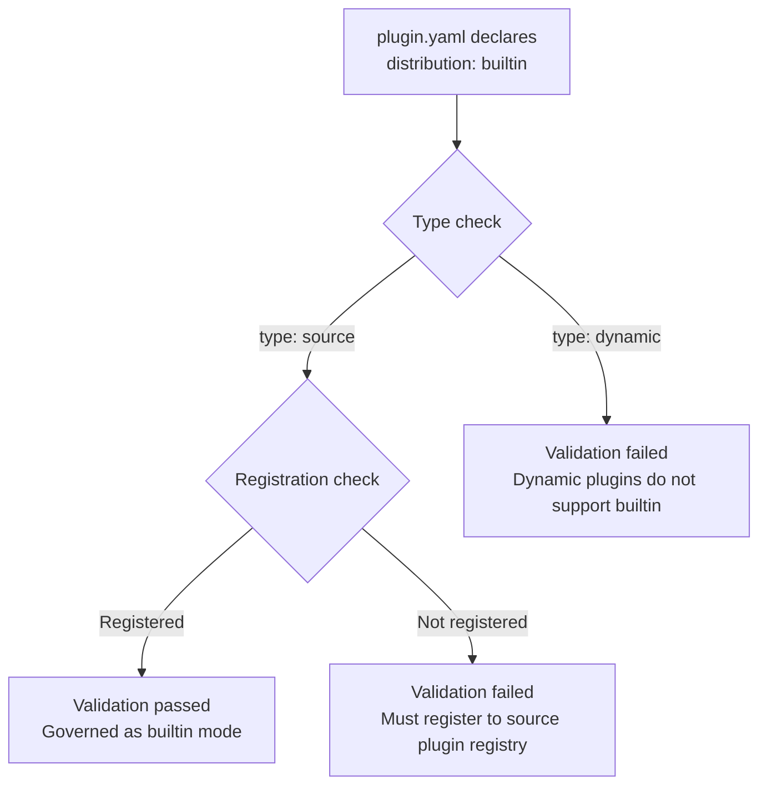
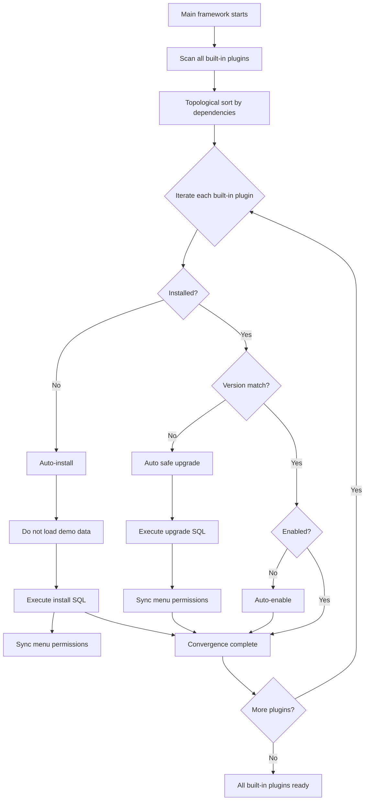

## Introduction

`Distribution` is a key enumeration field in the LinaPro plugin system that describes how a plugin is governed by the host platform. It determines the plugin's lifecycle management strategy, management page visibility, and startup behavior.

By declaring the `distribution` field in `plugin.yaml`, developers can explicitly specify whether a plugin is governed as a regular marketplace plugin or a project built-in plugin. The two distribution modes differ significantly in installation, enablement, upgrade, and management operations.

## Distribution Modes

LinaPro supports two distribution governance modes:

| Distribution Type | Semantics | Lifecycle Characteristics | Use Cases |
|----------|------|--------------|----------|
| `marketplace` | Regular plugin, explicitly manageable by platform administrators | Requires explicit installation, enablement, and upgrade, or managed enablement via `plugin.autoEnable` | Third-party plugins, optional feature modules |
| `builtin` | Project built-in source plugin, part of the project | Auto-installed, auto-enabled, and safely auto-upgraded at startup; not operable through the plugin management UI | Core business plugins, essential project features |

For enterprises or teams building their own business systems on LinaPro, business plugins are typically declared with the `builtin` distribution mode. This is because business plugins are core components of the system that need to be compiled, deployed, and upgraded together with the main framework, ensuring they are always available and version-consistent in production.

:::info
The default value of the `distribution` field is `marketplace`. If this field is not declared in `plugin.yaml`, the plugin will be governed as a marketplace plugin.
:::

## Configuration Examples

Declare the distribution mode in `plugin.yaml`:

```yaml
# Marketplace plugin (default)
id: linapro-ai-core
name: AI Hub
version: 0.1.0
type: source
distribution: marketplace
scope_nature: tenant_aware
```

```yaml
# Built-in plugin
id: linapro-tenant-core
name: Multi-Tenant Core
version: 0.1.0
type: source
distribution: builtin
scope_nature: tenant_aware
```

## Dual-Factor Constraints

Declaring `distribution: builtin` must satisfy dual-factor constraints:

1. **Type constraint**: `type` must be `source` (source plugin)
2. **Registration constraint**: Must be registered to the source plugin registry via `pluginhost.RegisterSourcePlugin`

Dynamic plugins (`type: dynamic`) do not support the `builtin` distribution mode. If `distribution: builtin` is declared in a dynamic plugin's `plugin.yaml`, the manifest validation phase will return an error.



## Lifecycle Management

The two distribution modes differ significantly in lifecycle management:

### Marketplace Plugin Lifecycle

Marketplace plugins require explicit administrator operations or configuration-based auto-enablement:

| Operation | Trigger | Description |
|:------:|----------|------|
| **Install** | Administrator manual install | Select and install from the plugin marketplace |
| **Enable** | Administrator manual enable or `plugin.autoEnable` | Requires explicit enablement after installation |
| **Upgrade** | Administrator manual upgrade | Requires confirmation of the new version |
| **Disable** | Administrator manual disable | Can be disabled at any time |
| **Uninstall** | Administrator manual uninstall | Can be uninstalled at any time |

### Built-in Plugin Lifecycle

Built-in plugins converge automatically at startup; administrators cannot perform operations through the management UI:

| Operation | Trigger | Description |
|:------:|----------|------|
| **Install** | Auto-installed at startup | Auto-installs if not already installed; does not load demo data |
| **Enable** | Auto-enabled at startup | Auto-enables if not already enabled |
| **Upgrade** | Auto safely upgraded at startup | Auto-upgrades when a new version is detected |
| **Disable** | Not allowed | Disable button hidden in the management UI |
| **Uninstall** | Not allowed | Uninstall button hidden in the management UI |

## Startup Convergence Flow

Built-in plugins execute automatic convergence when the main framework starts, ensuring all built-in plugins are in a ready state:



Startup sequence design:

1. **Source manifest sync**: Scans and synchronizes manifest information for all source plugins
2. **Built-in plugin convergence** (`bootstrap builtin plugins`): Installs, upgrades, and enables all built-in plugins in dependency topological order
3. **Auto-enable plugin convergence** (`bootstrap plugin.autoEnable`): Automatically enables marketplace plugins declared for auto-enablement based on configuration
4. **Tenant plugin reconciliation** (`reconcile auto-enabled tenant plugins`): Reconciles tenant-level plugin enablement state
5. **Register routes and runtime entries**: Registers routes and runtime entries for all enabled plugins into the host framework

:::info
Built-in plugin startup convergence uses a fail-fast strategy: if any built-in plugin fails to install, upgrade, or enable, the startup process is aborted by default.
:::

## Relationship with autoEnable

The `plugin.autoEnable` configuration item declares a list of plugins to be automatically enabled, but it differs semantically from `distribution: builtin`:

| Characteristic | `plugin.autoEnable` | `distribution: builtin` |
|:------:|---------------------|-------------------------|
| **Scope** | Only affects the enablement phase | Affects the full lifecycle: install, enable, and upgrade |
| **Management operations** | Allows manual administrator operations | Administrators cannot perform operations |
| **Upgrade behavior** | Does not auto-upgrade | Auto safely upgrades at startup |
| **Startup failure** | Does not abort startup | Aborts startup with fail-fast |

If `plugin.autoEnable` contains a plugin already declared as `builtin`, the system will emit a warning at startup indicating overlapping configuration.

## Best Practices

1. **Use `builtin` for core features**: Declare essential business plugins as `builtin` to ensure they are always available
2. **Use `marketplace` for optional features**: Declare optional feature modules as `marketplace` to allow flexible administrator management
3. **Prefer `builtin` for enterprise business plugins**: When building business systems on LinaPro, declare self-developed business plugins as `builtin` for unified compilation and deployment with the main framework, avoiding omissions or version inconsistencies in production
4. **Follow dual-factor constraints**: When declaring `builtin`, ensure both type and registration constraints are satisfied
5. **Plan dependency order properly**: Built-in plugins start in dependency topological order; ensure dependency relationships are correct
6. **Avoid overlapping configuration**: Do not add `builtin` plugins to `plugin.autoEnable`

## Common Mistakes

| Mistake | Correct Approach |
|------|----------|
| Declaring `distribution: builtin` in a dynamic plugin | `builtin` only supports source plugins (`type: source`) |
| Declaring `builtin` without registering to the source plugin registry | Ensure registration is completed via `pluginhost.RegisterSourcePlugin` |
| Adding `builtin` plugins to `plugin.autoEnable` | `builtin` already includes auto-enablement logic; no need for redundant configuration |
| Expecting to operate built-in plugins through the management UI | Built-in plugin management operations are rejected on the server side; the frontend hides them completely |
| Thinking built-in plugins can skip SQL migration | Built-in plugins still go through the full SQL migration process |
