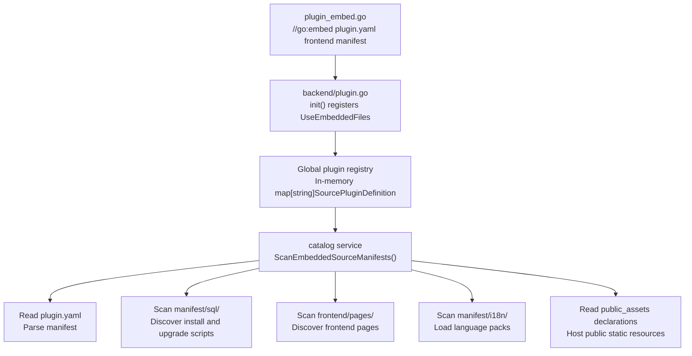

## Introduction

Every plugin version carries a set of owned resource files, including installation and upgrade SQL, internationalization language packs, frontend pages, configuration templates, and other custom files. These resources are collectively called Manifest delivery resources and reside in the plugin's `manifest/` and `frontend/` directories.

Manifest resources differ from plugin configuration: configuration allows production environment overrides, while Manifest resources are more like a part of the plugin version -- they are compiled into the binary with the source code or packaged into the dynamic plugin's `.wasm` artifact, and they switch with the effective release version on upgrade or rollback. For plugin configuration management, see [Plugin Configuration Management](/docs/plugin-config).

## Directory Structure

A typical plugin resource directory looks like this:

```text
apps/lina-plugins/<plugin-id>/
├── plugin.yaml
├── frontend/
│   ├── pages/                       # Plugin pages
│   └── slots/                       # Slot pages, optional
├── manifest/
│   ├── config/
│   │   ├── config.yaml              # Development-time default config
│   │   └── config.example.yaml      # Config template
│   ├── profile.yaml                 # Plugin custom YAML resource
│   ├── resources/
│   │   └── policy.yaml              # Plugin custom resource
│   ├── sql/                         # Installation and upgrade SQL
│   │   ├── mock-data/               # Demo data, optional
│   │   └── uninstall/               # Uninstallation SQL
│   └── i18n/                        # Plugin language packs
└── backend/
```

| Path | Primary Purpose | `Manifest()` Read Path |
|------|----------|----------------------|
| `manifest/config/config.yaml` | Plugin default runtime configuration | `config/config.yaml` |
| `manifest/config/config.example.yaml` | Configuration template, not used as runtime default | `config/config.example.yaml` |
| `manifest/profile.yaml` | Plugin custom YAML resource example | `profile.yaml` |
| `manifest/resources/*.yaml` | Plugin custom resources | `resources/*.yaml` |
| `manifest/sql/` | Installation, upgrade, and uninstallation scripts | `sql/*.sql` |
| `manifest/i18n/` | Plugin language packs | `i18n/*.json` |
| `frontend/pages/` | Plugin frontend pages | -- |

`Manifest()` read paths are always relative to `manifest/`. For example, to read `manifest/profile.yaml`, the call path should be `profile.yaml`, not `manifest/profile.yaml`.

## Source Plugin Embed Compilation Process

Source plugins use Go's `//go:embed` mechanism to compile resource files into the core framework binary. The entire process has four phases: declaration, registration, aggregation, and runtime reading.

### Declaring Embedded Resources

Each source plugin provides a `plugin_embed.go` at its root directory, using the `//go:embed` directive to declare resources to embed:

```go
package plugindemosource

import "embed"

//go:embed plugin.yaml frontend manifest
var EmbeddedFiles embed.FS
```

Embedded targets typically include three categories: the `plugin.yaml` manifest, `frontend/` pages, and all resources under `manifest/` (SQL, i18n, config templates, etc.). The Go compiler packages these files into the binary at build time.

### Registering the Embedded Filesystem

Source plugins bind the embedded filesystem to the plugin declaration in `backend/plugin.go`'s `init()`:

```go
func init() {
    plugin := pluginhost.NewDeclarations(pluginID)
    plugin.Assets().UseEmbeddedFiles(plugindemosource.EmbeddedFiles)
    // ... register lifecycle, routes, jobs, etc.
    pluginhost.RegisterSourcePlugin(plugin)
}
```

`UseEmbeddedFiles` stores the `fs.FS` in the plugin definition's in-memory structure for subsequent runtime reading.

### Aggregation Entry Triggers Initialization

The core framework triggers all source plugins' `init()` through blank imports in `lina-plugins.go`:

```go
package linaplugins

import (
    _ "lina-plugin-linapro-ai-core/backend"
    _ "lina-plugin-linapro-content-notice/backend"
    _ "lina-plugin-linapro-demo-source/backend"
    // ... other source plugins
)
```

The blank imports ensure that all plugins' `init()` functions execute at core framework startup, and the embedded filesystems are registered in the in-memory global plugin registry.

### Runtime Reading of Embedded Resources

After the core framework starts, the `catalog` service iterates through all source plugins in the registry and reads resources from the embedded filesystems:



The `catalog` service performs the following operations through the embedded filesystem:

| Operation | Description |
|------|------|
| Manifest discovery | Reads plugin identity, dependencies, menus, and permission declarations from `plugin.yaml` |
| SQL discovery | Scans scripts under `manifest/sql/`, `manifest/sql/uninstall/`, and `manifest/sql/mock-data/` |
| Frontend discovery | Scans `.vue` files under `frontend/pages/` and `frontend/slots/` |
| Public resources | Reads directories declared in `public_assets` and hosts them at `/x-assets/{plugin-id}/{version}/...` |
| i18n loading | Reads language packs under `manifest/i18n/` and injects them into the runtime translation service |
| API docs | Reads API documentation translations under `manifest/i18n/{locale}/apidoc/` |

## Dynamic Plugin Artifact Packaging

Dynamic plugins use a different resource packaging approach from source plugins. The build tool reads plugin embedded resources (or falls back to directory scanning when needed) and writes the following into the `.wasm` artifact:

- `plugin.yaml` manifest
- `frontend/` frontend assets
- `manifest/sql` installation and upgrade scripts
- `manifest/i18n` language packs
- `manifest/config/config.yaml` default configuration
- `manifest/config/config.example.yaml` configuration template
- Other resources under `manifest/`

Runtime resources are bound to the current effective release's checksum and build number. Install, enable, disable, uninstall, upgrade, or same-version refresh operations all trigger the corresponding cache invalidation.

## Reading Manifest Resources

Plugins can read raw resources from the current plugin's `manifest/` directory through the `Manifest()` service.

### Interface Methods

| Method | Description |
|------|------|
| `Get` | Returns the raw byte content of a file |
| `Exists` | Checks whether a file exists |
| `Scan` | Scans a YAML resource or a nested key within it into a target struct |

### Source Plugin Read Source

Source plugins read from the embedded filesystem bound to the current plugin. If no embedded filesystem exists, they fall back to the repository development directory `apps/lina-plugins/<plugin-id>/manifest/`. Source plugins can only read their own `manifest/` resources and cannot read the host's or other plugins' directories.

```go
// Read raw bytes
content, err := services.Manifest().Get(ctx, "config/config.example.yaml")
if err != nil {
    return err
}
if len(content) > 0 {
    _ = string(content)
}
```

### Dynamic Plugin Read Source

Dynamic plugins read from the `manifest/` resource snapshot carried by the current effective release artifact. Reads must pass through the `plugin.yaml`'s `service: manifest` and `resources.paths` authorization snapshot validation.

After a dynamic plugin upgrade, rollback, or same-version refresh, `Manifest()` sees the resource snapshot bound to the current effective release. This ensures that the raw resources read by the dynamic plugin are consistent with the actually active release version.

### YAML Convenience Scanning

When reading custom YAML resources, you can use `Manifest().Scan()`:

```go
type PluginProfile struct {
    Category string `yaml:"category"`
    Display  struct {
        Icon        string `yaml:"icon"`
        AccentColor string `yaml:"accentColor"`
    } `yaml:"display"`
    Features struct {
        Import bool `yaml:"import"`
        Export bool `yaml:"export"`
    } `yaml:"features"`
}

func loadProfile(ctx context.Context, services pluginhost.Services) (*PluginProfile, error) {
    profile := &PluginProfile{}
    if err := services.Manifest().Scan(ctx, "profile.yaml", "", profile); err != nil {
        return nil, err
    }
    return profile, nil
}
```

You can also scan only a specific nested key:

```go
var features struct {
    Import bool `yaml:"import"`
    Export bool `yaml:"export"`
}

if err := services.Manifest().Scan(ctx, "profile.yaml", "features", &features); err != nil {
    return err
}
```

## Dynamic Plugin Authorization

If a dynamic plugin needs to read manifest resources, it must declare the resource scope in `plugin.yaml`:

```yaml
hostServices:
  - service: manifest
    methods: [get]
    resources:
      paths:
        - profile.yaml
        - resources/*.yaml
        - config/config.example.yaml
        - sql/*.sql
        - i18n/zh-CN/*.json
```

Dynamic plugin manifest resource paths support exact paths and controlled wildcard patterns. Paths are still relative to `manifest/`; do not write `manifest/profile.yaml`.

Source plugins do not perform additional authorization through `plugin.yaml`'s `paths` because source plugins are compiled and delivered with the host and are considered trusted extensions. However, source plugins are still subject to path safety constraints and plugin scope constraints. Dynamic plugins connect through WASM and must explicitly declare and receive host confirmation before reading corresponding paths.

## Dedicated Directory Raw Reading

`Manifest()` reads the raw content of files and does not automatically "activate" them. For example:

| Read Path | What You Get via `Manifest()` | Actual Activation Mechanism |
|----------|------------------------------|--------------|
| `config/config.yaml` | Raw content of the configuration file carried by the current plugin's source or dynamic artifact | Runtime configuration is still read by `Plugins().Config()` following the production, development-time, dynamic default priority |
| `config/config.example.yaml` | Configuration template raw text | Only serves as template and documentation; does not participate in default value reading |
| `sql/*.sql` | Installation, upgrade, or uninstallation script text | Whether to execute is determined by the plugin lifecycle pipeline |
| `i18n/*.json` | Plugin language pack raw text | Whether to load is determined by the internationalization pipeline |

Therefore, `Manifest()` is suitable for resource inspection, preview, diagnostics, custom parsing, or plugin-internal customization logic. Do not treat it as the entry point for executing SQL, loading language packs, or overriding runtime configuration.

## Path Safety

`Manifest()` only accepts slash paths relative to the current plugin's `manifest/` root directory. The following patterns will be rejected:

| Invalid Path | Rejection Reason |
|----------|----------|
| `manifest/profile.yaml` | Redundantly includes the `manifest/` prefix |
| `../other-plugin/profile.yaml` | Attempts to escape the current plugin's `manifest/` directory |
| `/etc/passwd` | Absolute path |
| `C:\secret.yaml` | Windows drive path |
| `https://example.com/config.yaml` | URL; will not trigger network reads |

When reading a missing resource, `Get()` returns empty content, `Exists()` returns `false`, and `Scan()` does not modify the target struct. Plugins should decide based on their own business semantics whether a missing resource should fall back gracefully or raise an error.

## Design Benefits

### Dynamic Plugins Carry Default Configuration Per Version

Dynamic plugin default configuration is bound to the `.wasm` effective release version. When a plugin is upgraded, rolled back, or refreshed at the same version, the core framework uses the current effective release's resource snapshot without depending on the developer's local directory.

### Raw Reading Does Not Replace Dedicated Pipelines

`Manifest()` can read raw resources under `manifest/`, but configuration, SQL, and language packs are still governed by their respective dedicated pipelines at runtime. This lets plugins inspect files carried with their version when needed, while preventing "reading a file" from being confused with "activating a file."

## Common Mistakes

| Mistake | Correct Approach |
|------|----------|
| Using `Manifest()` to read `config/config.yaml` and treating it as the current runtime configuration | Use `Plugins().Config()` to read plugin runtime configuration; `Manifest()` can only retrieve raw file content |
| Using `Manifest()` to read `sql/` or `i18n/` and expecting automatic execution or loading | Let the plugin lifecycle and internationalization pipelines handle these resources; `Manifest()` is only responsible for raw reading |
| Passing `manifest/profile.yaml` to `Manifest()` | Pass the relative path `profile.yaml` |
| Dynamic plugins requesting overly broad `manifest` access scope | Only declare paths you actually need, such as `profile.yaml`, `config/config.example.yaml`, or `resources/*.yaml` |
