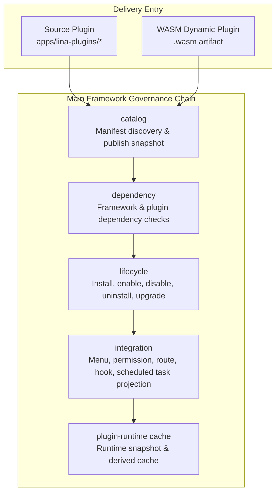
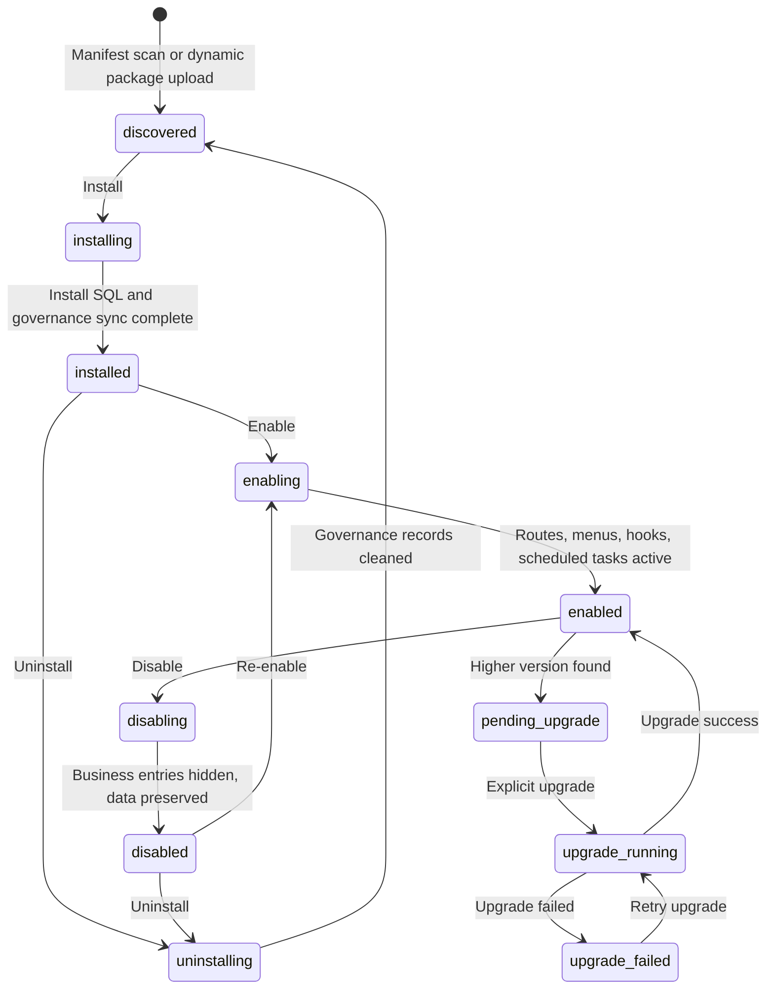

## Introduction

The plugin system is `LinaPro`'s core extension mechanism for delivering business capabilities. Each plugin is a self-contained module that can declare `API` routes, database resources, frontend pages, menu permissions, language packs, scheduled tasks, and lifecycle callbacks.

`LinaPro` supports two delivery modes simultaneously:

- **Source plugins**: Participate in main framework compilation as `Go` source code, suitable for long-term maintained business capabilities.
- **Dynamic plugins**: Uploaded and loaded at runtime as `.wasm` artifacts, suitable for binary distribution, hot-reload, and temporary extensions.

The two modes differ in runtime form but share the same plugin governance surface. The admin side sees the same plugin lifecycle, dependencies, permissions, state, multi-tenant strategy, public static assets, and plugin configuration.

Source plugins and dynamic plugins also converge in directory structure: the root contains `plugin.yaml`, backend capabilities live in `backend/`, frontend resources in `frontend/`, and install scripts, language packs, configuration, and plugin-owned resources in `manifest/`. Source plugins embed these resources into the main framework build artifact via `plugin_embed.go`; dynamic plugins write similar resources into `.wasm` artifacts through build tooling and bind them to the currently active published version at runtime.

## Plugins Don't Need to Include Frontend Pages

`LinaPro`'s plugin system does not require every plugin to provide frontend pages. Whether a plugin solves a problem depends not on whether it has a UI, but on whether it implements the extension capabilities the main framework needs.

Many plugins derive their entire value from extending backend behavior without any user interface. Typical examples include:

- **Storage backend plugins**: Integrate with Qiniu Cloud, `AWS S3`, or other object storage services, taking over the main framework's file upload and read logic. Once the plugin is enabled, the main framework's file storage behavior switches automatically without modifying any caller code — the UI side is completely unaware.
- **Authentication method plugins**: Integrate with `LDAP` directory services or `OIDC` identity providers to extend user login capabilities. The main framework calls the plugin's specific implementation through the authentication interface, and the business layer is completely transparent to the underlying protocol.

For these purely backend plugins, the `menus` field in `plugin.yaml` is typically empty. The plugin only needs to register `HTTP` routes through `pluginhost` or implement main framework extension point interfaces, and the main framework consumes plugin capabilities through interface calls. Frontend and backend modularization are two natural choices within the same plugin model, not a mandatory requirement for all plugins.

## Why Dual Modes Are Needed

A single plugin form can hardly satisfy development efficiency, runtime performance, hot-reload, and commercial distribution simultaneously.

| Need | More Suitable Mode | Reason |
|------|-------------------|--------|
| **Long-term business modules** | Source plugin | Native `Go` performance, complete toolchain, easy to test and maintain |
| **Urgent fixes or temporary capabilities** | Dynamic plugin | Can be uploaded and enabled at runtime, reducing deployment impact |
| **Commercial plugin distribution** | Dynamic plugin | Can distribute only binary artifacts without exposing source code |
| **Deep collaboration with main framework capabilities** | Source plugin | Can use main framework capabilities through stable `pluginhost` contracts |

In most business development, source plugins are the default choice; when hot-reload, source code protection, or end-user self-service plugin upload becomes a hard requirement, choose dynamic plugins.

## Governance Main Chain

The plugin system is not simply scanning directories and registering routes — it is a governance main chain from discovery to runtime:



| Source Component | Component Responsibility |
|------------------|-------------------------|
| `catalog` | Reads `plugin.yaml` or `WASM` custom sections, generating auditable publish snapshots |
| `dependency` | Checks framework version ranges, plugin dependencies, and circular dependencies |
| `lifecycle` | Orchestrates install, enable, disable, uninstall, and runtime upgrade |
| `integration` | Projects menus, permissions, routes, hooks, and scheduled tasks into the main framework runtime |
| `plugin-runtime cache` | Provides low-latency plugin state, route, and resource snapshots for request paths |

## Key Public Contracts

### plugin.yaml

Every plugin must provide a `plugin.yaml`. It is the unified entry for plugin identity, dependencies, menus, multi-tenant strategy, public static assets, and dynamic plugin main framework capability authorization.

```yaml
# Unique plugin identifier, must be unique across host and source plugin directories, kebab-case naming
# Recommended format: <author>-<domain>-<capability>, e.g., linapro-content-notice
id: linapro-content-notice

# Plugin display name, used in plugin management pages, documentation, and presentation
name: Content Notice

# Plugin semantic version, recommended to use v-prefixed format
version: v0.1.0

# Plugin type enum
# source: Delivered with host source code compilation, suitable for long-term maintained business capabilities
# dynamic: Loaded as runtime dynamic plugin artifact, suitable for hot-reload and commercial distribution
type: source

# Multi-tenant scope enum
# platform_only: Only visible and governed in platform context
# tenant_aware: Governed by tenant context (default)
scope_nature: tenant_aware

# Multi-tenant support flag, true means plugin supports tenant-level install and provisioning governance
supports_multi_tenant: true

# Default install mode enum
# global: Globally unified install and enable
# tenant_scoped: Independent enable/disable per tenant (default)
default_install_mode: tenant_scoped

# Plugin capability description, outlining the plugin's capability boundary
description: Provides content change notification publish and subscribe capabilities

# Plugin author or owning team
author: linapro

# Plugin homepage or documentation URL, for supplementary project introduction, design docs, or external links
homepage: https://example.com/plugins/linapro-content-notice

# Plugin license identifier
license: Apache-2.0

# Distribution method declaration (optional)
distribution: bundled

# Plugin i18n configuration, consistent with host i18n config structure
i18n:
  # Whether to enable multi-language support
  enabled: true
  # Default language
  default: zh-CN
  # Enabled language list
  locales:
    # Language code
    - locale: en-US
      # Language native name
      nativeName: English
    - locale: zh-CN
      nativeName: 简体中文

# Plugin dependency declarations
dependencies:
  # LinaPro framework semantic version range, supports >=, <=, >, <, = operators, multiple constraints separated by space
  framework:
    version: ">=0.1.0 <1.0.0"
  # Inter-plugin dependency declarations
  plugins:
    # Dependency plugin ID
    - id: linapro-org-core
      # Dependency plugin semantic version range
      version: ">=0.1.0"

# Declarative public static asset directories, hosted by the main framework at /x-assets/{plugin-id}/{version}/...
# Dynamic plugins typically need to declare; source plugins are optional
public_assets:
  # Plugin relative directory or resource prefix
  - source: frontend/pages
    # URL mount point
    mount: /
    # Default entry file
    index: index.html

# Plugin menu declaration list, host syncs menus, button permissions, and route entries per this list
menus:
  # Menu unique key, must use plugin:<plugin-id>:<menu-key> format
  - key: plugin:linapro-content-notice:main-entry
    # Parent menu key, points to host built-in catalog or parent menu key
    parent_key: extension
    # Menu display name
    name: Content Notice
    # Frontend route path (source plugins use host-internal route fragments, dynamic plugins use full hosted path)
    path: linapro-content-notice-list
    # Menu render component, dynamic page shell for hosting plugin pages
    component: system/plugin/dynamic-page
    # Menu access permission identifier
    perms: linapro-content-notice:notice:view
    # Menu icon, using Iconify icon name
    icon: lucide:bell
    # Menu type enum
    # D: Directory
    # M: Menu page
    # B: Button permission point
    type: M
    # Menu sort value, smaller numbers come first
    sort: 10
    # Visibility: 0 hidden, 1 shown (optional)
    visible: 1
    # iframe flag: 0 no, 1 yes (optional)
    is_frame: 0
    # Cache flag: 0 no, 1 yes (optional)
    is_cache: 0
    # Route query parameters (optional, commonly used by dynamic plugins)
    query:
      pluginAccessMode: embedded-mount
    # Menu remark, written to host menu governance data (optional)
    remark: Content notice management menu

  # Button permission point example
  - key: plugin:linapro-content-notice:notice-create
    # Parent menu key, points to the owning menu page
    parent_key: plugin:linapro-content-notice:main-entry
    # Button display name
    name: Create Notice
    # Button permission identifier
    perms: linapro-content-notice:notice:create
    # Button permission point type
    type: B
    # Button sort value
    sort: 1

# Host service declaration list (dynamic plugin only), for requesting host service, method, and resource boundary access
hostServices:
  # runtime service: provides logging, state, and runtime info capabilities
  - service: runtime
    methods:
      # Write host structured log
      - log.write
      # Read plugin isolated state
      - state.get
      # Write plugin isolated state
      - state.set
      # Delete plugin isolated state
      - state.delete
      # Read host current time
      - info.now
      # Generate host-side UUID
      - info.uuid

  # storage service: access plugin isolated storage objects
  - service: storage
    methods:
      # Write storage object
      - put
      # Initiate chunked storage object upload
      - put.init
      # Append a storage object upload chunk
      - put.chunk
      # Commit chunked storage object upload
      - put.commit
      # Abort chunked storage object upload
      - put.abort
      # Read storage object
      - get
      # Delete storage object
      - delete
      # List storage objects
      - list
      # Read storage object metadata
      - stat
    # Resource boundary declaration, limits accessible storage path prefixes
    resources:
      paths:
        - notice-files/

  # network service: initiate governed external network requests
  - service: network
    methods:
      # Initiate external network request
      - request
    # Resource boundary declaration, limits accessible URLs
    resources:
      - url: https://api.example.com

  # data service: access authorized data tables
  - service: data
    methods:
      # Paginate multiple records
      - list
      # Read single record by primary key
      - get
      # Create record
      - create
      # Update record
      - update
      # Delete record
      - delete
      # Execute single-table structured transaction
      - transaction
    # Resource boundary declaration, limits accessible data tables
    resources:
      tables:
        - plugin_linapro_content_notice_record

  # plugins service: read current plugin's own runtime configuration
  - service: plugins
    methods:
      - config.get

  # hostConfig service: read host public configuration within whitelist
  - service: hostConfig
    methods:
      - get
    resources:
      keys:
        - workspace.basePath
        - i18n.default
```

### Plugin ID Naming Convention

The plugin `ID` is the unique identifier that runs through the entire plugin lifecycle, used for directory naming, `API` route namespaces, database table prefixes, menu `keys`, and static asset paths. `LinaPro` recommends a three-segment `kebab-case` structure for plugin IDs: `<author>-<domain>-<capability>`:

| Segment | Meaning | Example |
|---------|---------|---------|
| `<author>` | Plugin author or organization identifier | `linapro` |
| `<domain>` | Business domain | `content`, `monitor`, `org`, `tenant` |
| `<capability>` | Specific capability, may contain multiple `kebab` segments | `notice`, `loginlog`, `demo-guard` |

`<author>-<domain>-<capability>` is the official recommended naming convention and repository governance standard, not a runtime enforcement rule. Runtime validation only ensures the `ID` is non-empty, max `64` characters, and valid `kebab-case`. The main framework's `ParsePluginID` function will attempt to split `Author`, `Domain`, and `Capability` segments from the `ID`, but IDs with fewer than three segments are also accepted.

The `<domain>` segment identifies the plugin's business domain. It is recommended to select from common domains below, or define your own based on actual business:

| Domain | Use Case | Plugin Name Example |
|--------|----------|---------------------|
| `content` | Content management, articles, announcements, notifications | `linapro-content-notice` |
| `monitor` | Monitoring, logs, auditing | `linapro-monitor-loginlog` |
| `org` | Organizational structure, departments, positions | `linapro-org-core` |
| `tenant` | Multi-tenancy, tenant management | `linapro-tenant-core` |
| `ops` | Operations, security, access control | `linapro-ops-demo-guard` |
| `auth` | Authentication, authorization, SSO | — |
| `oidc` | `OIDC` identity provider integration | — |
| `ai` | AI, large models, vector search | `linapro-ai-core` |
| `storage` | File storage, object storage | — |
| `workflow` | Workflows, approval flows | — |
| `message` | Message center, in-app messaging, push | — |
| `payment` | Payments, orders, billing | — |
| `gateway` | Gateway, rate limiting, routing | — |
| `data` | Data integration, import/export, `ETL` | — |

### pluginhost

`pluginhost` is the host interface layer for **source plugins** facing the main framework, located in the `pkg/plugin/pluginhost` directory. It does not expand each domain capability's specific methods on this overview page, but consolidates source plugin declarations, resources, routes, lifecycle, and runtime service entries into stable public contracts.

Source plugins cannot directly `import` the main framework's `internal/` directory — they can only use stable published contracts. For which domain capabilities, trusted management commands, and tenant filtering capabilities `pluginhost.Services` can access, see [Domain Capabilities Design and Overview](/docs/domain-capabilities).

### pluginbridge

`pluginbridge` is the bridge interface layer for **dynamic plugins** facing the main framework, located in the `pkg/plugin/pluginbridge` directory. It isolates `WASM` plugin declarations, route handling, protocol encoding/decoding, and host capability calls within the sandbox boundary.

When dynamic plugins access main framework capabilities, they must declare authorization scope through `hostServices`, which is then validated by the host by service, method, and resource boundary. For the detailed dynamic plugin domain capability catalog, `hostServices` authorization model, and source plugin capability differences, see [Domain Capabilities Design and Overview](/docs/domain-capabilities).

## Lifecycle States

Plugin lifecycle covers discovery, install, enable, disable, uninstall, and upgrade, including governance hooks for tenant-level disable, tenant deletion, and install mode adjustment:



Plugin file updates do not automatically switch the active version. After the main framework starts or scans and discovers a higher version, it marks the plugin as `pending_upgrade`. Administrators preview and explicitly execute the runtime upgrade on the plugin management page. The upgrade process executes dependency pre-checks, lifecycle callbacks, upgrade `SQL`, governance resource sync, active publish switch, cache invalidation, and cluster notification.

Dynamic plugin upgrades that involve resource-type `hostServices` changes require re-confirmation of the authorization snapshot. Source plugin upgrades compare the current compile-time discovered version against the database's active version to avoid mistaking file overwrite for runtime upgrade completion.

## Isolation Mechanisms

### Database Namespace

Plugin-owned tables must use the `snake_case` prefix derived from the plugin `ID`:

```text
Main framework tables: sys_user, sys_role, sys_menu
Plugin tables: linapro_content_notice_record, linapro_org_core_dept, linapro_demo_dynamic_record
```

System tables use the `sys_` prefix; plugin tables use the `<plugin_id>_` prefix. Main framework and plugin data are completely isolated, avoiding naming conflicts and permission misuse.

If a plugin needs multi-tenant support, it must design tables containing a `tenant_id` column and append filtering conditions through the main framework's published tenant filtering capability.

### File Namespace

Plugin file storage should use the plugin `ID` as the path namespace:

```text
temp/upload/linapro-content-notice/
temp/upload/linapro-demo-dynamic/
```

### Sandbox Isolation

`WASM` dynamic plugins cannot directly access the main framework's filesystem, network, or database. All access goes through `hostServices` bridging and is constrained by the authorization snapshot.

## Multi-Tenant Fields

Plugins declare multi-tenant boundaries through three fields:

| Field | Options | Description |
|-------|---------|-------------|
| `scope_nature` | `platform_only` / `tenant_aware` | Whether the plugin is platform-level governance or can enter tenant context |
| `supports_multi_tenant` | `true` / `false` | Whether it supports tenant-level install, provisioning, and data isolation |
| `default_install_mode` | `global` / `tenant_scoped` | Whether globally enabled by default or independently enabled/disabled per tenant |

For example, the `multi-tenant` plugin itself is a platform-level governance plugin using `platform_only` and `global`; content, organization, and audit plugins are typically `tenant_aware`.

## Main Framework and Plugin Boundary

| Rule | Reason |
|------|--------|
| Plugins do not directly depend on the main framework's `internal/` packages | Main framework internal implementation can evolve; stable contracts are provided by `pkg/` |
| Plugin menus use the `plugin:<plugin-id>:<key>` format | Avoids conflicts with the main framework or other plugins |
| Install `SQL` must be idempotent | Supports re-execution, data-preserving reinstall, and upgrade recovery |
| Plugin service logic goes in `backend/internal/service/` | Keeps plugin backend structure consistent, avoids package naming confusion |
| Plugin `API` uses `/x/{plugin-id}/...` | Source and dynamic plugins share a unified plugin `API` namespace, avoiding occupying the main framework `/api/v1` control plane |
| Public static assets must declare `public_assets` | The main framework only hosts plugin explicitly authorized public resource directories |
| Plugin config is read through plugin-scoped config service | Avoids plugins directly depending on host global config structure |
| Plugin uninstall distinguishes data preservation from data cleanup | Reduces accidental deletion risk, allows data reuse on subsequent reinstall |
