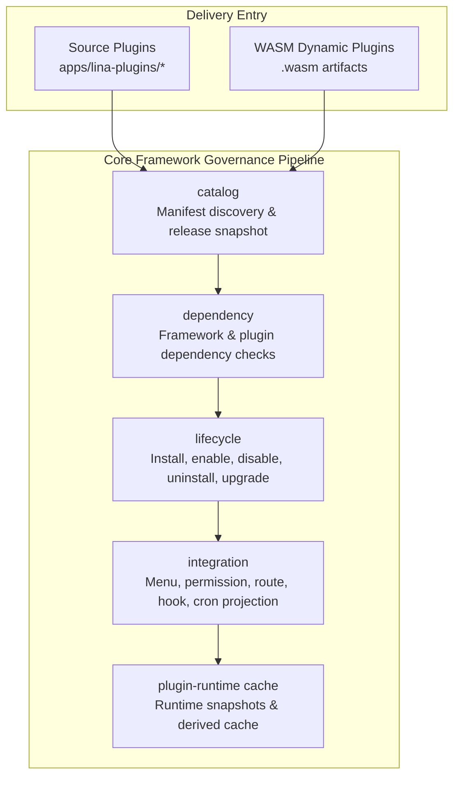
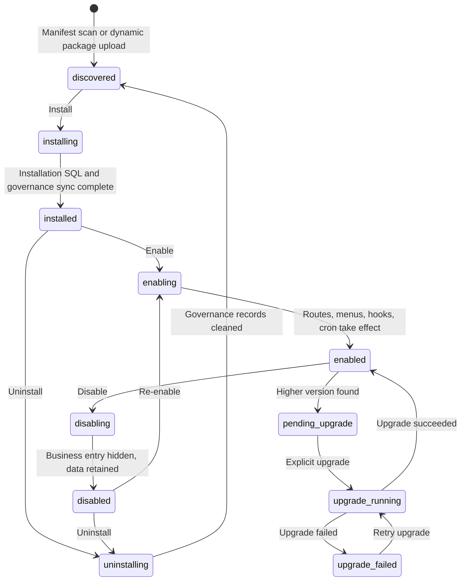

## Introduction

The plugin system is `LinaPro`'s core extension mechanism for business capabilities. Each plugin is a self-contained module that can declare `API` routes, database resources, frontend pages, menu permissions, language packs, scheduled tasks, and lifecycle callbacks.

`LinaPro` supports two delivery modes simultaneously:

- **Source plugins**: Participate in core framework compilation as `Go` source code, suited for long-term business capabilities.
- **Dynamic plugins**: Uploaded and loaded as `.wasm` runtime artifacts, suited for binary distribution, hot-loading, and temporary extensions.

The two modes differ in runtime form, but share the same plugin governance plane. The admin side sees the same plugin lifecycle, dependencies, permissions, status, and multi-tenant policies.

## Plugins Don't Have to Include a Frontend

`LinaPro`'s plugin system does not require every plugin to provide a frontend page. Whether a plugin solves the problem depends not on whether it has a UI, but on whether it implements the extension capability the core framework needs.

Many plugins deliver their full value by extending backend behavior, with no user interface at all. Common examples include:

- **Storage backend plugins**: Integrate Qiniu Cloud, `AWS S3`, or other object storage services, taking over the framework's file upload and read logic. Once enabled, the framework's file storage behavior switches automatically — no changes to any calling code, and no visible impact on the frontend.
- **Authentication provider plugins**: Connect `LDAP` directory services or `OIDC` identity providers to extend the user login experience. The framework calls the plugin's concrete implementation through the authentication interface, making the underlying protocol completely transparent to the business layer.

For this kind of backend-only plugin, the `menus` field in `plugin.yaml` is typically empty. The plugin simply registers `HTTP` routes or implements the core framework extension point interfaces via `pluginhost`, and the framework consumes the plugin's capabilities through interface calls. Frontend and backend modularity are two natural choices within the same plugin model — not a requirement imposed on every plugin.

## Why Two Modes?

A single plugin form cannot simultaneously satisfy development efficiency, runtime performance, hot-loading, and commercial distribution.

| Need | Better Mode | Reason |
|------|-------------|--------|
| **Long-term business modules** | Source plugins | Native `Go` performance, complete toolchain, easy to test and maintain |
| **Urgent fixes or temporary capabilities** | Dynamic plugins | Can be uploaded and enabled at runtime, reducing deployment impact |
| **Commercial plugin distribution** | Dynamic plugins | Can distribute only binary artifacts without exposing source |
| **Deep core framework collaboration** | Source plugins | Can use core framework capabilities through stable `pluginhost` contracts |

In most business development, source plugins are the default choice. Choose dynamic plugins when hot-loading, source code protection, or end-user plugin uploads are hard requirements.

## Governance Pipeline

The plugin system is not a simple "scan directory and register routes" — it is a full governance pipeline from discovery to runtime:



| Component | Responsibility |
|-----------|---------------|
| `catalog` | Reads `plugin.yaml` or `WASM` custom sections and generates an auditable release snapshot |
| `dependency` | Checks framework version range, plugin dependencies, and circular dependencies |
| `lifecycle` | Orchestrates install, enable, disable, uninstall, and runtime upgrade |
| `integration` | Projects menus, permissions, routes, hooks, and scheduled tasks into the core framework runtime |
| `plugin-runtime cache` | Provides low-latency plugin status, route, and resource snapshots for request paths |

## Key Public Contracts

### plugin.yaml

Every plugin must provide a `plugin.yaml`. It is the unified entry point for plugin identity, dependencies, menus, multi-tenant policy, and dynamic plugin core framework service authorization.

```yaml
id: content-article
name: 文章管理
version: v0.1.0
type: source
scope_nature: tenant_aware
supports_multi_tenant: true
default_install_mode: tenant_scoped
description: 提供文章内容的增删改查管理功能
author: linapro
license: Apache-2.0
menus:
  - key: plugin:content-article:list
    name: 文章管理
    path: content-article-list
    component: system/plugin/dynamic-page
    perms: content-article:article:view
    type: M
```

Dynamic plugins can also declare `hostServices` to request access to core framework capabilities:

```yaml
hostServices:
  - service: data
    methods: [list, get, create, update, delete]
    resources:
      tables:
        - plugin_demo_dynamic_record
  - service: storage
    methods: [put, get, delete, list]
    resources:
      paths:
        - plugin-demo-dynamic/
```

### pluginhost

`pluginhost` is the stable extension interface used by **source plugins**. Source plugins register through it:

| Interface | Capability |
|-----------|-----------|
| `Assets()` | Embeds plugin manifest, language packs, `SQL`, and frontend resources |
| `HTTP()` | Registers plugin `HTTP` routes |
| `Hooks()` | Subscribes to core framework events |
| `Cron()` | Registers plugin task handlers |
| `Lifecycle()` | Registers install, upgrade, disable, uninstall, and other lifecycle callbacks |
| `Governance()` | Declares menu and permission filtering logic |

Source plugins cannot directly `import` the core framework's `internal/` directory. They can only use stable contracts published by the core framework.

### pluginbridge

`pluginbridge` is the sandbox communication layer for **dynamic plugins**. The core framework encapsulates request, identity, tenant, and permission snapshots into a `BridgeRequestEnvelopeV1` and passes it into the `WASM` module. The plugin returns a `BridgeResponseEnvelopeV1`.

When a dynamic plugin accesses core framework capabilities, it issues a `host_call`. The core framework validates the service, method, and resource boundaries against the `hostServices` authorization snapshot confirmed at installation time.

## Lifecycle States

The plugin lifecycle covers discovery, installation, enablement, disablement, uninstallation, and upgrade:



Plugin file updates do not automatically switch the active version. After the core framework starts or scans and finds a higher version, it marks the plugin as `pending_upgrade`. The administrator previews and explicitly executes the runtime upgrade in the plugin management page. The upgrade flow runs dependency pre-checks, lifecycle callbacks, upgrade `SQL`, governance resource synchronization, active release switching, cache invalidation, and cluster notification.

## Isolation Mechanisms

### Database namespace

Plugin-owned tables must use a `snake_case` prefix derived from the plugin `ID`:

```text
Core framework tables: sys_user, sys_role, sys_menu
Plugin tables: content_notice_notice, org_center_dept, plugin_demo_dynamic_record
```

System tables use the `sys_` prefix. Plugin tables use the `<plugin_id>_` prefix. Core framework and plugin data are fully isolated, avoiding naming conflicts and permission misuse.

Plugins that need multi-tenant support should design their tables to include a `tenant_id` column and use the core framework-published tenant filtering capability to append filter conditions.

### File namespace

Plugin file storage should use the plugin `ID` as the path namespace:

```text
temp/upload/content-notice/
temp/upload/plugin-demo-dynamic/
```

### Sandbox isolation

`WASM` dynamic plugins cannot directly access the core framework filesystem, network, or database. All access goes through `hostServices` bridging, constrained by authorization snapshots.

## Multi-Tenant Fields

Plugins declare multi-tenant boundaries through three fields:

| Field | Values | Description |
|-------|--------|-------------|
| `scope_nature` | `platform_only` / `tenant_aware` | Whether the plugin is a platform-level governance capability or can enter tenant contexts |
| `supports_multi_tenant` | `true` / `false` | Whether it supports tenant-scoped installation, provisioning, and data isolation |
| `default_install_mode` | `global` / `tenant_scoped` | Whether it is enabled globally by default or independently per tenant |

For example, the `multi-tenant` plugin itself is a platform-level governance plugin using `platform_only` and `global`. Content, organization, and audit plugins are typically `tenant_aware`.

## Core Framework and Plugin Boundaries

| Rule | Reason |
|------|--------|
| Plugins must not depend on the core framework's `internal/` packages | Core framework internals can evolve; stable contracts are provided by `pkg/` |
| Plugin menus use the `plugin:<plugin-id>:<key>` format | Avoids conflicts with the core framework or other plugins |
| Installation `SQL` must be idempotent | Supports repeated execution, reinstallation with data retention, and upgrade recovery |
| Plugin service logic goes in `backend/internal/service/` | Keeps plugin backend structure consistent, avoiding package naming confusion |
| Plugin uninstallation distinguishes retained vs. cleaned data | Reduces accidental deletion risk and allows data reuse on reinstallation |
