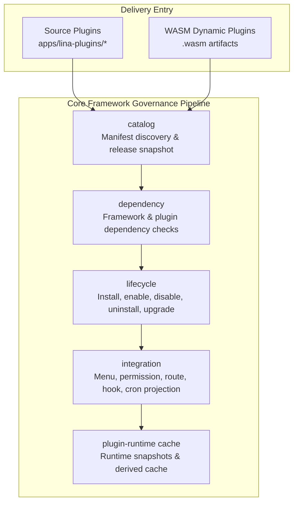
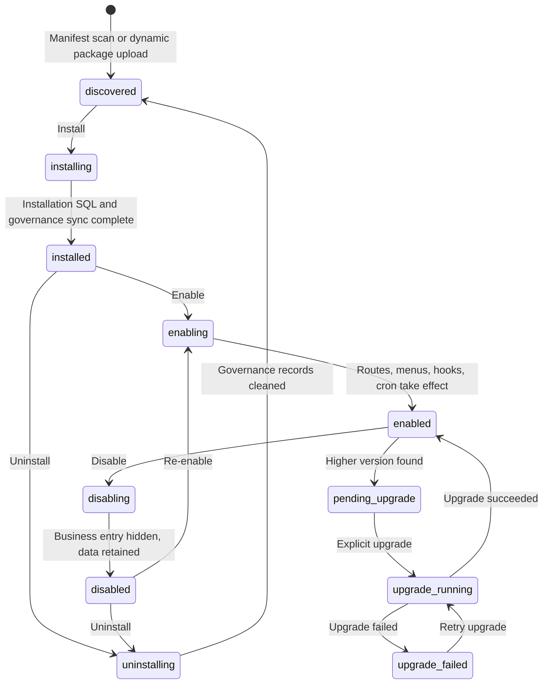

## Introduction

The plugin system is `LinaPro`'s core extension mechanism for business capabilities. Each plugin is a self-contained module that can declare `API` routes, database resources, frontend pages, menu permissions, language packs, scheduled tasks, and lifecycle callbacks.

`LinaPro` supports two delivery modes simultaneously:

- **Source plugins**: Participate in core framework compilation as `Go` source code, suited for long-term business capabilities.
- **Dynamic plugins**: Uploaded and loaded as `.wasm` runtime artifacts, suited for binary distribution, hot-loading, and temporary extensions.

The two modes differ in runtime form, but share the same plugin governance plane. The admin side sees the same plugin lifecycle, dependencies, permissions, status, multi-tenant policies, public static assets, and plugin-owned configuration.

The directory structures for source plugins and dynamic plugins are also converging: the root contains `plugin.yaml`, backend capability lives under `backend/`, frontend resources live under `frontend/`, and installation scripts, language packs, configuration, and plugin-owned resources live under `manifest/`. Source plugins embed these resources into the core framework build artifact through `plugin_embed.go`; dynamic plugins write the same kinds of resources into `.wasm` artifacts through the build tool and bind them to the current active release version at runtime.

## Plugins Don't Have to Include a Frontend

`LinaPro`'s plugin system does not require every plugin to provide a frontend page. Whether a plugin solves the problem depends not on whether it has a UI, but on whether it implements the extension capability the core framework needs.

Many plugins deliver their full value by extending backend behavior, with no user interface at all. Common examples include:

- **Storage backend plugins**: Integrate Qiniu Cloud, `AWS S3`, or other object storage services, taking over the framework's file upload and read logic. Once enabled, the framework's file storage behavior switches automatically — no changes to any calling code, and no visible impact on the frontend.
- **Authentication provider plugins**: Connect `LDAP` directory services or `OIDC` identity providers to extend the user login experience. The framework calls the plugin's concrete implementation through the authentication interface, making the underlying protocol completely transparent to the business layer.

For this kind of backend-only plugin, the `menus` field in `plugin.yaml` is typically empty. The plugin simply registers `HTTP` routes or implements the core framework extension point interfaces via `pluginhost`, and the framework consumes the plugin's capabilities through interface calls. Frontend and backend modularity are two natural choices within the same plugin model — not a requirement imposed on every plugin.

## Why Two Modes?

A single plugin form cannot simultaneously satisfy development efficiency, runtime performance, hot-loading, and commercial distribution.

| Need | Better Mode | Reason |
|------|-------------|--------|
| **Long-term business modules** | Source plugins | Native `Go` performance, complete toolchain, easy to test and maintain |
| **Urgent fixes or temporary capabilities** | Dynamic plugins | Can be uploaded and enabled at runtime, reducing deployment impact |
| **Commercial plugin distribution** | Dynamic plugins | Can distribute only binary artifacts without exposing source |
| **Deep core framework collaboration** | Source plugins | Can use core framework capabilities through stable `pluginhost` contracts |

In most business development, source plugins are the default choice. Choose dynamic plugins when hot-loading, source code protection, or end-user plugin uploads are hard requirements.

## Governance Pipeline

The plugin system is not a simple "scan directory and register routes" — it is a full governance pipeline from discovery to runtime:



| Component | Responsibility |
|-----------|---------------|
| `catalog` | Reads `plugin.yaml` or `WASM` custom sections and generates an auditable release snapshot |
| `dependency` | Checks framework version range, plugin dependencies, and circular dependencies |
| `lifecycle` | Orchestrates install, enable, disable, uninstall, and runtime upgrade |
| `integration` | Projects menus, permissions, routes, hooks, and scheduled tasks into the core framework runtime |
| `plugin-runtime cache` | Provides low-latency plugin status, route, and resource snapshots for request paths |

## Key Public Contracts

### plugin.yaml

Every plugin must provide a `plugin.yaml`. It is the unified entry point for plugin identity, dependencies, menus, multi-tenant policy, public static assets, and dynamic plugin core framework service authorization.

```yaml
id: content-article
name: 文章管理
version: v0.1.0
type: source
scope_nature: tenant_aware
supports_multi_tenant: true
default_install_mode: tenant_scoped
description: 提供文章内容的增删改查管理功能
author: linapro
homepage: https://example.com/plugins/content-article
license: Apache-2.0
i18n:
  enabled: true
  default: zh-CN
  locales:
    - locale: en-US
      nativeName: English
    - locale: zh-CN
      nativeName: 简体中文
dependencies:
  framework:
    version: ">=0.1.0 <1.0.0"
public_assets:
  - source: frontend/pages
    mount: /
    index: index.html
menus:
  - key: plugin:content-article:list
    name: 文章管理
    path: content-article-list
    component: system/plugin/dynamic-page
    perms: content-article:article:view
    type: M
```

The plugin `ID` must be `kebab-case` and at most 64 characters. Menu `key` values must use the `plugin:<plugin-id>:...` format. Menu types use `D`, `M`, and `B` for directory, page, and button permissions. `supports_multi_tenant` is a required semantic field that makes explicit whether the plugin participates in tenant-level installation and provisioning governance.

`public_assets` declares static resource directories that the plugin author permits anonymous users to access. The core framework serves only resources matched by this declaration and maps them to `/x-assets/{plugin-id}/{version}/...`. Public asset content under the same plugin version should remain stable; if resources change, upgrade the plugin version or use an equivalent content-versioning mechanism.

Dynamic plugins can also declare `hostServices` to request access to core framework capabilities. `hostServices` is an authorization request list, not a set of capabilities automatically granted at runtime. During installation or upgrade, the core framework must confirm and persist the authorization snapshot:

```yaml
hostServices:
  - service: data
    methods: [list, get, create, update, delete]
    resources:
      tables:
        - plugin_demo_dynamic_record
  - service: storage
    methods: [put, get, delete, list]
    resources:
      paths:
        - plugin-demo-dynamic/
  - service: config
    methods: [get]
  - service: hostConfig
    methods: [get]
    resources:
      keys:
        - workspace.basePath
        - i18n.default
  - service: manifest
    methods: [get]
    resources:
      paths:
        - profile.yaml
```

`config`, `hostConfig`, and `manifest` are all read-only services; manifests should declare only `methods: [get]`. `String`, `Bool`, `Int`, `Duration`, `Scan`, and similar helpers are source plugin or dynamic plugin `SDK` convenience methods layered on top of `get`, and should not be written as authorization methods.

### pluginhost

`pluginhost` is the stable extension interface used by **source plugins**. Source plugins register through it:

| Interface | Capability |
|-----------|-----------|
| `Assets()` | Embeds plugin manifest, language packs, `SQL`, and frontend resources |
| `HTTP()` | Registers plugin `HTTP` routes |
| `Hooks()` | Subscribes to core framework events |
| `Cron()` | Registers plugin task handlers |
| `Lifecycle()` | Registers install, upgrade, disable, uninstall, and other lifecycle callbacks |
| `Governance()` | Declares menu and permission filtering logic |
| `HostServices()` | Gets plugin-scoped core framework services such as configuration, cache, tenancy, notifications, and manifest resources |

Source plugins cannot directly `import` the core framework's `internal/` directory. They can only use stable contracts published by the core framework. For architecture details and usage constraints of each foundational capability service, see [Plugin Capability Services Overview](/docs/plugin-capability-services).

### pluginbridge

`pluginbridge` is the sandbox communication layer for **dynamic plugins**. The core framework encapsulates request, identity, tenant, and permission snapshots into a `BridgeRequestEnvelopeV1` and passes it into the `WASM` module. The plugin returns a `BridgeResponseEnvelopeV1`.

When a dynamic plugin accesses core framework capabilities, it issues a `host_call`. The core framework validates the service, method, and resource boundaries against the `hostServices` authorization snapshot confirmed at installation time.

### Plugin Configuration and Manifest Resources

Plugin business configuration should not be written into the core framework `config.yaml`. The core framework provides a plugin-scoped configuration service with the following read priority:

| Priority | Configuration location | Description |
|----------|------------------------|-------------|
| 1 | `plugins/<plugin-id>/config.yaml` under the runtime directory | Operations-side override for the current plugin |
| 2 | `apps/lina-plugins/<plugin-id>/manifest/config/config.yaml` | Development-time plugin default configuration |
| 3 | `manifest/config/config.yaml` inside a dynamic plugin artifact | Default configuration carried with a dynamic plugin release |

`manifest/config/config.example.yaml` is only a configuration template, not a runtime default. Source plugins read their own configuration through `HostServices().Config()`, read allowlisted public host configuration keys through `HostServices().HostConfig()`, and read original resources under `manifest/` through `HostServices().Manifest()`. Dynamic plugins use the corresponding `config`, `hostConfig`, and `manifest` authorizations in `hostServices`.

Manifest resource paths are relative to `manifest/` and can be used to read plugin-owned files such as `profile.yaml`, `resources/policy.yaml`, `config/config.example.yaml`, `sql/*.sql`, or `i18n/*.json`. Reading the original content does not cause the configuration, `SQL`, or language pack to take effect. For full path semantics, read priority, and usage examples, see [Plugin Configuration and Manifest Resources](/docs/plugin-config-and-manifest).


## Lifecycle States

The plugin lifecycle covers discovery, installation, enablement, disablement, uninstallation, and upgrade, and also includes governance hooks such as tenant-level disablement, tenant deletion, and install-mode adjustment:



Plugin file updates do not automatically switch the active version. After the core framework starts or scans and finds a higher version, it marks the plugin as `pending_upgrade`. The administrator previews and explicitly executes the runtime upgrade in the plugin management page. The upgrade flow runs dependency pre-checks, lifecycle callbacks, upgrade `SQL`, governance resource synchronization, active release switching, cache invalidation, and cluster notification.

If a dynamic plugin upgrade changes resource-scoped `hostServices`, the authorization snapshot must be confirmed again. Source plugin upgrades compare the discovered version compiled into the current code with the effective version stored in the database, avoiding any assumption that overwriting files has completed the runtime upgrade.

## Isolation Mechanisms

### Database namespace

Plugin-owned tables must use a `snake_case` prefix derived from the plugin `ID`:

```text
Core framework tables: sys_user, sys_role, sys_menu
Plugin tables: content_notice_notice, org_center_dept, plugin_demo_dynamic_record
```

System tables use the `sys_` prefix. Plugin tables use the `<plugin_id>_` prefix. Core framework and plugin data are fully isolated, avoiding naming conflicts and permission misuse.

Plugins that need multi-tenant support should design their tables to include a `tenant_id` column and use the core framework-published tenant filtering capability to append filter conditions.

### File namespace

Plugin file storage should use the plugin `ID` as the path namespace:

```text
temp/upload/content-notice/
temp/upload/plugin-demo-dynamic/
```

### Sandbox isolation

`WASM` dynamic plugins cannot directly access the core framework filesystem, network, or database. All access goes through `hostServices` bridging, constrained by authorization snapshots.

## Multi-Tenant Fields

Plugins declare multi-tenant boundaries through three fields:

| Field | Values | Description |
|-------|--------|-------------|
| `scope_nature` | `platform_only` / `tenant_aware` | Whether the plugin is a platform-level governance capability or can enter tenant contexts |
| `supports_multi_tenant` | `true` / `false` | Whether it supports tenant-scoped installation, provisioning, and data isolation |
| `default_install_mode` | `global` / `tenant_scoped` | Whether it is enabled globally by default or independently per tenant |

For example, the `multi-tenant` plugin itself is a platform-level governance plugin using `platform_only` and `global`. Content, organization, and audit plugins are typically `tenant_aware`.

## Core Framework and Plugin Boundaries

| Rule | Reason |
|------|--------|
| Plugins must not depend on the core framework's `internal/` packages | Core framework internals can evolve; stable contracts are provided by `pkg/` |
| Plugin menus use the `plugin:<plugin-id>:<key>` format | Avoids conflicts with the core framework or other plugins |
| Installation `SQL` must be idempotent | Supports repeated execution, reinstallation with data retention, and upgrade recovery |
| Plugin service logic goes in `backend/internal/service/` | Keeps plugin backend structure consistent, avoiding package naming confusion |
| Plugin `API`s use `/x/{plugin-id}/...` | Source plugins and dynamic plugins share a unified plugin `API` namespace and avoid occupying the core framework `/api/v1` control plane |
| Public static assets must be declared through `public_assets` | The core framework serves only directories the plugin explicitly authorizes for public access |
| Plugin configuration is read through the plugin-scoped configuration service | Avoids direct dependency on the host's global configuration structure |
| Plugin uninstallation distinguishes retained vs. cleaned data | Reduces accidental deletion risk and allows data reuse on reinstallation |
