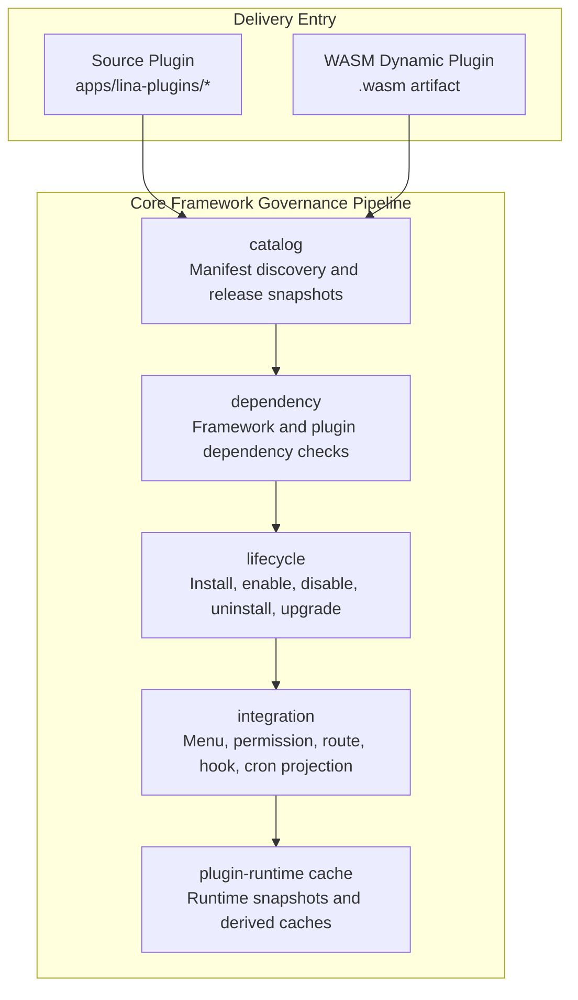

## Introduction

The plugin system is LinaPro's core extension mechanism for business capabilities. Each plugin is a self-contained module that can declare API routes, database resources, frontend pages, menu permissions, language packs, scheduled tasks, and lifecycle callbacks.

LinaPro supports two delivery modes simultaneously:

- **Source plugins**: Compiled with the core framework as Go source code, suitable for long-term maintained business capabilities.
- **Dynamic plugins**: Uploaded and loaded at runtime as `.wasm` artifacts, suitable for binary distribution, hot-reloading, and temporary extensions.

The two modes differ in their runtime form, but share a single plugin governance surface. From the admin side, plugins share the same lifecycle, dependencies, permissions, state, multi-tenant policies, public static assets, and plugin-owned configuration regardless of mode.

The directory structure for source plugins and dynamic plugins is also converging: the root directory contains `plugin.yaml`, backend capabilities live in `backend/`, frontend resources are in `frontend/`, and installation scripts, language packs, configuration, and plugin-owned resources are in `manifest/`. Source plugins embed these resources into the core framework's compiled binary through `plugin_embed.go`; dynamic plugins write the same types of resources into the `.wasm` artifact through the build tool and bind them to the current effective release at runtime.

## Plugins Do Not Need to Include Frontend Pages

LinaPro's plugin system does not require every plugin to provide frontend pages. Whether a plugin solves a problem depends not on whether it has a UI, but on whether it implements the extension capability the core framework needs.

Many plugins derive their entire value from extending backend behavior without any user interface. Typical examples include:

- **Storage backend plugins**: Integrate with Qiniu Cloud, AWS S3, or other object storage services to take over the core framework's file upload and retrieval logic. Once the plugin is enabled, the core framework's file storage behavior switches automatically without modifying any caller code; the frontend is completely unaware.
- **Authentication method plugins**: Integrate with LDAP directory services or OIDC identity providers to extend user login capabilities. The core framework calls the specific implementation provided by the plugin through its authentication interface, and the business layer remains fully transparent to the underlying protocol.

For these backend-only plugins, the `menus` field in `plugin.yaml` is typically empty. The plugin only needs to register HTTP routes through `pluginhost` or implement core framework extension point interfaces, and the core framework consumes the plugin's capabilities through interface calls. Frontend and backend modularity are two natural choices within the same plugin model, not a mandatory requirement for all plugins.

## Why Two Modes Are Needed

A single plugin form can hardly satisfy development efficiency, runtime performance, hot-reloading, and commercial distribution all at once.

| Requirement | Better Suited Mode | Reason |
|------|--------------|------|
| **Long-term business modules** | Source plugin | Native Go performance, complete toolchain, easy to test and maintain |
| **Urgent fixes or temporary capabilities** | Dynamic plugin | Can be uploaded and enabled at runtime, reducing deployment impact |
| **Commercial plugin distribution** | Dynamic plugin | Can distribute only binary artifacts without exposing source code |
| **Deep collaboration with framework capabilities** | Source plugin | Can use framework capabilities through stable pluginhost contracts |

In most business development, source plugins are the default choice. Choose dynamic plugins when hot-reloading, source code protection, or end-user self-upload becomes a hard requirement.

## Governance Pipeline

The plugin system is not simply a matter of scanning directories and registering routes; it is a complete governance pipeline from discovery to runtime:



| Source Component | Responsibility |
|------|------|
| `catalog` | Reads `plugin.yaml` or WASM custom sections and generates auditable release snapshots |
| `dependency` | Checks framework version ranges, plugin dependencies, and circular dependencies |
| `lifecycle` | Orchestrates installation, enablement, disablement, uninstallation, and runtime upgrades |
| `integration` | Projects menus, permissions, routes, hooks, and scheduled tasks into the core framework runtime |
| `plugin-runtime cache` | Provides low-latency snapshots of plugin state, routes, and resources for request paths |

## Key Public Contracts

### plugin.yaml

Every plugin must provide a `plugin.yaml`. It is the unified entry point for plugin identity, dependencies, menus, multi-tenant policies, public static assets, and dynamic plugin framework capability authorization.

```yaml
id: linapro-content-notice
name: Content Notice
version: v0.1.0
type: source
scope_nature: tenant_aware
supports_multi_tenant: true
default_install_mode: tenant_scoped
description: Provides publish and subscribe capabilities for content change notifications
author: linapro
homepage: https://example.com/plugins/linapro-content-notice
license: Apache-2.0
i18n:
  enabled: true
  default: zh-CN
  locales:
    - locale: en-US
      nativeName: English
    - locale: zh-CN
      nativeName: 简体中文
dependencies:
  framework:
    version: ">=0.1.0 <1.0.0"
public_assets:
  - source: frontend/pages
    mount: /
    index: index.html
menus:
  - key: plugin:linapro-content-notice:list
    name: Content Notice
    path: linapro-content-notice-list
    component: system/plugin/dynamic-page
    perms: content-notice:notice:view
    type: M
```

### Plugin ID Naming Convention

The plugin ID is the unique identifier that threads through the entire plugin lifecycle. It is used for directory naming, API route namespaces, database table prefixes, menu keys, and static asset paths. LinaPro recommends a three-segment `kebab-case` structure: `<author>-<domain>-<capability>`:

| Segment | Meaning | Example |
|------|------|------|
| `<author>` | Plugin author or organization identifier | `linapro` |
| `<domain>` | Business domain | `content`, `monitor`, `org`, `tenant` |
| `<capability>` | Specific capability, may contain multiple kebab segments | `notice`, `loginlog`, `demo-guard` |

`<author>-<domain>-<capability>` is the official naming convention and repository governance standard, not a runtime enforcement rule. Runtime validation only ensures the ID is non-empty, at most 64 characters, and valid kebab-case. The core framework's `ParsePluginID` function will attempt to split the ID into Author, Domain, and Capability segments, but IDs with fewer than three segments are also accepted.

The `<domain>` segment identifies the plugin's business domain. It is recommended to choose from the common domains below, or define your own based on actual business needs:

| Domain | Use Case | Plugin Name Example |
|------|----------|--------------|
| `content` | Content management, articles, announcements, notifications | `linapro-content-notice` |
| `monitor` | Monitoring, logging, auditing | `linapro-monitor-loginlog` |
| `org` | Organizational structure, departments, positions | `linapro-org-core` |
| `tenant` | Multi-tenancy, tenant management | `linapro-tenant-core` |
| `ops` | Operations, security, access control | `linapro-ops-demo-guard` |
| `auth` | Authentication, authorization, SSO | -- |
| `oidc` | OIDC identity provider integration | -- |
| `ai` | AI, large language models, vector search | `linapro-ai-core` |
| `storage` | File storage, object storage | -- |
| `workflow` | Workflows, approval flows | -- |
| `message` | Message center, in-app messaging, push notifications | -- |
| `payment` | Payments, orders, billing | -- |
| `gateway` | Gateway, rate limiting, routing | -- |
| `data` | Data integration, import/export, ETL | -- |


### pluginhost

`pluginhost` is the host interface layer that **source plugins** use to interact with the core framework, located in the `pkg/plugin/pluginhost` directory. Rather than detailing every domain capability method on this overview page, it consolidates source plugin declarations, resources, routes, lifecycle, and runtime service entry points into stable public contracts.

Source plugins cannot directly `import` the core framework's `internal/` directory; they may only use the stable contracts published by the framework. For details on which domain capabilities, trusted admin commands, and tenant filtering abilities are available through `pluginhost.Services`, see [Domain Capabilities Design and Overview](/docs/domain-capabilities).

### pluginbridge

`pluginbridge` is the bridge interface layer that **dynamic plugins** use to interact with the core framework, located in the `pkg/plugin/pluginbridge` directory. It is responsible for isolating WASM plugin declarations, route handling, protocol encoding/decoding, and host capability calls within the sandbox boundary.

When dynamic plugins access framework capabilities, they must declare their authorization scope through `hostServices`, and the host validates each call against service, method, and resource boundaries. For the full dynamic plugin domain capability catalog, the `hostServices` authorization model, and differences from source plugin capabilities, see [Domain Capabilities Design and Overview](/docs/domain-capabilities).

## Lifecycle States

The plugin lifecycle covers discovery, installation, enablement, disablement, uninstallation, and upgrades, and includes governance hooks such as tenant-level disablement, tenant deletion, and installation mode adjustments:


Plugin file updates do not automatically switch the effective version. When the core framework discovers a higher version at startup or during a scan, it marks the plugin as `pending_upgrade`. The administrator previews and explicitly performs the runtime upgrade from the plugin management page. The upgrade process executes dependency pre-checks, lifecycle callbacks, upgrade SQL, governance resource synchronization, effective release switching, cache invalidation, and cluster notifications.

If a dynamic plugin upgrade involves changes to resource-type `hostServices`, the authorization snapshot must be re-confirmed. Source plugin upgrades compare the currently compiled discovered version against the effective version in the database, preventing file overwrites from being mistakenly treated as completed runtime upgrades.

## Isolation Mechanisms

### Database Namespace

Plugin-owned tables must use a prefix derived from the plugin ID in `snake_case`:

```text
Core framework tables: sys_user, sys_role, sys_menu
Plugin tables: linapro_content_notice_record, linapro_org_core_dept, linapro_demo_dynamic_record
```

System tables use the `sys_` prefix; plugin tables use the `<plugin_id>_` prefix. Core framework and plugin data are fully isolated, avoiding naming conflicts and permission misuse.

If a plugin needs multi-tenant support, it must design tables with a `tenant_id` column and use the tenant filtering capability published by the core framework to append filter conditions.

### File Namespace

Plugin file storage should use the plugin ID as the path namespace:

```text
temp/upload/linapro-content-notice/
temp/upload/linapro-demo-dynamic/
```

### Sandbox Isolation

WASM dynamic plugins cannot directly access the core framework's filesystem, network, or database. All access goes through `hostServices` bridging and is constrained by the authorization snapshot.

## Multi-Tenant Fields

Plugins declare their multi-tenancy boundary through three fields:

| Field | Allowed Values | Description |
|------|--------|------|
| `scope_nature` | `platform_only` / `tenant_aware` | Whether the plugin is a platform-level governance capability or can enter tenant contexts |
| `supports_multi_tenant` | `true` / `false` | Whether tenant-level installation, provisioning, and data isolation are supported |
| `default_install_mode` | `global` / `tenant_scoped` | Whether to enable globally by default or manage enablement per tenant |

For example, a multi-tenant management plugin itself is a platform-level governance plugin and uses `platform_only` with `global`. Content, organization, and audit plugins are typically `tenant_aware`.

## Core Framework and Plugin Boundaries

| Rule | Reason |
|------|------|
| Plugins must not directly depend on the core framework's `internal/` packages | Core framework internals can evolve; stable contracts are provided via `pkg/` |
| Plugin menus use the `plugin:<plugin-id>:<key>` format | Avoids conflicts with the core framework or other plugins |
| Installation SQL must be idempotent | Supports repeated execution, reinstall after data preservation, and upgrade recovery |
| Plugin service logic lives in `backend/internal/service/` | Keeps plugin backend structure consistent and avoids package naming confusion |
| Plugin APIs use `/x/{plugin-id}/...` | Source and dynamic plugins share a unified plugin API namespace, avoiding occupation of the core framework's `/api/v1` control plane |
| Public static assets must be declared in `public_assets` | The core framework only hosts explicitly authorized public resource directories |
| Plugin configuration is read through the plugin-scoped config service | Avoids plugins directly depending on the host's global configuration structure |
| Plugin uninstallation distinguishes preserved data from cleaned data | Reduces accidental deletion risk and allows data reuse on reinstallation |
