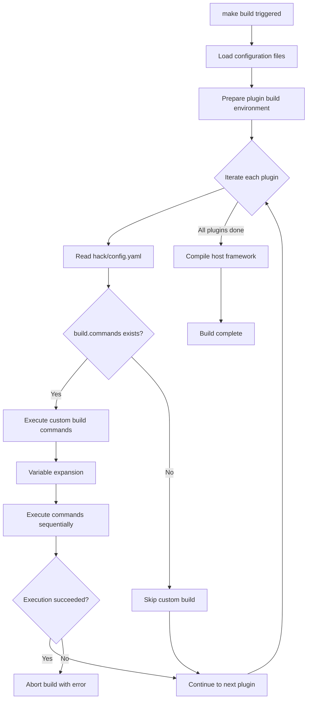

## Introduction

The `hack/config.yaml` file in each plugin directory is a plugin-level tool configuration file used to declare custom steps that the plugin needs to execute during the build process. This configuration file primarily serves two scenarios:

1. **Custom build commands**: Declare pre-compilation build steps via the `build.commands` field
2. **Code generation configuration**: Configure database code generation parameters via the `gfcli.gen` field

This page focuses on custom build command configuration. For code generation configuration, refer to the GoFrame official documentation.

## Configuration Hierarchy

LinaPro's configuration files exist at two levels, each with distinct responsibilities:

| Level | File Path | Primary Purpose |
|:------:|----------|----------|
| **Repository-level** | `hack/config.yaml` | Controls repository-wide compilation, image builds, and plugin source management |
| **Plugin-level** | `apps/lina-plugins/<plugin-id>/hack/config.yaml` | Controls code generation and custom build steps for a single plugin |

:::info
The repository-level and plugin-level `hack/config.yaml` files share the same filename but serve entirely different purposes. Plugin-level configuration focuses on a single plugin's build needs and does not affect other plugins or the host framework.
:::

## Directory Structure

A typical plugin's `hack/` directory looks like this:

```text
apps/lina-plugins/<plugin-id>/
├── plugin.yaml
├── backend/
├── manifest/
├── frontend/
├── hack/
│   ├── config.yaml              # Tool configuration file
│   └── tests/                   # Test directory, optional
└── Makefile
```

## Custom Build Configuration

### Basic Syntax

Declare custom build steps in `hack/config.yaml` using the `build.commands` array:

```yaml
build:
  commands:
    - "go generate ./..."
    - "go-bindata -o assets.go -pkg assets ./static/..."
```

Each command executes sequentially in array order. If any command fails, the build process aborts and returns an error.

### Available Variables

Build commands support variable expansion using the `$(VARIABLE_NAME)` syntax. Available variables include:

| Variable | Description | Example Value |
|------|------|--------|
| `$(PLUGIN_ROOT)` | Absolute path of the current plugin directory | `/path/to/apps/lina-plugins/linapro-ai-core` |
| `$(REPO_ROOT)` | Absolute path of the repository root | `/path/to/linapro` |

Example with variables:

```yaml
build:
  commands:
    - "go -C $(REPO_ROOT) generate $(PLUGIN_ROOT)/backend/..."
    - "protoc --go_out=$(PLUGIN_ROOT)/backend/internal $(PLUGIN_ROOT)/api/proto/*.proto"
```

### Execution Environment

Custom build commands execute in the following environment:

- **Working directory**: The current plugin directory (`$(PLUGIN_ROOT)`)
- **Environment variables**: Inherited from the host process
- **Execution timing**: Runs before the host framework compilation

## Complete Configuration Example

Here is a complete example that includes both custom build steps and code generation configuration:

```yaml
# Custom build steps
build:
  commands:
    - "go generate ./..."
    - "go-bindata -o internal/assets/assets.go -pkg assets ./static/..."

# GoFrame DAO code generation configuration
gfcli:
  gen:
    dao:
      - link: "pgsql:postgres:postgres@tcp(127.0.0.1:5432)/linapro?sslmode=disable"
        path: "internal"
        tables: "plugin_linapro_demo_source_record"
        removePrefix: "plugin_linapro_demo_source_"
        importPrefix: "lina-plugin-linapro-demo-source/backend/internal"
        descriptionTag: true
        noModelComment: true
        stdTime: true
        typeMapping:
          timestamp: {type: "*time.Time", import: time}
          timestamptz: {type: "*time.Time", import: time}
          date: {type: "*time.Time", import: time}
          time: {type: "*time.Time", import: time}
```

## Build Process

The plugin's custom build steps in the overall build process:



## Relationship with Makefile

Each plugin directory has a `Makefile` for declaring plugin-level make targets, typically containing code generation commands:

```makefile
PLUGIN_ROOT := $(patsubst %/,%,$(dir $(abspath $(lastword $(MAKEFILE_LIST)))))
REPO_ROOT := $(abspath $(PLUGIN_ROOT)/../../..)
include $(REPO_ROOT)/hack/makefiles/plugin.codegen.mk
```

The shared `plugin.codegen.mk` provides two common targets:

| Target | Description |
|------|------|
| `make ctrl` | Generate controller code |
| `make dao` | Generate database code (reads `gfcli.gen.dao` configuration from `hack/config.yaml`) |

:::info
`Makefile` targets are for manual code generation during development, while `build.commands` in `hack/config.yaml` are for automatic execution during the build process. They complement each other without conflict.
:::

## Best Practices

1. **Keep commands simple**: Each build command should focus on a single task for easier debugging and maintenance
2. **Use variable expansion**: Avoid hardcoding paths; use `$(PLUGIN_ROOT)` and `$(REPO_ROOT)` for portability
3. **Handle dependencies**: If commands have dependencies, ensure they are ordered correctly
4. **Add error handling**: Build commands should return proper exit codes and abort the build on failure
5. **Document special commands**: For complex build steps, explain their purpose in the plugin's README

## Common Mistakes

| Mistake | Correct Approach |
|------|----------|
| Running time-consuming operations in `build.commands` | Place time-consuming operations in development-time `Makefile` targets; only run essential steps during build |
| Hardcoding absolute paths | Use `$(PLUGIN_ROOT)` and `$(REPO_ROOT)` variables |
| Ignoring command execution order | Build commands execute sequentially in array order; ensure dependency relationships are correct |
| Modifying host files in `build.commands` | Custom build steps should be confined to the plugin directory |
| Confusing repository-level and plugin-level configuration | Repository-level controls the overall build; plugin-level controls a single plugin |
