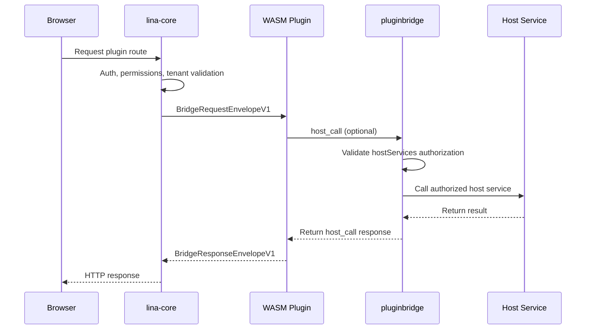

## Introduction

Dynamic plugins are `LinaPro`'s runtime-extensible plugin form. They compile plugins into `.wasm` artifacts that can be uploaded, installed, enabled, disabled, uninstalled, and explicitly upgraded at runtime — without recompiling the host.

Dynamic plugins run inside a `WASM` sandbox. They cannot directly access the host's filesystem, network, or database; all host capability access must go through `pluginbridge` and `hostServices` authorization.

### When to Use

| Scenario | Description |
|----------|-------------|
| **Runtime hot-loading** | Upload a `.wasm` artifact and it enters the plugin governance flow immediately |
| **Temporary capability validation** | Quickly bring up a proof-of-concept feature; convert to a source plugin after validation |
| **Commercial plugin distribution** | Distribute only binary artifacts without exposing source code |
| **Controlled external integration** | Network, storage, and data access are all governed through authorization snapshots |

Long-term core business capabilities should still prefer source plugins. Dynamic plugins are better suited for hot-loading and scenarios with stronger isolation requirements.

### What Is WebAssembly?

`WebAssembly` (abbreviated `WASM`) is a stack-based virtual machine binary instruction format standardized by the `W3C`. Originally designed for the browser, it is now widely used in server-side, edge computing, and plugin system scenarios.

- **Cross-platform**: `WASM` modules are platform-agnostic binaries. The same `.wasm` artifact runs on `Linux`, `macOS`, `Windows`, and across `x86` and `ARM` instruction sets without recompilation.

- **Secure sandbox**: `WASM` runs in a strictly isolated sandbox. By default, it cannot access the host's filesystem, network, memory, or system calls. Every host capability must be explicitly authorized through an interface, fundamentally limiting the blast radius of malicious code or vulnerabilities.

- **Near-native performance**: `WASM` uses a compact binary format that can be JIT-compiled to native machine code at runtime, achieving near-native execution efficiency while maintaining sandbox isolation.

- **Hot-loading support**: `WASM` modules can be dynamically loaded and unloaded at runtime without restarting the host process. This provides a natural hot-update capability for plugin systems — new versions can go live or roll back without affecting overall system operation.

- **Multi-language ecosystem**: Mainstream languages including `Go`, `Rust`, `C/C++`, and `AssemblyScript` can all compile to `WASM`. Plugin developers are not locked into a single tech stack. `LinaPro` currently uses `Go` as the primary plugin development language, extending the sandbox and host service communication contract based on `WASI` (WebAssembly System Interface).

## Runtime Model



The host completes authentication, authorization, and tenant context handling before passing a request snapshot into the `WASM` instance. Dynamic plugins see a structured request envelope — not a raw host internal object.

## Directory Structure

Dynamic plugin source directories follow the same layout as source plugins, with an additional `main.go` as the `WASM` entry point:

```text
apps/lina-plugins/<plugin-id>/
├── main.go                          # WASM export function entry
├── plugin.yaml
├── plugin_embed.go
├── backend/
│   ├── api/                         # API DTOs and route contracts
│   ├── internal/
│   │   ├── controller/              # HTTP controllers
│   │   ├── service/                 # Business service layer
│   │   ├── dao/                     # gf gen dao generated
│   │   └── model/                   # do/entity models
│   └── plugin.go                    # Plugin registration entry
├── frontend/
│   └── pages/                       # Plugin pages
├── manifest/
│   ├── sql/                         # Installation and upgrade SQL
│   │   ├── mock-data/               # Demo data, optional
│   │   └── uninstall/               # Uninstall SQL
│   └── i18n/                        # Plugin language packs
└── README.md
```

## WASM Entry Point

Dynamic plugins must export host-conventioned functions. Here is an official example:

```go
var guestRuntime = pluginbridge.NewGuestRuntime(dynamicbackend.HandleRequest)

//go:wasmexport lina_dynamic_route_alloc
func linaDynamicRouteAlloc(size uint32) uint32 {
    return guestRuntime.Alloc(size)
}

//go:wasmexport lina_dynamic_route_execute
func linaDynamicRouteExecute(size uint32) uint64 {
    responsePointer, responseLength, err := guestRuntime.Execute(size)
    if err != nil {
        fallback, _ := pluginbridge.EncodeResponseEnvelope(
            pluginbridge.NewInternalErrorResponse(err.Error()),
        )
        responsePointer, responseLength, _ = guestRuntime.ExposeResponseBuffer(fallback)
    }
    return uint64(responsePointer)<<32 | uint64(responseLength)
}

//go:wasmexport lina_host_call_alloc
func linaHostCallAlloc(size uint32) uint32 {
    return guestRuntime.HostCallAlloc(size)
}

func main() {}
```

Business routing is typically delegated to `pluginbridge.MustNewGuestControllerRouteDispatcher`, which dispatches requests to controller methods.

## hostServices Authorization

Dynamic plugins must declare the host services, methods, and resource scopes they need in `plugin.yaml`. When a plugin is installed or enabled, the host writes the authorization into a release snapshot. At runtime, any unauthorized call is rejected.

| Service | Typical Capabilities |
|---------|---------------------|
| `runtime` | Log writing, plugin status, time, `UUID`, node info |
| `data` | Database read/write constrained by table scope and tenant filtering |
| `storage` | File read/write within the plugin's namespace |
| `network` | External `HTTP` requests constrained by target address |
| `cache` | Cluster-aware cache read/write |
| `lock` | Distributed lock acquisition, renewal, and release |
| `cron` | Built-in task registration for dynamic plugins |
| `config` | Plugin configuration reading |
| `notify` | Host notification capability |

Example:

```yaml
hostServices:
  - service: runtime
    methods: [log.write, info.now, info.node]
  - service: data
    methods: [list, get, create, update, delete]
    resources:
      tables:
        - plugin_demo_dynamic_record
  - service: network
    methods: [request]
    resources:
      - url: https://api.example.com
```

## Building Dynamic Plugins

Dynamic plugins use the standard `Go` toolchain compiled to the `wasip1/wasm` target. The project provides `make` commands to simplify the build process:

```bash
make wasm
make wasm p=plugin-demo-dynamic
```

Build artifacts are output to `temp/output/<plugin-id>.wasm` and include the plugin manifest, route contracts, and necessary embedded resources.

## Installation, Enablement, and Upgrade

The runtime flow for dynamic plugins:

1. Build the `.wasm` artifact.
2. Upload the dynamic plugin package in the management workspace's Extension Center.
3. The host validates the `WASM` file header, custom sections, embedded manifest, `ABI` version, and resources.
4. The administrator confirms `hostServices` authorization.
5. The installation `SQL` is executed and governance records are written.
6. Once enabled, the host loads the `WASM` sandbox and projects routes, menus, and resources.

When a higher version is uploaded, the host does not immediately switch the active version. Instead, it marks the plugin as `pending_upgrade`. The administrator previews the diff in the plugin management page and explicitly executes the runtime upgrade. If the upgrade fails, the previous active version is retained and failure diagnostics are recorded for retry after fixing.

## Key Differences from Source Plugins

| Dimension | Source Plugin | `WASM` Dynamic Plugin |
|-----------|--------------|----------------------|
| Delivery | Source code compiled with the host | `.wasm` runtime artifact |
| Hot-loading | Requires new host deployment | Supports runtime upload and enablement |
| Performance | Native `Go` performance | Sandbox and bridge overhead |
| Host capability access | `pluginhost` stable contract | `hostServices` authorized bridge |
| Isolation strength | Namespace isolation | `WASM` sandbox isolation |
| Debugging | Standard `Go` debug toolchain | More reliant on logs and bridge diagnostics |
| Best for | Long-term business modules | Commercial distribution, hot-loading, temporary extensions |

## Best Practices

- Only request the `hostServices` methods and resource scopes you actually need.
- Use the plugin `ID` namespace for database tables to avoid conflicts with the host or other plugins.
- Be explicit about target addresses for outbound network access; avoid broad authorization.
- Prepare rollback-friendly, idempotent upgrade `SQL` for runtime upgrades.
- Promote long-running, high-frequency business logic to source plugins; use dynamic plugins for hot-loading and isolation scenarios.
