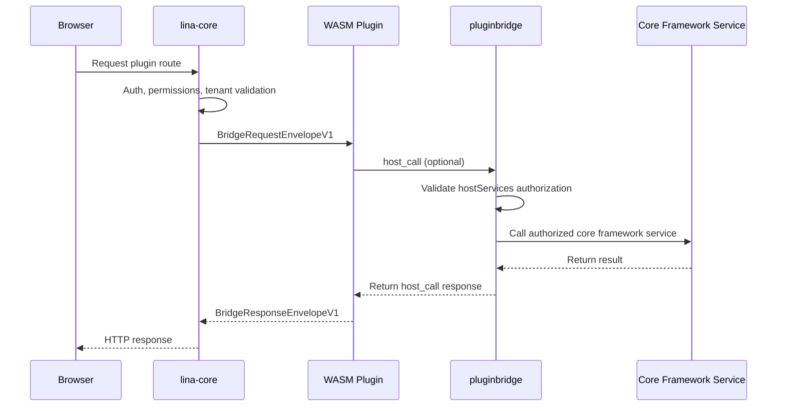

## Introduction

Dynamic plugins are `LinaPro`'s runtime-extensible plugin form. They compile plugins into `.wasm` artifacts that can be uploaded, installed, enabled, disabled, uninstalled, and explicitly upgraded at runtime — without recompiling the core framework.

Dynamic plugins run inside a `WASM` sandbox. They cannot directly access the core framework's filesystem, network, or database; all core framework capability access must go through `pluginbridge` and `hostServices` authorization.

### When to Use

| Scenario | Description |
|----------|-------------|
| **Runtime hot-loading** | Upload a `.wasm` artifact and it enters the plugin governance flow immediately |
| **Temporary capability validation** | Quickly bring up a proof-of-concept feature; convert to a source plugin after validation |
| **Commercial plugin distribution** | Distribute only binary artifacts without exposing source code |
| **Controlled external integration** | Network, storage, and data access are all governed through authorization snapshots |

Long-term core business capabilities should still prefer source plugins. Dynamic plugins are better suited for hot-loading and scenarios with stronger isolation requirements.

### What Is WebAssembly?

`WebAssembly` (abbreviated `WASM`) is a stack-based virtual machine binary instruction format standardized by the `W3C`. Originally designed for the browser, it is now widely used in server-side, edge computing, and plugin system scenarios.

- **Cross-platform**: `WASM` modules are platform-agnostic binaries. The same `.wasm` artifact runs on `Linux`, `macOS`, `Windows`, and across `x86` and `ARM` instruction sets without recompilation.

- **Secure sandbox**: `WASM` runs in a strictly isolated sandbox. By default, it cannot access the core framework's filesystem, network, memory, or system calls. Every core framework capability must be explicitly authorized through an interface, fundamentally limiting the blast radius of malicious code or vulnerabilities.

- **Near-native performance**: `WASM` uses a compact binary format that can be JIT-compiled to native machine code at runtime, achieving near-native execution efficiency while maintaining sandbox isolation.

- **Hot-loading support**: `WASM` modules can be dynamically loaded and unloaded at runtime without restarting the core framework process. This provides a natural hot-update capability for plugin systems — new versions can go live or roll back without affecting overall system operation.

- **Multi-language ecosystem**: Mainstream languages including `Go`, `Rust`, `C/C++`, and `AssemblyScript` can all compile to `WASM`. Plugin developers are not locked into a single tech stack. `LinaPro` currently uses `Go` as the primary plugin development language, extending the sandbox and core framework service communication contract based on `WASI` (WebAssembly System Interface).

## Runtime Model



The core framework completes authentication, authorization, and tenant context handling before passing a request snapshot into the `WASM` instance. Dynamic plugins see a structured request envelope — not a raw core framework internal object.

## Directory Structure

Dynamic plugin source directories follow the same layout as source plugins, with an additional `main.go` as the `WASM` entry point:

```text
apps/lina-plugins/<plugin-id>/
├── main.go                          # WASM export function entry
├── plugin.yaml
├── plugin_embed.go
├── backend/
│   ├── api/                         # API DTOs and route contracts
│   ├── internal/
│   │   ├── controller/              # HTTP controllers
│   │   ├── service/                 # Business service layer
│   │   ├── dao/                     # gf gen dao generated
│   │   └── model/                   # do/entity models
│   └── plugin.go                    # Plugin registration entry
├── frontend/
│   └── pages/                       # Dynamic plugin frontend assets
├── manifest/
│   ├── config/
│   │   ├── config.yaml              # Default configuration carried in the dynamic artifact
│   │   └── config.example.yaml      # Configuration template, not a runtime default
│   ├── sql/                         # Installation and upgrade SQL
│   │   ├── mock-data/               # Demo data, optional
│   │   └── uninstall/               # Uninstall SQL
│   └── i18n/                        # Plugin language packs
└── README.md
```

The build tool reads embedded plugin resources first and falls back to directory scanning when needed. It writes `plugin.yaml`, `frontend/` assets, `manifest/sql`, `manifest/i18n`, `manifest/config/config.yaml`, `manifest/config/config.example.yaml`, and declaration resources under `manifest/` into the dynamic artifact. Runtime resources are bound to the checksum and generation of the current active release; installation, enablement, disablement, uninstallation, upgrade, or same-version refresh invalidates the corresponding caches.

## WASM Entry Point

Dynamic plugins must export core framework-conventioned functions. Here is an official example:

```go
var guestRuntime = pluginbridge.NewGuestRuntime(dynamicbackend.HandleRequest)

//go:wasmexport lina_dynamic_route_alloc
func linaDynamicRouteAlloc(size uint32) uint32 {
    return guestRuntime.Alloc(size)
}

//go:wasmexport lina_dynamic_route_execute
func linaDynamicRouteExecute(size uint32) uint64 {
    responsePointer, responseLength, err := guestRuntime.Execute(size)
    if err != nil {
        fallback, _ := pluginbridge.EncodeResponseEnvelope(
            pluginbridge.NewInternalErrorResponse(err.Error()),
        )
        responsePointer, responseLength, _ = guestRuntime.ExposeResponseBuffer(fallback)
    }
    return uint64(responsePointer)<<32 | uint64(responseLength)
}

//go:wasmexport lina_host_call_alloc
func linaHostCallAlloc(size uint32) uint32 {
    return guestRuntime.HostCallAlloc(size)
}

func main() {}
```

Business routing is typically delegated to `pluginbridge.MustNewGuestControllerRouteDispatcher`, which dispatches requests to controller methods. `linactl` injects the contract metadata required by zero-reflection dispatch when building for `wasip1`.

## hostServices Authorization

Dynamic plugins must declare the core framework services, methods, and resource scopes they need in `plugin.yaml`. When a plugin is installed or enabled, the core framework writes the authorization into a release snapshot. At runtime, any unauthorized call is rejected.

| Service | Typical Capabilities |
|---------|---------------------|
| `runtime` | Log writing, plugin status, time, `UUID`, node info |
| `data` | Database read/write constrained by table scope and tenant filtering |
| `storage` | File read/write within the plugin's namespace |
| `network` | External `HTTP` requests constrained by target address |
| `cache` | Cluster-aware cache read/write |
| `lock` | Distributed lock acquisition, renewal, and release |
| `cron` | Built-in task registration for dynamic plugins |
| `config` | Read-only access to the current plugin's own configuration |
| `hostConfig` | Read-only access to allowlisted public host configuration |
| `manifest` | Read-only access to the current plugin's `manifest/` declaration resources |
| `notify` | Core framework notification capability |

Example:

```yaml
hostServices:
  - service: runtime
    methods: [log.write, info.now, info.node]
  - service: cron
    methods: [register]
  - service: data
    methods: [list, get, create, update, delete]
    resources:
      tables:
        - plugin_demo_dynamic_record
  - service: network
    methods: [request]
    resources:
      - url: https://api.example.com
  - service: config
    methods: [get]
  - service: hostConfig
    methods: [get]
    resources:
      keys:
        - workspace.basePath
        - i18n.default
  - service: manifest
    methods: [get]
    resources:
      paths:
        - metadata.yaml
```

`config`, `hostConfig`, and `manifest` allow only the `get` method. Convenience functions on the guest-side `SDK`, such as `String`, `Bool`, `Int`, `Duration`, and `Scan`, are converted into `get` calls. They do not need to and must not be declared as authorization methods. `hostConfig` must declare `resources.keys`, and `manifest` must declare `resources.paths`.

## Building Dynamic Plugins

Dynamic plugins use the standard `Go` toolchain compiled to the `wasip1/wasm` target. The project provides `make` commands to simplify the build process:

```bash
make wasm
make wasm p=plugin-demo-dynamic
```

Build artifacts are output to `temp/output/<plugin-id>.wasm` and include the plugin manifest, route contracts, public frontend assets, install and uninstall scripts, language packs, plugin default configuration, and declaration resources. Default configuration inside the artifact is used only as a fallback when no production external configuration or development-time configuration exists.

## Frontend Assets

Dynamic plugins declare public resources through `public_assets` in `plugin.yaml`. The core framework hosts them under `/x-assets/{plugin-id}/{version}/...`:

```yaml
public_assets:
  - source: frontend/pages
    mount: /
    index: index.html

menus:
  - key: plugin:linapro-demo-dynamic:main-entry
    path: /x-assets/linapro-demo-dynamic/v0.1.0/mount.js
    component: system/plugin/dynamic-page
    query:
      pluginAccessMode: embedded-mount
```

Frontend files inside a dynamic plugin artifact are not automatically exposed. Only resources matched by `public_assets` are served through `/x-assets`. If the plugin is disabled, not installed, unavailable to the tenant, or requested with a mismatched version, public assets return `404` by default.

## Installation, Enablement, and Upgrade

The runtime flow for dynamic plugins:

1. Build the `.wasm` artifact.
2. Upload the dynamic plugin package in the admin workspace's Extension Center.
3. The core framework validates the `WASM` file header, custom sections, embedded manifest, `ABI` version, and resources.
4. The administrator confirms `hostServices` authorization. If the plugin declares resource-scoped services such as `storage`, `network`, `data`, `hostConfig`, or `manifest`, the resource scope must also be confirmed.
5. The installation `SQL` is executed and governance records are written.
6. Once enabled, the core framework loads the `WASM` sandbox and projects routes, menus, public assets, and resource snapshots.

When a higher version is uploaded, the core framework does not immediately switch the active version. Instead, it marks the plugin as `pending_upgrade`. The administrator previews the diff in the plugin management page and explicitly executes the runtime upgrade. If the upgrade fails, the previous active version is retained and failure diagnostics are recorded for retry after fixing.

Dynamic plugin `API`s are ultimately exposed under the unified plugin namespace. The core framework only prepends `/x/{plugin-id}`; the remaining path comes from the plugin's own route contract. External paths therefore look like:

```text
/x/linapro-demo-dynamic/demo-records
/x/linapro-demo-dynamic/backend-summary
```

## Key Differences from Source Plugins

| Dimension | Source Plugin | `WASM` Dynamic Plugin |
|-----------|--------------|----------------------|
| Delivery | Source code compiled with the core framework | `.wasm` runtime artifact |
| Hot-loading | Requires new core framework deployment | Supports runtime upload and enablement |
| Performance | Native `Go` performance | Sandbox and bridge overhead |
| Core framework capability access | `pluginhost` stable contract | `hostServices` authorized bridge |
| Isolation strength | Namespace isolation | `WASM` sandbox isolation |
| Debugging | Standard `Go` debug toolchain | More reliant on logs and bridge diagnostics |
| Best for | Long-term business modules | Commercial distribution, hot-loading, temporary extensions |

## Best Practices

- Only request the `hostServices` methods and resource scopes you actually need.
- Use the plugin `ID` namespace for database tables to avoid conflicts with the core framework or other plugins.
- Be explicit about target addresses for outbound network access; avoid broad authorization.
- Prepare rollback-friendly, idempotent upgrade `SQL` for runtime upgrades.
- Promote long-running, high-frequency business logic to source plugins; use dynamic plugins for hot-loading and isolation scenarios.
