## Overview

`LinaPro` provides a complete set of plugin lifecycle management tools covering the full chain from code download to feature go-live. Plugin sources are configured centrally in `hack/config.yaml`, `make` commands synchronize plugin code to the local workspace, and the management workspace UI handles runtime enablement, disablement, and uninstallation.

## Configuring Plugin Sources

Plugin sources are configured in the `plugins.sources` section of `hack/config.yaml` at the repository root:

```yaml
plugins:
  sources:
    official:                                              # Source name (custom), used for --source filtering
      repo: "https://github.com/linaproai/official-plugins.git"  # Plugin Git repository URL
      root: "."                                           # Sub-path within the repo where plugins live
      ref: "main"                                         # Branch, tag, or commit to pull
      items:                                              # List of plugins to install
        - "*"                                             # "*" installs all plugin directories under root
```

The `items` list accepts two formats:

| Format | Description |
|--------|-------------|
| `"*"` | Install all plugin directories under `root` |
| `"org-center"` | Install only the plugin with the specified `ID` |

You can configure multiple sources, each with an independent name, for selective operations via `source=<name>`:

```yaml
plugins:
  sources:
    official:
      repo: "https://github.com/linaproai/official-plugins.git"
      root: "."
      ref: "main"
      items:
        - "multi-tenant"
        - "org-center"
    internal:
      repo: "https://git.example.com/my-company/lina-plugins.git"
      root: "plugins"
      ref: "release/1.0"
      items:
        - "*"
```

## Initializing the Plugin Workspace

`apps/lina-plugins/` is the fixed local plugin workspace. If this directory currently exists as a `Git` submodule, you must first convert it to a regular directory before performing plugin management operations:

```bash
make plugins.init
```

This command disassociates the submodule while preserving existing plugin code — no local content is lost. If the directory does not exist, it is created automatically.

## Installing Plugins

Pull plugin code into `apps/lina-plugins/` according to the configuration in `hack/config.yaml`:

```bash
make plugins.install
```

After installation, corresponding plugin directories appear under `apps/lina-plugins/`, each containing a `plugin.yaml` manifest and complete frontend/backend code. The tool also writes `.linapro-plugins.lock.yaml` to record installation state for change detection during upgrades.

## Upgrading Plugins

Update installed plugins to the latest version pointed to by the source repository's current `ref`:

```bash
make plugins.update
```

Before upgrading, the tool checks for uncommitted local changes. If the plugin directory has local modifications, the upgrade is blocked by default to prevent accidental overwrites:

```bash
# Force-overwrite local changes and upgrade directly
make plugins.update force=1
```

## Checking Plugin Status

View the installation status, version information, and local modification state of configured plugins in the current workspace:

```bash
make plugins.status
```

Example output:

```text
Plugin workspace: apps/lina-plugins (ordinary)
Querying configured plugin sources...
Rendering status for 3 configured plugin(s)...

Plugin          Source    Version  Installed  Dirty  Remote
multi-tenant    official  v0.1.0   true       false  up-to-date
org-center      official  v0.1.0   true       true   up-to-date
content-notice  official  v0.1.0   false      -      up-to-date
```

Column descriptions:

| Column | Description |
|--------|-------------|
| `Plugin` | Plugin `ID` |
| `Source` | Source name (corresponds to the key in `hack/config.yaml`) |
| `Version` | Locally installed version (from `plugin.yaml`) |
| `Installed` | Whether the plugin directory exists |
| `Dirty` | Whether there are uncommitted local changes |
| `Remote` | Sync status with the source repository's current `ref` |

## Enabling Plugins in the Management Workspace

After plugin code is synchronized to `apps/lina-plugins/` and the host is restarted, the host automatically scans and discovers new plugins. Navigate to the **Extension Management** page in the management workspace:

1. Find the target plugin in the plugin list — its status will be **Discovered**
2. Click **Install** — the host runs dependency checks and executes installation `SQL`
3. After successful installation, click **Enable** — the host registers menus, routes, and hooks, and the functionality takes effect immediately

No host restart is required — menus and routes become visible in real time after enablement.

## Disable and Uninstall

Find the enabled plugin on the **Extension Management** page in the management workspace:

- **Disable**: Hides the plugin's menus and routes. Plugin data is fully preserved and can be re-enabled at any time.
- **Uninstall**: The system prompts whether to also clean up plugin-owned data. Choosing cleanup runs uninstallation `SQL` and the data cannot be recovered; choosing preserve only removes governance records while data tables remain intact, allowing data reuse on reinstallation.

## Using a Custom Configuration File

By default, `make` commands read `hack/config.yaml`. To use a configuration file at a different path, specify it with the `config` parameter:

```bash
make plugins.install config=hack/config.staging.yaml
```

## Plugin Sources and Workspace Relationship

```mermaid
flowchart LR
    Config["hack/config.yaml<br/>Declares plugin sources"]
    Workspace["apps/lina-plugins/<br/>Local source workspace"]
    Host["Host startup<br/>Auto-scans plugin.yaml"]
    Govern["Plugin governance plane<br/>Discovered"]
    Lifecycle["Install → Enable<br/>Disable → Uninstall"]

    Config -->|"make plugins.install<br/>make plugins.update"| Workspace
    Workspace -->|"Compiled with the host"| Host
    Host -->|"Enters"| Govern
    Govern -->|"Management workspace ops"| Lifecycle
```



For the plugin system architecture design and dual-mode differences, see [Dual-Mode Plugin System](/docs/plugin-system). For declaring multi-tenant fields in the plugin manifest, see [Multi-Tenancy](/docs/multi-tenant).
