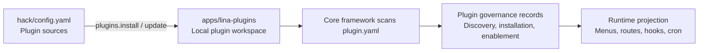

## Component Positioning

Plugin management connects two chains:

- **Development chain**: Reads plugin sources from `hack/config.yaml` and synchronizes source plugins to the `apps/lina-plugins/` workspace.
- **Runtime chain**: After the core framework scans plugin manifests, the admin workspace handles discovery, installation, enablement, disablement, uninstallation, and upgrade.

These two chains have clear responsibilities. Code synchronization only means plugin files appear in the local workspace; whether a plugin is installed, enabled, or upgraded successfully is still determined by the core framework's runtime governance records.



The plugin management page reads a complete plugin list projection built by the core framework. The list includes discovered version, effective version, dependency checks, `hostServices` authorization, declared routes, demo-data availability, runtime upgrade state, and tenant provisioning policy. Frontend filtering is derived from the complete projection and does not cause the interface to drop detail fields.

## Plugin Source Configuration

Plugin sources are configured in the `plugins.sources` section of `hack/config.yaml` at the repository root:

```yaml
plugins:
  sources:
    official:
      repo: "https://github.com/linaproai/official-plugins.git"
      root: "."
      ref: "main"
      items:
        - "*"
```

| Field | Description |
|-------|-------------|
| `repo` | Plugin source repository URL |
| `root` | Root path within the source repository where plugins live |
| `ref` | Branch, tag, or `commit` |
| `items` | List of plugins to install; `"*"` means all plugins |

You can configure multiple sources, e.g. an official plugin source and an internal enterprise source. Commands support filtering via `source=<name>`.

:::info Note
The current version only supports open repositories as plugin sources. Private repository and dynamic plugin source installation will be supported in the future.
:::

## Plugin Workspace

`apps/lina-plugins/` is the fixed plugin workspace. Official plugins are typically mounted as a `Git submodule`; if the project wants to manage plugin source code independently, it can first convert to an ordinary directory:

```bash
make plugins.init
```

This command disassociates the submodule while preserving existing plugin code. If the directory does not exist, it creates an empty workspace.

:::info Note
This command is optional — the directory conversion is performed automatically during installation. After execution, `apps/lina-plugins/` becomes an ordinary directory where you can directly add, modify, or delete plugin source code.
:::

## Installing and Updating Source Plugins

Install plugins:

```bash
make plugins.install
```

Update plugins:

```bash
make plugins.update
```

Before updating, the tool checks for uncommitted local changes in the plugin directory. By default, local modifications block the update to prevent overwriting developer changes. If you need to force the update:

```bash
make plugins.update force=1
```

Check status:

```bash
make plugins.status
```

The status output shows plugin `ID`, source, version, local installation state, local modification state, and remote sync status.

## Admin Workspace Lifecycle

After plugin code enters the workspace, the core framework scans `plugin.yaml` at startup and presents the plugin as "Discovered". The administrator then performs runtime lifecycle operations in the Extension Center:

| Operation | Runtime behavior |
|-----------|-----------------|
| **Install** | Check dependencies, run installation `SQL`, write plugin governance records |
| **Enable** | Project menus, permissions, routes, hooks, scheduled tasks, and frontend resources |
| **Disable** | Hide menus and business routes; preserve data and governance records |
| **Uninstall** | Clean up governance records; optionally preserve or clean up plugin-owned data |
| **Upgrade** | Preview, confirm, migrate, switch version, and invalidate cache for the target plugin |

The distinction between disable and uninstall is important: disable only removes the runtime entry point while data remains; uninstall enters a cleanup flow, and if data cleanup is chosen, plugin-owned data may be unrecoverable.

`GET /api/v1/plugins` is a read-only interface. Opening the plugin list does not implicitly execute synchronization writes. Plugin synchronization, dynamic plugin upload, installation, uninstallation, enablement, disablement, source plugin upgrade, dynamic plugin upgrade, and tenant plugin provisioning-policy changes actively invalidate the list cache. In cluster mode, plugin runtime revisions notify other nodes to refresh. After startup, the core framework prewarms the list cache asynchronously; prewarm failures are logged only, and requests can still rebuild the projection on demand.

## Dynamic Plugin Upload

`WASM` dynamic plugins do not depend on the source workspace for delivery. The build artifact is a `.wasm` file; after the administrator uploads it in the Extension Center, the core framework validates the artifact and reads the embedded manifest, routes, resources, and authorization declarations.

During dynamic plugin installation, the administrator must confirm `hostServices` authorization. Only after authorization confirmation does the core framework allow the plugin to access the corresponding core framework services and resource scope through `pluginbridge`.

If a dynamic plugin declares resource-scoped `hostServices`, such as `storage.resources.paths`, `network` targets, `data.resources.tables`, `hostConfig.resources.keys`, or `manifest.resources.paths`, startup auto-enable must also have a confirmed authorization snapshot. It does not bypass governance and enable the plugin directly.

## Runtime Upgrade

After plugin files are updated, the core framework may detect that the "effective version" and the "discovered version" are inconsistent. At this point the plugin enters a runtime upgrade state:

| State | Description |
|-------|-------------|
| `normal` | Effective version matches discovered version |
| `pending_upgrade` | A higher version has been discovered, awaiting explicit administrator upgrade |
| `upgrade_running` | Upgrade in progress |
| `upgrade_failed` | Upgrade failed; the old effective version is retained with diagnostics recorded |
| `abnormal` | File version is lower than the effective version or state is anomalous, requiring manual intervention |

Before upgrading, you can view a preview including version diff, dependency check, `SQL` count, `hostServices` diff, and risk warnings. During upgrade execution, the core framework performs confirmation validation, acquires the runtime upgrade lock, runs lifecycle callbacks, executes upgrade `SQL`, synchronizes governance resources, switches the effective version, and refreshes the cache.

## Startup Auto-Enable

The core framework supports automatically installing and enabling selected plugins at startup through `plugin.autoEnable` in `config.yaml`:

```yaml
plugin:
  autoEnable:
    - id: "linapro-demo-source"
      withMockData: false
    - id: "linapro-demo-dynamic"
      withMockData: true
```

`autoEnable` entries must be object structures shaped as `{id, withMockData}`; bare strings are no longer accepted. `withMockData` defaults to `false`. When set to `true`, it loads demo data from `manifest/sql/mock-data` only during startup auto-installation and does not re-import demo data for plugins that are already installed. Duplicate plugin `ID`s are deduplicated by keeping the first entry.

For tenant-scoped plugins, startup auto-enable also syncs tenant provisioning policies such as `autoEnableForNewTenants` and asks the tenant provider to backfill provisioning state for existing tenants. Production environments should use demo data carefully, and dynamic plugins should ensure their authorization snapshots have already been confirmed.

## Multi-Tenant Governance

Tenant-aware plugins can choose between global enablement or tenant-scoped enablement:

| Mode | Behavior |
|------|----------|
| `global` | Plugin is installed and enabled once, effective for the platform or all tenants |
| `tenant_scoped` | Plugin can be enabled or disabled per tenant |

The specific enablement strategy is determined by the core framework governance records and the `multi-tenant` plugin, not by the frontend alone.

## Management UI Display

The Extension Center list follows actual governance fields. The plugin type column displays "source plugin" or "dynamic plugin"; even when the underlying dynamic artifact is `WASM`, its governance type remains dynamic plugin. The list now emphasizes installation time, update time, version, and runtime upgrade state, and de-emphasizes older concepts such as "delivery mode", "integration mode", and "entry" that were easy to confuse with governance state.

## Best Practices

- After synchronizing plugin code during development, still install and enable the plugin in the admin workspace.
- Check for local changes before updating plugin source code — avoid accidentally using `force=1` to overwrite development work.
- After uploading a higher version of a dynamic plugin, do not assume the new version is active — a runtime upgrade must be performed.
- Do not rely on the plugin list request to trigger synchronization; use an explicit sync operation when discovery needs to be refreshed.
- `plugin.autoEnable` is best suited to development, demo, or controlled initialization flows. In production, review `hostServices` and demo-data switches explicitly.
- Before uninstalling a production plugin, confirm whether to preserve data and check for reverse dependencies.
- Pin plugin sources to stable branches, tags, or `commits` — avoid using uncontrolled floating versions in production.
