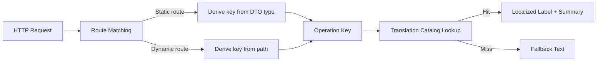
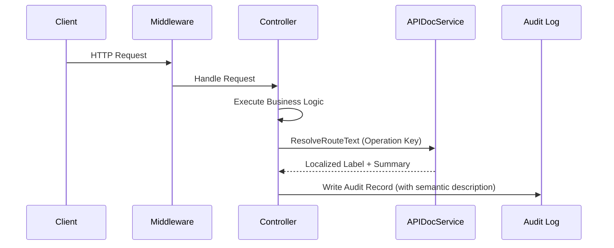

## Introduction

`APIDocService` provides plugins with localized `API` documentation capabilities, resolving route operation keys into localized module labels and action summaries. The service primarily supports scenarios such as audit logs and operation records that need to display semantic route information, rather than `OpenAPI` document generation itself.

Plugins obtain the service via `services.APIDoc()`. A typical consumer is the operation log plugin (`linapro-monitor-operlog`), which needs to convert intercepted `HTTP` routes into human-readable action descriptions.

## Design Philosophy

The core design of `APIDocService` revolves around **operation keys**. An operation key is a stable identifier for a route that does not change with path parameters or versions.

There are two strategies for constructing operation keys:

- **Static routes**: Derived by reflecting on the `DTO` type of the request handler function. `BuildOperationKeyFromHandler` parses the input parameter types of the handler function and converts their package path and type name into a dot-separated stable key. For example, `lina-core.backend.api.sys.user.ListReq` normalizes to `core.backend.api.sys.user.ListReq`.
- **Dynamic routes**: Derived from the request path. `BuildOperationKeyFromPath` normalizes the `OpenAPI` path and combines it with the `HTTP` method to generate the operation key. Dynamic plugin routes (`/x/{pluginId}/...`) are detected and converted to the `plugins.{pluginId}.paths.{method}.{path}` format.

Operation keys correspond to entries in a translation catalog. `ResolveRouteText` looks up the translation catalog by operation key and returns a localized module label (`Title`) and action summary (`Summary`). When no matching entry exists in the catalog, the fallback text provided by the caller is returned.

## Architectural Position

`APIDocService` sits downstream in the request processing pipeline, typically invoked when business logic completes or an audit record is written:

This service forms the request context read layer alongside `BizCtxService` and `RouteService`:

- `BizCtxService` provides request identity and tenant context
- `RouteService` provides dynamic route metadata
- `APIDocService` provides localized route semantics

## Key Capabilities

| Method | Description |
|--------|-------------|
| `ResolveRouteText` | Resolves the localized module label and action summary for a single route based on its operation key |
| `ResolveRouteTexts` | Batch-resolves multiple route texts, sharing a single translation catalog load — suited for batch audit records |
| `FindRouteTitleOperationKeys` | Searches matching module label operation keys by keyword, used for route filtering in audit logs |

For helper functions, `BuildOperationKeyFromHandler` handles static routes, `BuildOperationKeyFromPath` handles non-`DTO` fallback routes, and `BuildDynamicOperationKey` handles dynamic plugin routes. Together, these three cover all operation key construction scenarios.

## Design Constraints

- **Operation keys are stable identifiers**: Operation keys do not change with path parameters. The same business operation should produce the same operation key across different requests — this is a prerequisite for correct translation catalog matching.
- **Translation catalogs are managed by the host**: `APIDocService` is only responsible for lookup and retrieval, not for catalog maintenance. Adding, modifying, or removing translation entries is done through the `i18n` resource management process.
- **Fallback text is a safety net**: When the translation catalog has no matching entry, the caller's fallback text is returned, ensuring audit records always have displayable content.
- **Plugin operation keys require namespacing**: Source plugin operation keys are normalized with a `plugins.{pluginId}.` prefix to avoid conflicts with the core framework or other plugins.

## Related Services

- [BizCtxService](/docs/plugin-capability-bizctx) - Provides request-level identity and tenant context
- [RouteService](/docs/plugin-capability-route) - Provides dynamic route metadata
- [I18nService](/docs/plugin-capability-i18n) - Provides runtime translation capabilities
