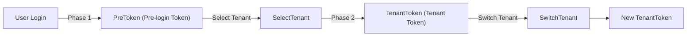
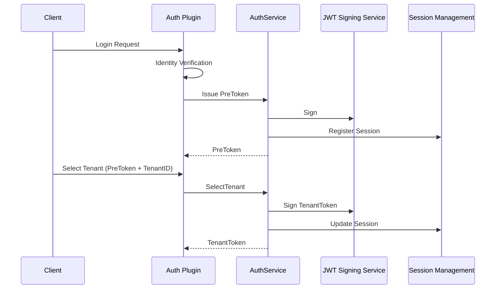

## Introduction

`AuthService` provides plugins with tenant authentication `Token` issuance, switching, and management capabilities. It is the core service in multi-tenant authentication flows, handling the entire `Token` lifecycle from login to tenant selection, tenant switching, and platform administrator impersonation into tenants.

Plugins obtain the service via `services.Auth()`. A typical consumer is the `linapro-tenant-core` plugin, which implements the business logic for tenant selection and switching, completing `Token` issuance and revocation through `AuthService`.

## Design Philosophy

`AuthService` uses a **two-phase authentication model**:

**Phase 1: Login produces a PreToken.** After the user completes identity verification via username/password or another method, the core framework issues a short-lived `PreToken`. At this point the user is not yet bound to a specific tenant.

**Phase 2: Tenant selection issues a TenantToken.** Once the user selects a target tenant, the plugin calls `SelectTenant` to consume the `PreToken` and issue a `TenantToken` bound to that tenant. The `TenantToken` contains an `AccessToken` and a `RefreshToken`; subsequent requests use the `TenantToken` to access tenant resources.

**Tenant switching.** When an authenticated user needs to switch to a different tenant, the plugin calls `SwitchTenant`. This method verifies the user's membership in the target tenant, revokes the current `Token`, and issues a new `TenantToken`.

**Impersonation tokens.** Platform administrators can impersonate into any tenant. `IssueImpersonationToken` issues a `Token` marked as impersonation, and `RevokeImpersonationToken` revokes the impersonation session. Business authorization and audit checks for impersonation tokens are the responsibility of the calling plugin — the host only handles `JWT` signing, session state, and permission caching.

## Architectural Position

`AuthService` sits at the `Token` management layer in the authentication chain, between identity verification and business authorization:

This service collaborates with the following services:

- `BizCtxService`: Token information issued by `AuthService` is ultimately projected into `BizCtx` for business logic to read
- `SessionService`: `Token` issuance and revocation synchronously update online session state
- `TenantService`: Tenant switching requires verifying user visibility in the target tenant

## Key Capabilities

| Method | Description |
|--------|-------------|
| `SelectTenant` | Consumes a PreToken and issues a TenantToken bound to the target tenant |
| `SwitchTenant` | Verifies membership, revokes the current Token, and issues a TenantToken for the new tenant |
| `IssueImpersonationToken` | Issues an impersonation token for a platform administrator to enter a target tenant |
| `RevokeImpersonationToken` | Revokes an impersonation token, ending the impersonation session |

## Design Constraints

- **Plugins do not issue JWTs directly.** `Token` signing, key management, and expiration policies are controlled by the host authentication service. Plugins request issuance through `AuthService` and never touch signing details.
- **Impersonation tokens require caller-side auditing.** `IssueImpersonationToken` only issues the `Token` — the plugin must complete business authorization checks and audit logging on its own before calling it.
- **PreTokens are single-use.** Once `SelectTenant` consumes a `PreToken`, it becomes invalid and cannot be reused.
- **Tenant switching revokes the old Token.** After `SwitchTenant` executes, the original `Token` is immediately invalidated, and the client must use the newly issued `Token`.

## Related Services

- [BizCtxService](/docs/plugin-capability-bizctx) - Token information is projected into the business context
- [SessionService](/docs/plugin-capability-session) - Token issuance and revocation synchronize session state
- [TenantService](/docs/plugin-capability-tenant) - Visibility verification before tenant switching
