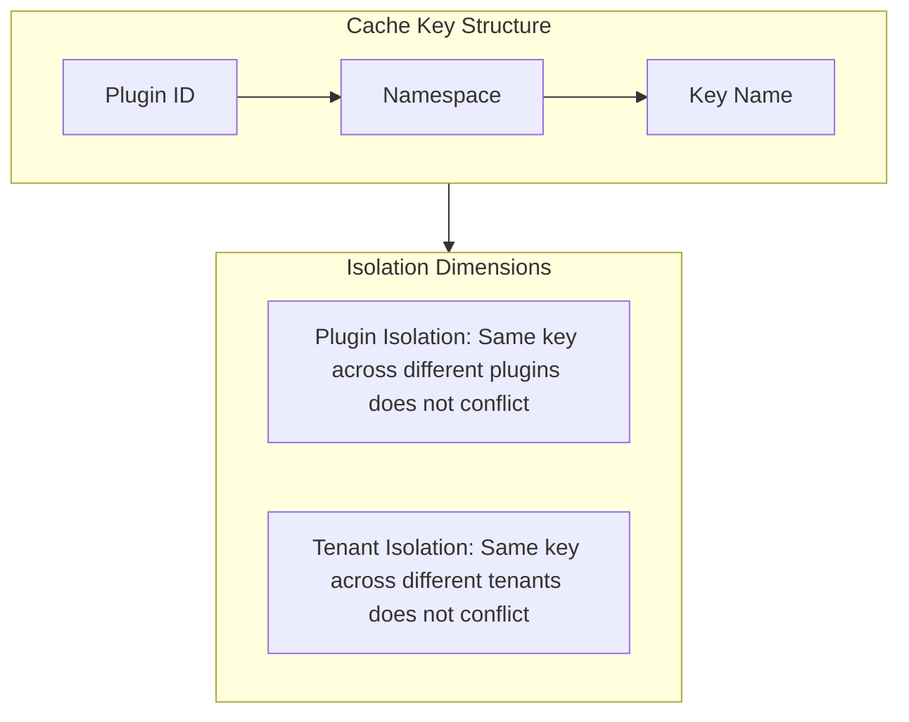
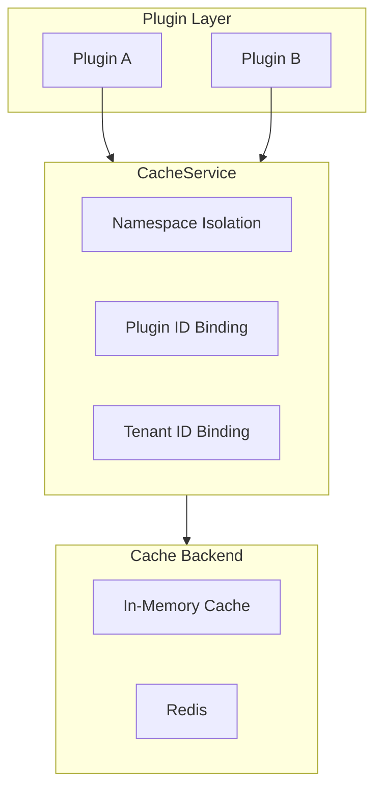

## Introduction

`CacheService` provides plugins with namespace-isolated runtime caching capabilities. Plugins obtain the service via `services.Cache()`, and cached data is automatically bound to the current plugin ID and tenant scope, preventing interference between plugins.

This service is suited for intra-plugin temporary data acceleration, such as session state, counters, and hot data. Cache is lossy runtime acceleration data and should not be treated as an authoritative source for permissions, configuration, tenant boundaries, or business records.

## Design Philosophy

`CacheService` uses a **namespace + plugin ID + tenant ID** triple-isolation model:

Every cache operation requires specifying a `namespace` and a `key`. Namespaces provide logical grouping within a plugin, and key names are unique within a namespace. The host automatically prepends the plugin ID and tenant ID prefixes during actual storage, ensuring cross-plugin and cross-tenant isolation.

The cache supports two value types:

| Value Type | Constant | Description |
|------------|----------|-------------|
| String | `CacheValueKindString` | General-purpose text cache |
| Integer | `CacheValueKindInt` | Integer scenarios such as counters and sequence numbers |

The `Incr` method is purpose-built for atomic increment of integer cache entries, suited for access counters, rate-limiting counters, and similar use cases.

## Architectural Position

`CacheService` sits between the plugin business layer and the host cache backend, serving as the single entry point for plugin caching:

## Key Capabilities

| Method | Description |
|--------|-------------|
| `Get` | Reads a non-expired cache entry from the specified namespace |
| `Set` | Stores a string value in the specified namespace; `ttl=0` means no expiration |
| `Delete` | Deletes a specified cache entry; deleting a non-existent entry is a successful no-op |
| `Incr` | Atomically increments an integer cache entry, suited for counter scenarios |
| `Expire` | Updates the expiration policy of a cache entry; `ttl=0` clears the expiration |

## Design Constraints

- **Cache is lossy data.** Cache content may expire or be evicted at any time and should not be treated as an authoritative source for permission checks, configuration reads, tenant boundaries, or business records.
- **Plugins should not manipulate cache key prefixes directly.** The host automatically prepends plugin ID and tenant ID prefixes — plugins only need to concern themselves with namespaces and business key names.
- **`ttl=0` has different semantics depending on the method.** With `Set`, `ttl=0` means no expiration; with `Expire`, `ttl=0` clears the existing expiration policy.
- **Cache backend is controlled by the host.** Plugins cannot choose or configure the cache backend (in-memory, Redis, etc.) — it is managed uniformly by the host.

## Related Services

- [TenantFilterService](/docs/plugin-capability-tenant-filter) - Tenant isolation in cache keys complements TenantFilter's data filtering
- [ConfigService](/docs/plugin-capability-config) - Configuration is persistent data, while cache is lossy runtime data
