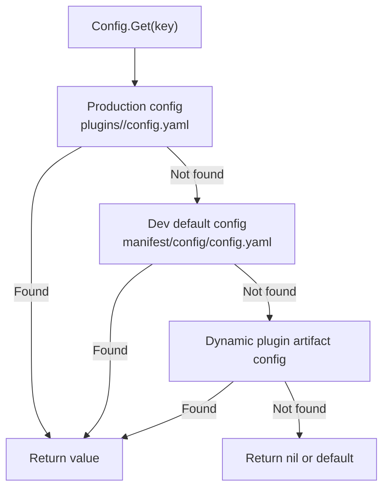
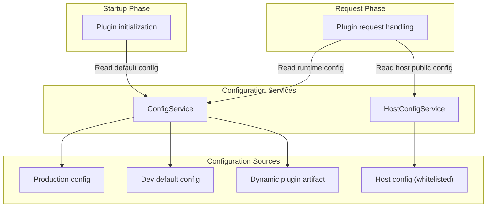

## Introduction

`LinaPro` provides two configuration reading services for plugins, each serving a different configuration layer:

- `ConfigService`: Reads the current plugin's own business configuration. Plugins access it via `services.Config()`.
- `HostConfigService`: Reads the host's publicly whitelisted configuration keys. Plugins access it via `services.HostConfig()`.

Both services offer typed reading methods (`String`, `Bool`, `Int`, `Duration`, `Scan`), but their responsibilities are strictly separated: plugin business configuration should not be written into the host's `config.yaml`, and the host's internal configuration should not be exposed to plugins through `HostConfigService`.

## Design Philosophy

### Plugin Configuration — ConfigService

`ConfigService` uses a **three-tier priority override** model:

| Priority | Configuration location | Description |
|----------|------------------------|-------------|
| 1 | `plugins/<plugin-id>/config.yaml` under the production config root | Operations-side override, highest priority in production |
| 2 | `apps/lina-plugins/<plugin-id>/manifest/config/config.yaml` | Development-time default configuration |
| 3 | `manifest/config/config.yaml` inside a dynamic plugin artifact | Default configuration shipped with a dynamic plugin release |

`manifest/config/config.example.yaml` is a configuration template and is not used in runtime default reading. It exists solely for documentation and initialization guidance.

`ConfigService` is plugin-scoped: the core framework automatically binds the current plugin ID when constructing the service, so a plugin can only read its own configuration, not that of other plugins.

### Host Configuration — HostConfigService

`HostConfigService` uses a **whitelist** model: the host maintains a list of publicly exposed configuration keys, and only keys on that list can be read through this service. Typical whitelisted keys include:

| Key | Description |
|-----|-------------|
| `workspace.basePath` | Workspace base path |
| `i18n.default` | Default locale |
| `i18n.enabled` | Whether internationalization is enabled |

The whitelist design of `HostConfigService` prevents plugins from scanning the host's full configuration tree, avoiding access to sensitive settings such as database connection strings and secrets.

## Architectural Placement

Both configuration services are used during startup and request processing:

During the route registration phase (`registerRoutes`), plugins typically read startup-level configuration. During request handling, they read runtime configuration on demand.

## Key Capabilities

Both services share the same method signatures:

| Method | Description |
|--------|-------------|
| `Get` | Returns the raw configuration value |
| `Exists` | Checks whether a configuration key exists |
| `Scan` | Deserializes a configuration section into a target struct |
| `String` | Reads a string value, returning a default if missing |
| `Bool` | Reads a boolean value, returning a default if missing |
| `Int` | Reads an integer value, returning a default if missing |
| `Duration` | Reads a duration value, returning a default if missing |

## Design Constraints

- **Plugins should not use `g.Cfg()`.** Plugins should read their own configuration through `ConfigService` rather than using GoFrame's global configuration to scan the host's full configuration tree.
- **Plugin configuration should not be written into the host's `config.yaml`.** Plugin business configuration belongs in its own configuration path, maintaining configuration isolation.
- **`HostConfigService` reads only whitelisted keys.** Plugins should not attempt to read non-whitelisted configuration through `HostConfigService`; such requests return empty values.
- **Convenience methods are built on `Get`.** `String`, `Bool`, `Int`, `Duration`, and `Scan` are typed convenience methods layered on top of `Get`, not independent authorization methods.

## Related Services

- [ManifestService](/docs/plugin-capability-manifest) - Reads raw resource files under `manifest/`, complementary to the configuration services
- [I18nService](/docs/plugin-capability-i18n) - Keys like `i18n.default` in configuration affect translation behavior
