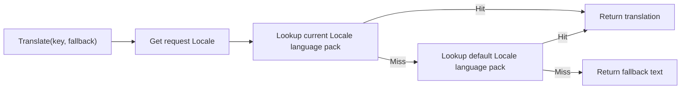
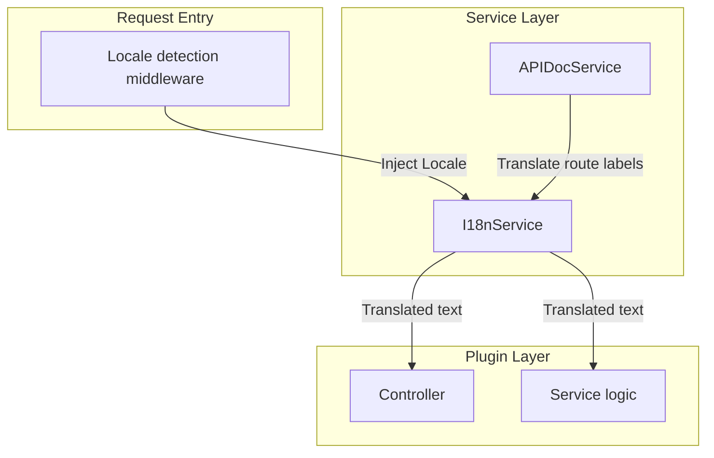

## Introduction

`I18nService` provides runtime translation capabilities for plugins, resolving translation keys into localized text based on the current request's `Locale`. Plugins access it via `services.I18n()`. Nearly every plugin that displays user-readable text will use this service.

The service works in tandem with the language packs under a plugin's `manifest/i18n/` directory: language packs define translation entries, and `I18nService` looks up and returns the corresponding translation at runtime based on the request `Locale`.

## Design Philosophy

`I18nService` is built around a **translation key plus fallback text** model. Every translation call provides a translation key and a fallback text. The key is used to look up the translation in language packs, and the fallback text serves as a safety net when the lookup fails.

Translation keys typically follow a hierarchical structure, such as `plugin.content-notice.article.create.success`, corresponding to the `JSON` or `YAML` hierarchy in the plugin's language pack. The `Translate` method searches in the following priority order:

1. The plugin language pack for the current request `Locale`
2. The plugin language pack for the default `Locale`
3. The fallback text provided by the caller

The `FindMessageKeys` method supports reverse lookup: given a translation key prefix and keyword, it returns a list of matching translation keys. This is useful in scenarios such as audit logging, where you need to search for translation entries containing specific text.

## Architectural Placement

`I18nService` sits in the request pipeline as translation infrastructure, consumed by multiple downstream services and plugin business logic:

`I18nService` is an underlying dependency of `APIDocService`: `APIDocService` uses `I18nService` to translate module labels and operation summaries associated with route operation keys.

## Key Capabilities

| Method | Description |
|--------|-------------|
| `GetLocale` | Returns the effective locale for the current request, injected by host middleware |
| `Translate` | Returns a localized value based on a translation key and fallback text |
| `FindMessageKeys` | Searches for matching translation keys by prefix and keyword |

## Design Constraints

- **Translation keys are defined by plugins.** `I18nService` only handles lookup and return; translation entries are defined and maintained in the plugin's `manifest/i18n/` language packs.
- **Fallback text is required.** Every translation call should provide fallback text to ensure there is displayable content when a language pack is missing or a translation key is incorrect.
- **Locale is injected by the host.** Plugins should not parse the `Accept-Language` header or other locale sources themselves; they should obtain the host-resolved result through `GetLocale`.
- **Translation values are runtime data.** Translation results should not be cached as configuration or written to the database — they are only suitable for temporary use during request processing.

## Related Services

- [APIDocService](/docs/plugin-capability-apidoc) - Uses I18n to translate route labels and operation summaries
- [ConfigService](/docs/plugin-capability-config) - Keys like `i18n.default` in configuration affect locale resolution
- [ManifestService](/docs/plugin-capability-manifest) - Reads language pack resources under `manifest/i18n/`
