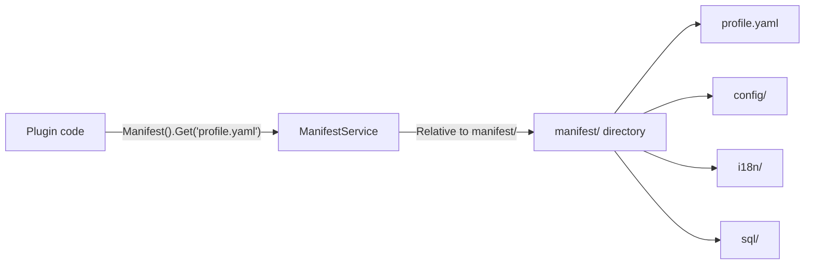
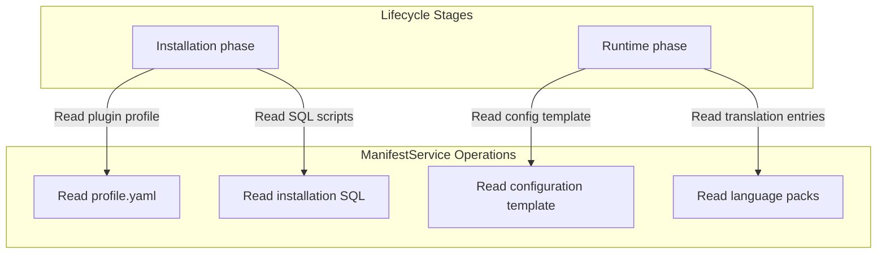

## Introduction

`ManifestService` provides plugins with read-only access to raw resource files under the `manifest/` directory. Plugins access it via `services.Manifest()` to read plugin-owned files such as `profile.yaml`, `config/config.example.yaml`, `i18n/zh-CN/plugin.json`, and `sql/*.sql`.

This service is complementary to `ConfigService`: `ConfigService` reads plugin configuration values resolved through priority layers, while `ManifestService` reads the raw file content under `manifest/`.

## Design Philosophy

The core design of `ManifestService` is **raw resource reading**. It offers three access modes:

- `Get`: Reads raw byte content, suitable for resource files in any format
- `Exists`: Checks whether a resource exists, suitable for conditional logic
- `Scan`: Deserializes a `YAML` resource (or a nested key within it) into a target struct, suitable for structured configuration

Paths are slash-separated and relative to `manifest/`. For example:

| Path | Actual file | Description |
|------|-------------|-------------|
| `profile.yaml` | `manifest/profile.yaml` | Plugin profile |
| `config/config.example.yaml` | `manifest/config/config.example.yaml` | Configuration template |
| `i18n/zh-CN/plugin.json` | `manifest/i18n/zh-CN/plugin.json` | Chinese language pack |
| `sql/install.sql` | `manifest/sql/install.sql` | Installation script |
| `resources/policy.yaml` | `manifest/resources/policy.yaml` | Policy configuration |

For source plugins, `manifest/` resources are embedded into the compiled artifact via `plugin_embed.go`. `ManifestService` reads from the embedded filesystem. For dynamic plugins, resources are packaged with the `.wasm` artifact and bound to the current active release version at runtime.

## Architectural Placement

`ManifestService` is used across multiple stages of the plugin lifecycle:

This service forms a complementary relationship with the following services:

- `ConfigService`: `ConfigService` reads configuration values resolved through priority layers; `ManifestService` reads the raw configuration files
- `I18nService`: `I18nService` performs runtime translation; `ManifestService` can read the raw language pack files

## Key Capabilities

| Method | Description |
|--------|-------------|
| `Get` | Reads raw byte content at a specified path under `manifest/` |
| `Exists` | Checks whether a resource exists at a specified path under `manifest/` |
| `Scan` | Deserializes a YAML resource (or a nested key within it) into a target struct |

## Design Constraints

- **Paths are relative to `manifest/`.** Do not write `manifest/profile.yaml`; use `profile.yaml` instead.
- **Only reads raw resources.** `ManifestService` is only responsible for reading file content, not for making resources "take effect." Reading a SQL script does not execute the installation; reading a language pack does not register translations.
- **`config.example.yaml` is not used for default reading.** It is a configuration template, not a runtime default. `ConfigService` defaults come from `manifest/config/config.yaml`.
- **Plugins can only read their own resources.** Similar to `ConfigService`, `ManifestService` is plugin-scoped and cannot read the `manifest/` directory of other plugins.

## Related Services

- [ConfigService](/docs/plugin-capability-config) - Reads plugin configuration values resolved through priority layers
- [I18nService](/docs/plugin-capability-i18n) - Runtime translation capability; language pack files are read through ManifestService
