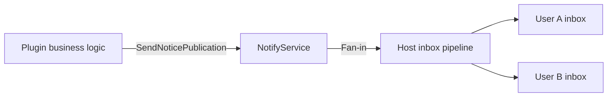
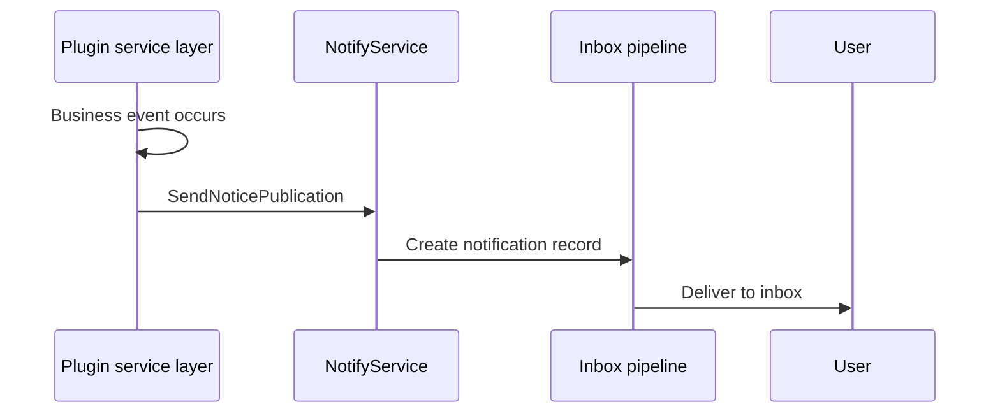

## Introduction

`NotifyService` provides plugins with notification publishing capabilities, fanning business events into the host's unified inbox pipeline. Plugins access it via `services.Notify()` to send system notifications, business alerts, and other messages to users.

The service uses a **publish-deliver** model: plugins publish notifications, and the host is responsible for delivering them to the target user's inbox.

## Design Philosophy

`NotifyService` is designed around two dimensions: **source classification** and **inbox classification**.

**SourceType** identifies the business origin of a notification:

| SourceType | Description |
|------------|-------------|
| `SourceTypeNotice` | Notification from the announcement module |
| `SourceTypePlugin` | Notification from plugin business logic |

**CategoryCode** identifies the classification of a notification in the inbox. Plugins can declare their own category codes; the host provides a general-purpose fallback category `CategoryCodeOther`.

`SendNoticePublication` accepts a `NoticePublishInput` containing a notification ID, title, content, category code, and sender ID. The host uses this information to create a notification record and deliver it to the target users.

`DeleteBySource` is used to clean up notification records for a specific business source. When business data is deleted, the associated notifications should be cleaned up as well.

## Architectural Placement

`NotifyService` sits at the end of the business event processing chain, acting as the conversion layer from events to notifications:

This service is a one-way publish channel; it does not provide notification status queries or read-marking capabilities. Those capabilities are provided independently by the host's inbox module.

## Key Capabilities

| Method | Description |
|--------|-------------|
| `SendNoticePublication` | Publishes a notification to the host's inbox pipeline |
| `DeleteBySource` | Deletes notification records by business source type and identifier |

## Design Constraints

- **Plugins define category codes.** Plugins can use any string as a `CategoryCode`; the host does not predefine a category list. When unspecified, it falls back to `CategoryCodeOther`.
- **Notifications are delivered asynchronously.** After `SendNoticePublication` returns, there is no guarantee that the notification has reached the user; the host completes delivery in the background.
- **Deletion matches by source.** `DeleteBySource` matches and deletes by `SourceType` and `sourceIDs`, making it suitable for cleaning up associated notifications when business data is removed.
- **Notification content is plain text.** Notification titles and content are plain text; rich text or template rendering is not supported.

## Related Services

- [BizCtxService](/docs/plugin-capability-bizctx) - Retrieves the current user ID as the notification sender
- [I18nService](/docs/plugin-capability-i18n) - Notification content may require translation
