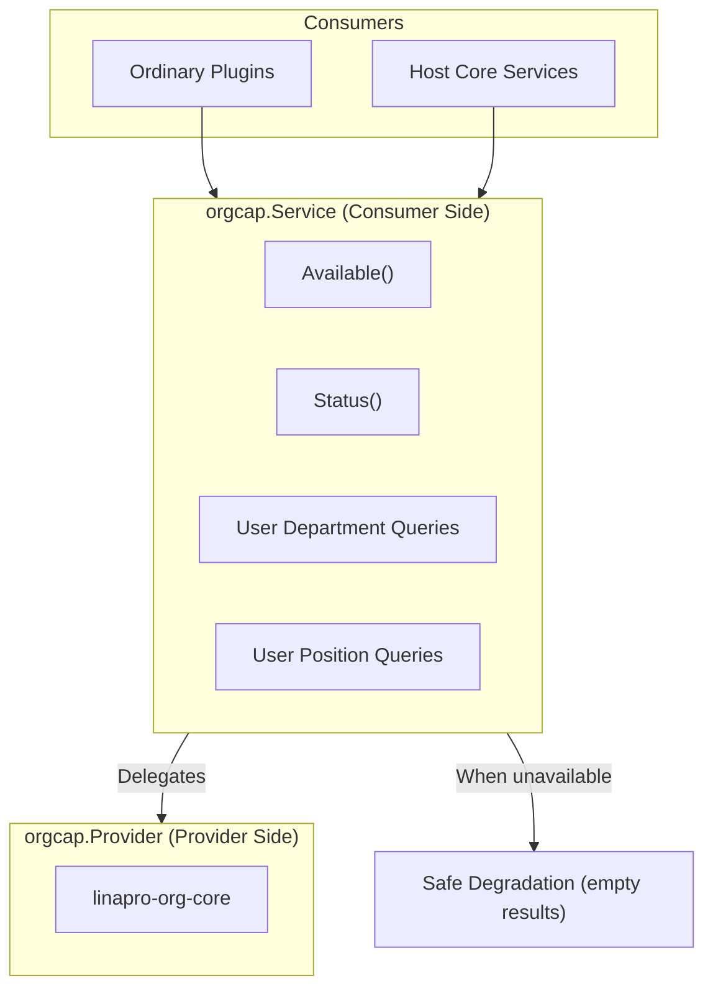
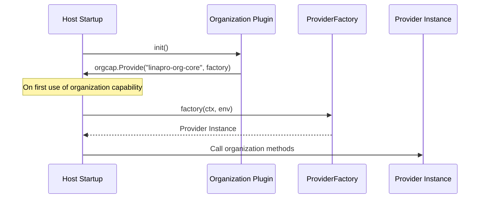
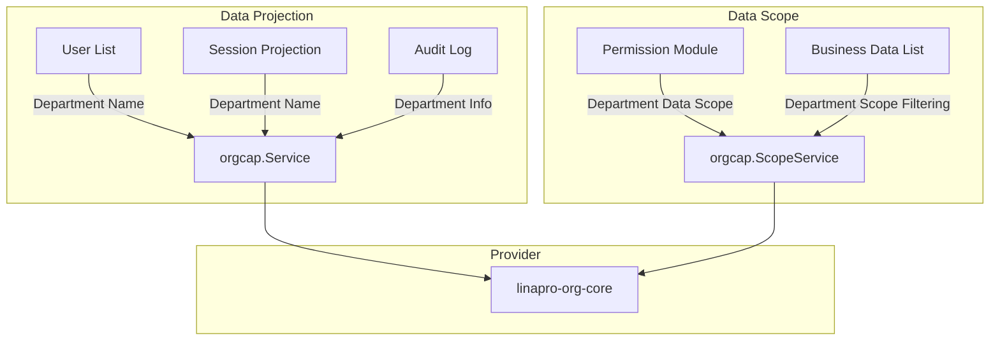

## Introduction

The organization capability (`orgcap`) is a framework-level optional capability in `LinaPro` that provides plugins and the host with read-only projections of organization data — such as user departments and positions — along with data-scope filtering. Plugins access the consumer interface through `services.Org()`.

The organization capability follows a **Provider + Consumer Service** pattern: a dedicated provider plugin (such as `linapro-org-core`) implements the concrete organization logic, while consumers access it through the `orgcap.Service` interface without directly depending on the provider implementation. When the provider is unavailable, consumers safely degrade and return empty results.

## Design Approach

### Consumer Service

`orgcap.Service` is the read-only consumer interface for ordinary plugins and host core services. It provides the following capabilities:

- **Availability check**: `Available()` determines whether the organization capability provider is available
- **Capability status**: `Status()` returns detailed activation status, including provider plugin and conflict information
- **User department queries**: Batch or single-user department assignment lookups
- **User position queries**: Query positions associated with a user

### Provider

`orgcap.Provider` is the interface that organization capability plugins must implement. It defines the complete read-write contract for organization data, including user-department relationships, position relationships, data-scope filtering, and organization tree projections.

Providers register a factory function through `orgcap.Provide(pluginID, factory)`. The host lazily invokes the factory on first use of the organization capability, passing in a `ProviderEnv` to construct the environment.

## Architectural Position

The organization capability serves two key roles in the system:

- **Data projection**: Provides display information such as department names for user lists, sessions, and audit logs
- **Data scope**: Provides department-level data-scope filtering for the permission module and business data (`ScopeService` is an internal host interface, not exposed through `capability.Services`)

## Key Capabilities

Primary methods of `orgcap.Service` (consumer side):

| Method | Description |
|--------|-------------|
| `Available` | Determines whether the organization capability provider is available |
| `Status` | Returns detailed activation status and provider information |
| `ListUserDeptAssignments` | Batch query for user department assignment projections |
| `GetUserDeptInfo` | Queries a single user's department identifier and name |
| `GetUserDeptName` | Queries a single user's department name (lightweight projection) |
| `GetUserDeptIDs` | Queries a single user's list of department identifiers |
| `GetUserPostIDs` | Queries a single user's list of associated position identifiers |

## Design Constraints

- **The consumer side is read-only.** `orgcap.Service` does not include write operations. User-department and position relationship maintenance is handled through the host-internal `AssignmentService`, which is not exposed to ordinary plugins.
- **Capability is optional, with safe degradation.** Plugins should check `Available()` before using the organization capability. When unavailable, query methods return empty results without errors.
- **`Provider` is lazily constructed.** The host only invokes the factory function to construct a `Provider` instance on first use of the organization capability, avoiding unnecessary capability loading at startup.
- **`ScopeService` is not exposed to plugins.** Data-scope filtering involves database query builders and is used through the host's internal interface, not exposed through `capability.Services`.

## Provider Guide

To implement a custom organization capability plugin, you need to:

1. Implement the `orgcap.Provider` interface, providing methods for user departments, positions, data scope, etc.
2. Register a factory function through `orgcap.Provide(pluginID, factory)`
3. The factory function receives a `ProviderEnv` containing host services such as `PluginID` and `TenantFilter`

Provider plugins must register the factory in `init()`. The host lazily constructs the instance on first use.

## Related Services

- [TenantService](/docs/plugin-capability-tenant) - Tenant capability complements organization capability, together forming the multi-tenant + organization data model
- [PluginStateService](/docs/plugin-capability-plugin-state) - Uses `IsProviderEnabled` to determine whether the organization provider is available
- [SessionService](/docs/plugin-capability-session) - Department names in session projections come from the organization capability
