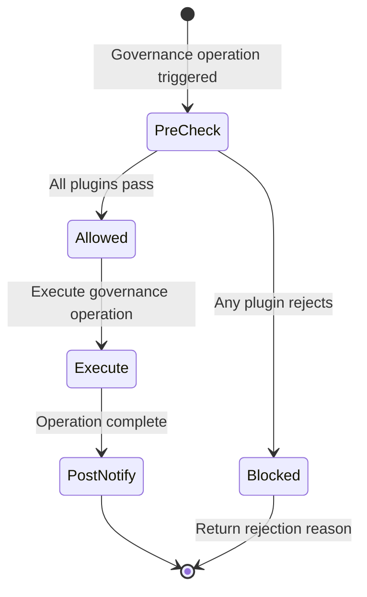
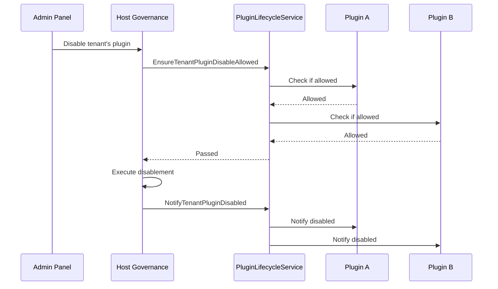
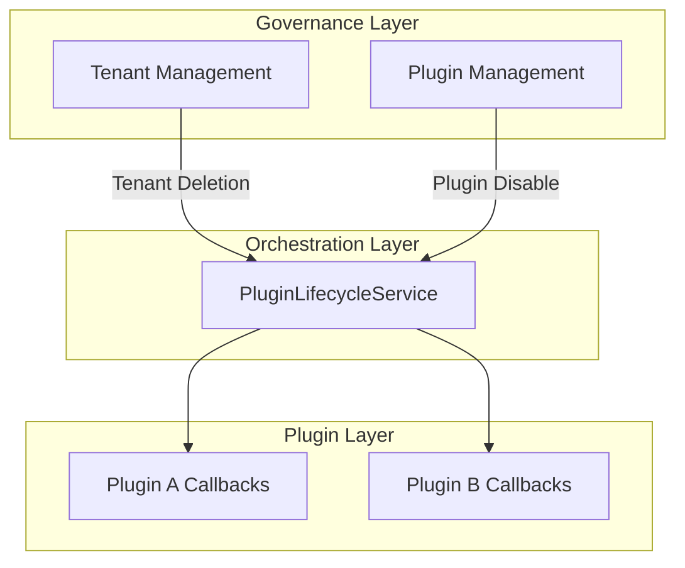

## Introduction

`PluginLifecycleService` provides plugins with tenant-level lifecycle orchestration, handling pre-checks and post-notifications for tenant plugin disablement and tenant deletion. Plugins access this service through `services.PluginLifecycle()`.

This service differs from `pluginhost.Lifecycle()`: `pluginhost.Lifecycle()` is the entry point for a single plugin to register its own lifecycle callbacks, while `PluginLifecycleService` is a host-side service that orchestrates cross-plugin lifecycle events. The former is oriented toward plugin registration; the latter is oriented toward governance module consumption.

## Design Approach

`PluginLifecycleService` uses a **pre-check + post-notification** two-phase orchestration model:

Taking "tenant disables a plugin" as an example:

1. **Pre-check**: `EnsureTenantPluginDisableAllowed` iterates over all plugins that have registered this hook and asks whether disablement is allowed. If any plugin returns an error, the operation is rejected entirely.
2. **Post-notification**: `NotifyTenantPluginDisabled` notifies relevant plugins after disablement is complete, allowing plugins to execute cleanup logic.

`EnsureTenantDeleteAllowed` and `NotifyTenantDeleted` follow the same pattern for tenant deletion scenarios.

## Architectural Position

`PluginLifecycleService` sits between the host governance layer and plugin lifecycle callbacks:

This service is the orchestration bridge from governance operations to plugin callbacks, ensuring that cross-plugin lifecycle events propagate with consistent ordering and semantics.

## Key Capabilities

| Method | Description |
|--------|-------------|
| `EnsureTenantPluginDisableAllowed` | Pre-check before a tenant disables a plugin; if any plugin rejects, the operation is blocked |
| `NotifyTenantPluginDisabled` | Post-notification after a tenant disables a plugin; best-effort delivery |
| `EnsureTenantDeleteAllowed` | Pre-check before tenant deletion |
| `NotifyTenantDeleted` | Post-notification after tenant deletion |

## Design Constraints

- **Pre-checks can block operations.** When an `Ensure*` method returns an error, the governance operation is blocked. Plugins should return stable rejection reason keys for display in the admin panel.
- **Post-notifications are best-effort.** `Notify*` methods do not return errors; failures in notification callbacks do not affect the completion of the governance operation.
- **Complements `pluginhost.Lifecycle()`.** `pluginhost.Lifecycle()` registers install, upgrade, and uninstall callbacks for a single plugin; `PluginLifecycleService` orchestrates cross-plugin tenant-level events.
- **Oriented toward governance module consumption.** Ordinary business plugins typically do not need to call this service directly; its consumers are governance modules such as tenant management and plugin management.

## Related Services

- [PluginStateService](/docs/plugin-capability-plugin-state) - Queries plugin enablement status, complementing lifecycle orchestration
- [TenantService](/docs/plugin-capability-tenant) - The tenant management module uses PluginLifecycleService to orchestrate tenant-level events
