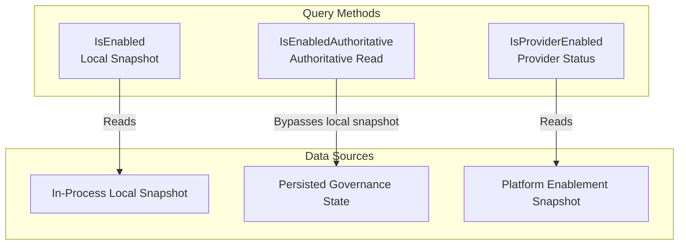
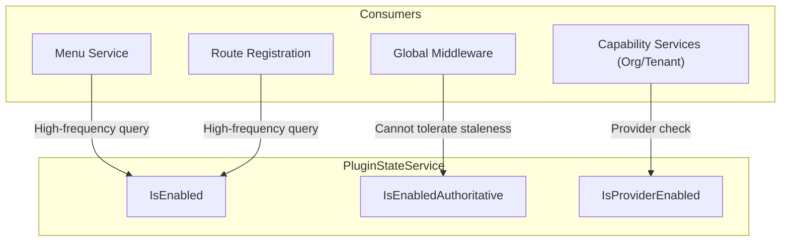

## Introduction

`PluginStateService` provides plugins with enablement status query capabilities, supporting three distinct query semantics. Plugins access this service through `services.PluginState()` and choose the appropriate query method based on the business scenario.

This service is core infrastructure for plugin governance; nearly every scenario that needs to be aware of its own or another plugin's status relies on it.

## Design Approach

`PluginStateService` provides three query methods, each serving different timeliness and consistency requirements:

| Method | Data Source | Use Case |
|--------|-----------|----------|
| `IsEnabled` | In-process local snapshot | High-frequency checks such as menus, routes, and permissions |
| `IsEnabledAuthoritative` | Persisted governance state | Global middleware, write-protection, and other controls that cannot tolerate stale data |
| `IsProviderEnabled` | Platform plugin enablement snapshot | Capability provider availability checks |

**Local snapshot vs. authoritative read.** `IsEnabled` reads the in-process enablement state snapshot with extremely low latency, but it may lag behind the latest admin operations. `IsEnabledAuthoritative` bypasses the local snapshot and reads directly from persisted storage, ensuring the most up-to-date status at the cost of higher latency.

**Provider enablement status.** `IsProviderEnabled` determines whether a specified plugin can serve as a framework capability provider. This semantics is independent of `IsEnabled`: a plugin may be enabled but unable to serve as a provider (e.g., incomplete capability declaration), or it may be available as a provider in certain contexts while its business entry is not visible.

## Architectural Position

`PluginStateService` is consumed by multiple layers in the request processing chain:

## Key Capabilities

| Method | Description |
|--------|-------------|
| `IsEnabled` | Queries whether a plugin is installed, enabled, and allowed to expose business entries within the current request scope |
| `IsEnabledAuthoritative` | Bypasses the local snapshot and reads enablement status from persisted governance state; suitable for global controls |
| `IsProviderEnabled` | Queries whether a plugin is available as a framework capability provider, independent of business entry visibility |

## Design Constraints

- **Use `IsEnabled` for high-frequency checks.** Menu filtering, route registration, permission checks, and similar scenarios should use `IsEnabled`, which reads from the in-process local snapshot with extremely low latency.
- **Use `IsEnabledAuthoritative` for global controls.** Global middleware, demo-mode write protection, and other scenarios that cannot tolerate local snapshot staleness should use `IsEnabledAuthoritative`.
- **`IsProviderEnabled` is independent of business entries.** A plugin's business entry may not be visible to the current tenant, yet it may still serve as a capability provider. These two states are governed by different dimensions.
- **Query scope is affected by request context.** The results of `IsEnabled` and `IsEnabledAuthoritative` are influenced by the current request's tenant scope and runtime upgrade gating; different requests may return different results.

## Related Services

- [PluginLifecycleService](/docs/plugin-capability-plugin-lifecycle) - Lifecycle orchestration changes plugin state; PluginStateService queries plugin state
- [OrgService](/docs/plugin-capability-org) - Uses `IsProviderEnabled` to determine whether the organization capability provider is available
- [TenantService](/docs/plugin-capability-tenant) - Uses `IsProviderEnabled` to determine whether the tenant capability provider is available
