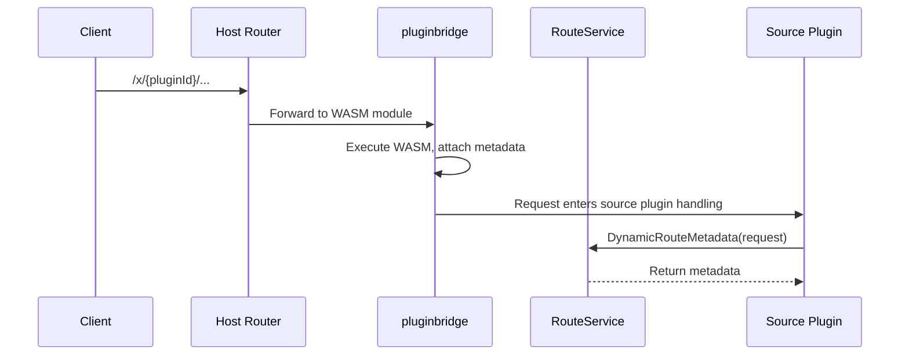

## Introduction

`RouteService` provides plugins with metadata access for the current dynamic route request. Plugins access this service through `services.Route()` to read declarative information such as the plugin ID, HTTP method, public path, tags, and summary of a dynamic plugin route.

This service primarily serves dynamic plugin route scenarios. Source plugins typically already know their route information at registration time and do not need to actively use this service; however, when handling requests forwarded by dynamic plugins (such as recording the dynamic route origin in an audit log), `RouteService` is needed to retrieve route metadata.

## Design Approach

`RouteService` is designed around **dynamic route metadata projection**. When a request from a dynamic plugin enters the host through `pluginbridge`, the host attaches route metadata to the request context. `RouteService` projects this metadata into a `DynamicRouteMetadata` struct.

`DynamicRouteMetadata` contains the following fields:

| Field | Description |
|-------|-------------|
| `PluginID` | The ID of the dynamic plugin that owns this route |
| `Method` | The HTTP method declared by the route |
| `PublicPath` | The public host path matched by the request |
| `Tags` | The tag list declared by the route |
| `Summary` | The summary declared by the route |
| `Meta` | Additional metadata declared by the route |
| `ResponseBody` | The raw response body captured by the runtime dispatcher |
| `ResponseContentType` | The content type of the response |

## Architectural Position

`RouteService` sits within the dynamic plugin request dispatch chain:

This service is the information bridge between dynamic plugins and source plugins, enabling source plugins to sense whether the current request originates from a dynamic plugin route.

## Key Capabilities

| Method | Description |
|--------|-------------|
| `DynamicRouteMetadata` | Extracts dynamic route metadata from the request; returns `nil` for non-dynamic-route requests |

## Design Constraints

- **Primarily serves dynamic plugin scenarios.** When a source plugin handles its own routes, route information is already known at registration time and does not need to be queried through `RouteService`.
- **Returns `nil` for non-dynamic routes.** When a request does not enter through a dynamic plugin route, `DynamicRouteMetadata` returns `nil`; callers must perform a nil check.
- **Metadata is a read-only projection.** The returned metadata struct is read-only and cannot be used to modify route declarations or response content.
- **`ResponseBody` is captured at runtime.** This field stores the response body captured by the `pluginbridge` dispatcher and may be empty.

## Related Services

- [APIDocService](/docs/plugin-capability-apidoc) - Uses the operation key from route metadata for document localization
- [BizCtxService](/docs/plugin-capability-bizctx) - Route metadata and business context together form the complete request picture
