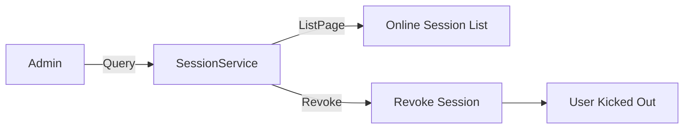
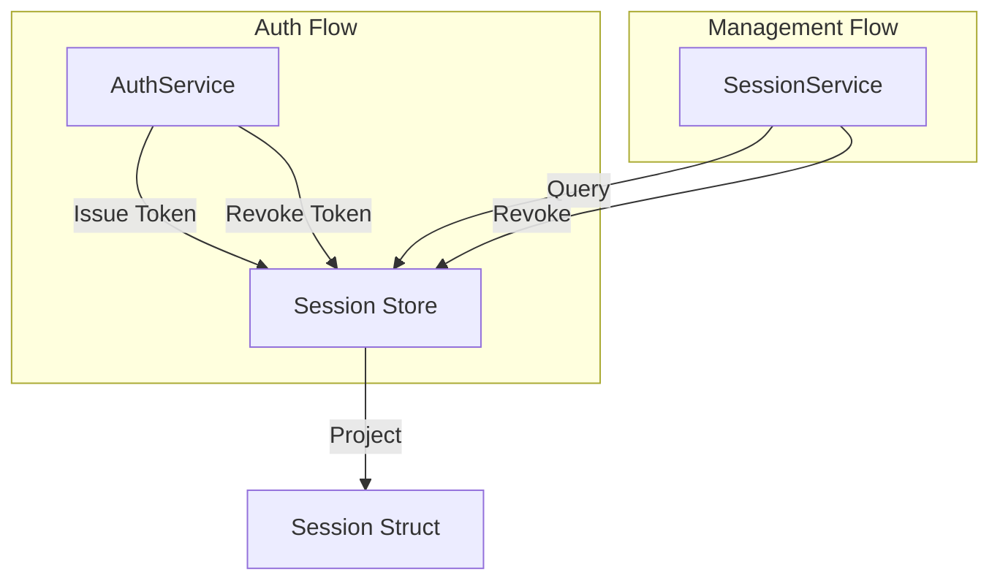

## Introduction

`SessionService` provides plugins with the ability to query and manage online sessions. Plugins obtain the service via `services.Session()` to paginate through online session lists and revoke sessions by `TokenID`.

A typical consumer is the `linapro-monitor-online` plugin, which provides online user monitoring functionality, displaying currently online users through `SessionService` and allowing administrators to kick sessions.

## Design Philosophy

`SessionService` is built around two core capabilities: **session projection** and **session management**.

**Session projection.** The `Session` struct is a stable projection of an online session, containing the following fields:

| Field | Description |
|-------|-------------|
| `TokenId` | Unique token identifier for the session |
| `TenantId` | Tenant the session belongs to; `0` means platform |
| `UserId` | Authenticated user ID |
| `Username` | Authenticated username |
| `ClientType` | Client type |
| `DeptName` | Department name projection |
| `Ip` | Login IP address |
| `Browser` | Browser fingerprint |
| `Os` | Operating system fingerprint |
| `LoginTime` | Initial login time |
| `LastActiveTime` | Most recent activity time |

**Session filtering.** `ListFilter` supports fuzzy matching by username and login IP, useful for administrators searching for specific users among a large number of sessions.

## Architectural Position

`SessionService` sits at the query and management layer in the session management chain, complementing the session registration layer of `AuthService`:

- `AuthService` registers and revokes sessions in the authentication flow
- `SessionService` queries and revokes sessions in the management flow
- Both share the same session store, but with different responsibilities

## Key Capabilities

| Method | Description |
|--------|-------------|
| `ListPage` | Paginated query of online sessions, with fuzzy filtering by username and IP |
| `Revoke` | Revoke a single online session by token ID, kicking the user out |

## Design Constraints

- **Sessions are read-only projections.** The `Session` struct is read-only; modifying it does not change session state. Use `Revoke` to terminate a session.
- **Paginated queries are scoped by tenant.** Platform administrators can query sessions across all tenants; tenant administrators can only query sessions within their own tenant.
- **Revocation takes effect immediately.** After `Revoke` is executed, the corresponding token is invalidated instantly, and the client's next request will be rejected.
- **`DeptName` is a projection field.** The department name is projected from the organization capability provider; if the organization capability is unavailable, this field may be empty.

## Related Services

- [AuthService](/docs/plugin-capability-auth) - AuthService registers sessions in the authentication flow; SessionService queries sessions in the management flow
- [BizCtxService](/docs/plugin-capability-bizctx) - Current request session information is projected into BizCtx
- [OrgService](/docs/plugin-capability-org) - The DeptName field in Session is projected from the organization capability
