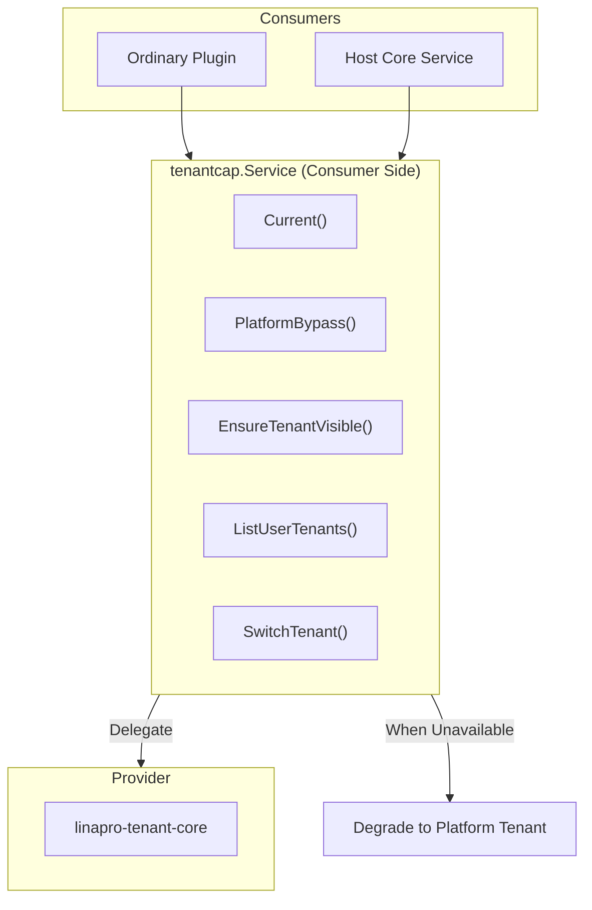
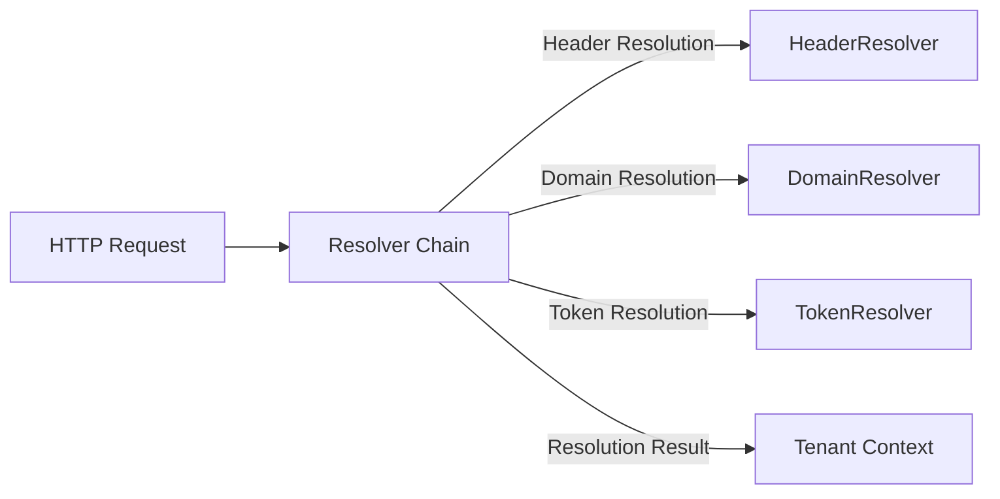
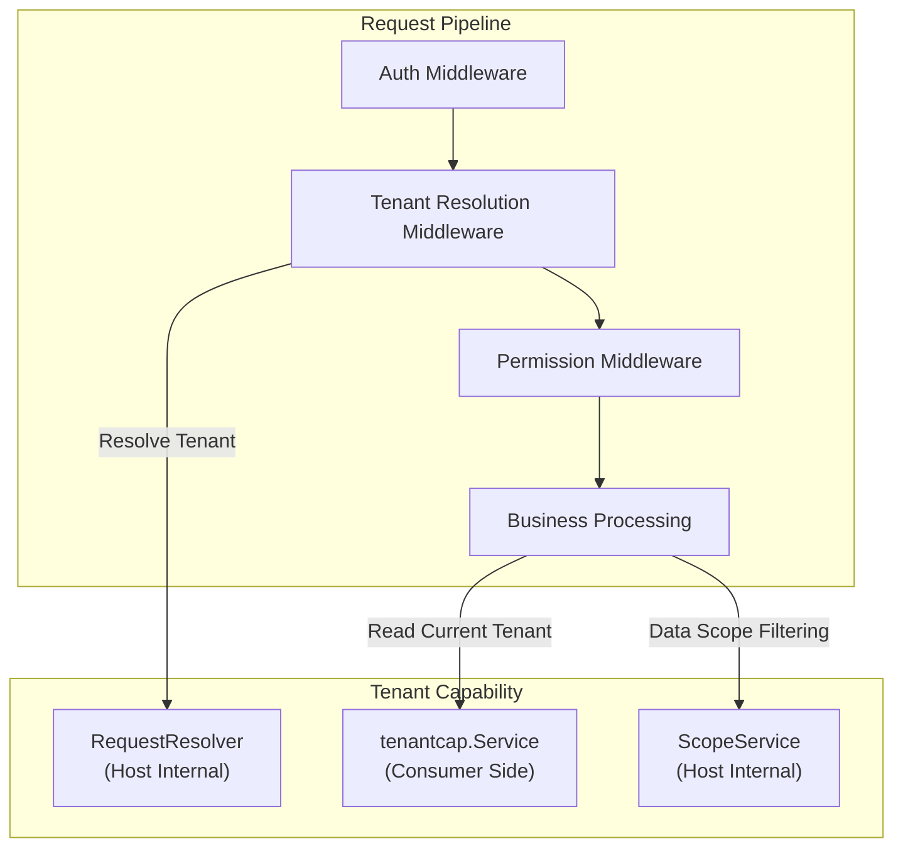

## Introduction

Tenant capability (`tenantcap`) is a framework-level optional capability in `LinaPro`, providing plugins and the host with multi-tenant fundamentals such as tenant resolution, tenant visibility validation, user-tenant relationship queries, and tenant switching. Plugins obtain the consumer-side interface via `services.Tenant()`.

Similar to the organization capability, tenant capability follows the **capability provider + consumer-side service** model. Provider plugins (such as `linapro-tenant-core`) implement the concrete tenant logic, while the consumer side accesses it through the `tenantcap.Service` interface. When the provider is unavailable, the system degrades to single-tenant mode using the platform tenant (`PlatformTenantID = 0`).

## Design Philosophy

### Consumer-Side Service

`tenantcap.Service` is the consumer-facing interface for ordinary plugins and host core services:

- **Availability check**: `Available()` determines whether the tenant capability provider is available
- **Current tenant**: `Current()` returns the tenant ID for the current request, falling back to the platform tenant when unavailable
- **Platform bypass**: `PlatformBypass()` determines whether the current request allows cross-tenant access
- **Tenant visibility**: `EnsureTenantVisible()` validates whether the current user can access a given tenant
- **User-tenant relationships**: `ListUserTenants()` returns the list of active tenants visible to the user
- **Tenant switching**: `SwitchTenant()` validates the legitimacy of a tenant switch

### Provider

`tenantcap.Provider` defines the base contract that tenant capability plugins must implement:

- **Tenant resolution**: `ResolveTenant` resolves tenant identity from the HTTP request
- **Tenant validation**: `ValidateUserInTenant` validates a user's access to a tenant
- **Tenant listing**: `ListUserTenants` returns active tenants visible to the user
- **Tenant switching**: `SwitchTenant` validates the legitimacy of a tenant switch

`tenantcap.Resolver` is an HTTP request-level tenant resolver interface used by the tenant middleware to establish tenant context before a request enters business processing. Multiple `Resolver` instances can form a chain of responsibility, attempting resolution in configured order.

## Architectural Position

Tenant capability plays several key roles in the system:

- **Request pipeline**: The tenant resolution middleware uses `RequestResolver` to establish tenant context after authentication
- **Business processing**: Plugins read the current tenant and validate visibility through `Service`
- **Data filtering**: The host internally uses `ScopeService` to inject tenant filter conditions (not exposed to plugins)

## Key Capabilities

Primary methods of `tenantcap.Service` (consumer side):

| Method | Description |
|--------|-------------|
| `Available` | Determines whether the tenant capability provider is available |
| `Status` | Returns detailed activation status and provider information |
| `Current` | Returns the current request tenant ID; falls back to the platform tenant when unavailable |
| `PlatformBypass` | Determines whether the current request is allowed to bypass tenant filtering |
| `EnsureTenantVisible` | Validates whether the current user can access a given tenant |
| `ValidateUserInTenant` | Validates whether a specified user can access a given tenant |
| `ListUserTenants` | Returns the list of active tenants visible to the user |
| `SwitchTenant` | Validates the legitimacy of a user switching to a target tenant |

## Design Constraints

- **Degrades to platform tenant.** When tenant capability is unavailable, `Current()` returns `PlatformTenantID (0)`, and the system operates in single-tenant mode.
- **`ScopeService` is not exposed to plugins.** Tenant filtering involves database query builders and is consumed through host-internal interfaces.
- **`RequestResolver` is not exposed to plugins.** HTTP request-level tenant resolution is the responsibility of host middleware; ordinary plugins do not need to use it directly.
- **`Provider` and `Resolver` are registered independently.** `Provider` supplies tenant business logic; `Resolver` supplies HTTP request resolution. They can be implemented by different plugins.

## Provider Guide

To implement a custom tenant capability plugin, you need to:

1. Implement the `tenantcap.Provider` interface, providing tenant resolution, validation, listing, switching, and other methods
2. Optionally implement the `tenantcap.Resolver` interface to provide HTTP request-level tenant resolution
3. Register a factory function via `tenantcap.Provide(pluginID, factory)`
4. The factory function receives a `ProviderEnv` containing host services such as `PluginID`, `BizCtx`, and `PluginLifecycle`

Provider plugins must register their factory in `init()`, and the host lazily constructs the instance on first use.

## Related Services

- [OrgService](/docs/plugin-capability-org) - Organization capability and tenant capability complement each other, jointly forming the multi-tenant + organization data model
- [BizCtxService](/docs/plugin-capability-bizctx) - Tenant resolution results are projected into BizCtx's TenantID field
- [AuthService](/docs/plugin-capability-auth) - TenantService validates legitimacy before tenant switching
- [TenantFilterService](/docs/plugin-capability-tenant-filter) - Uses tenant information from Tenant to filter data
