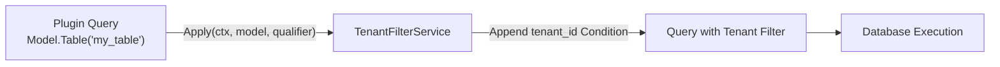
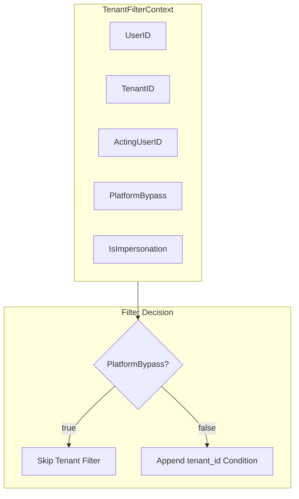
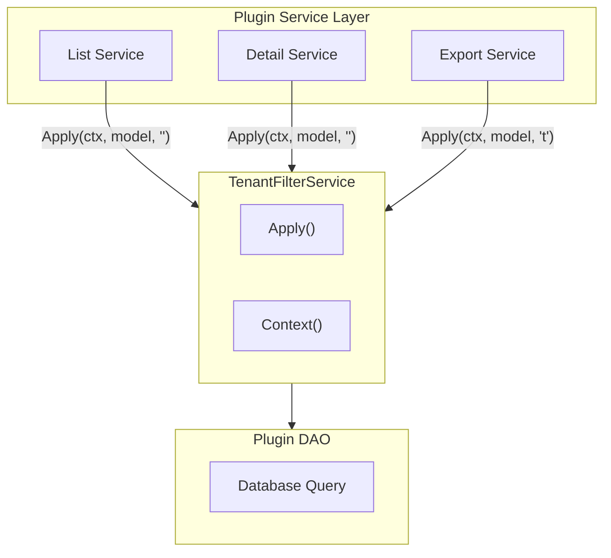

## Introduction

`TenantFilterService` provides plugins with tenant filter injection for database queries. Plugins obtain the service via `services.TenantFilter()` to append `tenant_id` filter conditions to plugin-owned tables, achieving multi-tenant data isolation.

This service is exclusive to source plugins. It is not exposed through `capability.Services`; instead, it is provided through the `pluginhost.Services` extension. This is because `TenantFilterService` carries a database query builder (`*gdb.Model`), and per the design principles for capability services, such capabilities are not exposed through the standard `capability.Services` interface.

## Design Philosophy

`TenantFilterService` follows the **query injection** pattern: a plugin passes its database query model into the `Apply` method, the service automatically appends a `tenant_id` condition, and returns the modified query model.

The `qualifier` parameter of the `Apply` method specifies a table name or alias, useful in join query scenarios:

| qualifier Value | Description |
|-----------------|-------------|
| Empty string | No table qualifier on the `tenant_id` column |
| Table name | Adds a table qualifier to `tenant_id`, e.g., `my_table.tenant_id` |
| Alias | Adds an alias qualifier to `tenant_id`, e.g., `t.tenant_id` |

The `Context` method returns a `TenantFilterContext` containing the current request's tenant, user, and impersonation state, for use when plugins need to manually construct query conditions.

## Architectural Position

`TenantFilterService` is widely used in the plugin data access layer:

Nearly every tenant-aware plugin uses this service. The typical pattern is to call `Apply` in the DAO layer's query methods, ensuring that all data access passes through tenant filtering.

## Relationship with pluginhost.Services

`TenantFilterService` is an extension capability of `pluginhost.Services` and is not part of `capability.Services`.

The reason for this design is that `TenantFilterService` methods carry a `*gdb.Model` database query builder. Per the design principles for capability services, capabilities that involve database query builders are not exposed through the standard `capability.Services` interface, to prevent the consumer interface from leaking database implementation details.

## Key Capabilities

| Method | Description |
|--------|-------------|
| `Context` | Returns the current request's `TenantFilterContext`, containing tenant, user, and impersonation state |
| `Apply` | Appends a `tenant_id` filter condition to the query model; skips filtering when `PlatformBypass` is active |

## Design Constraints

- **Source plugins only.** `TenantFilterService` is not exposed through `capability.Services`; dynamic plugins access equivalent capabilities through the `hostServices` authorization mechanism.
- **`PlatformBypass` automatically skips.** When a request operates at the platform scope (`TenantID = 0`), `Apply` automatically skips tenant filtering, allowing cross-tenant reads.
- **Plugins should not hand-write tenant filters.** Use `TenantFilterService` instead of writing `WHERE tenant_id = ?` manually, ensuring that filter logic stays consistent with the host's platform bypass and impersonation policies.
- **`qualifier` is for join queries.** Single-table queries typically use an empty string; join queries require specifying a table name or alias to avoid column name ambiguity.

## Related Services

- [BizCtxService](/docs/plugin-capability-bizctx) - Identity information in TenantFilterContext comes from BizCtx
- [TenantService](/docs/plugin-capability-tenant) - Tenant capability provides tenant resolution; TenantFilter uses tenant information to filter data
- [CacheService](/docs/plugin-capability-cache) - Tenant isolation in cache keys complements TenantFilter's query filtering
