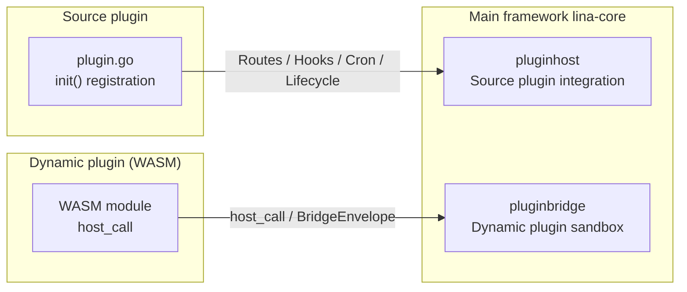
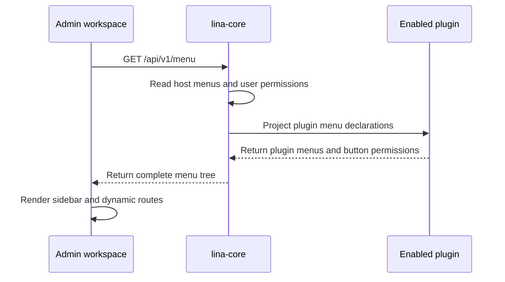

## Design Philosophy

`LinaPro` was designed around one core principle from the start: **the main framework is responsible only for lightweight foundational capabilities and stable extension interfaces, while business capabilities are implemented through plugins**.

The reason is straightforward. If the main framework carries too much business logic, every business change forces changes to the framework itself, raising upgrade cost and weakening stability. When business capabilities move into plugins instead, the main framework can focus on stable infrastructure: authentication, authorization, multi-tenancy, route dispatch, scheduled tasks, static assets, and plugin lifecycle management. Once these foundations are stable, they can support rapid iteration in upper-layer plugins for the long term.

That does not mean the host and plugins are completely isolated. Collaboration itself needs boundaries and rules. If a plugin depends too deeply on the host, for example by importing the host's `internal` packages directly or bypassing published interfaces to call private implementations, the plugin will break whenever host internals evolve. Conversely, if the host exposes one-off interfaces just to accommodate a specific plugin, unnecessary coupling appears between the host and that plugin, harming maintainability across the whole system.

`LinaPro` establishes clear collaboration boundaries between the host and plugins in three ways:

- **Source plugins integrate through the `pluginhost` contract**: every interface in the `pluginhost` package is a stable commitment from the main framework to source plugins. Source plugins can use host capabilities only through these interfaces and must not import the host's `internal/` directory directly.
- **Dynamic plugins communicate through the `pluginbridge` sandbox**: dynamic plugins run inside a `WASM` sandbox and call host services through the `host_call` mechanism. The host validates every call against the `hostServices` authorization snapshot confirmed at installation time.
- **The main framework provides general foundations, not business-specific interfaces**: `pluginhost` exposes general service adapters for authentication, tenancy, configuration, cache, notifications, and similar platform capabilities. It does not expose domain-specific business APIs for a particular plugin; plugins build their own business logic on top of those primitives.

This design keeps host stability and plugin flexibility compatible. The two sides collaborate across explicit boundaries instead of leaking into each other's implementation.

## Host Capability Design

The foundational capabilities provided by the main framework `lina-core` can be divided into two groups: **infrastructure capabilities** and **plugin extension interfaces**.

### Infrastructure Capabilities

Infrastructure capabilities apply to the whole runtime environment. They are not designed for any single business scenario or page:

| Capability Area | Description |
|-----------------|-------------|
| **Authentication and sessions** | `JWT` issuance and validation, session storage, forced sign-out, session activity refresh |
| **Permission management** | `RBAC` model, menu and button permissions, permission identifier enforcement middleware |
| **Multi-tenancy** | Tenant resolution, tenant context injection, tenant filter service |
| **Routing and middleware** | Unified response serialization, `CORS`, request body limits, business context injection |
| **Scheduled tasks** | Task scheduling, distributed leader election, task execution logs |
| **Static assets** | Embedded frontend build artifacts and unified plugin asset serving |
| **Configuration** | Static configuration reading and runtime configuration items |
| **Cache** | Plugin-scoped cache namespaces |
| **Plugin governance** | Plugin directory scanning, dependency checks, lifecycle orchestration, runtime upgrades |

These capabilities are wrapped as stable service adapters and exposed to plugins through the `HostServices` interface. The main framework does not define a dedicated interface for a single business scenario. Instead, it provides composable general primitives, and each plugin decides how to use them in its own logic.

### Plugin Extension Interfaces

The main framework defines two stable extension interfaces for plugins:



Source plugins use `pluginhost` at compile time to register routes, hooks, scheduled tasks, lifecycle callbacks, and governance logic. Dynamic plugins use `pluginbridge` at runtime to access host capabilities through sandbox communication. The two interfaces differ in capability scope, but both plugin types are governed transparently by the main framework.

## Default Admin Workspace

`LinaPro` includes a default admin workspace built on `Vue 3 + Vben5`. By default, it is served under the `/admin` route. The workspace provides visual management for system modules and is the standard `UI` expression layer for host APIs and plugin APIs.

`/admin` is the entry boundary of the default admin workspace, not the boundary of all frontend capability in the system. The workspace `SPA` static asset service and refresh `fallback` serve only `/admin` and its subpaths. They do not occupy the root path `/` by default. Therefore, the root path, portal pages, plugin-managed static assets, and other non-reserved public paths can be registered by source plugins in code. If no host or plugin route matches a request, the request should return an unmatched result instead of falling back to the admin workspace `index.html`.

The workspace entry path is configurable, but it must not be the root path. The configuration must not use `/`, an empty value, a wildcard, a relative path, or any reserved host namespace such as the host control-plane `/api/v1`, the unified plugin API namespace `/x`, or the plugin asset namespace `/x-assets`.

### How the Workspace Connects to Plugins

Plugins connect their admin pages to the workspace navigation by declaring the `menus` field in `plugin.yaml`:

```yaml
menus:
  - key: plugin:linapro-demo-source:example
    name: Example Management
    path: linapro-demo-source-example
    component: system/plugin/dynamic-page
    perms: linapro-demo-source:example:view
    type: M
```

When responding to frontend menu requests, the host merges built-in menus with menu declarations from enabled plugins, filters them by the current user's permissions, and returns the complete menu tree to the workspace. When a plugin is disabled, its menu entries automatically disappear from navigation, and the workspace does not need a code change.



This mechanism lets each plugin own and maintain its admin interface declaration. The main framework does not need to understand the plugin's business page content; it only aggregates menu data and filters permissions.

### Workspace and Host Responsibilities

The workspace is the standard `UI` consumer of the main framework. It does not define business logic. The main framework provides `API` contracts, and the workspace uses those contracts to display data and expose operations. Plugins extend the framework's APIs, and the workspace hosts plugin pages through the unified menu and dynamic page shell mechanism without custom frontend changes for each plugin.

Developers can replace the built-in workspace with a custom frontend. As long as the new frontend follows the host's public `RESTful API` and permission model, it can use the same backend capabilities.

Workspace page paths, host control-plane APIs, and plugin APIs are three separate boundaries:

| Boundary | Default Path | Description |
|----------|--------------|-------------|
| Default admin workspace | `/admin` | Admin workspace `SPA` entry and refresh `fallback` boundary |
| Host control-plane `API` | `/api/v1/...` | Built-in host governance APIs for users, permissions, configuration, and related system capabilities |
| Unified plugin `API` | `/x/{plugin-id}/api/v1/...` | Shared plugin `API` namespace for source plugins and dynamic plugins |

## Plugin Capability Boundaries

### Dynamic Routes

The two plugin types differ clearly in route registration capability, but their externally exposed plugin `API` paths are unified.

**Source plugins** can register non-reserved `HTTP` route paths freely. A plugin declares a route registration callback during `init()`, and the host triggers it during startup. A plugin can register `/`, `/portal/...`, `/assets/...`, or other non-reserved public paths for pages, portals, static assets, custom `fallback` behavior, or other `HTTP` responses. This flexibility is useful, but it also creates a risk: **if multiple source plugins register the same route path, route conflicts cause service startup to fail**. For example, if more than one plugin registers the same `GET /` root route, the `HTTP Server` router reports a duplicate route and the process exits.

Plugin APIs for source plugins must not use arbitrary public paths. They must use the unified plugin `API` namespace. `HTTPRegistrar` provides `APIPrefix()` or an equivalent method that returns the current plugin's API prefix:

```text
/x/{plugin-id}/api/v1
```

:::info Tip
`x` stands for `eXtension`. It is the conventional namespace prefix that marks the path as a plugin extension `API`, not a host control-plane endpoint.
:::

Source plugin business APIs should be mounted under that prefix, for example:

```text
/x/linapro-demo-source/api/v1/demo-records
/x/linapro-demo-source/api/v1/demo-records/{id}
```

**Dynamic plugins** run inside a `WASM` sandbox and cannot directly access the `HTTP Server` route registration mechanism. Dynamic plugins still declare their internal `path`, `method`, `access`, and `permission` through a `route contract`. The host projects those contracts into the same unified plugin `API` namespace:

```text
/x/linapro-demo-dynamic/api/v1/demo-records
/x/linapro-demo-dynamic/api/v1/demo-records/{id}
/x/linapro-demo-dynamic/api/v1/backend-summary
```

Here, `/x` represents the unified plugin `API` namespace. Source plugin requests are handled by the source plugin's `HTTP Server handler`; dynamic plugin requests are bridged by the host to the matching runtime based on the `route contract`. Host control-plane APIs still use `/api/v1/...`; source plugin APIs should no longer be mounted under the host control-plane namespace.

| Plugin Type | Route Registration | Path Constraint | Conflict Risk |
|-------------|--------------------|-----------------|---------------|
| Source plugin `API` | `pluginhost.HTTPRegistrar` | Must use `/x/{plugin-id}/api/v1/...` | Isolated by plugin, no conflict risk |
| Source plugin<br/>custom routes | `pluginhost.HTTPRegistrar` | Can register non-reserved paths | Startup fails if they conflict with host, workspace, or other plugin routes |
| Dynamic plugin `API` | Host dispatches by `route contract` | Public path uses `/x/{plugin-id}/api/v1/...` | Avoided by host isolation through plugin `ID` and contract |

### Static Assets

The main framework manages its own static assets through `Go Embed` and provides a declarative `public_assets` model for serving public plugin assets. Both source plugins and dynamic plugins can declare public asset directories in the root of `plugin.yaml`. The host maps those assets to `/x-assets/{plugin-id}/{version}/...`, for example:

```text
/x-assets/linapro-demo-dynamic/v0.1.0/pages/standalone.html
/x-assets/linapro-demo-dynamic/v0.1.0/css/main.css
```

Each declaration uses `source` to point to a plugin-relative directory or a dynamic `artifact asset` prefix, and optional `mount` to specify its relative mount path under `/x-assets/{plugin-id}/{version}/`. If `mount` is empty or `/`, files in the declared directory are mounted directly at the version root:

```yaml
public_assets:
    # source points to the plugin directory that should be publicly exposed.
  - source: frontend/public
    # mount is the path under /x-assets/{plugin-id}/{version}/.
    # / means the files are mounted directly at the version root.
    mount: /
    # Another asset group can be mounted under a subpath for pages, styles, or other groups.
  - source: frontend/pages
    mount: /pages
```

When a source plugin registers an `embedded filesystem` through `plugin.Assets().UseEmbeddedFiles(...)`, the host exposes files only from directories declared in `public_assets`. For example, `source: frontend/public` and `mount: /` maps `frontend/public/logo.png` to `/x-assets/{plugin-id}/{version}/logo.png`. Files outside declared directories are not exposed simply because they exist in the `embedded filesystem`.

Dynamic plugin `frontend assets` must also use the same declarative model. The host no longer exposes dynamic `artifact` frontend assets automatically just because they exist. Only asset sets matching `public_assets` declarations are served through `/x-assets/{plugin-id}/{version}/...`. This design does not preserve the old `/plugin-assets` compatibility entry.

`/x-assets` is an optional hosted entry, not a mandatory frontend mechanism for source plugins. Source plugins can still return pages, file streams, static assets, or `SPA fallback` behavior through their own `HTTP` routes. Those routes are fully maintained by plugin code. The host does not infer `HTTP` routes from `public_assets`, and it does not infer asset directories from `HTTP` routes.

Plugins can also expose static asset access through dynamic routes, but this is **not recommended**. The unified host asset entry provides governance capabilities that would otherwise need to be rebuilt:

| Host-Managed Capability | Problem When Implemented Manually |
|-------------------------|-----------------------------------|
| Plugin enablement coupling, returning `404` automatically when disabled | Plugin must implement enablement checks itself |
| Automatic `MIME` type derivation | Plugin must maintain its own `Content-Type` map |
| In-memory caching and on-demand serving | Plugin must implement caching itself |
| Version path isolation through `/version/...` | Plugin must design its own versioning strategy |
| Consistent priority rules with host asset routes | Custom implementation may conflict with host route ordering |

`public_assets` declarations can expose only explicitly public frontend static resources. The following resources are governance resources or backend implementation resources and must not be exposed through `/x-assets`:

| Resource That Must Not Be Public | Reason |
|----------------------------------|--------|
| `plugin.yaml` | Plugin governance metadata; contains dependencies, permissions, and lifecycle information |
| `manifest/sql` | Installation and uninstallation `SQL`, consumed only by plugin lifecycle flows |
| `manifest/i18n`, `manifest/apidoc` | Runtime translations and API documentation resources, loaded by their corresponding governance flows |
| `backend` | Source plugin backend implementation, not frontend static assets |
| Paths containing `../` | May escape the plugin resource boundary |

A `public asset URL` uses `{plugin-id, version}` as the cache boundary. Asset content under the same plugin version must remain stable. If asset content changes, the plugin should upgrade its `plugin.yaml` version or introduce an equivalent content versioning mechanism. When a plugin is not installed, not enabled, or not available to the current tenant, `/x-assets/{plugin-id}/{version}/...` returns `404` by default.

### Foundational Capabilities

The main framework exposes foundational capabilities to plugins through stable service adapter interfaces. Plugins can call these interfaces without knowing the host's internal implementation.

**Source plugins** access host foundational capabilities through the `HostServices` interface, provided consistently by `pluginhost.HTTPRegistrar` and `pluginhost.CronRegistrar`:

```go
func registerRoutes(ctx context.Context, registrar pluginhost.HTTPRegistrar) error {
    svc := registrar.HostServices()
    // Use host-provided i18n, tenant filtering, cache, and related capabilities.
    _ = svc.I18n()
    _ = svc.TenantFilter()
    _ = svc.Cache()
    _ = svc.Config()
    _ = svc.Notify()
    // ...
    return nil
}
```

Current `HostServices` covers the following service domains:

| Service | Capability |
|---------|------------|
| `APIDoc()` | API documentation localization adapter |
| `Auth()` | Tenant authentication adapter |
| `BizCtx()` | Business context adapter |
| `Cache()` | Plugin-scoped cache adapter |
| `Config()` | Static configuration reader adapter |
| `I18n()` | Runtime translation adapter |
| `Notify()` | Notification sender adapter |
| `PluginState()` | Plugin enablement state adapter |
| `PluginLifecycle()` | Plugin lifecycle orchestration adapter |
| `Route()` | Dynamic route metadata adapter |
| `Session()` | Online session adapter |
| `TenantFilter()` | Tenant filter adapter |

**Dynamic plugins** access host capabilities through the `host_call` mechanism exposed by `pluginbridge`. Every call is validated against the authorization snapshot. A dynamic plugin declares `hostServices` in `plugin.yaml` to request the services and methods it needs. The host records that authorization snapshot at installation time, then validates the service, method, and resource boundary for every runtime `host_call`:

```yaml
hostServices:
  - service: data
    methods: [list, get, create, update, delete]
    resources:
      tables:
        - plugin_demo_dynamic_record
  - service: cache
    methods: [get, set, delete]
  - service: runtime
    methods: [log.write, info.uuid, info.now]
```

Current host service capabilities available to dynamic plugins include:

| Service | Capability |
|---------|------------|
| `runtime` | Runtime logs, plugin-scoped runtime state read/write/delete, host time, `UUID`, node information, and other runtime metadata |
| `cron` | Dynamic plugin scheduled task registration |
| `storage` | File write, read, delete, list, and metadata operations constrained by authorized paths |
| `network` | Outbound `HTTP` requests constrained by authorized `URL` patterns |
| `data` | List, detail, create, update, delete, and transaction operations constrained by authorized data tables |
| `cache` | Plugin cache read, write, delete, increment, and expiry adjustment |
| `lock` | Distributed lock acquire, renew, and release |
| `notify` | Message notification sending |
| `config` | Read-only configuration reads, existence checks, and typed values |

For `storage`, accessible paths are constrained by `paths`; for `data`, accessible tables are constrained by `tables`; for `network`, accessible targets are constrained by declared `URL` resource patterns. Other services continue to be controlled by `methods`.

The main framework's foundational capabilities will continue to expand across versions. Plugins can use only the capabilities they actually need without depending on host internal service implementations.

## Portal Routes and Admin Routes

When implementing business capabilities, plugins often need two kinds of interfaces: **portal routes** for frontend users (the data plane), and **admin routes** for backend management (the control plane). Their callers, permission models, and interface semantics differ significantly.

| Dimension | Portal Routes (Data Plane) | Admin Routes (Control Plane) |
|-----------|----------------------------|------------------------------|
| **Caller** | Frontend users and anonymous visitors | Administrators and backend operators |
| **Authentication** | Can be public or require login as needed | Usually requires login and permissions |
| **Interface semantics** | Content viewing and business operations | Data management and configuration changes |
| **Menu mounting** | Not necessarily mounted in the workspace | Usually accessed through workspace menus |

The main framework does not interpret a plugin's internal route grouping and does not distinguish the plugin's control plane from its data plane. Plugins own this internal grouping entirely. Note that `/x/{plugin-id}/api/v1` carries only plugin APIs. Public pages, portal entries, static assets, or custom `fallback` routes for source plugins should continue to use non-reserved paths such as `/portal/*` or `/assets/*`. The following example shows a source plugin registering a public portal entry, portal APIs, and admin APIs together:

```go
func registerRoutes(ctx context.Context, registrar pluginhost.HTTPRegistrar) error {
    var (
        routes      = registrar.Routes()
        middlewares = routes.Middlewares()
        apiPrefix   = registrar.APIPrefix()
    )
    // Plugin APIs: both source plugins and dynamic plugins must use /x/{plugin-id}/api/v1.
    routes.Group(apiPrefix, func(group pluginhost.RouteGroup) {
        group.Middleware(
            middlewares.NeverDoneCtx(),
            middlewares.HandlerResponse(),
            middlewares.CORS(),
            middlewares.RequestBodyLimit(),
            middlewares.Ctx(),
        )

        // Portal API (data plane): for frontend users; some endpoints can be anonymous.
        // Full path example: /x/my-plugin/api/v1/portal/articles.
        group.Group("/portal", func(group pluginhost.RouteGroup) {
            // Public endpoint: no login required.
            group.Bind(
                portalArticleCtrl,
            )
            // Login endpoint: requires authentication but not admin permission.
            group.Group("/", func(group pluginhost.RouteGroup) {
                group.Middleware(
                    middlewares.Auth(),
                )
                group.POST("/comments", commentCtrl.Create)
            })
        })

        // Admin API (control plane): for the admin workspace; requires full auth and permission checks.
        // Full path example: /x/my-plugin/api/v1/admin/articles.
        group.Group("/admin", func(group pluginhost.RouteGroup) {
            group.Middleware(
                middlewares.Auth(),
                middlewares.Tenancy(),
                middlewares.Permission(),
            )
            group.Bind(
                adminArticleCtrl,
                adminCommentCtrl,
            )
        })
    })

    // Public portal entry: plugin-managed pages, static assets, or SPA fallback.
    // These routes are not plugin APIs, do not enter /x, and are not automatically projected as menus, permissions, or OpenAPI entries.
    routes.Group("/portal", func(group pluginhost.RouteGroup) {
        group.Middleware(
            middlewares.NeverDoneCtx(),
            middlewares.CORS(),
            middlewares.RequestBodyLimit(),
        )
        group.Bind(
            portalPageCtrl,
            portalAssetCtrl,
        )
    })

    return nil
}
```

In this example, `/portal` is a plugin-managed public portal entry, `/x/my-plugin/api/v1/portal/articles` is a plugin portal `API`, and `/x/my-plugin/api/v1/admin/articles` is a plugin admin `API`. The admin workspace sees plugin menu entries only through `menus` in `plugin.yaml`; it must not automatically generate workspace routes, menus, or permission nodes just because a plugin registered `HTTP` routes. Permission identifiers for admin APIs are declared through the `permission` field in `g.Meta`, then associated with menu entries and permission items in `plugin.yaml`, and finally shown to administrators through the workspace extension center:

```go
// Example admin endpoint DTO.
type ArticleAdminListReq struct {
    g.Meta   `path:"/articles" method:"get" tags:"My Plugin Admin" summary:"List admin articles" permission:"my-plugin:article:view"`
    Page     int `json:"page"`
    PageSize int `json:"pageSize"`
}
```

## Why These Boundaries Matter

The capability boundary design between the main framework and plugins is not only about today's feature division. It also shapes how the whole ecosystem evolves over time.

**For the main framework**, stable extension interfaces mean internal implementation can evolve safely. The host can refactor concrete `HostServices` implementations, optimize plugin governance flows, and add new foundational capabilities. As long as the public `pluginhost` and `pluginbridge` contracts remain stable, existing plugins are not affected.

**For plugin developers**, clear boundaries mean host capabilities can be used with confidence. Developers do not need to understand host internals or worry that future host upgrades will break plugin logic. If a plugin collaborates with the host strictly through stable contracts, version compatibility is protected by the host's interface stability.

**For the system as a whole**, this layered architecture allows different teams to maintain the main framework and their own plugins independently, reducing coordination friction and leaving enough room for future plugin types or governance capabilities.
