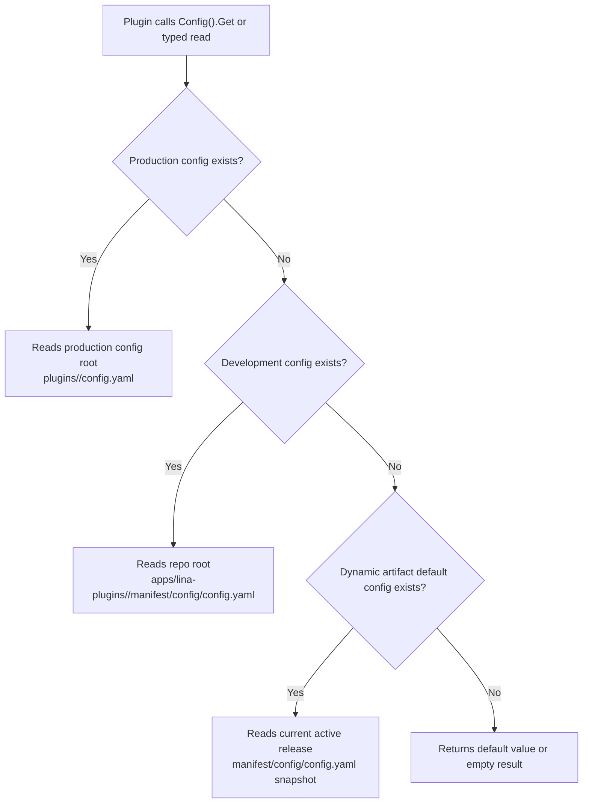

## Introduction

`LinaPro` uses a decoupled design for plugin configuration and `manifest` resources. Plugins can own their own configuration files and `manifest` resources without stuffing business configuration into the core framework `config.yaml` or requiring the core framework to add dedicated configuration fields for each plugin.

This design applies equally to source plugins and dynamic plugins:

- **Plugin configuration**: Lives in the plugin's own `manifest/config/config.yaml` and is read at runtime through the plugin-scoped `Config()` service.
- **Configuration template**: Lives in `manifest/config/config.example.yaml` and documents configurable items; it is not read as a runtime default.
- **Manifest resources**: Plugin-owned files under `manifest/` — such as `profile.yaml`, `resources/policy.yaml`, `config/config.example.yaml`, `sql/*.sql`, or `i18n/*.json` — read at runtime as raw bytes through the plugin-scoped `Manifest()` service.

Plugin configuration answers "how does this plugin run in the current deployment." Manifest resources answer "what resources does this plugin version carry, and how does the plugin read them." Both are owned by the plugin, but they have different lifecycles: configuration allows production overrides, while manifest resources are more closely tied to the plugin version.

## Directory Structure

A typical plugin directory looks like this:

```text
apps/lina-plugins/<plugin-id>/
├── plugin.yaml
├── manifest/
│   ├── config/
│   │   ├── config.yaml
│   │   └── config.example.yaml
│   ├── profile.yaml
│   ├── resources/
│   │   └── policy.yaml
│   ├── sql/
│   └── i18n/
└── backend/
```

| Path | Primary purpose | `Manifest()` read path |
|------|----------------|----------------------|
| `manifest/config/config.yaml` | Plugin default runtime configuration; `Config()` determines whether it takes effect as the default | `config/config.yaml` |
| `manifest/config/config.example.yaml` | Configuration template and documentation; not read as a runtime default | `config/config.example.yaml` |
| `manifest/profile.yaml` | Example custom `YAML` resource for the plugin | `profile.yaml` |
| `manifest/resources/*.yaml` | Plugin-owned custom resources | `resources/*.yaml` |
| `manifest/sql/` | Install, upgrade, and uninstall scripts; execution is determined by the lifecycle pipeline | `sql/*.sql` |
| `manifest/i18n/` | Plugin language packs; loading is determined by the i18n pipeline | `i18n/*.json` |

`Manifest()` read paths are always relative to `manifest/`. For example, to read `manifest/profile.yaml`, the call path should be `profile.yaml`, not `manifest/profile.yaml`.

## Configuration Read Order

The plugin configuration service reads only `config.yaml` within the current plugin scope, following this priority:



### Production Deployment Configuration Path

The production override configuration path is not a fixed repository-root path. It lives under the "production configuration path" for the plugin:

```text
<working-directory>/plugins/<plugin-id>/config.yaml
```

### Development-Time Default Configuration

During local development, the plugin default configuration lives directly in the plugin source directory:

```text
apps/lina-plugins/<plugin-id>/manifest/config/config.yaml
```

This lets plugin developers maintain the plugin's own default behavior, demo toggles, external service default addresses, or scheduling parameters inside the plugin directory. The core framework does not need to know which business configuration items each plugin has.

### Dynamic Plugin Default Configuration

When a dynamic plugin is built into a `.wasm` artifact, the build tool writes `manifest/config/config.yaml` into the dynamic artifact. At runtime, if there is no production override configuration and no development-time configuration file, the core framework uses the default configuration snapshot carried in the current active release.

This lets dynamic plugins carry a self-describing default configuration with each version, while still allowing production environments to override it with external configuration. After a plugin upgrade, the default configuration also switches with the active release version and does not depend on the source directory.

### Configuration Templates Do Not Participate in Reads

`manifest/config/config.example.yaml` is only for displaying configuration items and example values. It does not participate in runtime default value reads. Do not treat values that exist only in `config.example.yaml` as the plugin's runtime default configuration.

The recommended approach is:

```text
manifest/config/config.yaml          # Runnable default configuration
manifest/config/config.example.yaml  # Configuration template for operations or users
```

## HostServices Configuration Services

Plugins access plugin-scoped core framework services through `registrar.HostServices()`. Three services are primarily relevant to configuration and manifest resources:

| Service | Read scope | Typical use |
|---------|-----------|-------------|
| `Config()` | The current plugin's own configuration | Plugin business toggles, external system addresses, timeouts, scheduling parameters |
| `HostConfig()` | Allowlisted public host configuration | Workspace base path, default language, enabled languages, and a small number of public keys |
| `Manifest()` | Original resources under the current plugin's `manifest/` | Read `YAML`, `JSON`, `SQL`, configuration templates, and other files carried with the plugin version |

In a source plugin, you can read them like this:

```go
func registerRoutes(ctx context.Context, registrar pluginhost.HTTPRegistrar) error {
    services := registrar.HostServices()

    endpoint, err := services.Config().String(ctx, "sync.endpoint", "")
    if err != nil {
        return err
    }

    interval, err := services.Config().Duration(ctx, "sync.interval", 30*time.Second)
    if err != nil {
        return err
    }

    workspaceBase, err := services.HostConfig().String(ctx, "workspace.basePath", "/admin")
    if err != nil {
        return err
    }

    _ = endpoint
    _ = interval
    _ = workspaceBase
    return nil
}
```

Dynamic plugins access the same kind of `hostServices` through the `pluginbridge` guest-side capabilities. Dynamic plugins must first declare authorization in `plugin.yaml`:

```yaml
hostServices:
  - service: config
    methods: [get]
  - service: hostConfig
    methods: [get]
    resources:
      keys:
        - workspace.basePath
        - i18n.default
```

`config` reads only the current plugin's own configuration. `hostConfig` reads only allowlisted public host keys. Plugins should not scan the full host configuration tree through `g.Cfg()`, and should not require users to write plugin business configuration into the core framework `config.yaml`.

## Manifest Resources

Plugins can read original resources under the current plugin's `manifest/` through `Manifest()`. `Manifest().Get()` returns file bytes, `Manifest().Exists()` checks whether a file exists, and `Manifest().Scan()` scans a `YAML` resource — or a nested key within it — into a struct.

Custom declarative `YAML` is just one common use case for manifest resources. File names have no framework-level special semantics. `profile.yaml`, `resources/policy.yaml`, or any other team-conventioned name works as long as the path is safe. For example:

```yaml
category: content
display:
  icon: ant-design:file-text-outlined
  accentColor: '#1677ff'
features:
  import: true
  export: true
external:
  provider: example-cms
  docsUrl: https://example.com/docs
```

### Read Sources

Source plugins and dynamic plugins read from different sources, but the path semantics are the same: call paths are always relative to the current plugin's `manifest/` root directory.

| Plugin type | `Manifest()` read source | Boundary |
|-------------|--------------------------|----------|
| Source plugin | Current plugin's bound embedded filesystem; falls back to the repository development directory `apps/lina-plugins/<plugin-id>/manifest/` when missing | Can only read the current plugin's own `manifest/` resources; does not read the host or other plugin directories |
| Dynamic plugin | `manifest/` resource snapshot carried in the current active release artifact | Must pass the `plugin.yaml` `service: manifest` and `resources.paths` authorization snapshot validation |

After a dynamic plugin upgrade, rollback, or same-version refresh, `Manifest()` sees the resource snapshot bound to the current active release. This ensures that the original resources a dynamic plugin reads are consistent with the actually-effective release version.

### YAML Convenience Scan

When reading custom `YAML` resources, you can use `Manifest().Scan()`:

```go
type PluginProfile struct {
    Category string `yaml:"category"`
    Display  struct {
        Icon        string `yaml:"icon"`
        AccentColor string `yaml:"accentColor"`
    } `yaml:"display"`
    Features struct {
        Import bool `yaml:"import"`
        Export bool `yaml:"export"`
    } `yaml:"features"`
}

func loadProfile(ctx context.Context, services pluginhost.Services) (*PluginProfile, error) {
    profile := &PluginProfile{}
    if err := services.Manifest().Scan(ctx, "profile.yaml", "", profile); err != nil {
        return nil, err
    }
    return profile, nil
}
```

You can also scan only a nested key:

```go
var features struct {
    Import bool `yaml:"import"`
    Export bool `yaml:"export"`
}

if err := services.Manifest().Scan(ctx, "profile.yaml", "features", &features); err != nil {
    return err
}
```

You can also read raw text or byte content:

```go
content, err := services.Manifest().Get(ctx, "config/config.example.yaml")
if err != nil {
    return err
}
if len(content) > 0 {
    _ = string(content)
}
```

### Dynamic Plugin Authorization

Dynamic plugins that want to read `manifest` resources must also declare the resource scope in `plugin.yaml`:

```yaml
hostServices:
  - service: manifest
    methods: [get]
    resources:
      paths:
        - profile.yaml
        - resources/*.yaml
        - config/config.example.yaml
        - sql/*.sql
        - i18n/zh-CN/*.json
```

Dynamic plugin `manifest` resource paths support exact paths and controlled glob patterns. Paths are still relative to `manifest/` — do not write `manifest/profile.yaml`.

Source plugins do not perform additional authorization through `plugin.yaml`'s `resources.paths`, because source plugins are compiled and delivered with the host and are considered trusted extensions. However, source plugins are still subject to path safety constraints and plugin-scope constraints. Dynamic plugins接入 through `WASM` and must explicitly declare and receive host confirmation before reading corresponding paths.

### Dedicated Directory Raw Reads

`Manifest()` reads the raw file content. It does not cause these files to automatically "take effect." For example:

| Read path | What you get through `Manifest()` | How it actually takes effect |
|-----------|-----------------------------------|------------------------------|
| `config/config.yaml` | Raw content of the configuration file carried with the source code or dynamic artifact | Runtime configuration is still read by `Config()` in the production → development → dynamic default priority order |
| `config/config.example.yaml` | Configuration template raw text | Serves only as a template and documentation; does not participate in default value reads |
| `sql/*.sql` | Install, upgrade, or uninstall script text | Whether to execute is determined by the plugin lifecycle pipeline |
| `i18n/*.json` | Plugin language pack raw text | Whether to load is determined by the i18n pipeline |

Therefore, `Manifest()` is suited for resource inspection, preview, diagnostics, custom parsing, or plugin-internal personalization logic. Do not use it as the entry point for executing `SQL`, loading language packs, or overriding runtime configuration.

### Path Safety

`Manifest()` accepts only slash paths relative to the current plugin's `manifest/` root directory. The following patterns are rejected:

| Invalid path | Rejection reason |
|-------------|-----------------|
| `manifest/profile.yaml` | Duplicate `manifest/` prefix |
| `../other-plugin/profile.yaml` | Attempts to escape the current plugin's `manifest/` directory |
| `/etc/passwd` | Absolute path |
| `C:\secret.yaml` | Windows drive path |
| `https://example.com/config.yaml` | URL — would not trigger a network read |

When reading a missing resource, `Get()` returns empty content, `Exists()` returns `false`, and `Scan()` does not modify the target struct. Plugins should decide based on their own business semantics whether a missing resource is an acceptable fallback or an error.

## Design Benefits

### Plugin and Core Framework Configuration Decoupling

The core framework publishes only stable plugin-scoped read services. It does not need to add configuration structs for each plugin. When a plugin adds new configuration items, it only needs to update its own `config.yaml`, `config.example.yaml`, and read logic.

### Independent Production Overrides

Production environments can maintain `plugins/<plugin-id>/config.yaml` under an external configuration root, avoiding direct modification of the plugin source directory. For container and multi-environment deployments, this approach is easier to mount, audit, and roll back.

### Dynamic Plugins Carry Default Configuration with the Version

A dynamic plugin's default configuration is bound to the `.wasm` active release version. When the plugin is upgraded, rolled back, or refreshed at the same version, the core framework uses the current active release's resource snapshot and does not depend on the developer's local directory.

### Raw Reads Do Not Replace Dedicated Pipelines

`Manifest()` can read original resources under `manifest/`, but configuration, `SQL`, and language packs are still governed by their respective dedicated pipelines at runtime. This lets plugins inspect the files they carry with their version when needed, while preventing "reading a file" from being confused with "making the file take effect."

## Common Mistakes

| Mistake | Correct approach |
|---------|-----------------|
| Writing plugin business configuration into the core framework `config.yaml` | Write it into the plugin's own `manifest/config/config.yaml`; use the production config root's `plugins/<plugin-id>/config.yaml` for production overrides |
| Relying on `config.example.yaml` for default values | Write real default values into `config.yaml`; use the template only for documentation |
| Reading `config/config.yaml` through `Manifest()` and treating it as the current runtime configuration | Use `Config()` to read the plugin's runtime configuration; `Manifest()` only returns raw file content |
| Reading `sql/` or `i18n/` through `Manifest()` and expecting automatic execution or loading | Let the plugin lifecycle and i18n pipelines handle these resources; `Manifest()` is only responsible for reading the raw content |
| Passing `manifest/profile.yaml` when calling `Manifest()` | Pass the relative path `profile.yaml` |
| Dynamic plugins requesting broad `manifest` access scope | Declare only the paths you actually need to read, such as `profile.yaml`, `config/config.example.yaml`, or `resources/*.yaml` |
