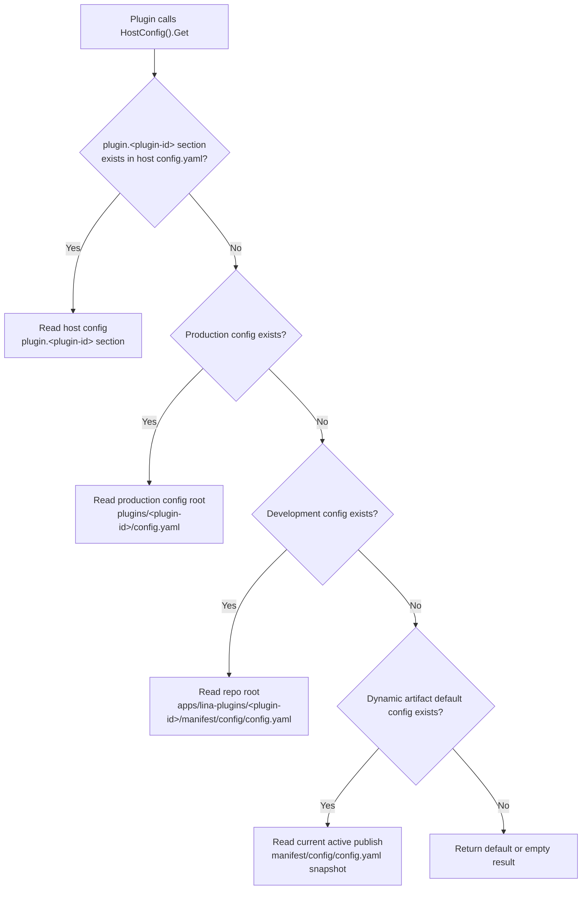
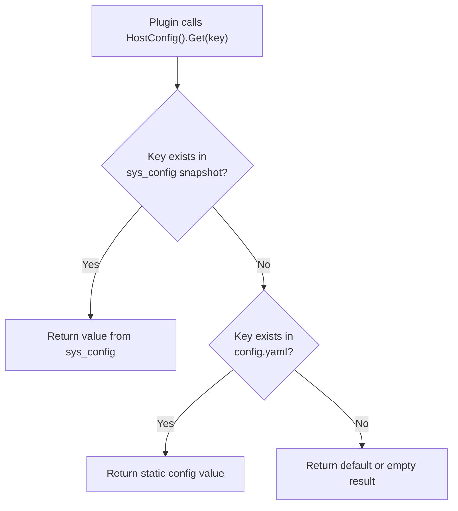

## Introduction

The main framework `config.yaml` only stores main framework static runtime configuration, not plugin business configuration. Plugins should read their own configuration through the plugin-scoped configuration service, achieving configuration isolation and independent management.

Beyond static configuration, the main framework also provides a runtime parameter storage mechanism based on the database `sys_config` table. `sys_config` is a **generic runtime key-value store** — the main framework uses it to manage built-in system parameters, and plugins can similarly register and read custom runtime parameters in it. All entries are accessible through the `HostConfig()` service.

## Configuration Read Priority

Plugin business configuration reads use an **exclusive priority** strategy — multiple config sources are not merged; the first source providing a valid value is the final result. Priority from high to low:

| <span style={{whiteSpace: 'nowrap'}}>Priority</span> | Source | Path | Applicable To |
|:---:|--------|------|---------------|
| 1 | Host config file | `plugin.<plugin-id>` section in main framework `config.yaml` | All plugins |
| 2 | Production config file | `<productionRoot>/plugins/<plugin-id>/config.yaml` | All plugins |
| 3 | Development config file | `apps/lina-plugins/<plugin-id>/manifest/config/config.yaml` | Source plugins |
| 4 | Artifact embedded config | Default config embedded in dynamic plugin publish artifact | Dynamic plugins |

:::warning Exclusive Override, Not Merge
When a `plugin.<plugin-id>` section exists in the host `config.yaml`, that section is the **sole source** for that plugin's configuration — even if it lacks certain sub-keys, it will not fall back to file config to fill them. For example: the production config file defines `storage.endpoint` and `storage.region`, but the host config only overrides `storage.endpoint` — then `storage.region` will not be read from the file but will return the caller's default value. Even an empty `plugin.<plugin-id>: {}` object will prevent fallback to file config.
:::

`manifest/config/config.example.yaml` is only a template file and does not serve as runtime defaults.



## `plugin.<plugin-id>` Configuration

The `plugin.<plugin-id>` section in the host `config.yaml` can directly override any plugin's business configuration. This mechanism applies to scenarios requiring deployment-level unified control of plugin behavior, such as: forcing overrides of development environment defaults, specifying differentiated configs for different deployment environments, or temporarily adjusting plugin parameters without modifying the plugin's own config file.

### Configuration Structure

The `plugin.<plugin-id>` section maintains the same key structure as the plugin's own `config.yaml`. The plugin identifier (`<plugin-id>`) serves as the first-level key, and its sub-keys directly correspond to the plugin's internal configuration items:

```yaml
plugin:
  # Framework-level plugin management configuration
  allowForceUninstall: true
  dynamic:
    storagePath: "/app/data/wasm"
  autoEnable:
    - id: "linapro-ai-core"
      withMockData: false

  # Plugin business configuration overrides — plugin identifier as first-level key
  linapro-demo-source:
    demo:
      greeting: "Hello from host override"
      featureEnabled: false
```

In the above example, `linapro-demo-source` is the plugin identifier, and `demo.greeting` and `demo.featureEnabled` are the plugin's internal business configuration keys. The framework parses `plugin.linapro-demo-source` as the plugin's configuration root, so when the plugin reads via `config.Get(ctx, "demo.greeting")`, it gets the overridden value.

### Use Cases

| Scenario | Description |
|----------|-------------|
| Deployment environment differentiation | Different environments (dev, test, prod) each declare plugin config in their own `config.yaml`, without modifying the plugin's bundled defaults |
| Centralized control | Ops engineers manage all plugins' key parameters through the host config file, avoiding dispersal across plugin directories |
| Temporary debugging | Temporarily override a plugin's config item during troubleshooting; remove the override section to restore default behavior |

:::caution Configuration Exclusivity
Once a `plugin.<plugin-id>` section is declared in the host `config.yaml`, the plugin's file-level configs (production config, development config, artifact embedded config) are completely ignored. To preserve some file config values, all needed configuration items must be fully replicated in the `plugin.<plugin-id>` section.
:::

### Production Config File Path Resolution

The `productionRoot` in the production config file `<productionRoot>/plugins/<plugin-id>/config.yaml` is resolved in the following priority:

| <span style={{whiteSpace: 'nowrap'}}>Priority</span> | Source | Description |
|:---:|--------|-------------|
| 1 | Factory explicit specification | Path injected during framework initialization |
| 2 | `GF_GCFG_PATH` environment variable | Config directory path environment variable |
| 3 | Repository root + `apps/lina-core/manifest/config` | Default location in development repository |
| 4 | Executable directory + `config` | Relative path fallback for deployment scenarios |

## Plugin Configuration Reading Methods

### Source Plugins

Source plugins read their own configuration through `HostServices().Config()`. This provides full configuration access capability — plugins can read all configuration items within their own scope.

### Dynamic Plugins

Dynamic plugins read configuration after declaring `service: config` and `methods: [get]` in `hostServices`. Dynamic plugin configuration access is more strictly limited, only able to access explicitly authorized configuration methods.

## Accessing Main Framework Configuration Content

Beyond reading their own scoped configuration, plugins sometimes need to access the main framework's global configuration. Main framework configuration is divided into two types: static configuration (from `config.yaml` file) and runtime parameters (from database `sys_config` table). The two plugin types have significant differences when accessing host configuration.

### Runtime Parameters (sys_config)

The `sys_config` table is a generic runtime key-value store that supports dynamically adjusting parameters at runtime without restarting the service. Entries in this table are divided into two types:

- **Main framework built-in parameters** — System-level parameters predefined and managed by the main framework, with defaults and validation rules; `is_builtin` marked as `1`.
- **Plugin custom parameters** — Runtime parameters registered by business plugins, with key names and values defined by the plugin; `is_builtin` marked as `0`.

Both types are read through the `HostConfig()` service in the same way; the main framework does not distinguish parameter sources.

#### Main Framework Built-in Parameters

Parameters with `is_builtin` attribute `1` are managed by the main framework. These parameter key names use the `sys.` prefix, and built-in parameter key names cannot be renamed or deleted, with their values subject to format validation. Plugin custom parameters should avoid using these prefixes to prevent conflicts with built-in parameters.

#### Plugin Custom Parameters

Business plugins can register custom runtime parameters in the `sys_config` table, typically declared as initial data by the plugin's install `SQL` file and managed at runtime through the `AdminServices.HostConfig()` interface. These parameters are stored in the same table as built-in parameters and read through the `HostConfig()` service in exactly the same way.

##### SQL File Initial Parameter Declaration

Plugins execute `SQL` files in the `manifest/sql/` directory during installation. Plugins can directly insert custom runtime parameters into the `sys_config` table in install `SQL`, suitable for declaring initial configuration values needed by the plugin.

```sql
-- manifest/sql/001-my-plugin-config.sql
-- Plugin custom runtime parameters — automatically written to sys_config table on install
INSERT INTO sys_config ("tenant_id", "name", "key", "value", "is_builtin", "remark", "created_at", "updated_at") VALUES
(0, 'API Gateway URL', 'my-plugin.api.endpoint', 'https://api.example.com', 0, 'Third-party API gateway URL', NOW(), NOW()),
(0, 'Max Retry Count', 'my-plugin.retry.max', '3', 0, 'Max retries on request failure', NOW(), NOW()),
(0, 'Debug Mode', 'my-plugin.debug.enabled', 'false', 0, 'Whether to enable debug log output', NOW(), NOW())
ON CONFLICT DO NOTHING;
```

Key constraints for the `SQL` method:

| Constraint | Description |
|------------|-------------|
| `is_builtin` | Must be set to `0`, marking as plugin custom parameter rather than main framework built-in |
| `tenant_id` | Set to `0` for platform-level default; multi-tenant scenarios can insert override values by tenant ID |
| `ON CONFLICT DO NOTHING` | Idempotent protection; repeated installs won't overwrite existing runtime values |
| Key name prefix | Recommended to use **plugin identifier** as prefix (e.g., `my-plugin.`) to avoid conflicts with built-in parameters or other plugins |

##### AdminServices.HostConfig() Runtime Management

Source plugins can batch query and update existing runtime parameters at runtime through the `AdminServices.HostConfig()` interface. This is suitable for dynamic config reads/writes within plugin business logic.

| Method | Description |
|--------|-------------|
| `BatchGetRuntimeConfig(ctx, capCtx, keys)` | Batch query runtime parameters, returning visible parameter projections and missing key list |
| `SetRuntimeConfigJSON(ctx, capCtx, key, valueJSON)` | Update existing runtime parameter value; automatically advances shared revision number after write to trigger snapshot refresh |

```go
// Batch read runtime parameters
result, err := services.Admin().HostConfig().BatchGetRuntimeConfig(ctx, capCtx,
    []hostconfigcap.RuntimeConfigKey{
        "my-plugin.api.endpoint",
        "my-plugin.retry.max",
    },
)
for key, proj := range result.Items {
    fmt.Printf("%s = %s\n", key, string(proj.ValueJSON))
}
// result.MissingIDs contains keys that don't exist in the table

// Update existing parameter value (key must already exist in sys_config table)
err = services.Admin().HostConfig().SetRuntimeConfigJSON(ctx, capCtx,
    "my-plugin.api.endpoint",
    []byte(`"https://new-api.example.com"`),
)
```

:::caution SetRuntimeConfigJSON Only Updates, Doesn't Create
`SetRuntimeConfigJSON` can only update keys that **already exist** in the `sys_config` table. If a key doesn't exist, the interface returns a permission denied error. Therefore, initial plugin parameters should be declared via `SQL` files, with subsequent value updates through `SetRuntimeConfigJSON`.
:::

##### Reading Parameters

Regardless of how parameters are registered, reads are uniformly completed through the `HostConfig()` service. The read flow: first look up in the `sys_config` runtime snapshot; if hit, return; if miss, fall back to `config.yaml` static configuration.



:::tip Runtime Parameters Take Precedence Over Static Config
When a key in `sys_config` shares the same name as a static config in `config.yaml`, the `sys_config` value takes precedence. For example: `config.yaml` has `jwt.expire: 12h`, but `sys_config` has `sys.jwt.expire: 24h` — the effective JWT expiration is `24` hours.
:::

### Source Plugins: Unrestricted Access

Source plugins obtain the `HostConfig()` service instance through `pluginhost.Services` and can read **any key** in `sys_config` (including built-in parameters and plugin custom parameters), as well as **any static config key** in `config.yaml`. The main framework does no filtering or interception on key names — source plugins have the same configuration read permissions as main framework internal modules.

Source plugin reading runtime parameters example:

```go
// Read main framework built-in parameters
jwtExpire, err := services.HostConfig().Duration(ctx, "sys.jwt.expire", 24*time.Hour)
uploadMaxSize, err := services.HostConfig().Int(ctx, "sys.upload.maxSize", 100)

// Read plugin custom parameters
apiEndpoint, err := services.HostConfig().String(ctx, "my-plugin.api.endpoint", "")
maxRetries, err := services.HostConfig().Int(ctx, "my-plugin.retry.max", 3)
debugMode, err := services.HostConfig().Bool(ctx, "my-plugin.debug.enabled", false)

// Generic read — first check sys_config snapshot, fall back to config.yaml on miss
rawValue, err := services.HostConfig().Get(ctx, "my-plugin.some.key")

// Check if config key exists (prioritizes sys_config)
exists, err := services.HostConfig().Exists(ctx, "my-plugin.some.key")
```

### Dynamic Plugins: Declarative Whitelist

Dynamic plugin host configuration access is subject to strict whitelist constraints. Plugins must declare `service: hostConfig` in `plugin.yaml`'s `hostServices` and explicitly list allowed configuration keys through `resources.keys`. The whitelist applies to both `sys_config` runtime parameters and `config.yaml` static config keys. The main framework performs multi-layer validation on declarations during plugin install and runtime:

1. **Manifest validation** — At plugin install, the main framework checks the `hostConfig` declaration in `plugin.yaml` for completeness, requiring at least one key and disallowing empty keys or root path `.`.
2. **Capability check** — Before each runtime call, verifies the plugin has the `host:hostconfig` capability.
3. **Key-level auth** — When a call arrives, the main framework retrieves the declared key set from the plugin's authorization snapshot; only keys matching the whitelist are allowed for reading.

Below is an example of a dynamic plugin declaring a whitelist in `plugin.yaml` — declaring both main framework built-in parameters and plugin custom parameters:

```yaml
hostServices:
  - service: hostConfig
    methods:
      - get
    resources:
      keys:
        # Main framework static configuration
        - workspace.basePath
        - i18n.default
        - i18n.enabled
        # Main framework built-in runtime parameters
        - sys.jwt.expire
        - sys.upload.maxSize
        # Plugin custom runtime parameters
        - my-plugin.api.endpoint
        - my-plugin.retry.max
```

:::caution Whitelist Covers All Config Sources
Whitelist key names apply uniformly to `sys_config` runtime parameters and `config.yaml` static config — the main framework first looks up in the `sys_config` snapshot, falling back to static config on miss. Keys not declared in the whitelist will be denied access, regardless of whether stored in `sys_config` or `config.yaml`.
:::

## Configuration Isolation Design

The isolation design between plugin and main framework configuration follows these principles:

1. **Independent management** — Plugin configuration is managed by the plugin itself, independent of main framework configuration
2. **Scope isolation** — Each plugin has an independent configuration scope, avoiding configuration conflicts
3. **Tiered access** — Source plugins can read all host configuration; dynamic plugins use declarative whitelists to limit accessible config keys, balancing flexibility and security
4. **Exclusive override** — The host can override plugin configuration via the `plugin.<plugin-id>` section, but once present, that section becomes the sole source — file config no longer participates in resolution
5. **Runtime shared storage** — The `sys_config` table serves as a generic runtime parameter store where both main framework and plugins can register custom parameters, accessed uniformly through the `HostConfig()` service, taking effect without restart

This design allows plugins to configure and run independently without affecting the main framework — managing static defaults through file-level configuration, managing dynamically adjustable runtime parameters through `sys_config`, and providing clear semantics for deployment-level centralized control through the exclusive override mechanism.
