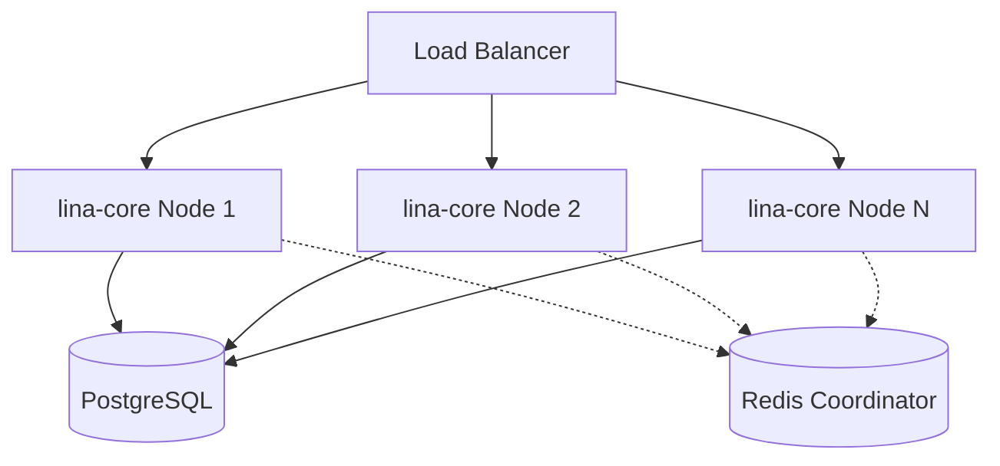
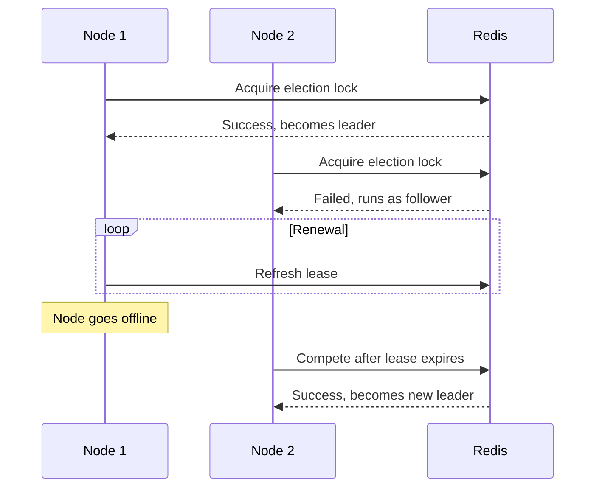
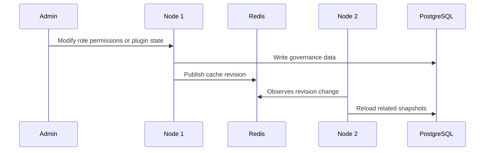
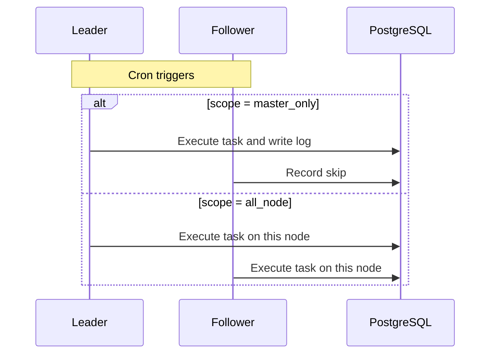

## Overview

`LinaPro`'s distributed capabilities are built into the core host service. Development environments and small-scale deployments can use single-node mode; when business scale grows, enable cluster mode through configuration. Multiple host nodes share the same `PostgreSQL` database and use `Redis` for cross-node coordination.

Business code, plugin code, and the frontend workspace do not need to be rewritten when switching from single-node to cluster mode. What changes is the deployment topology and `cluster` configuration.

## Single-Node Mode

Single-node mode is the default:

```yaml
cluster:
  enabled: false
```

Single-node mode does not require `Redis`. The host process uses local caching, local locks, and `PostgreSQL` for development, testing, and small-scale operation.

```text
┌─────────────────────┐
│      lina-core      │
│   single process    │
└──────────┬──────────┘
           │
      ┌────▼─────┐
      │PostgreSQL│
      └──────────┘
```

## Cluster Mode

Enable cluster mode:

```yaml
cluster:
  enabled: true
  coordination: redis
  election:
    lease: 30s
    renewInterval: 10s
  redis:
    address: "127.0.0.1:6379"
    db: 0
    password: ""
```

The current version only supports `Redis` as the coordination backend. `PostgreSQL` continues to handle business data, governance data, and plugin state persistence; `Redis` handles leader election, distributed locks, cache revision, and cross-node events.



## Leader Election

In cluster mode, nodes elect a leader through `Redis`. The leader holds an election lock with a lease and renews it at `renewInterval`. If the leader exits abnormally, other nodes compete to become the new leader after the lease expires.



`lease` is recommended at around `30s`; `renewInterval` should be one-third of the lease duration.

## Node Responsibilities

All nodes can handle `HTTP` requests. The leader additionally handles work that requires global coordination.

| Responsibility | Leader | Follower |
|----------------|--------|----------|
| Handle business and plugin `API` | Yes | Yes |
| Read permission and menu cache | Yes | Yes |
| Execute `master_only` tasks | Yes | Skip |
| Execute `all_node` tasks | Yes | Yes |
| Publish certain global maintenance events | Yes | Not responsible |
| Participate in plugin runtime upgrade lock contention | Yes | Yes |

## Cache Revision and Permission Sync

Permission topology, plugin runtime snapshots, frontend packages, `WASM` modules, and i18n resources may all be cached. In cluster mode, nodes sense changes through shared revision numbers or event broadcasts and refresh local caches on the read path.



This mechanism avoids querying the database on every request while ensuring that permission, menu, and plugin state changes converge across all nodes.

## Distributed Locks

The host provides a unified lock capability. In single-node mode it degrades to a local lock; in cluster mode it uses the distributed lock provided by the coordination backend. Plugin runtime upgrades, critical maintenance tasks, and any process requiring global mutual exclusion can all reuse this capability.

The design goal of distributed locks is not to replace database transactions, but to protect runtime orchestration processes that must have only one executor across the cluster.

## Key-Value Cache

Key-value cache is used to store short-lived state, version numbers, and runtime snapshots. In cluster mode, cache writes and invalidation must be scoped to avoid full flushes that affect unrelated languages, plugins, or tenants.

Common cache objects include:

- Permission topology version
- Online session state
- Plugin runtime snapshots
- Plugin frontend packages and `WASM` modules
- Runtime language packs

## Scheduled Task Execution

Persistent tasks support two execution scopes:

| Scope | Behavior | Use case |
|-------|----------|----------|
| `master_only` | Only the current leader executes; followers record a skip | Data archival, statistics aggregation, global cleanup |
| `all_node` | Every node executes | Local cache refresh, node self-check |



Task execution results are written to the shared database and can be viewed from the admin workspace on any node.

## Scaling Process

Scaling from single-node to cluster typically follows these steps:

1. Prepare a shared `PostgreSQL` database.
2. Prepare an accessible `Redis` instance.
3. Set `cluster.enabled` to `true` and configure `cluster.coordination: redis` and `cluster.redis` endpoints.
4. Start multiple `lina-core` nodes pointing to the same database.
5. Add all host nodes to the load balancer.
6. Verify `/health`, login, menus, plugin state, task scheduling, and permission change synchronization.

## Design Boundaries

- Cluster coordination currently only supports `Redis`.
- `SQLite` is only for single-node local demos or smoke verification — it does not support clustering.
- Distributed capabilities do not change the business `API` contract; business code should still access data through stable services published by the host and plugins.
- High availability also requires external load balancing, database reliability, and `Redis` reliability to work together.
