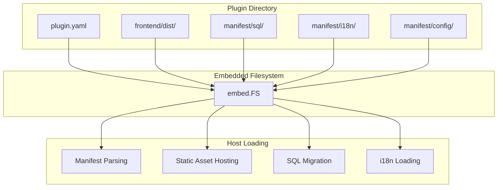

## Introduction

`Assets()` is the asset declaration entry point for source plugins. It binds the plugin's embedded filesystem through `UseEmbeddedFiles()`. The embedded filesystem contains the plugin's manifest files, frontend pages, SQL migration scripts, and i18n resources. The host loads these resources at startup to complete plugin integration. Dynamic plugins embed resources through WASM custom sections and do not require explicit binding.

**Capability Phase**: Declaration

**Supported Plugin Types**: Source plugins only

## Capability Design

### Resource Directory Structure

The standard plugin directory structure is as follows:

```text
apps/lina-plugins/<plugin-id>/
├── plugin.yaml              # Plugin manifest               [embedded]
├── backend/                 # Backend Go code               [compiled, not embedded]
│   ├── plugin.go            # Registration entry point
│   └── internal/            # Business logic
├── frontend/                # Frontend resources            [embedded]
│   └── dist/                # Build artifacts
└── manifest/                # Manifest resources            [embedded]
    ├── sql/                 # SQL migration scripts
    │   ├── install.sql      # Installation script
    │   ├── uninstall.sql    # Uninstallation script
    │   └── mock.sql         # Mock data script
    ├── i18n/                # Internationalization resources
    │   ├── zh-Hans.yaml
    │   └── en.yaml
    └── config/              # Configuration templates
        ├── config.yaml      # Default configuration
        └── config.example.yaml  # Configuration example
```

### Embedded Filesystem Binding

Source plugins embed static resources into the binary via `UseEmbeddedFiles()`. The embedding scope covers only the manifest files, frontend resources, and the `manifest/` directory's operational resources -- backend Go source code is excluded:



### Resource Types

| Resource Type | Directory | Description |
|---------------|-----------|-------------|
| Manifest file | `plugin.yaml` | Plugin identity, dependencies, menus, permissions, and other declarations |
| Frontend resources | `frontend/dist/` | Frontend build artifacts, hosted by the host at `/x-assets/{plugin-id}/{version}/` |
| SQL migration | `manifest/sql/` | Installation, uninstallation, and mock data scripts; must be idempotent |
| i18n resources | `manifest/i18n/` | Multilingual translation files |
| Configuration templates | `manifest/config/` | Plugin default configuration and configuration examples |

### Frontend Resource Hosting

The host serves plugin frontend resources under the `/x-assets/{plugin-id}/{version}/` path. Plugins declare directories to be hosted through the `public_assets` field in `plugin.yaml`:

```yaml
public_assets:
  - source: frontend/dist
    mount: /
    index: index.html
```

| Field | Description |
|-------|-------------|
| `source` | Source directory path within the plugin |
| `mount` | Mount path |
| `index` | Default index file |

### SQL Migration Scripts

SQL migration scripts are located in the `manifest/sql/` directory. The host executes them during plugin installation and uninstallation:

| Script | Execution Timing | Description |
|--------|------------------|-------------|
| `install.sql` | Plugin installation | Creates table structures and initializes data |
| `uninstall.sql` | Plugin uninstallation | Cleans up table structures and data |
| `mock.sql` | Development environment | Inserts mock data |

SQL scripts must be idempotent, using `IF NOT EXISTS` or `IF EXISTS` to ensure repeated execution does not cause errors. Tables for multi-tenant plugins must include a `tenant_id` column.

### Internationalization Resources

Internationalization resources are located in the `manifest/i18n/` directory in YAML format:

```yaml
# manifest/i18n/zh-Hans.yaml
menu:
  dashboard: 仪表盘
  reports: 报表
  settings: 设置

messages:
  welcome: 欢迎使用
  error.notFound: 未找到资源
```

```yaml
# manifest/i18n/en.yaml
menu:
  dashboard: Dashboard
  reports: Reports
  settings: Settings

messages:
  welcome: Welcome
  error.notFound: Resource not found
```

The host loads internationalization resources when the plugin is enabled for runtime translation use.

## Interface Definition

### Source Plugin Interface

Source plugins declare their embedded filesystem through `Assets()`:

| Method | Description |
|--------|-------------|
| `UseEmbeddedFiles` | Binds the plugin's embedded filesystem |

`AssetDeclarations` interface definition:

```go
type AssetDeclarations interface {
    UseEmbeddedFiles(fileSystem fs.FS)
}
```

### Dynamic Plugin Resource Management

Dynamic plugins embed resources through WASM custom sections without explicit binding. The build tool automatically embeds the following resources into the `.wasm` artifact:

| Custom Section | Content |
|----------------|---------|
| `lina.plugin.manifest` | Plugin identity manifest |
| `lina.plugin.frontend.assets` | Frontend resources |
| `lina.plugin.i18n.assets` | Internationalization resources |
| `lina.plugin.apidoc.i18n.assets` | API documentation i18n resources |
| `lina.plugin.install.sql` | Installation SQL script |
| `lina.plugin.uninstall.sql` | Uninstallation SQL script |
| `lina.plugin.mock.sql` | Mock data SQL script |
| `lina.plugin.manifest.resources` | Manifest resource files |

## Usage

### Source Plugin Usage

Source plugins bind their embedded filesystem in `init()` through `Assets()`:

```go
package main

import (
    "embed"

    "lina-core/pkg/plugin/pluginhost"
)

//go:embed plugin.yaml all:manifest all:frontend/dist
var pluginFS embed.FS

func init() {
    plugin := pluginhost.NewDeclarations("my-author-my-domain-my-cap")
    plugin.Assets().UseEmbeddedFiles(pluginFS)

    if err := pluginhost.RegisterSourcePlugin(plugin); err != nil {
        panic(err)
    }
}
```

### Embedded Filesystem Access

The host accesses the plugin's embedded filesystem through `SourcePluginDefinition.GetEmbeddedFiles()`:

```go
// Read plugin manifest
manifestData, err := fs.ReadFile(embeddedFS, "plugin.yaml")

// Read SQL script
installSQL, err := fs.ReadFile(embeddedFS, "manifest/sql/install.sql")

// Read internationalization resources
i18nData, err := fs.ReadFile(embeddedFS, "manifest/i18n/zh-Hans.yaml")
```

### Dynamic Plugin Resource Management

Dynamic plugin resources are automatically embedded into the `.wasm` artifact at build time. The build tool scans the plugin directory and generates corresponding custom sections:

```bash
# Build a dynamic plugin
make wasm p=my-plugin
```

The build tool automatically:
1. Reads `plugin.yaml` and embeds the `lina.plugin.manifest` section
2. Scans `frontend/dist/` and embeds the `lina.plugin.frontend.assets` section
3. Scans `manifest/i18n/` and embeds the `lina.plugin.i18n.assets` section
4. Scans `manifest/sql/` and embeds the corresponding SQL sections
5. Scans `manifest/resources/` and embeds the `lina.plugin.manifest.resources` section

## Design Constraints

- **`Assets()` is limited to source plugins.** Dynamic plugins embed resources through WASM custom sections and do not require explicit binding.
- **The embedded filesystem is read-only.** Plugins cannot modify embedded resources at runtime.
- **SQL scripts must be idempotent.** Use `IF NOT EXISTS` or `IF EXISTS` to ensure repeated execution does not cause errors.
- **Multi-tenant tables require a `tenant_id` column.** The host checks table structures for tenant-aware plugins.
- **Frontend resources are hosted by the host.** Plugins should not self-host static resources; they should declare them through `public_assets`.
- **Internationalization resources use YAML format.** The host uniformly parses i18n files in YAML format.

## Related Documentation

- [Declaration Capabilities Overview](/docs/declaration-capabilities)
- [Plugin Manifest](/docs/declaration-assets)
- [Source Plugin Development](/docs/source-plugins)
- [Internationalization Capability](/docs/domain-capability-i18n)
