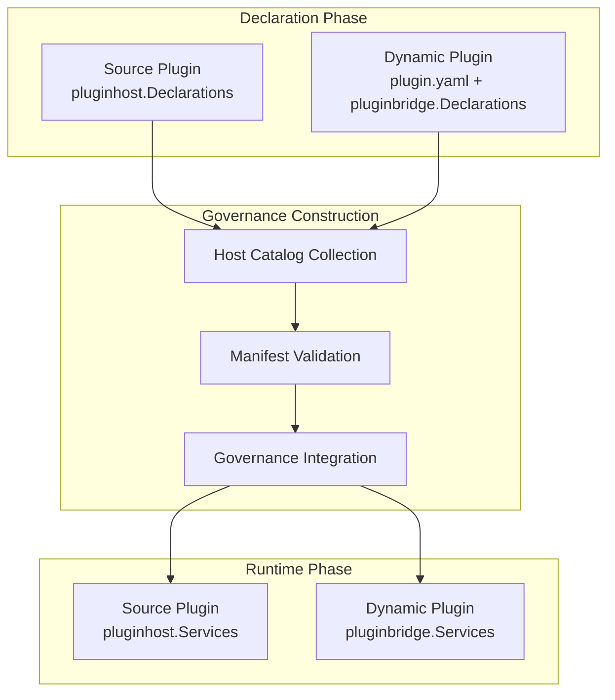
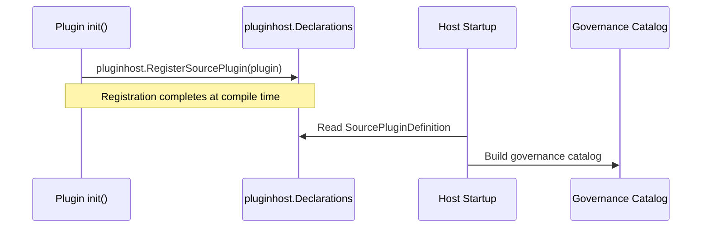
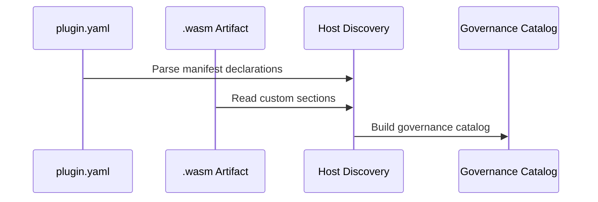

## Introduction

Plugin capabilities are divided into two phases: declaration and runtime. The declaration phase handles static registration and discovery, during which the host framework builds governance state from plugin declarations before any business logic runs. The runtime phase is when plugin business logic executes and consumes domain capability services provided by the host.

## Capability Design

### Declaration vs. Runtime Phases

| Phase | Description |
|-------|-------------|
| Declaration | Plugins register their identity, dependencies, capability requests, and callback handlers with the host; the host collects declarations and builds a governance catalog |
| Governance Construction | The host validates manifest legality, resolves dependencies, executes installation SQL, and builds runtime caches |
| Runtime | Plugin business logic executes and consumes domain capability services provided by the host |

### Source Plugin Declaration Mechanism

Source plugins register declarations through the `pluginhost.Declarations` interface in their `init()` function. This is a compile-time Go registration; the host scans all registered source plugin definitions at startup and builds the governance catalog.

Source plugins support the following declaration entry points:

| Entry Point | Description |
|-------------|-------------|
| `ID()` | Returns a stable plugin identifier consistent with `plugin.yaml` |
| `Assets()` | Binds the plugin's embedded filesystem |
| `Lifecycle()` | Registers lifecycle callbacks such as install, upgrade, disable, and uninstall |
| `Hooks()` | Subscribes to host framework extension point events |
| `HTTP()` | Registers HTTP route contribution callbacks |
| `Jobs()` | Registers scheduled job contribution callbacks |
| `Providers()` | Declares domain capability provider factories |
| `Access()` | Registers menu and permission filter callbacks |

### Dynamic Plugin Declaration Mechanism

Dynamic plugins express declarations through `plugin.yaml` manifest files and custom sections within `.wasm` artifacts. The host parses manifests and artifact metadata during the discovery phase to build the governance catalog.

Dynamic plugins support the following declaration sources:

| Source | Description |
|--------|-------------|
| `plugin.yaml` | Declares plugin identity, version, dependencies, menus, permissions, multi-tenant policies, public static assets, and `hostServices` authorization requests |
| `Routes()` | Declares route group bindings with API prefix and route packages |
| `Jobs()` | Registers scheduled job contracts via host-service calls |
| `WASM` custom sections | Embeds metadata in `.wasm` artifacts including ABI version, runtime type, codec, and exported function names |
| `protocol.BridgeSpec` | Defines the bridge ABI contract including version number, runtime type, codec method, and export names |

### Declaration Capability Directory

| Capability | Source Plugin | Dynamic Plugin | Description |
|------------|---------------|----------------|-------------|
| [Assets](/docs/declaration-assets) | `Assets()` | `WASM` custom sections | Embedded filesystem binding, including manifest, frontend, SQL, and i18n resources |
| [Lifecycle](/docs/declaration-lifecycle) | `Lifecycle()` | `LifecycleContract` | Callback registration for install, upgrade, disable, uninstall, and more |
| [Routes](/docs/declaration-routes) | `HTTP()` | `Routes()` | HTTP route contribution and route group bindings |
| [Jobs](/docs/declaration-jobs) | `Jobs()` | `Jobs()` | Scheduled job contract registration |
| [Hooks](/docs/declaration-hooks) | `Hooks()` | `HookSpec` | Extension point event subscription |
| [Providers](/docs/declaration-providers) | `Providers()` | Not supported | SPI capability provider factory registration |
| [Access](/docs/declaration-access) | `Access()` | `MenuSpec` | Menu and permission filter callback registration |

## Design Constraints

- **Declaration and runtime phases are separated.** The declaration phase only handles registration and discovery without executing business logic; the runtime phase only consumes registered capability services.
- **Source plugins register at compile time.** Source plugins complete their declarations via `init()` at compile time and cannot be dynamically added or removed at runtime.
- **Dynamic plugins declare during discovery.** Dynamic plugin declarations are parsed from manifests and artifact metadata during the host discovery phase and take effect after installation.
- **Declaration output drives governance construction.** The host uses declaration output to build the governance catalog, validate dependencies, and execute installation flows.
- **Provider declarations are limited to source plugins.** Dynamic plugins cannot register SPI factories; they can only consume published SPI capabilities.

## Related Documentation

- [Domain Capabilities Overview](/docs/domain-capabilities)
- [Plugin System Overview](/docs/plugin-system)
- [Source Plugin Development](/docs/source-plugins)
- [Dynamic Plugins and WASM Runtime](/docs/wasm-plugins)
