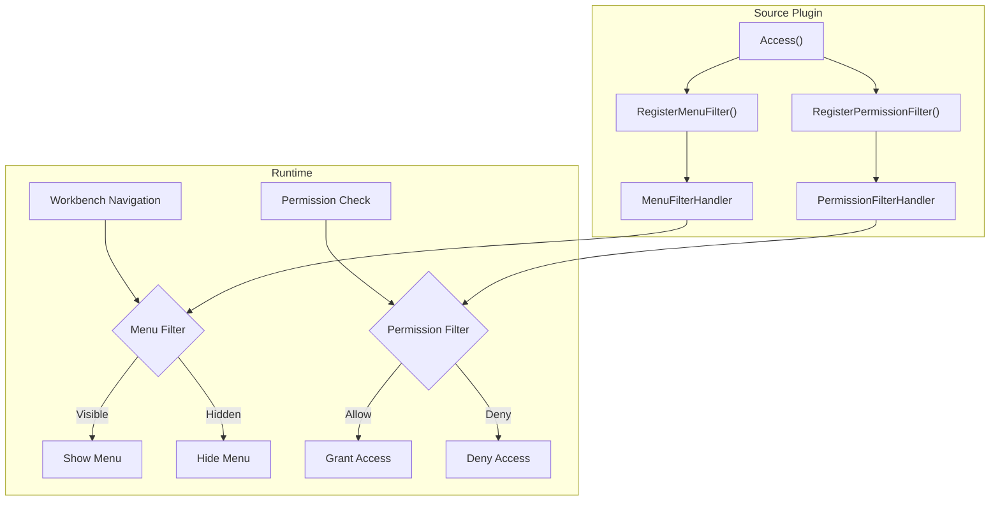

## Introduction

Access declarations cover the registration of menu and permission filter callbacks for source plugins. Source plugins register filters through `pluginhost.Declarations.Access()` and perform supplementary checks at runtime based on business context to determine whether workbench menus are visible and permissions remain valid. Dynamic plugins declare their base menu and permission structures through `plugin.yaml` and do not support runtime dynamic filter callbacks.

**Capability Phase**: Declaration

**Supported Plugin Types**: Source plugins, dynamic plugins

## Capability Design

### Access Control Filter Model



### Menu Descriptor

The `MenuDescriptor` interface describes the full information of a menu item:

| Method | Description |
|--------|-------------|
| `ID()` | Menu ID |
| `ParentID()` | Parent menu ID |
| `Name()` | Menu name |
| `Path()` | Frontend route path |
| `Component()` | Frontend component path |
| `Permissions()` | Permission identifiers |
| `MenuKey()` | Unique menu key |
| `Type()` | Menu type: `D` (directory), `M` (menu), `B` (button) |
| `Visible()` | Whether visible |
| `Status()` | Status |

### Permission Descriptor

The `PermissionDescriptor` interface describes permission item information:

| Method | Description |
|--------|-------------|
| `MenuKey()` | Associated menu key |
| `MenuName()` | Associated menu name |
| `Permission()` | Permission identifier |

### Filter Return Values

| Return Value | Description |
|--------------|-------------|
| `true` | Allow: menu is visible or permission is granted |
| `false` | Deny: menu is hidden or permission is rejected |

## Interface Definition

### Source Plugin Interface

Source plugins register filters through `Access()`:

| Method | Description |
|--------|-------------|
| `RegisterMenuFilter` | Registers a menu filter with the specified extension point, execution mode, and handler function |
| `RegisterPermissionFilter` | Registers a permission filter with the specified extension point, execution mode, and handler function |

### Dynamic Plugin Interface

Dynamic plugins declare menu structures through the `plugin.yaml` menu manifest. Manifest fields:

| Field | Type | Description |
|-------|------|-------------|
| `key` | `string` | Unique menu key |
| `parent_key` | `string` | Parent menu key |
| `name` | `string` | Menu name |
| `path` | `string` | Frontend route path |
| `component` | `string` | Frontend component path |
| `perms` | `string` | Permission identifier |
| `type` | `string` | Menu type |
| `sort` | `int` | Sort weight |
| `visible` | `int` | Whether visible |
| `status` | `int` | Status |

Dynamic plugins do not support runtime dynamic filtering. Menu structures and permission identifiers are statically declared in the manifest and synchronized to governance data by the host during installation or upgrade.

## Usage

### Source Plugin Usage

Source plugins register filters in `init()` through the access control entry returned by `pluginhost.NewDeclarations`:

```go
func init() {
    plugin := pluginhost.NewDeclarations("my-author-my-domain-my-cap")

    // Menu filter: hide specific menus
    if err := plugin.Access().RegisterMenuFilter(
        pluginhost.ExtensionPointMenuFilter,
        pluginhost.CallbackExecutionModeBlocking,
        func(ctx context.Context, menu pluginhost.MenuDescriptor) (bool, error) {
            // Determine menu visibility based on business logic
            if menu.MenuKey() == "plugin:my-plugin:admin" {
                return isAdmin(ctx), nil
            }
            return true, nil
        },
    ); err != nil {
        panic(err)
    }

    // Permission filter: dynamic permission check
    if err := plugin.Access().RegisterPermissionFilter(
        pluginhost.ExtensionPointPermissionFilter,
        pluginhost.CallbackExecutionModeBlocking,
        func(ctx context.Context, perm pluginhost.PermissionDescriptor) (bool, error) {
            // Determine permission validity based on business logic
            if perm.Permission() == "my-plugin:report:export" {
                return hasExportPermission(ctx), nil
            }
            return true, nil
        },
    ); err != nil {
        panic(err)
    }

    if err := pluginhost.RegisterSourcePlugin(plugin); err != nil {
        panic(err)
    }
}
```

### Dynamic Plugin Usage

Dynamic plugins declare menu structures in their manifest:

```yaml
menus:
  - key: plugin:my-plugin:dashboard
    name: Dashboard
    path: /my-plugin/dashboard
    component: pages/dashboard
    type: M
    sort: 1
    visible: 1
    status: 1
  - key: plugin:my-plugin:reports
    name: Reports
    path: /my-plugin/reports
    component: pages/reports
    perms: my-plugin:report:view
    type: M
    sort: 2
    visible: 1
    status: 1
    query:
      embedded-mount: "true"
```

Dynamic plugin menus are registered to governance data by the host during installation or upgrade. Runtime dynamic filtering is not supported.

## Design Constraints

- **Filter callbacks must return quickly.** Menu and permission filters execute on every request; callbacks should avoid time-consuming operations.
- **Returning `false` means deny.** A menu filter returning `false` hides the menu; a permission filter returning `false` denies access.
- **Multiple filters execute in registration order.** If any filter returns `false`, the menu is hidden or the permission is denied.
- **Dynamic plugin menus are statically declared.** Dynamic plugins do not support runtime dynamic filtering; menu structures are fixed in the manifest.
- **Access declarations are not runtime domain capabilities.** `Access()` is only used for source plugin declaration-phase registration and is not mounted on `pluginhost.Services` or `pluginbridge.Services`.
- **Menu key format must follow convention.** Menu keys must match the `plugin:{plugin-id}:{resource}` format.
- **Permission identifier format must follow convention.** Permission identifiers must match the `{plugin-id}:{resource}:{action}` format.

## Related Documentation

- [Declaration Capabilities Overview](/docs/declaration-capabilities)
- [Plugin Manifest](/docs/declaration-assets)
- [Plugin Governance Capability](/docs/domain-capability-plugins)
- [Source Plugin Development](/docs/source-plugins)
