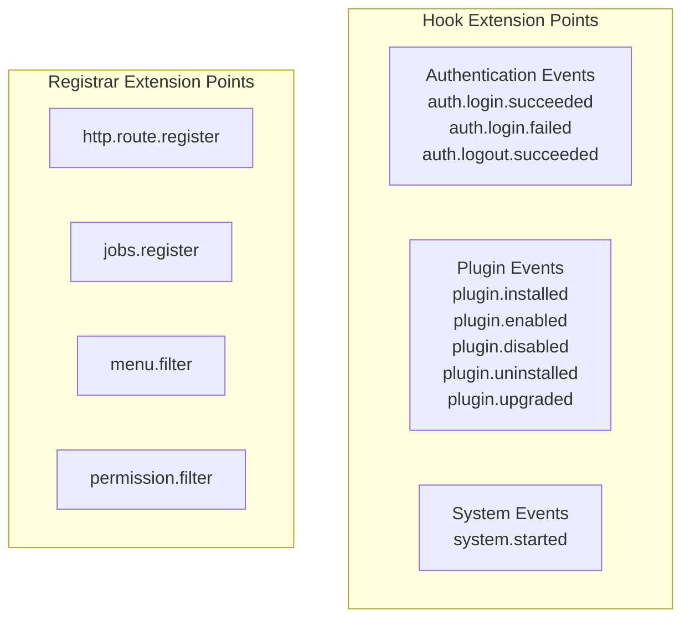

## Introduction

Hook declarations cover plugin subscriptions to host framework extension point events. Source plugins register event handlers through `pluginhost.Declarations.Hooks()` and execute callback logic when specific events occur. Dynamic plugins declare `HookSpec` through `backend/hooks/*.yaml` files, and the build tool embeds them into the `lina.plugin.backend.hooks` custom section of the `.wasm` artifact.

**Capability Phase**: Declaration

**Supported Plugin Types**: Source plugins, dynamic plugins

## Capability Design

### Extension Point Categories

Extension points are divided into two types: hook extension points (`Hook`) for event notification, and registrar extension points (`Registrar`) for declaration collection.



### Hook Extension Point List

| Extension Point | Description |
|-----------------|-------------|
| `auth.login.succeeded` | User login succeeded |
| `auth.login.failed` | User login failed |
| `auth.logout.succeeded` | User logout succeeded |
| `plugin.installed` | Plugin installation completed |
| `plugin.enabled` | Plugin enabled |
| `plugin.disabled` | Plugin disabled |
| `plugin.uninstalled` | Plugin uninstallation completed |
| `plugin.upgraded` | Plugin upgrade completed |
| `system.started` | System startup completed |

The table above lists the hook extension points published by the `pluginhost` runtime. When `linactl` (the dynamic plugin builder) scans `backend/hooks/*.yaml`, it only publishes `auth.login.succeeded`, `auth.login.failed`, `auth.logout.succeeded`, `plugin.installed`, `plugin.enabled`, `plugin.disabled`, `plugin.uninstalled`, and `system.started`. Dynamic plugins should not declare `plugin.upgraded` in `backend/hooks/*.yaml`.

### Execution Modes

| Mode | Description | Applicable Extension Points |
|------|-------------|---------------------------|
| `blocking` | Blocking execution; subsequent flow continues only after the callback completes | All extension points |
| `async` | Asynchronous execution; the callback runs in a separate goroutine | Hook extension points |

Hook extension points support both `blocking` and `async` modes. Registrar extension points only support `blocking` mode.

### Hook Payload

Hook handlers receive a `HookPayload` parameter containing event data:

| Method | Description |
|--------|-------------|
| `ExtensionPoint()` | Returns the current extension point |
| `Value(key)` | Reads a payload value by key |
| `Values()` | Returns all payload key-value pairs |
| `Services()` | Returns `Services` for accessing host capabilities |

### Payload Keys

| Key | Description |
|-----|-------------|
| `pluginId` | Plugin identifier |
| `name` | Name |
| `version` | Version |
| `status` | Status |
| `userName` | Username |
| `ip` | Client IP address |
| `clientType` | Client type |
| `browser` | Browser |
| `os` | Operating system |
| `message` | Message |
| `reason` | Reason |

### Authentication Event Reason Codes

| Reason Code | Description |
|-------------|-------------|
| `loginSuccessful` | Login succeeded |
| `loginFailed` | Login failed |
| `logoutSuccessful` | Logout succeeded |
| `invalidCredentials` | Invalid credentials |
| `userDisabled` | User disabled |
| `ipBlacklisted` | IP blacklisted |

### Dynamic Plugin Hook Declaration (HookSpec)

Dynamic plugins declare `HookSpec` hook contracts through `backend/hooks/*.yaml` files:

| Field | Type | Description |
|-------|------|-------------|
| `event` | `string` | Extension point name; when built with `linactl`, the available hooks are determined by the dynamic builder's published hook list |
| `action` | `string` | Action type: `insert`, `sleep`, `error` |
| `mode` | `string` | Execution mode: `blocking` or `async` |
| `table` | `string` | Associated table name |
| `fields` | `map` | Field mapping |
| `timeoutMs` | `int` | Timeout in milliseconds |
| `sleepMs` | `int` | Sleep duration in milliseconds (`sleep` action) |
| `errorMessage` | `string` | Error message (`error` action) |

## Interface Definition

### Source Plugin Interface

Source plugins register event handlers through `Hooks()`:

| Method | Description |
|--------|-------------|
| `RegisterHook` | Registers an event handler with the specified extension point, execution mode, and handler function |

### Dynamic Plugin Interface

Dynamic plugins declare hook contracts through `backend/hooks/*.yaml`. After building, they are embedded in the `lina.plugin.backend.hooks` custom section of the `.wasm` artifact.

## Usage

### Source Plugin Usage

Source plugins register event handlers in `init()` through the hook declaration entry returned by `pluginhost.NewDeclarations`:

```go
func init() {
    plugin := pluginhost.NewDeclarations("my-author-my-domain-my-cap")
    if err := plugin.Hooks().RegisterHook(
        pluginhost.ExtensionPointAuthLoginSucceeded,
        pluginhost.CallbackExecutionModeAsync,
        func(ctx context.Context, payload pluginhost.HookPayload) error {
            userName := payload.Value("userName")
            ip := payload.Value("ip")
            // Log login event
            return logLoginEvent(ctx, userName.(string), ip.(string))
        },
    ); err != nil {
        panic(err)
    }

    if err := pluginhost.RegisterSourcePlugin(plugin); err != nil {
        panic(err)
    }
}
```

Registering a system startup hook:

```go
err := plugin.Hooks().RegisterHook(
    pluginhost.ExtensionPointSystemStarted,
    pluginhost.CallbackExecutionModeBlocking,
    func(ctx context.Context, payload pluginhost.HookPayload) error {
        // Execute initialization after system startup
        return initializePlugin(ctx)
    },
)
```

### Dynamic Plugin Usage

Dynamic plugins declare hook contracts in `backend/hooks/001-plugin-enabled.yaml`:

```yaml
hooks:
  - event: plugin.enabled
    action: insert
    mode: blocking
    table: plugin_events
    fields:
      plugin_id: "{{pluginId}}"
      event: "enabled"
      timestamp: "{{now}}"
```

The build tool scans `backend/hooks/*.yaml`, validates the `HookSpec`, and embeds it into the `lina.plugin.backend.hooks` custom section of the `.wasm` artifact.

## Design Constraints

- **Extension points must be registered in the host registry.** Registering an undefined extension point returns an error.
- **Execution mode must match the extension point type.** Registrar extension points only support `blocking` mode.
- **Blocking callbacks affect the main flow.** `blocking` mode callbacks block subsequent processing and should return quickly.
- **Async callbacks execute independently.** `async` mode callbacks run in separate goroutines; failures do not affect the main flow.
- **Payload values require type assertion.** `HookPayload.Value()` returns `interface{}`, and callers must perform type assertion.
- **Dynamic plugin hooks are declared through contracts.** Dynamic plugin hooks are declared at build time via `backend/hooks/*.yaml` and do not support runtime dynamic registration.

## Related Documentation

- [Declaration Capabilities Overview](/docs/declaration-capabilities)
- [Plugin Manifest](/docs/declaration-assets)
- [Source Plugin Development](/docs/source-plugins)
- [Dynamic Plugins and WASM Runtime](/docs/wasm-plugins)
