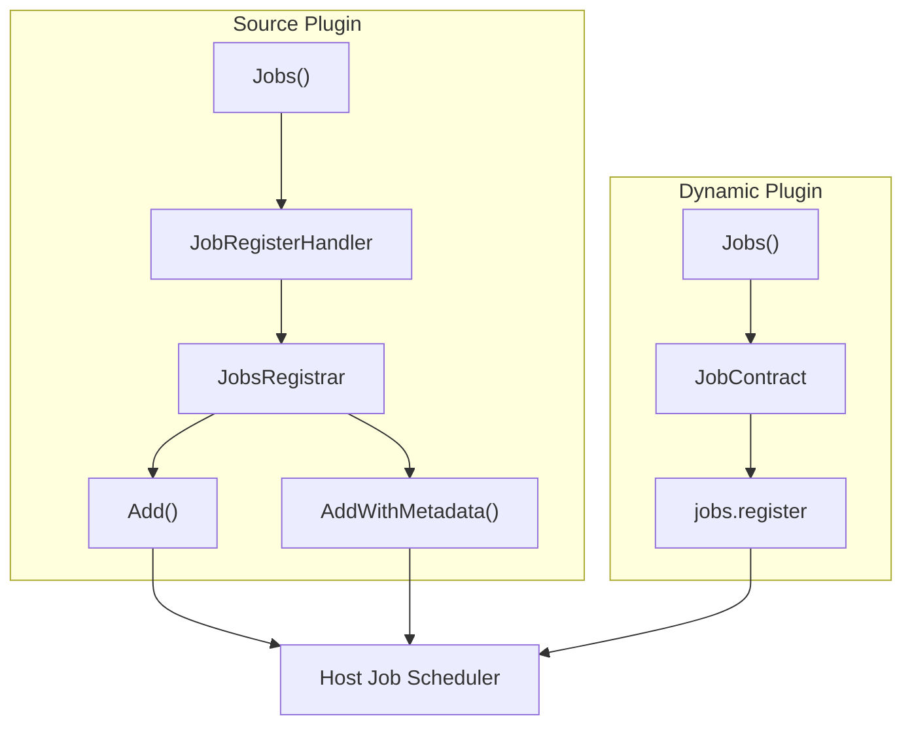

## Introduction

Job declarations cover the registration and declaration of plugin scheduled jobs. Source plugins register job contribution callbacks through `pluginhost.Declarations.Jobs()`, which are triggered uniformly by the host framework scheduler. Dynamic plugins submit job contracts through `pluginbridge.Declarations.Jobs()`.

**Capability Phase**: Declaration

**Supported Plugin Types**: Source plugins, dynamic plugins

## Capability Design

### Job Registration Model



### Job Contract Fields

| Field | Type | Required | Description |
|-------|------|----------|-------------|
| `name` | `string` | Yes | Job identifier |
| `displayName` | `string` | No | Display name for the job |
| `description` | `string` | No | Job description |
| `pattern` | `string` | Yes | Cron expression |
| `timezone` | `string` | No | Timezone, defaults to `Asia/Shanghai` |
| `scope` | `string` | No | Execution scope: `master_only` or `all_node` |
| `concurrency` | `string` | No | Concurrency mode: `singleton` or `parallel` |
| `maxConcurrency` | `int` | No | Maximum concurrency, defaults to `1` |
| `timeoutSeconds` | `int` | No | Timeout in seconds, defaults to `300` |
| `requestType` | `string` | Yes | Request DTO name (dynamic plugins) |
| `internalPath` | `string` | No | Internal route path |

### Execution Scope

| Value | Description |
|-------|-------------|
| `master_only` | Execute on the primary node only |
| `all_node` | Execute on all nodes (default) |

### Concurrency Modes

| Value | Description |
|-------|-------------|
| `singleton` | Singleton mode; only one instance executes at a time (default) |
| `parallel` | Parallel mode; allows multiple instances to execute simultaneously |

## Interface Definition

### Source Plugin Interface

Source plugins register job contribution callbacks through `Jobs()`:

| Method | Description |
|--------|-------------|
| `RegisterJobs` | Registers a job contribution callback, triggered uniformly by the host framework scheduler |

Callback handlers register jobs through `JobsRegistrar`:

| Method | Description |
|--------|-------------|
| `Add` | Registers a scheduled job with the specified cron expression, name, and handler function |
| `AddWithMetadata` | Registers a scheduled job with additional display name and description |
| `IsPrimaryNode` | Determines whether the current node is the primary node |
| `Services` | Returns `Services` for accessing host capabilities |

### Dynamic Plugin Interface

Dynamic plugins submit job contracts through `pluginbridge.Declarations.Jobs()`:

| Method | Description |
|--------|-------------|
| `Register` | Submits a `JobContract` to register a scheduled job |

## Usage

### Source Plugin Usage

Source plugins register job contribution callbacks in `init()`, then register scheduled jobs within the callback through `JobsRegistrar`:

```go
func init() {
    plugin := pluginhost.NewDeclarations("my-author-my-domain-my-cap")
    if err := plugin.Jobs().RegisterJobs(
        pluginhost.ExtensionPointJobsRegister,
        pluginhost.CallbackExecutionModeBlocking,
        registerJobs,
    ); err != nil {
        panic(err)
    }

    if err := pluginhost.RegisterSourcePlugin(plugin); err != nil {
        panic(err)
    }
}

// In the registration callback
func registerJobs(ctx context.Context, registrar pluginhost.JobsRegistrar) error {
    // Register a simple job
    err := registrar.Add(ctx, "0 2 * * *", "daily-report", func(ctx context.Context) error {
        // Execute daily at 2:00 AM
        return generateDailyReport(ctx)
    })
    if err != nil {
        return err
    }

    // Register a job with metadata
    return registrar.AddWithMetadata(ctx, "0 3 * * *", "cleanup-temp", "Temp File Cleanup", "Clean up expired temp files daily at 3:00 AM",
        func(ctx context.Context) error {
            return cleanupTempFiles(ctx)
        },
    )
}
```

Checking for the primary node:

```go
func registerJobs(ctx context.Context, registrar pluginhost.JobsRegistrar) error {
    if registrar.IsPrimaryNode() {
        // Only register on the primary node
        return registrar.Add(ctx, "0 * * * *", "leader-task", leaderTask)
    }
    return nil
}
```

### Dynamic Plugin Usage

Dynamic plugins submit job contracts through `Jobs()`:

```go
func RegisterPlugin(ctx context.Context) error {
    decl := pluginbridge.NewDeclarations()

    // Register a scheduled job
    err := decl.Jobs().Register(&protocol.JobContract{
        Name:           "cleanup-temp",
        DisplayName:    "Temp File Cleanup",
        Description:    "Clean up expired temp files daily at 3:00 AM",
        Pattern:        "0 3 * * *",
        Timezone:       "Asia/Shanghai",
        Scope:          protocol.JobScopeAllNode,
        Concurrency:    protocol.JobConcurrencySingleton,
        TimeoutSeconds: 300,
        RequestType:    "CleanupTempReq",
    })
    if err != nil {
        return err
    }

    return nil
}
```

Dynamic plugin job handlers use a standard function signature:

```go
//go:build wasm

package backend

type JobController struct{}

func (c *JobController) CleanupTemp(ctx context.Context, req *CleanupTempReq) (*CleanupTempResp, error) {
    // Execute cleanup logic
    return &CleanupTempResp{Cleaned: count}, nil
}
```

The build tool automatically generates `JobContract` and embeds it into the `.wasm` artifact.

## Design Constraints

- **Registration callbacks trigger during the discovery phase.** Source plugin job registration callbacks are triggered uniformly during the host discovery phase, not as runtime dynamic registration.
- **Dynamic plugin jobs go through host-service.** Dynamic plugins submit job contracts through the `jobs.register` host service and do not directly access the host scheduler.
- **Cron expressions must be valid.** The host validates cron expression format and rejects invalid expressions.
- **Job identifiers must be unique.** Job identifiers within the same plugin cannot be duplicated.
- **Timeout protection protects the host.** Jobs that exceed `timeoutSeconds` are terminated, with a default of `300` seconds.
- **Primary node check is for distributed scenarios.** `IsPrimaryNode()` helps plugins decide whether to register jobs that should only execute on the primary node.

## Related Documentation

- [Declaration Capabilities Overview](/docs/declaration-capabilities)
- [Plugin Manifest](/docs/declaration-assets)
- [Jobs and Scheduling Capability](/docs/domain-capability-jobs)
- [Source Plugin Development](/docs/source-plugins)
