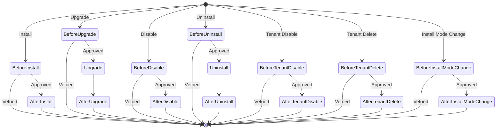

## Introduction

Lifecycle declarations cover callback registration for plugin governance operations such as install, upgrade, disable, and uninstall. Source plugins register Go callback functions through `pluginhost.Declarations.Lifecycle()`, while dynamic plugins declare lifecycle callback contracts through `LifecycleContract`.

**Capability Phase**: Declaration

**Supported Plugin Types**: Source plugins, dynamic plugins

## Capability Design

### Lifecycle Hook Categories

Lifecycle hooks are divided into two types: before hooks (`Before`) and after hooks (`After`). Before hooks can veto an operation, while after hooks are used for observation and cleanup.



### Lifecycle Hook List

| Hook | Type | Vetoable | Description |
|------|------|----------|-------------|
| `BeforeInstall` | Before | Yes | Pre-installation validation; returning `ok=false` prevents installation |
| `AfterInstall` | After | No | Post-installation initialization for creating default data or configuration |
| `BeforeUpgrade` | Before | Yes | Pre-upgrade validation; returning `ok=false` prevents upgrade |
| `Upgrade` | Custom | No | Executes custom upgrade logic |
| `AfterUpgrade` | After | No | Post-upgrade cleanup or observation |
| `BeforeDisable` | Before | Yes | Pre-disable validation; returning `ok=false` prevents disabling |
| `AfterDisable` | After | No | Post-disable cleanup |
| `BeforeUninstall` | Before | Yes | Pre-uninstallation validation; returning `ok=false` prevents uninstallation |
| `Uninstall` | Custom | No | Executes uninstall cleanup logic, such as clearing plugin data |
| `AfterUninstall` | After | No | Post-uninstallation observation |
| `BeforeTenantDisable` | Before | Yes | Pre-tenant-disable validation |
| `AfterTenantDisable` | After | No | Post-tenant-disable cleanup |
| `BeforeTenantDelete` | Before | Yes | Pre-tenant-delete validation |
| `AfterTenantDelete` | After | No | Post-tenant-delete cleanup |
| `BeforeInstallModeChange` | Before | Yes | Pre-install-mode-change validation |
| `AfterInstallModeChange` | After | No | Post-install-mode-change cleanup |

### Callback Timeouts

| Parameter | Default | Description |
|-----------|---------|-------------|
| Single callback timeout | `5` seconds | Maximum execution time for a single lifecycle callback |
| Aggregate timeout | `10` seconds | Total execution time for all plugin callbacks under the same hook |

### Input Parameters

| Input Interface | Applicable Hooks | Key Fields |
|-----------------|------------------|------------|
| `SourcePluginLifecycleInput` | Install, disable, uninstall | `PluginID()`, `Operation()`, `StartupAutoEnable()`, `PurgeStorageData()` |
| `SourcePluginUpgradeInput` | Upgrade | `PluginID()`, `FromVersion()`, `ToVersion()`, `FromManifest()`, `ToManifest()` |
| `SourcePluginTenantLifecycleInput` | Tenant disable, tenant delete | `Operation()`, `TenantID()` |
| `SourcePluginInstallModeChangeInput` | Install mode change | `PluginID()`, `Operation()`, `FromMode()`, `ToMode()` |
| `SourcePluginUninstallInput` | Uninstall cleanup | `PluginID()`, `PurgeStorageData()`, `Services()` |

## Interface Definition

### Source Plugin Interface

Source plugins register lifecycle callbacks through `Lifecycle()`:

| Method | Callback Type | Description |
|--------|---------------|-------------|
| `RegisterBeforeInstallHandler` | `SourcePluginBeforeLifecycleHandler` | Pre-installation validation |
| `RegisterAfterInstallHandler` | `SourcePluginAfterLifecycleHandler` | Post-installation initialization |
| `RegisterBeforeUpgradeHandler` | `SourcePluginBeforeUpgradeHandler` | Pre-upgrade validation |
| `RegisterUpgradeHandler` | `SourcePluginUpgradeHandler` | Custom upgrade logic |
| `RegisterAfterUpgradeHandler` | `SourcePluginUpgradeHandler` | Post-upgrade cleanup |
| `RegisterBeforeDisableHandler` | `SourcePluginBeforeLifecycleHandler` | Pre-disable validation |
| `RegisterAfterDisableHandler` | `SourcePluginAfterLifecycleHandler` | Post-disable cleanup |
| `RegisterBeforeUninstallHandler` | `SourcePluginBeforeLifecycleHandler` | Pre-uninstallation validation |
| `RegisterAfterUninstallHandler` | `SourcePluginAfterLifecycleHandler` | Post-uninstallation cleanup |
| `RegisterBeforeTenantDisableHandler` | `SourcePluginBeforeTenantLifecycleHandler` | Pre-tenant-disable validation |
| `RegisterAfterTenantDisableHandler` | `SourcePluginAfterTenantLifecycleHandler` | Post-tenant-disable cleanup |
| `RegisterBeforeTenantDeleteHandler` | `SourcePluginBeforeTenantLifecycleHandler` | Pre-tenant-delete validation |
| `RegisterAfterTenantDeleteHandler` | `SourcePluginAfterTenantLifecycleHandler` | Post-tenant-delete cleanup |
| `RegisterBeforeInstallModeChangeHandler` | `SourcePluginBeforeInstallModeChangeHandler` | Pre-install-mode-change validation |
| `RegisterAfterInstallModeChangeHandler` | `SourcePluginAfterInstallModeChangeHandler` | Post-install-mode-change cleanup |
| `RegisterUninstallHandler` | `SourcePluginUninstallHandler` | Uninstall cleanup logic |

### Dynamic Plugin Interface

Dynamic plugins declare lifecycle callback contracts through `LifecycleContract`. Each contract defines an operation and its corresponding WASM entry point:

| Field | Type | Description |
|-------|------|-------------|
| `operation` | `string` | Lifecycle operation name |
| `requestType` | `string` | Request DTO name |
| `internalPath` | `string` | Internal route path |
| `timeoutMs` | `int` | Callback timeout in milliseconds |

Supported `operation` values: `BeforeInstall`, `AfterInstall`, `BeforeUpgrade`, `Upgrade`, `AfterUpgrade`, `BeforeDisable`, `AfterDisable`, `BeforeUninstall`, `Uninstall`, `AfterUninstall`, `BeforeTenantDisable`, `AfterTenantDisable`, `BeforeTenantDelete`, `AfterTenantDelete`, `BeforeInstallModeChange`, `AfterInstallModeChange`.

## Usage

### Source Plugin Usage

Source plugins register lifecycle callbacks in `init()` through the grouped `Lifecycle()` entry:

```go
func init() {
    plugin := pluginhost.NewDeclarations("my-author-my-domain-my-cap")

    if err := plugin.Lifecycle().RegisterBeforeInstallHandler(beforeInstall); err != nil {
        panic(err)
    }
    if err := plugin.Lifecycle().RegisterAfterInstallHandler(afterInstall); err != nil {
        panic(err)
    }

    if err := pluginhost.RegisterSourcePlugin(plugin); err != nil {
        panic(err)
    }
}
```

Before hooks can veto an operation by returning `ok=false` and a `reason`:

```go
func beforeInstall(ctx context.Context, input pluginhost.SourcePluginLifecycleInput) (ok bool, reason string, err error) {
    // Validate dependencies
    if !checkDependencies() {
        return false, "Missing required dependencies", nil
    }
    return true, "", nil
}
```

After hooks are used for initialization or cleanup:

```go
func afterInstall(ctx context.Context, input pluginhost.SourcePluginLifecycleInput) error {
    // Create default configuration
    return createDefaultConfig(ctx)
}
```

### Dynamic Plugin Usage

Dynamic plugins embed `LifecycleContract` in the `.wasm` artifact. The build tool automatically extracts lifecycle contracts from controllers in the `backend/` directory:

```go
// backend/lifecycle.go
//go:build wasm

package backend

// Controller methods correspond to lifecycle operations
func (c *LifecycleController) BeforeInstall(ctx context.Context, req *BeforeInstallReq) (*LifecycleDecision, error) {
    // Pre-installation validation
    return &LifecycleDecision{OK: true}, nil
}

func (c *LifecycleController) AfterInstall(ctx context.Context, req *AfterInstallReq) (*LifecycleDecision, error) {
    // Post-installation initialization
    return &LifecycleDecision{OK: true}, nil
}
```

The build tool automatically generates `LifecycleContract` and embeds it in the `lina.plugin.backend.lifecycle` custom section of the `.wasm` artifact.

## Design Constraints

- **Before hooks can veto operations.** When `ok=false` is returned, the host prevents subsequent operations from executing.
- **After hooks cannot veto operations.** After hooks execute after the operation completes; failures are only logged and do not roll back the operation.
- **Uninstall cleanup is a separate hook.** The `Uninstall` hook handles data cleanup and is separate from `BeforeUninstall` and `AfterUninstall`.
- **Timeout mechanism protects the host.** Single callback timeout is `5` seconds, aggregate timeout is `10` seconds; callbacks are terminated on timeout.
- **Dynamic plugin lifecycle goes through bridge contracts.** Dynamic plugin lifecycle callbacks execute through the WASM bridge and are not exposed through `hostServices`.
- **`PurgeStorageData` controls data cleanup.** During uninstallation, the host uses this flag to notify the plugin whether persistent data needs to be cleared.

## Related Documentation

- [Declaration Capabilities Overview](/docs/declaration-capabilities)
- [Plugin Manifest](/docs/declaration-assets)
- [Plugin Governance Capability](/docs/domain-capability-plugins)
- [Plugin Management](/docs/plugin-management)
