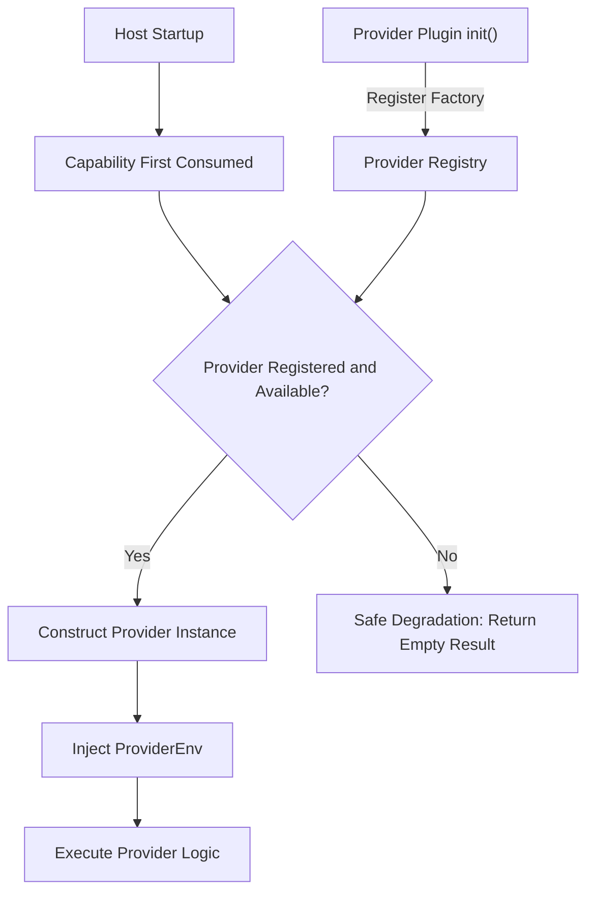

## Introduction

Provider declarations cover the registration of SPI capability provider factories by source plugins. The SPI (Service Provider Interface) pattern separates capability contracts from capability implementations. The host defines public interfaces for domain capabilities, while provider plugins implement the specific business logic. Dynamic plugins cannot register SPI factories; they can only consume published SPI capabilities.

**Capability Phase**: Declaration

**Supported Plugin Types**: Source plugins only

## Capability Design

### SPI Architecture



### Supported Provider Types

| Provider | Factory Interface | Capability Package | Official Plugin |
|----------|-------------------|-------------------|-----------------|
| `Tenant` | `tenantspi.ProviderFactory` | `tenantcap` | `linapro-tenant-core` |
| `Org` | `orgspi.ProviderFactory` | `orgcap` | `linapro-org-core` |
| `AI Text` | `aitext.ProviderFactory` | `aicap` | `linapro-ai-core` |

### ProviderEnv Injection

The host injects runtime context into providers through `ProviderEnv`:

| Injection Item | Description |
|----------------|-------------|
| Plugin identity | The current provider plugin's ID, used for auditing and isolation |
| Request context | Business context such as the current request's tenant and user |
| Auxiliary capabilities | Host capabilities required by the provider implementation |

### Provider Status Check

The host determines provider availability through `Plugins().State().IsProviderEnabled()`:

| Check Method | Semantics | Applicable Scenario |
|--------------|-----------|---------------------|
| `IsEnabled` | Whether the plugin's business entry is visible to the current tenant | Menu filtering, route visibility |
| `IsProviderEnabled` | Whether the plugin is platform-enabled and can accept provider calls | Pre-check before AI, Org, Tenant capability calls |

Provider checks ensure that platform-level capabilities remain available even when business entries are disabled at the tenant level.

### Lazy Construction

The host only constructs provider instances when a capability is first consumed, avoiding strong dependencies on optional plugins during startup.

### Safe Degradation

When no provider is available, capabilities return empty results or unavailable status rather than `nil` or errors.

## Interface Definition

### Source Plugin Interface

Source plugins register provider factories through `Providers()`:

| Method | Factory Interface | Description |
|--------|-------------------|-------------|
| `ProvideTenant` | `tenantspi.ProviderFactory` | Registers a tenant capability provider |
| `ProvideOrg` | `orgspi.ProviderFactory` | Registers an organization capability provider |
| `ProvideAIText` | `aitext.ProviderFactory` | Registers an AI text capability provider |

Each factory is a constructor function that receives a `ProviderEnv` parameter and returns a provider instance.

### Dynamic Plugin Interface

Dynamic plugins cannot register SPI factories. They interact with SPI capabilities through the following methods:

| Interaction Method | Description |
|--------------------|-------------|
| Consume SPI capabilities | Call published SPI capability methods through `hostServices` declarations |
| Check provider status | Determine provider availability through the `plugins.provider_enabled.check` dynamic method |
| Status query | Query capability availability through `capability.available` and `capability.status` dynamic methods |

## Usage

### Source Plugin Usage

Source plugins register provider factories in `init()`:

```go
func init() {
    plugin := pluginhost.NewDeclarations("my-author-my-org-provider")
    if err := plugin.Providers().ProvideOrg(orgProviderFactory); err != nil {
        panic(err)
    }

    if err := pluginhost.RegisterSourcePlugin(plugin); err != nil {
        panic(err)
    }
}

// Factory function
func orgProviderFactory(ctx context.Context, env orgspi.ProviderEnv) (orgspi.Provider, error) {
    return &myOrgProvider{env: env}, nil
}
```

Implementing the provider contract:

```go
type myOrgProvider struct {
    env orgspi.ProviderEnv
}

func (p *myOrgProvider) ListUserDeptAssignments(ctx context.Context, userIDs []int) (map[int]*orgcap.UserDeptAssignment, error) {
    // Query the provider's own organization data
    return queryDeptAssignments(ctx, userIDs)
}

func (p *myOrgProvider) GetUserDeptInfo(ctx context.Context, userID int) (int, string, error) {
    // Implement department info query
    return queryDeptInfo(ctx, userID)
}
```

Registering an AI text provider:

```go
func (p *myAIPlugin) ProvideAIText(factory aitext.ProviderFactory) error {
    p.aiTextProvider = factory
    return nil
}

func aiTextProviderFactory(env aitext.ProviderEnv) aitext.Provider {
    return &myAITextProvider{env: env}
}
```

### Dynamic Plugin Usage

Dynamic plugins consume SPI capabilities through `hostServices` declarations:

```yaml
hostServices:
  - service: ai
    methods:
      - text.generate
  - service: org
    methods:
      - users.dept_name.get
  - service: tenant
    methods:
      - tenants.current
```

Checking provider status:

```go
// Check via plugins.provider_enabled.check
enabled := pluginbridge.Default().Plugins().State().IsProviderEnabled(ctx, "linapro-ai-core")
if enabled {
    // Use AI capabilities
}
```

## Design Constraints

- **Provider declarations are limited to source plugins.** Dynamic plugins cannot register SPI factories because providers need to implement Go interfaces and run within the host process.
- **Each capability can only have one provider.** Registering duplicate providers for the same capability returns an error.
- **Lazy construction avoids strong dependencies.** The host only constructs provider instances when a capability is first consumed.
- **Safe degradation ensures stability.** When no provider is available, capabilities return empty results rather than errors.
- **Provider status is independent of business entries.** A plugin's business entry may be invisible to tenants but still available as a platform capability provider.
- **`ProviderEnv` is the injection channel.** The host injects context and auxiliary capabilities into providers through `ProviderEnv`; providers should not obtain these independently.

## Related Documentation

- [Declaration Capabilities Overview](/docs/declaration-capabilities)
- [Domain Capabilities Overview](/docs/domain-capabilities)
- [Plugin Governance Capability](/docs/domain-capability-plugins)
- [Source Plugin Development](/docs/source-plugins)
