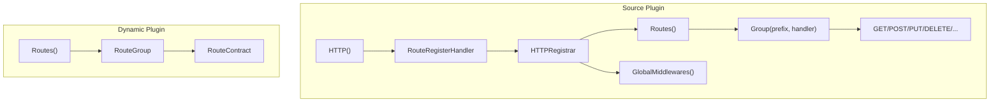

## Introduction

Route declarations cover the registration and binding of plugin HTTP routes. Source plugins register route contribution callbacks through `pluginhost.Declarations.HTTP()`, which are triggered uniformly when the host starts. Dynamic plugins declare route group bindings through `pluginbridge.Declarations.Routes()`.

**Capability Phase**: Declaration

**Supported Plugin Types**: Source plugins, dynamic plugins

## Capability Design

### Route Registration Model



### API Namespace

All plugin routes are mounted under the `/x/{plugin-id}/` namespace:

| Constant | Value | Description |
|----------|-------|-------------|
| `PluginAPINamespaceSegment` | `x` | API path segment |
| `PluginAPINamespacePrefix` | `/x` | API path prefix |

The source plugin's `RouteRegistrar.APIPrefix()` returns `/x/{plugin-id}`. Dynamic plugin route prefixes follow the same convention.

### Middleware System

Source plugins access eight standard middlewares provided by the host through `RouteMiddlewares`:

| Middleware | Description |
|------------|-------------|
| `NeverDoneCtx` | Prevents request context timeout |
| `HandlerResponse` | Unified response format middleware |
| `CORS` | Cross-Origin Resource Sharing middleware |
| `RequestBodyLimit` | Request body size limit middleware |
| `Ctx` | Request context injection middleware |
| `Auth` | Authentication middleware |
| `Tenancy` | Tenant isolation middleware |
| `Permission` | Permission validation middleware |

### Global Middleware

Source plugins can register global middleware through `GlobalMiddlewareRegistrar` that applies to all requests:

| Field | Description |
|-------|-------------|
| `scope` | Middleware scope |
| `handler` | Middleware handler function |

### Route Binding

Route bindings define the mapping between HTTP methods, paths, and handlers. Each binding includes the following metadata:

| Field | Description |
|-------|-------------|
| `Method` | HTTP method (`GET`, `POST`, `PUT`, `DELETE`, etc.) |
| `Path` | Route path relative to the API prefix |
| `Access` | Access mode: `public` (open) or `login` (requires authentication) |
| `Permission` | Permission identifier in the format `{plugin-id}:{resource}:{action}` |
| `Summary` | API summary |
| `Description` | API description |

## Interface Definition

### Source Plugin Interface

Source plugins register route contribution callbacks through `HTTP()`:

| Method | Description |
|--------|-------------|
| `RegisterRoutes` | Registers a route contribution callback, triggered uniformly when the host starts |

Callback handlers access route registration capabilities through `HTTPRegistrar`:

| Method | Description |
|--------|-------------|
| `Routes()` | Returns `RouteRegistrar` for registering route groups |
| `GlobalMiddlewares()` | Returns `GlobalMiddlewareRegistrar` for registering global middleware |
| `Services()` | Returns `Services` for accessing host capabilities |

`RouteRegistrar` interface:

| Method | Description |
|--------|-------------|
| `APIPrefix()` | Returns the current plugin's API prefix |
| `Group()` | Registers a route group |
| `Middlewares()` | Returns the standard middleware collection |
| `RouteBindings()` | Returns the list of registered route bindings |
| `Err()` | Returns errors encountered during registration |

The `RouteGroup` interface supports standard HTTP method registration:

| Method | Description |
|--------|-------------|
| `ALL` | Registers routes for all methods |
| `GET` | Registers a GET route |
| `POST` | Registers a POST route |
| `PUT` | Registers a PUT route |
| `DELETE` | Registers a DELETE route |
| `PATCH` | Registers a PATCH route |
| `HEAD` | Registers a HEAD route |
| `CONNECT` | Registers a CONNECT route |
| `OPTIONS` | Registers an OPTIONS route |
| `TRACE` | Registers a TRACE route |
| `Group` | Nested route group |
| `Middleware` | Registers group-level middleware |
| `Bind` | Binds a route handler |
| `Err()` | Returns errors encountered during registration |

### Dynamic Plugin Interface

Dynamic plugins declare route group bindings through `pluginbridge.Declarations.Routes()`:

| Method | Description |
|--------|-------------|
| `Group` | Declares a route group binding with the specified API prefix and route package |

Dynamic plugin routes are defined through `RouteContract`:

| Field | Type | Description |
|-------|------|-------------|
| `path` | `string` | Route path, must start with `/` |
| `method` | `string` | HTTP method, automatically converted to uppercase |
| `access` | `string` | Access mode: `public` or `login` |
| `permission` | `string` | Permission identifier |
| `summary` | `string` | API summary |
| `description` | `string` | API description |
| `requestType` | `string` | Request DTO name |

## Usage

### Source Plugin Usage

Source plugins register route contribution callbacks in `init()`, then use `HTTPRegistrar` within the callback to register routes:

```go
func init() {
    plugin := pluginhost.NewDeclarations("my-author-my-domain-my-cap")
    if err := plugin.HTTP().RegisterRoutes(
        pluginhost.ExtensionPointHTTPRouteRegister,
        pluginhost.CallbackExecutionModeBlocking,
        registerRoutes,
    ); err != nil {
        panic(err)
    }

    if err := pluginhost.RegisterSourcePlugin(plugin); err != nil {
        panic(err)
    }
}

// In the registration callback
func registerRoutes(ctx context.Context, registrar pluginhost.HTTPRegistrar) error {
    routes := registrar.Routes()
    middlewares := routes.Middlewares()

    routes.Group("/reports", func(group pluginhost.RouteGroup) {
        group.Middleware(middlewares.Auth())
        group.Middleware(middlewares.Tenancy())
        group.Middleware(middlewares.Permission())

        group.GET("/", listReports)
        group.GET("/:id", getReport)
        group.POST("/", createReport)
        group.PUT("/:id", updateReport)
        group.DELETE("/:id", deleteReport)
    })

    return routes.Err()
}
```

Registering global middleware:

```go
func registerGlobalMiddleware(ctx context.Context, registrar pluginhost.HTTPRegistrar) error {
    return registrar.GlobalMiddlewares().Bind(
        "", // Empty string defaults to matching all paths "/*"
        func(r *ghttp.Request) {
            // Global middleware logic
            r.Middleware.Next()
        },
    )
}
```

### Dynamic Plugin Usage

Dynamic plugins declare route group bindings through `Routes()`:

```go
func RegisterPlugin(ctx context.Context) error {
    decl := pluginbridge.NewDeclarations()

    // Declare route group binding
    err := decl.Routes().Group("/reports", "controllers")
    if err != nil {
        return err
    }

    return nil
}
```

Dynamic plugin route controllers use standard HTTP method signatures:

```go
//go:build wasm

package controllers

type ReportController struct{}

func (c *ReportController) Get(ctx context.Context, req *GetReportReq) (*ReportResp, error) {
    // Handle GET request
}

func (c *ReportController) Post(ctx context.Context, req *CreateReportReq) (*ReportResp, error) {
    // Handle POST request
}
```

The build tool automatically generates `RouteContract` and embeds it in the `lina.plugin.backend.routes` custom section of the `.wasm` artifact.

## Design Constraints

- **Routes are mounted under the plugin namespace.** All plugin routes must be under the `/x/{plugin-id}/` prefix.
- **Registration callbacks trigger at startup.** Source plugin route registration callbacks are triggered uniformly when the host starts, not as runtime dynamic registration.
- **Middleware chains are assembled by plugins.** Plugins select and compose middleware based on business needs; the host does not enforce middleware ordering.
- **Permission identifiers must follow convention.** Permission identifiers must match the `{plugin-id}:{resource}:{action}` format.
- **Dynamic plugin routes are declared through contracts.** Dynamic plugin routes are declared at build time through `RouteContract` and do not support runtime dynamic registration.
- **Route paths must start with `/`.** The host validates route path format and rejects invalid paths.

## Related Documentation

- [Declaration Capabilities Overview](/docs/declaration-capabilities)
- [Plugin Manifest](/docs/declaration-assets)
- [Source Plugin Development](/docs/source-plugins)
- [Dynamic Plugins and WASM Runtime](/docs/wasm-plugins)
