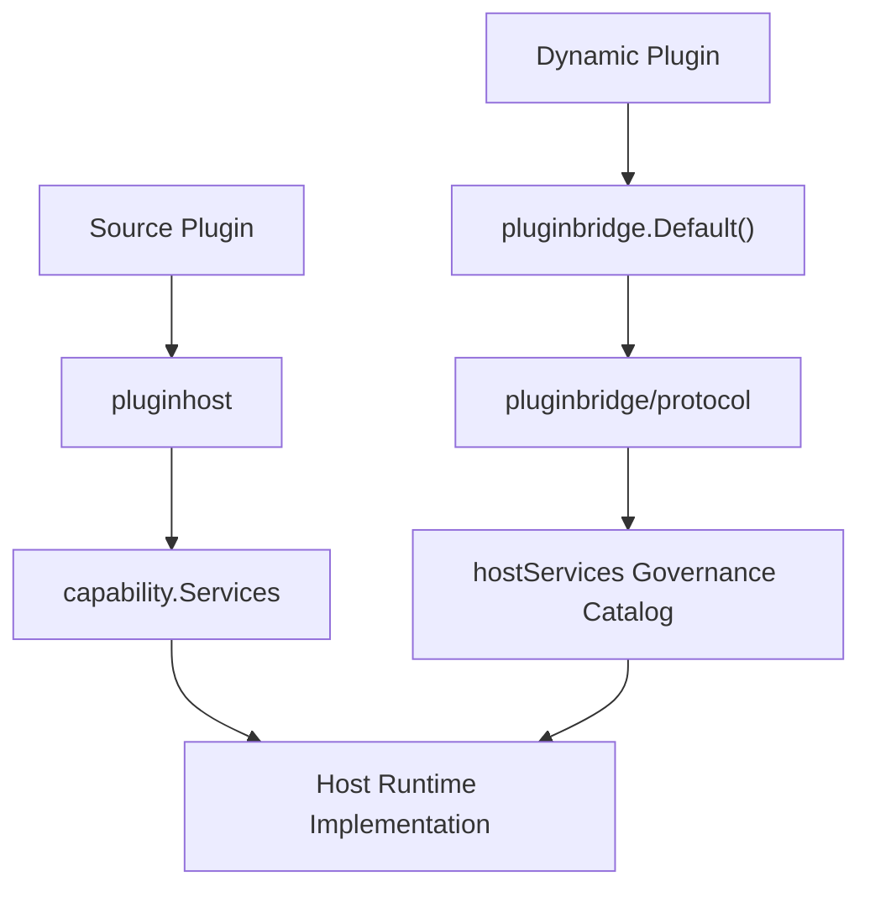
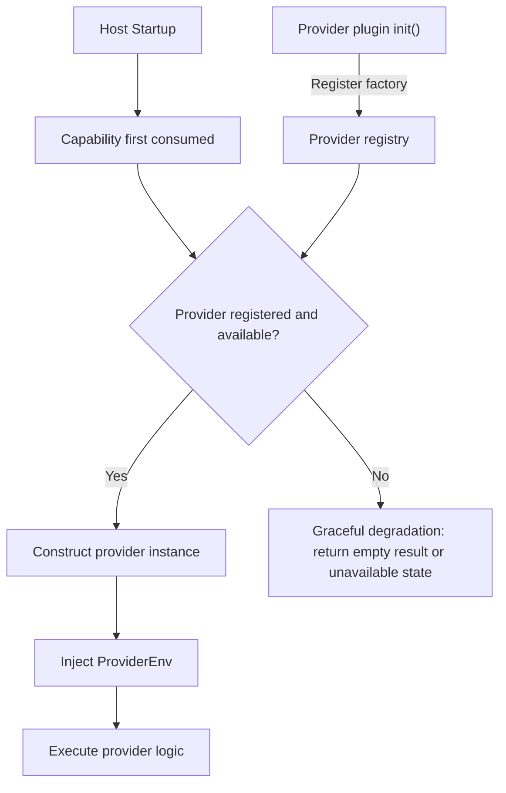
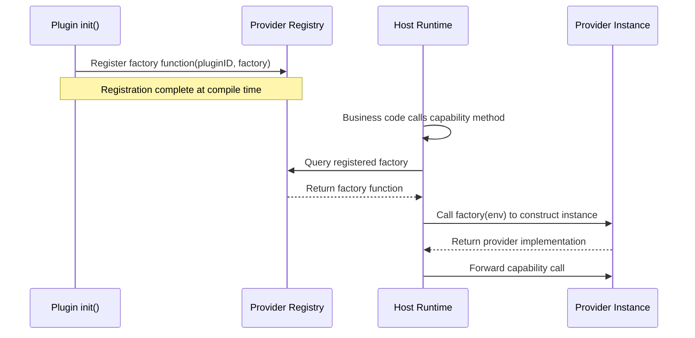

## Introduction

To improve the overall flexibility and extensibility of the framework, the core framework adopts a domain-driven design approach to model its core capabilities, organizing each domain capability's implementation and contracts in a decoupled manner. The `apps/lina-core/pkg/plugin` directory serves as the public Go contract boundary, exposing stable domain service interfaces to plugins. Source plugins consume the full `capability.Services` catalog through `pluginhost.Services`, while dynamic plugins consume the published `hostServices` capability subset through the `pluginbridge.Services` returned by `pluginbridge.Default()`.

## Component Structure

| Path | Responsibility |
|------|---------------|
| `capability/` | Aggregates stable host capabilities, including `Services`, plugin-scoped service bindings, and narrow interfaces for each domain. Source plugins use the full catalog directly; dynamic plugins use the published bridged subset. |
| `pluginhost/` | Source plugin host namespace providing compile-time registration interfaces and runtime callback contracts. |
| `pluginbridge/` | Dynamic plugin bridge namespace providing the `pluginbridge.Default()` / `pluginbridge.New()` runtime capability catalog, Wasm execution contracts, and `hostServices` encoding/decoding. |



## Domain Capability Overview

| Method | Domain Documentation | SPI Extension | Description |
|--------|---------------------|---------------|-------------|
| `AI()` | [AI Capability](/docs/domain-capability-ai) | Supported | Aggregates text, image, vector, audio, vision, document, safety, and video sub-capabilities |
| `APIDoc()` | [API Documentation](/docs/domain-capability-apidoc) | - | Parses route operation keys, localizes module labels and operation summaries |
| `Auth()` | [Auth Capability](/docs/domain-capability-auth) | - | Token issuance, tenant switching, impersonation tokens, and authorization permission view reading and checks |
| `Users()` | [Users Capability](/docs/domain-capability-users) | - | User views, search, and visibility validation |
| `BizCtx()` | [Business Context](/docs/domain-capability-bizctx) | - | Reads current request user, tenant, impersonation, and platform bypass state |
| `Cache()` | [Cache Capability](/docs/domain-capability-cache) | - | Plugin-scoped runtime cache |
| `Dict()` | [Dict Capability](/docs/domain-capability-dict) | - | Dictionary type and value lifecycle management, label resolution, and cache refresh |
| `Files()` | [Files Capability](/docs/domain-capability-files) | - | File views, upload, streaming open, and visibility validation |
| `HostConfig()` | [Host Config](/docs/domain-capability-hostconfig) | - | Reads host configuration values; dynamic plugins must declare `keys` |
| `I18n()` | [i18n Capability](/docs/domain-capability-i18n) | - | Source plugin runtime translation; not exposed as a dynamic host service |
| `Jobs()` | [Jobs Capability](/docs/domain-capability-jobs) | - | Scheduled task lifecycle management |
| `Manifest()` | [Manifest Resources](/docs/domain-capability-manifest) | - | Reads read-only resources under the current plugin's `manifest/` |
| `Notifications()` | [Notifications](/docs/domain-capability-notifications) | - | Notification message lifecycle management |
| `Org()` | [Org Capability](/docs/domain-capability-org) | Supported | Optional org capability, department and position lifecycle management |
| `Plugins()` | [Plugin Governance](/docs/domain-capability-plugins) | - | Aggregates plugin registry, plugin config, plugin state, and lifecycle sub-capabilities |
| `Route()` | [Dynamic Route](/docs/domain-capability-route) | - | Reads current dynamic route metadata |
| `Sessions()` | [Sessions](/docs/domain-capability-sessions) | - | Online session search, batch reading, and revocation |
| `Storage()` | [Files Capability](/docs/domain-capability-files) | Supported | Plugin-scoped object storage operations |
| `Tenant()` | [Tenant Capability](/docs/domain-capability-tenant) | Supported | Optional tenant capability, reads current tenant, visibility, switch validation, and source plugin tenant filtering |
| `Lock()` | [Lock Capability](/docs/domain-capability-lock) | - | Plugin-visible distributed lock acquisition, renewal, and release |

Plugin-scoped capabilities are bound to the plugin identity by the host. For example, `Plugins().Config()` only reads the current plugin's own `config.yaml`, `Manifest()` only reads the current plugin's `manifest/` resources, and `AI()` injects the source plugin ID into subsequent provider requests.

## Capability Lifecycle

Plugin capabilities are divided into two phases: declaration and runtime. The declaration phase is the static registration and discovery stage where the host uses declaration output to build governance state before business execution. The runtime phase is when plugin business logic executes and consumes the domain capability services provided by the host.

### Declaration-Phase Capabilities

Declaration-phase capabilities are the static registration output of plugins. Source plugins register through `pluginhost.Declarations` at compile time, while dynamic plugins declare through `plugin.yaml` manifests and `pluginbridge.Declarations`.

For detailed design and usage of declaration-phase capabilities, see [Declaration Capabilities Overview](/docs/declaration-capabilities).

#### Source Plugin Declaration Phase

Source plugins register the following declarations through `pluginhost.Declarations` in `init()`:

| Declaration Entry | Description |
|-------------------|-------------|
| `ID()` | Returns a stable plugin identifier consistent with `plugin.yaml` |
| `Assets()` | Binds the plugin's embedded filesystem, including manifests, frontend pages, SQL, and i18n resources |
| `Lifecycle()` | Registers 16 lifecycle callbacks for install, upgrade, disable, uninstall, tenant disable, tenant delete, and install mode changes |
| `Hooks()` | Subscribes to host extension point events, such as `auth.login.succeeded`, `plugin.enabled`, `system.started`, etc. |
| `HTTP()` | Registers plugin HTTP route contribution callbacks, triggered uniformly at host startup |
| `Jobs()` | Registers scheduled task contribution callbacks, triggered uniformly by the host scheduler |
| `Providers()` | Declares domain capability provider factories, such as `ProvideTenant`, `ProvideOrg`, and `ProvideAIText` |
| `Access()` | Registers menu filtering and permission filtering callbacks for runtime dynamic adjustment of workspace navigation and permissions |

#### Dynamic Plugin Declaration Phase

Dynamic plugins express declarations through `plugin.yaml` manifests and build-time contracts:

| Declaration Source | Description |
|--------------------|-------------|
| `plugin.yaml` | Declares plugin identity, version, dependencies, menus, permissions, multi-tenant strategy, public static assets, and `hostServices` authorization requests |
| `Routes()` | Declares route group bindings, specifying API prefixes and route packages |
| `Jobs()` | Registers scheduled task contracts through `host-service` calls |
| WASM custom sections | Embeds metadata in `.wasm` artifacts such as ABI version, runtime type, codecs, and export function names |
| `protocol.BridgeSpec` | Defines bridge ABI contracts, including version number, runtime type, codec, and `alloc`/`execute` export names |

### Runtime-Phase Capabilities

Runtime-phase capabilities are the services available during plugin business logic execution. Source plugins and dynamic plugins share the host domain capability model, but with different public entry points.

#### Source Plugin Runtime

Source plugins access runtime capabilities through `pluginhost.Services`. This interface embeds `capability.Services`, directly exposing all domain capability methods.

#### Dynamic Plugin Runtime

Dynamic plugins access published runtime capabilities through `pluginbridge.Default()`. All calls are transmitted via WASI host call and dispatched by the host after validation against the `hostServices` authorization snapshot. Dynamic plugins access a subset of capabilities from the dynamic service catalog and have three exclusive capabilities:

| Capability Entry | Description |
|------------------|-------------|
| Published domain capabilities | Such as AI, Auth, Cache, Storage, accessed via `host-call` bridging; `I18n()` is not published as a dynamic host service |
| `Runtime()` | Exclusive: log writing, plugin state read/write, time retrieval, UUID generation, node identity reading |
| `Network()` | Exclusive: governed outbound HTTP requests, requiring authorized target addresses declared in `plugin.yaml` |
| `RecordStore()` | Exclusive: ORM-like wrapper for the `data` service, only accessing declared plugin-owned tables |

#### Capability Differences Between Source and Dynamic Plugins

Source plugins access the full domain capability set through `capability.Services`, including both read and write operations (e.g., `Jobs().Run()`, `Sessions().Revoke()`, `Notifications().Send()`). These write operations are executed after governance validation covering state, target, tenant, and audit checks.

The dynamic plugin `pluginbridge.Services` interface only exposes the capability subset published as `hostServices`. Dynamic plugins can only invoke specific methods that have been declared in `plugin.yaml`, authorized by the host, and registered with the WASM host-service dispatcher. Nearly all domain capabilities now expose both read and write interfaces to dynamic plugins — for example, the `sessions` dynamic service includes the `sessions.revoke` force-revoke command, the `jobs` dynamic service includes write operations like `jobs.run` and `jobs.status.set`, and services like `dict`, `files`, `hostconfig`, `org`, and `users` also provide full lifecycle management methods such as `Create`, `Update`, and `Delete`. Plugin authors should refer to the dynamic service catalog table below for the specific method list of each service.

## SPI Architecture

Some domain capabilities are optional framework capabilities — they are not built into the main framework but are implemented by provider plugins and injected into the host runtime. Current capabilities using the SPI pattern include AI, Org, and Tenant, with official provider plugins `linapro-ai-core`, `linapro-org-core`, and `linapro-tenant-core` respectively.

### Architecture Design

The SPI (Service Provider Interface) pattern's core idea is separating capability contracts from capability implementations. The host defines the public interface for a domain capability (the SPI contract), and provider plugins implement the actual business logic. The host uses deferred construction to avoid hard dependencies on optional plugins during startup — the provider is only instantiated when the capability is first consumed.



| Design Point | Description |
|--------------|-------------|
| Deferred construction | The host only constructs provider instances when the capability is first consumed, avoiding hard dependencies on optional plugins during startup |
| Graceful degradation | When no provider is available, the capability returns an empty result or unavailable state, not `nil` or an error |
| Source injection | The host injects request context, plugin identity, and auxiliary capabilities into the provider via `ProviderEnv` |
| Enable state isolation | Provider state is independent of business entry visibility — a plugin's business entry may be invisible to the current tenant but still available as a platform capability provider |

### SPI Service Registration

Source plugins declare SPI factories through `pluginhost.Declarations.Providers()`. Each factory is a constructor function that receives a `ProviderEnv` parameter and returns a provider instance:



`ProviderEnv` is the runtime context injected by the host into the provider, typically containing:

| Injection Item | Description |
|----------------|-------------|
| Plugin identity | The current provider plugin's ID, for auditing and isolation |
| Request context | Current request's tenant, user, and other business context |
| Auxiliary capabilities | Host capabilities needed by the provider implementation, such as `TenantFilter`, user views, etc. |

### SPI Provider Status Check

The host uses `Plugins().State().IsProviderEnabled()` to determine if a provider is available. This check has different semantics from `IsEnabled`:

| Check Method | Semantics | Use Case |
|--------------|-----------|----------|
| `IsEnabled` | Whether the plugin's business entry is visible to the current tenant | Menu filtering, route visibility, permission filtering |
| `IsProviderEnabled` | Whether the plugin is platform-enabled and can serve as a framework capability provider | Pre-check before AI, Org, Tenant capability calls |

The provider check ensures that even if a business entry is disabled at the tenant level, platform-level capabilities can still serve normally.

### Plugin Implementing SPI Providers

Implementing an SPI provider as a source plugin involves two steps: registration and implementation. Using the Org capability as an example:

**Registering the SPI factory:**

The provider plugin registers a factory function through the `Providers()` declaration entry in `init()`:

```go
func init() {
    plugin := pluginhost.NewDeclarations("my-author-my-org-provider")
    if err := plugin.Providers().ProvideOrg(func(ctx context.Context, env orgspi.ProviderEnv) (orgspi.Provider, error) {
        return &myOrgProvider{env: env}, nil
    }); err != nil {
        panic(err)
    }

    if err := pluginhost.RegisterSourcePlugin(plugin); err != nil {
        panic(err)
    }
}
```

**Implementing the SPI contract:**

The provider must implement the `Provider` interface defined in the capability domain package. Using `orgcap.Provider` as an example, the provider must implement complete org capabilities including department views, position views, etc.:

```go
type myOrgProvider struct {
    env orgcap.ProviderEnv
}

func (p *myOrgProvider) ListUserDeptAssignments(ctx context.Context, userIDs []string) ([]DeptAssignment, error) {
    // Query the provider's own org data
    // Can access host-injected auxiliary capabilities via p.env
}

func (p *myOrgProvider) GetUserDeptInfo(ctx context.Context, userID string) (*DeptInfo, error) {
    // Implement department info query
}
```

The `Tenant` capability additionally provides the `tenantcap.Resolver` interface, responsible for resolving tenant identity from HTTP requests, composable as a chain of responsibility based on request headers, domains, paths, tokens, or other strategies.

### Dynamic Plugins and SPI

Dynamic plugins cannot directly register SPI factories because providers need to implement Go interfaces and run within the host process. Dynamic plugins interact with SPI capabilities as follows:

| Interaction Method | Description |
|--------------------|-------------|
| Consume SPI capabilities | Invoke published SPI capability methods through `hostServices` declarations, e.g., `service: ai`, `service: org`, `service: tenant` |
| Check SPI provider status | Use the `plugins.provider_enabled.check` dynamic method to determine provider availability |
| Status query | Use `capability.available` and `capability.status` dynamic methods to query capability availability and active providers |

Dynamic plugins declare consumption of SPI capabilities in `plugin.yaml`:

```yaml
hostServices:
  - service: ai
    methods:
      - text.generate
  - service: org
    methods:
      - users.dept_name.get
  - service: tenant
    methods:
      - tenants.current
```

## Dynamic hostServices

Dynamic plugins cannot directly access host implementation packages. They declare the host services they need to call through `hostServices` in `plugin.yaml`. A typical `plugin.yaml` `hostServices` declaration looks like this:

```yaml
hostServices:
  - service: runtime
    methods:
      - log.write
      - state.get
      - state.set
  - service: storage
    methods:
      - put
      - get
      - list
    resources:
      paths:
        - exports/
  - service: data
    methods:
      - list
      - get
      - create
    resources:
      tables:
        - plugin_demo_reports
  - service: network
    methods:
      - request
    resources:
      - url: https://api.example.com/v1/*
  - service: hostconfig
    methods: [get]
    resources:
      keys:
        - workspace.basePath
  - service: manifest
    methods: [get]
    resources:
      paths:
        - profile.yaml
  - service: ai
    methods:
      - text.generate
```

### Resource Declaration Forms

| Resource Type | Declaration Field | Services |
|---------------|-------------------|----------|
| `none` | No `resources` declared | `runtime`, `apidoc`, `auth`, `ai`, `users`, `bizctx`, `dict`, `files`, `jobs`, `notifications`, `plugins`, `route`, `sessions`, `org`, `tenant` |
| `path` | `resources.paths` | `storage`, `manifest` |
| `table` | `resources.tables` | `data` |
| `key` | `resources.keys` | `hostconfig` |
| `resource` | `resources[].url` or `resources[].ref` with service-specific attributes | `network`, `cache`, `lock`, `notifications` (only `messages.send`) |

Production validation requires `data` service tables to belong to the plugin's own namespace. Dynamic plugins must not declare host core tables like `sys_*`, nor should they use host table names as targets for plugin data capabilities.

### Dynamic Service Catalog

| Service | Domain Documentation | Resource Type | Methods |
|---------|---------------------|---------------|---------|
| `ai` | [AI Capability](/docs/domain-capability-ai) | `none` | `text.generate`, `text.method_status.get`, `ai.methods.status.batch_get`, `image.generate`, `image.edit`, `embedding.create`, `audio.transcribe`, `audio.synthesize`, `vision.analyze`, `document.analyze`, `document.cite`, `safety.moderate`, `video.generate`, `video.edit`, `video.extend`, `video.operation.get`, `video.operation.cancel` |
| `apidoc` | [API Documentation](/docs/domain-capability-apidoc) | `none` | `route_text.resolve`, `route_texts.resolve`, `route_title_operation_keys.find` |
| `auth` | [Auth Capability](/docs/domain-capability-auth) | `none` | `token.tenant.select`, `token.tenant.switch`, `token.impersonation_token.issue`, `token.impersonation_token.revoke`, `authz.permissions.batch_get`, `authz.permissions.batch_has`, `authz.permissions.has`, `authz.users.platform_admin.check`, `authz.role_permissions.replace` |
| `bizctx` | [Business Context](/docs/domain-capability-bizctx) | `none` | `current.get` |
| `cache` | [Cache Capability](/docs/domain-capability-cache) | `resource` | `get`, `get_many`, `set`, `set_many`, `delete`, `delete_many`, `incr`, `expire` |
| `data` | [Record Store](/docs/domain-capability-recordstore) | `table` | `list`, `get`, `batch_get`, `create`, `update`, `delete`, `transaction` |
| `dict` | [Dict Capability](/docs/domain-capability-dict) | `none` | `dict.refresh`, `dict.type.get`, `dict.type.batch_get`, `dict.type.list`, `dict.type.visible.ensure`, `dict.type.keys.visible.ensure`, `dict.type.create`, `dict.type.update`, `dict.type.delete`, `dict.value.get`, `dict.value.batch_get`, `dict.value.labels.resolve`, `dict.value.list`, `dict.value.visible.ensure`, `dict.value.values.visible.ensure`, `dict.value.create`, `dict.value.update`, `dict.value.delete`, `dict.value.by_type.delete` |
| `files` | [Files Capability](/docs/domain-capability-files) | `none` | `files.batch_get`, `files.list`, `files.visible.ensure`, `files.upload`, `files.create_from_storage`, `files.metadata.update`, `files.delete`, `files.delete_many` |
| `hostconfig` | [Host Config](/docs/domain-capability-hostconfig) | `key` | `get`, `sys_config.get`, `sys_config.value.set`, `sys_config.reset` |
| `jobs` | [Jobs Capability](/docs/domain-capability-jobs) | `none` | `jobs.batch_get`, `jobs.list`, `jobs.visible.ensure`, `jobs.create`, `jobs.update`, `jobs.delete`, `jobs.run`, `jobs.status.set`, `jobs.register` |
| `lock` | [Lock Capability](/docs/domain-capability-lock) | `resource` | `acquire`, `renew`, `release` |
| `manifest` | [Manifest Resources](/docs/domain-capability-manifest) | `path` | `get`, `get_many`, `list` |
| `network` | [Network Capability](/docs/domain-capability-network) | `resource` | `request` |
| `notifications` | [Notifications](/docs/domain-capability-notifications) | Read no resource; `messages.send` uses `resources[].ref` | `messages.batch_get`, `messages.list`, `messages.by_source.batch_get`, `messages.visible.ensure`, `messages.send`, `messages.delete`, `messages.by_source.delete`, `messages.mark_read`, `messages.mark_unread` |
| `org` | [Org Capability](/docs/domain-capability-org) | `none` | `capability.available`, `capability.status`, `org.assignment.user_profiles.batch_get`, `org.department.tree.list`, `org.department.batch_get`, `org.department.list`, `org.department.create`, `org.department.update`, `org.department.delete`, `org.post.batch_get`, `org.post.options.list`, `org.post.create`, `org.post.update`, `org.post.delete`, `org.department.visible.ensure_many`, `org.post.visible.ensure_many`, `org.assignment.by_user.replace`, `org.assignment.by_user.cleanup` |
| `plugins` | [Plugin Governance](/docs/domain-capability-plugins) | `none` | `plugins.current.get`, `plugins.batch_get`, `plugins.registry.list`, `plugins.tenant.list`, `config.get`, `plugins.state.enabled.check`, `plugins.state.provider_enabled.check`, `plugins.state.enabled_authoritative.check`, `plugins.lifecycle.tenant_plugin_disable.ensure`, `plugins.lifecycle.tenant_plugin_disabled.notify`, `plugins.lifecycle.tenant_delete.ensure`, `plugins.lifecycle.tenant_deleted.notify` |
| `route` | [Dynamic Route](/docs/domain-capability-route) | `none` | `metadata.get` |
| `runtime` | <span style={{whiteSpace: 'nowrap'}}>[Dynamic Runtime](/docs/domain-capability-runtime)</span> | `none` | `log.write`, `state.get`, `state.get_many`, `state.set`, `state.set_many`, `state.delete`, `state.delete_many`, `info.now`, `info.uuid`, `info.node` |
| `sessions` | [Sessions Capability](/docs/domain-capability-sessions) | `none` | `sessions.current.get`, `sessions.list`, `sessions.batch_get`, `sessions.users.online.batch_get`, `sessions.visible.ensure`, `sessions.revoke`, `sessions.revoke_many` |
| `storage` | [Files Capability](/docs/domain-capability-files) | `path` | `put`, `put.init`, `put.chunk`, `put.commit`, `put.abort`, `get`, `delete`, `delete.batch`, `list`, `list.cursor`, `stat`, `stat.batch` |
| `tenant` | [Tenant Capability](/docs/domain-capability-tenant) | `none` | `capability.available`, `capability.status`, `tenant.context.current`, `tenant.context.info`, `tenant.context.platform_bypass`, `tenant.directory.batch_get`, `tenant.directory.list`, `tenant.membership.validate`, `tenant.membership.list_by_user`, `tenant.directory.visible.ensure_many`, `tenant.plugins.enabled.set`, `tenant.plugins.defaults.provision`, `tenant.filter.context` |
| `users` | [Users Capability](/docs/domain-capability-users) | `none` | `users.current.get`, `users.batch_get`, `users.resolve.batch`, `users.list`, `users.visible.ensure`, `users.create`, `users.update`, `users.delete`, `users.status.set`, `users.password.reset`, `users.assignment.roles.replace` |

### Dynamic Plugin Exclusive Capabilities

`Runtime()`, `Network()`, and `RecordStore()` are dynamic plugin exclusive capabilities on the `pluginbridge.Default()` catalog. They are not part of `capability.Services` because source plugins already run within the host process and can use native host equivalents.

| Capability | Public Entry | Description |
|------------|--------------|-------------|
| `Runtime()` | `pluginbridge.Default().Runtime()` | Dynamic plugins use the WASI host-service client to write logs, read/write state, read time, generate UUIDs, and read node identity; source plugins use native host logging and runtime context directly |
| `Network()` | `pluginbridge.Default().Network()` | Dynamic plugins access governed outbound HTTP through host-service authorization; source plugins use native host HTTP client or injected domain services |
| `RecordStore()` | `pluginbridge.Default().RecordStore()` | Dynamic plugins use the pluginbridge-side facade wrapping the data host-service protocol and typed query plans; source plugins use their own DAO or provider seams |

## Related Documents

- [AI Capability](/docs/domain-capability-ai)
- [Host Config Capability](/docs/domain-capability-hostconfig)
- [Tenant Capability](/docs/domain-capability-tenant)
- [Record Store Capability](/docs/domain-capability-recordstore)
- [Dynamic Runtime Capability](/docs/domain-capability-runtime)
- [Dynamic Plugins and WASM Runtime](/docs/wasm-plugins)
