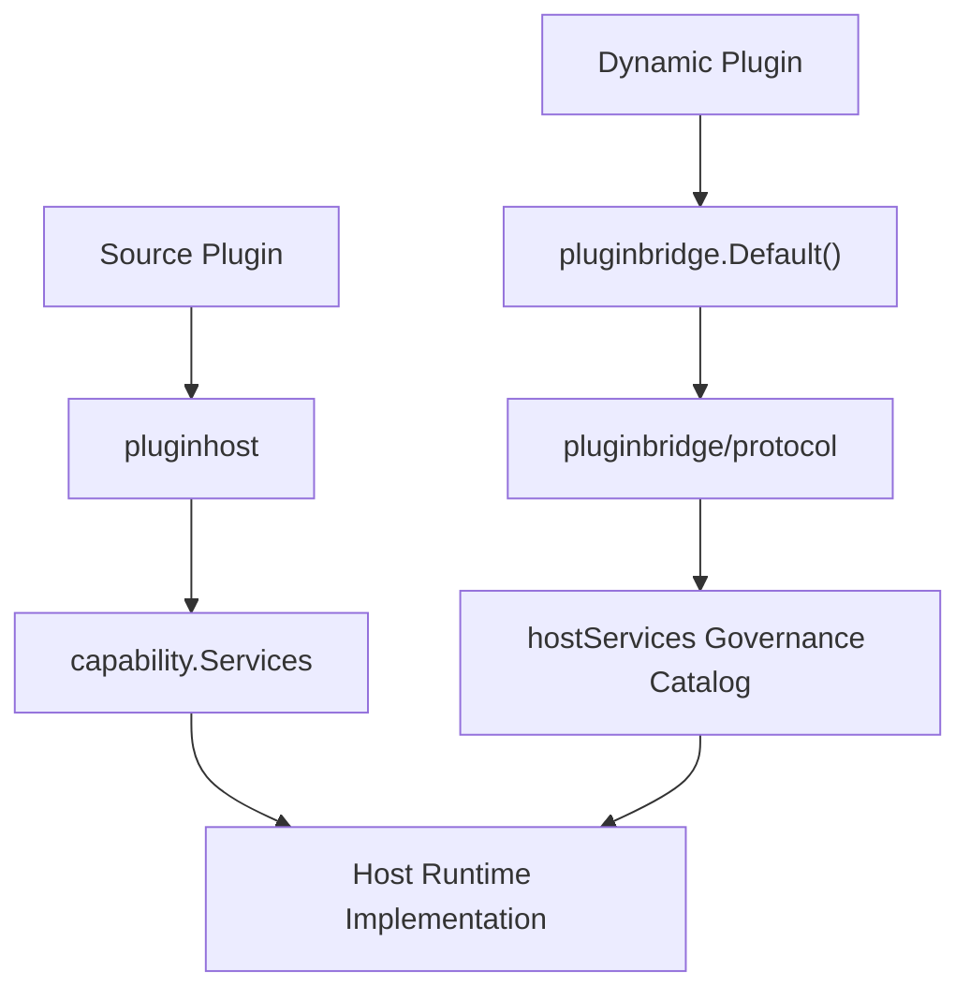
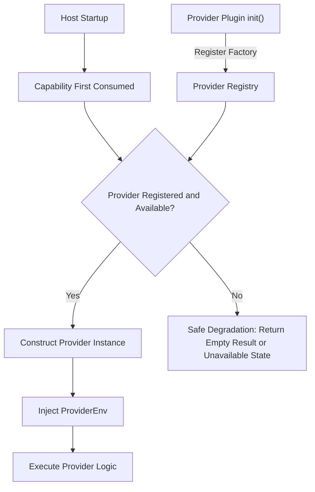
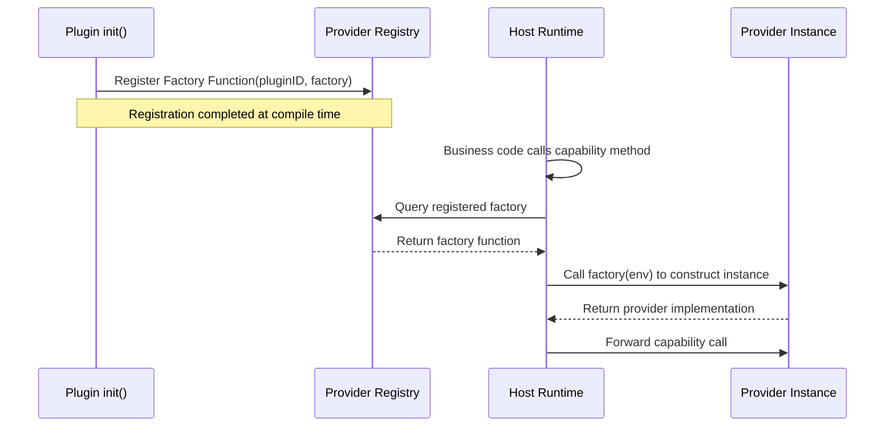

## Introduction

To improve the overall flexibility and extensibility of the framework, the core framework adopts a domain-driven design approach to model its core capabilities, organizing each domain capability's implementation and contracts in a decoupled manner. The `apps/lina-core/pkg/plugin` directory serves as the public `Go` contract boundary, exposing stable domain service interfaces to plugins. Source plugins consume the full `capability.Services` catalog through `pluginhost.Services`, while dynamic plugins consume the published `hostServices` capability subset through the `pluginbridge.Services` returned by `pluginbridge.Default()`.

## Component Structure

| Path | Responsibility |
|------|---------------|
| `capability/` | Aggregates stable host capabilities, including `Services`, `AdminServices`, plugin-scoped service bindings, and narrow interfaces for each domain. Source plugins use the full catalog directly; dynamic plugins use the published bridged subset. |
| `pluginhost/` | Source plugin host namespace providing compile-time registration interfaces and runtime callback contracts. |
| `pluginbridge/` | Dynamic plugin bridge namespace providing the `pluginbridge.Default()` / `pluginbridge.New()` runtime capability catalog, `Wasm` execution contracts, and `hostServices` encoding/decoding. |



## Declaration Phase and Runtime Phase

Plugin capabilities are divided into two phases: declaration and runtime. The declaration phase is the static registration and discovery stage where the host uses declaration output to build governance state before business execution. The runtime phase is when plugin business logic executes and consumes the domain capability services provided by the host.

For detailed design and usage of declaration-phase capabilities, see [Declaration Capabilities Overview](/docs/declaration-capabilities), including [Resource Declarations](/docs/declaration-assets), [Lifecycle Declarations](/docs/declaration-lifecycle), [Route Declarations](/docs/declaration-routes), [Job Declarations](/docs/declaration-jobs), [Hook Declarations](/docs/declaration-hooks), [Provider Declarations](/docs/declaration-providers), and [Access Control Declarations](/docs/declaration-access).

### Declaration-Phase Capabilities

Declaration-phase capabilities represent the static registration output of plugins. Source plugins register through `pluginhost.Declarations` at compile time, while dynamic plugins declare through `plugin.yaml` manifests and `pluginbridge.Declarations`.

#### Source Plugin Declaration Phase

Source plugins register the following declarations through `pluginhost.Declarations` in their `init()` function:

| Declaration Entry | Description |
|-------------------|-------------|
| `ID()` | Returns a stable plugin identifier consistent with `plugin.yaml` |
| `Assets()` | Binds the plugin's embedded filesystem, including manifest, frontend pages, `SQL`, and `i18n` resources |
| `Lifecycle()` | Registers `16` lifecycle callbacks for install, upgrade, disable, uninstall, tenant disable, tenant delete, and install mode changes |
| `Hooks()` | Subscribes to host extension point events, such as `auth.login.succeeded`, `plugin.enabled`, `system.started`, etc. |
| `HTTP()` | Registers plugin `HTTP` route contribution callbacks, triggered uniformly when the host starts |
| `Jobs()` | Registers scheduled task contribution callbacks, triggered uniformly during host scheduling |
| `Providers()` | Declares domain capability provider factories, such as `ProvideTenant`, `ProvideOrg`, and `ProvideAIText` |
| `Access()` | Registers menu filtering and permission filtering callbacks for runtime dynamic adjustment of workbench navigation and permissions |

#### Dynamic Plugin Declaration Phase

Dynamic plugins express declarations through `plugin.yaml` manifests and build-time contracts:

| Declaration Source | Description |
|--------------------|-------------|
| `plugin.yaml` | Declares plugin identity, version, dependencies, menus, permissions, multi-tenant policies, public static assets, and `hostServices` authorization requests |
| `Routes()` | Declares route group bindings specifying `API` prefix and route packages |
| `Jobs()` | Registers scheduled task contracts through `host-service` calls |
| `WASM` custom sections | Embeds metadata such as `ABI` version, runtime type, codec, and export function names in `.wasm` artifacts |
| `protocol.BridgeSpec` | Defines bridge `ABI` contract, including version, runtime type, codec method, and `alloc`/`execute` export names |

### Runtime-Phase Capabilities

Runtime-phase capabilities are the services available during plugin business logic execution. Source plugins and dynamic plugins share the same host domain capability model but with different access entry points.

#### Source Plugin Runtime

Source plugins access runtime capabilities through `pluginhost.Services`. This interface embeds `capability.Services`, directly exposing all domain capability methods, and additionally provides source-plugin-specific capabilities:

| Capability Entry | Description |
|------------------|-------------|
| All domain capabilities | Including `AI`, `Auth`, `Cache`, `Storage`, and others |
| `Admin()` | Trusted management commands such as modifying user status, replacing role permissions, revoking sessions, writing runtime config, etc. |
| `TenantFilter()` | A database query builder that appends tenant filtering conditions to plugin-owned tables |

#### Dynamic Plugin Runtime

Dynamic plugins access published runtime capabilities through `pluginbridge.Default()`. All calls are transmitted via `WASI host calls`, validated against the `hostServices` authorization snapshot by the host before dispatch. Dynamic plugins access a subset of capabilities in the dynamic service catalog, with three exclusive capabilities:

| Capability Entry | Description |
|------------------|-------------|
| Published domain capabilities | Such as `AI`, `Auth`, `Cache`, `Storage`, etc., accessed via `host-call` bridging. `I18n()` is not published as a dynamic `hostServices`. |
| `Runtime()` | Exclusive capability: log writing, plugin state read/write, time retrieval, `UUID` generation, node identity reading |
| `Network()` | Exclusive capability: governed outbound `HTTP` requests, requiring authorized target addresses declared in `plugin.yaml` |
| `RecordStore()` | Exclusive capability: `data` service ORM-like wrapper, with access only to declared plugin-owned tables |

#### `AdminServices` Boundary

`capability.AdminServices` is the management command catalog for trusted source plugins, exposed only through `pluginhost.Services.Admin()`. Source plugins can receive domain-governed management capabilities within the host process, such as user management, permission management, notification management, forced session revocation, and plugin governance commands.

The `pluginbridge.Services` interface for dynamic plugins does not provide an `Admin()` entry point, so dynamic plugins cannot directly use `sessioncap.AdminService`, `notifycap.AdminService`, or other domain `AdminService` interfaces. Dynamic plugins can only call specific methods that have been published as dynamic `hostServices`, declared in `plugin.yaml`, authorized by the host, and registered in the `WASM host-service` dispatcher.

For example, the current `sessions` dynamic service only provides `sessions.search` and `sessions.batch_get`, and does not include the forced revocation command corresponding to `sessioncap.AdminService.RevokeSession`. If a management action needs to be made available to dynamic plugins in the future, the management interface will be considered for opening.

## Domain Capability Overview

| Method | Domain Documentation | Description |
|--------|---------------------|-------------|
| `AI()` | [AI Capability](/docs/domain-capability-ai) | Aggregates text, image, embedding, audio, vision, document, safety, and video sub-capabilities |
| `APIDoc()` | [API Documentation Capability](/docs/domain-capability-apidoc) | Resolves route operation keys, localized module labels, and operation summaries |
| `Auth()` | [Authentication and Authorization](/docs/domain-capability-auth) | Aggregates `Token()` and `Authz()` sub-capabilities |
| `Users()` | [Users Capability](/docs/domain-capability-users) | User views, search, and visibility checks |
| `BizCtx()` | [Business Context Capability](/docs/domain-capability-bizctx) | Reads current request user, tenant, impersonation, and platform bypass status |
| `Cache()` | [Cache Capability](/docs/domain-capability-cache) | Plugin-scoped runtime cache |
| `Dict()` | [Dictionary Capability](/docs/domain-capability-dict) | Dictionary label resolution and view refresh |
| `Files()` | [Files Capability](/docs/domain-capability-files) | File views and visibility checks |
| `HostConfig()` | [Configuration Management](/docs/domain-capability-hostconfig) | Reads host configuration values; dynamic plugins must declare `keys` |
| `I18n()` | [Internationalization Capability](/docs/domain-capability-i18n) | Runtime translation for source plugins; no corresponding `host service` for dynamic plugins |
| `Infra()` | [Infrastructure Capability](/docs/domain-capability-infra) | Infrastructure component status views |
| `Jobs()` | [Jobs and Scheduling](/docs/domain-capability-jobs) | Scheduled task view reading |
| `Manifest()` | [Manifest Resource Capability](/docs/domain-capability-manifest) | Reads read-only resources under the current plugin's `manifest/` directory |
| `Notifications()` | [Notification Capability](/docs/domain-capability-notifications) | Notification message view reading |
| `Org()` | [Organization Capability](/docs/domain-capability-org) | Optional organization capability for reading user department and position views |
| `Plugins()` | [Plugin Governance](/docs/domain-capability-plugins) | Aggregates plugin registry, plugin configuration, plugin state, and lifecycle sub-capabilities |
| `Route()` | [Dynamic Route Capability](/docs/domain-capability-route) | Reads current dynamic route metadata |
| `Sessions()` | [Online Sessions Capability](/docs/domain-capability-sessions) | Online session search and batch reading |
| `Storage()` | [Files Capability](/docs/domain-capability-files) | Plugin-scoped object storage operations |
| `Tenant()` | [Tenant Capability](/docs/domain-capability-tenant) | Optional tenant capability for reading current tenant, visibility, switch validation, and source plugin tenant filtering |
| `Lock()` | [Distributed Lock Capability](/docs/domain-capability-lock) | Plugin-visible distributed lock acquisition, renewal, and release |

Plugin-scoped capabilities are bound to the plugin identity by the host. For example, `Plugins().Config()` only reads the current plugin's own `config.yaml`, `Manifest()` only reads the current plugin's `manifest/` resources, and `AI()` injects the source plugin `ID` into subsequent provider requests.

## SPI Architecture Design

Some domain capabilities are optional framework capabilities. They are not built into the core framework but are implemented by provider plugins and injected into the host runtime. Capabilities currently using the `SPI` pattern include `AI`, `Org`, and `Tenant`, with their corresponding official provider plugins being `linapro-ai-core`, `linapro-org-core`, and `linapro-tenant-core` respectively.

### Architecture Design

The core idea of the `SPI` (Service Provider Interface) pattern is to separate the capability contract from the capability implementation. The host defines the public interfaces for domain capabilities (the `SPI` contracts), while provider plugins implement the specific business logic. The host uses deferred construction to avoid hard dependencies on optional plugins during startup. Only when a capability is first consumed does the host instantiate the provider.



| Design Aspect | Description |
|---------------|-------------|
| Deferred Construction | The host only constructs a provider instance when the capability is first consumed, avoiding hard dependencies on optional plugins during startup |
| Safe Degradation | When no provider is available, the capability returns an empty result or unavailable state instead of `nil` or an error |
| Source Injection | The host injects request context, plugin identity, and helper capabilities into the provider via `ProviderEnv` |
| Enablement State Isolation | Provider state is independent of business entry visibility. A plugin's business entry may be invisible to the current tenant, but it can still serve as a platform capability provider |

### SPI Service Registration

Source plugins declare `SPI` factories through `pluginhost.Declarations.Providers()`. Each factory is a constructor function that receives a `ProviderEnv` parameter and returns a provider instance:



`ProviderEnv` is the runtime context injected by the host into the provider, typically including:

| Injection Item | Description |
|----------------|-------------|
| Plugin Identity | The `ID` of the current provider plugin, used for auditing and isolation |
| Request Context | The current request's tenant, user, and other business context |
| Helper Capabilities | Host capabilities needed by the provider implementation, such as `TenantFilter`, user views, etc. |

### SPI Provider State Check

The host uses `Plugins().State().IsProviderEnabled()` to determine whether a provider is available. This check has different semantics from `IsEnabled`:

| Check Method | Semantics | Use Case |
|--------------|-----------|----------|
| `IsEnabled` | Whether the plugin's business entry is visible to the current tenant | Menu filtering, route visibility, permission filtering |
| `IsProviderEnabled` | Whether the plugin is platform-enabled and can accept framework capability provider calls | Pre-check before `AI`, `Org`, `Tenant`, and other capability calls |

Provider checks ensure that platform-level capabilities continue to function even when business entries are disabled at the tenant level.

### Implementing an SPI Provider as a Plugin

Implementing an `SPI` provider as a source plugin involves two steps: registration and implementation. Using the `Org` capability as an example:

**Registering an SPI Factory:**

The provider plugin registers a factory function through the `Providers()` declaration entry in its `init()` function:

```go
func init() {
    plugin := pluginhost.NewDeclarations("my-author-my-org-provider")
    if err := plugin.Providers().ProvideOrg(func(ctx context.Context, env orgspi.ProviderEnv) (orgspi.Provider, error) {
        return &myOrgProvider{env: env}, nil
    }); err != nil {
        panic(err)
    }

    if err := pluginhost.RegisterSourcePlugin(plugin); err != nil {
        panic(err)
    }
}
```

**Implementing the SPI Contract:**

The provider must implement the `Provider` interface defined in the capability's domain package. Using `orgcap.Provider` as an example, the provider needs to implement complete organization capabilities such as department views and position views:

```go
type myOrgProvider struct {
    env orgcap.ProviderEnv
}

func (p *myOrgProvider) ListUserDeptAssignments(ctx context.Context, userIDs []string) ([]DeptAssignment, error) {
    // Query the provider's own organization data
    // Access host-injected helper capabilities through p.env
}

func (p *myOrgProvider) GetUserDeptInfo(ctx context.Context, userID string) (*DeptInfo, error) {
    // Implement department info query
}
```

Each capability's provider interface is defined in its corresponding domain capability package:

| Capability | `SPI` Interface | `SPI` Package | Official Plugin |
|------------|----------------|---------------|-----------------|
| `AI` | Independent interfaces per sub-capability | `aicap` | `linapro-ai-core` |
| `Org` | `orgcap.Provider` | `orgcap` | `linapro-org-core` |
| `Tenant` | `tenantcap.Provider` + `tenantcap.Resolver` | `tenantcap` | `linapro-tenant-core` |

The `Tenant` capability additionally provides the `tenantcap.Resolver` interface, which is responsible for resolving tenant identity from `HTTP` requests. It can compose a chain of responsibility based on request headers, domains, paths, tokens, or other strategies.

### Dynamic Plugins and SPI

Dynamic plugins cannot directly register `SPI` factories because providers must implement `Go` interfaces and run within the host process. Dynamic plugins interact with `SPI` capabilities in the following ways:

| Interaction Method | Description |
|--------------------|-------------|
| Consuming `SPI` capabilities | Calling published `SPI` capability methods through `hostServices` declarations, such as `service: ai`, `service: org`, `service: tenant` |
| Checking `SPI` provider state | Using the `plugins.provider_enabled.check` dynamic method to determine provider availability |
| Status queries | Using `capability.available` and `capability.status` dynamic methods to query capability availability and active providers |

Dynamic plugins declare consumption of `SPI` capabilities in `plugin.yaml`:

```yaml
hostServices:
  - service: ai
    methods:
      - text.generate
  - service: org
    methods:
      - users.dept_name.get
  - service: tenant
    methods:
      - tenants.current
```

## Dynamic `hostServices`

Dynamic plugins cannot directly access host implementation packages, nor can they use the `AdminServices` management command catalog exclusive to source plugins. They declare the host services they need to call through `hostServices` in `plugin.yaml`. A typical `hostServices` declaration in `plugin.yaml` looks like this:

```yaml
hostServices:
  - service: runtime
    methods:
      - log.write
      - state.get
      - state.set
  - service: storage
    methods:
      - put
      - get
      - list
    resources:
      paths:
        - exports/
  - service: data
    methods:
      - list
      - get
      - create
    resources:
      tables:
        - plugin_demo_reports
  - service: network
    methods:
      - request
    resources:
      - url: https://api.example.com/v1/*
  - service: hostconfig
    methods: [get]
    resources:
      keys:
        - workspace.basePath
  - service: manifest
    methods: [get]
    resources:
      paths:
        - profile.yaml
  - service: ai
    methods:
      - text.generate
```

### Resource Declaration Formats

| Resource Type | Declaration Field | Service |
|---------------|-------------------|---------|
| `none` | No `resources` declared | `runtime`, `apidoc`, `auth`, `authz`, `ai`, `users`, `bizctx`, `dict`, `files`, `infra`, `jobs`, `notifications`, `plugins`, `route`, `sessions`, `org`, `tenant` |
| `path` | `resources.paths` | `storage`, `manifest` |
| `table` | `resources.tables` | `data` |
| `key` | `resources.keys` | `hostconfig` |
| `resource` | `resources[].url` or `resources[].ref` with service-specific attributes | `network`, `cache`, `lock`, `notifications` (only `messages.send`) |

Production validation requires that `data` service tables belong to the plugin's own namespace. Dynamic plugins must not declare host core tables such as `sys_*`, nor should they target host table names for plugin data capabilities.

### Dynamic Service Catalog

| Service | Domain Documentation | Resource Type | Methods |
|---------|---------------------|---------------|---------|
| `runtime` | <span style={{whiteSpace: 'nowrap'}}>[Dynamic Runtime Capability](/docs/domain-capability-runtime)</span> | `none` | `log.write`, `state.get`, `state.set`, `state.delete`, `info.now`, `info.uuid`, `info.node` |
| `storage` | [Files Capability](/docs/domain-capability-files) | `path` | `put`, `get`, `delete`, `list`, `stat` |
| `network` | [External Network Capability](/docs/domain-capability-network) | `resource` | `request` |
| `data` | [Record Store Capability](/docs/domain-capability-recordstore) | `table` | `list`, `get`, `create`, `update`, `delete`, `transaction` |
| `cache` | [Cache Capability](/docs/domain-capability-cache) | `resource` | `get`, `set`, `delete`, `incr`, `expire` |
| `lock` | [Distributed Lock Capability](/docs/domain-capability-lock) | `resource` | `acquire`, `renew`, `release` |
| `hostconfig` | [Configuration Management](/docs/domain-capability-hostconfig) | `key` | `get` |
| `manifest` | [Manifest Resource Capability](/docs/domain-capability-manifest) | `path` | `get` |
| `apidoc` | [API Documentation Capability](/docs/domain-capability-apidoc) | `none` | `route_text.resolve`, `route_texts.resolve`, `route_title_operation_keys.find` |
| `auth` | [Authentication and Authorization](/docs/domain-capability-auth) | `none` | `tenant.select`, `tenant.switch`, `impersonation_token.issue`, `impersonation_token.revoke` |
| `authz` | [Authentication and Authorization](/docs/domain-capability-auth) | `none` | `permissions.batch_get`, `permissions.has`, `users.platform_admin.check` |
| `ai` | [AI Capability](/docs/domain-capability-ai) | `none` | `text.generate`, `image.generate`, `image.edit`, `embedding.create`, `audio.transcribe`, `audio.synthesize`, `vision.analyze`, `document.analyze`, `document.cite`, `safety.moderate`, `video.generate`, `video.edit`, `video.extend`, `video.operation.get`, `video.operation.cancel` |
| `users` | [Users Capability](/docs/domain-capability-users) | `none` | `users.batch_get`, `users.search`, `users.visible.ensure` |
| `bizctx` | [Business Context Capability](/docs/domain-capability-bizctx) | `none` | `current.get` |
| `dict` | [Dictionary Capability](/docs/domain-capability-dict) | `none` | `labels.resolve` |
| `files` | [Files Capability](/docs/domain-capability-files) | `none` | `files.batch_get`, `files.visible.ensure` |
| `infra` | [Infrastructure Capability](/docs/domain-capability-infra) | `none` | `status.batch_get` |
| `jobs` | [Jobs and Scheduling](/docs/domain-capability-jobs) | `none` | `jobs.batch_get`, `jobs.register` |
| `notifications` | [Notification Capability](/docs/domain-capability-notifications) | No resource for reads; `messages.send` uses `resources[].ref` | `messages.batch_get`, `messages.send` |
| `plugins` | [Plugin Governance](/docs/domain-capability-plugins) | `none` | `plugins.batch_get`, `plugins.tenant.list`, `plugins.enabled.check`, `plugins.provider_enabled.check`, `plugins.enabled_authoritative.check`, `config.get`, `lifecycle.tenant_plugin_disable.ensure`, `lifecycle.tenant_plugin_disabled.notify`, `lifecycle.tenant_delete.ensure`, `lifecycle.tenant_deleted.notify` |
| `route` | [Dynamic Route Capability](/docs/domain-capability-route) | `none` | `metadata.get` |
| `sessions` | [Online Sessions Capability](/docs/domain-capability-sessions) | `none` | `sessions.search`, `sessions.batch_get` |
| `org` | [Organization Capability](/docs/domain-capability-org) | `none` | `capability.available`, `capability.status`, `users.dept_assignments.list`, `users.dept_info.get`, `users.dept_name.get`, `users.dept_ids.get`, `users.post_ids.get` |
| `tenant` | [Tenant Capability](/docs/domain-capability-tenant) | `none` | `capability.available`, `capability.status`, `tenants.current`, `tenants.platform_bypass`, `tenants.visible.ensure`, `users.tenant_membership.validate`, `users.tenants.list`, `tenants.switch.validate` |
| `secret` | Reserved | `resource` | `resolve` |
| `event` | Reserved | `resource` | `publish` |
| `queue` | Reserved | `resource` | `enqueue` |

### Dynamic Plugin Exclusive Capabilities

`Runtime()`, `Network()`, and `RecordStore()` are exclusive capabilities on the `pluginbridge.Default()` catalog for dynamic plugins. They are not part of `capability.Services` because source plugins already run within the host process and can use the host's native equivalents.

| Capability | Access Entry | Description |
|------------|-------------|-------------|
| `Runtime()` | `pluginbridge.Default().Runtime()` | Dynamic plugins use the `WASI host-service` client to write logs, read/write state, read time, generate `UUID`s, and read node identity. Source plugins use the host's native logging and runtime context directly. |
| `Network()` | `pluginbridge.Default().Network()` | Dynamic plugins use `host-service` authorization for governed outbound `HTTP`. Source plugins use the host's native `HTTP client` or injected domain services. |
| `RecordStore()` | `pluginbridge.Default().RecordStore()` | Dynamic plugins use the `pluginbridge`-side facade to wrap `data host-service` protocols and typed query plans. Source plugins use their own `DAO`s or provider seams. |

## Related Documentation

- [AI Capability](/docs/domain-capability-ai)
- [Configuration Management](/docs/domain-capability-hostconfig)
- [Tenant Capability](/docs/domain-capability-tenant)
- [Record Store Capability](/docs/domain-capability-recordstore)
- [Infrastructure Capability](/docs/domain-capability-infra)
- [Dynamic Runtime Capability](/docs/domain-capability-runtime)
- [Dynamic Plugins and WASM Runtime](/docs/wasm-plugins)
