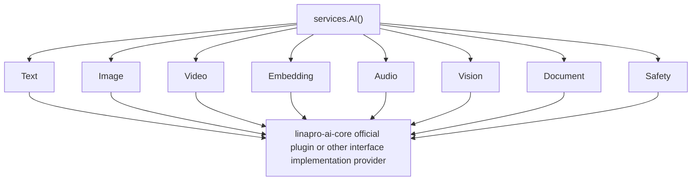

## Introduction

The `AI` capability is the typed intelligent capability namespace in the LinaPro plugin system. Source plugins access it through `services.AI()`, while dynamic plugins declare `service: ai` in `plugin.yaml` and access it through the `pluginbridge.Default().AI()` client.

The root namespace only aggregates sub-capabilities and does not directly expose all `AI` methods. Each sub-capability has its own request, response, provider contract, state, and degradation behavior. The official default `AI` capability implementation plugin is `linapro-ai-core`, and the host determines provider availability through plugin governance state.

**Capability Phase**: Runtime

**Supported Plugin Types**: Source plugins, Dynamic plugins

## Capability Design

### Sub-Capability System

The `AI` capability uses an aggregated sub-capability model where each sub-capability has independent request, response, provider contracts, and degradation behavior:

| <span style={{whiteSpace: 'nowrap'}}><strong>Sub-Capability</strong></span> | Source Entry | Dynamic Method | Description |
|--------|----------|----------|------|
| <span style={{whiteSpace: 'nowrap'}}><strong>Text</strong></span> | `AI().Text()` | `text.generate` | Text generation supporting `purpose`, tier, messages, output limit, and reasoning effort |
| <span style={{whiteSpace: 'nowrap'}}><strong>Image</strong></span> | `AI().Image()` | `image.generate`, `image.edit` | Image generation and editing with inputs/outputs expressed as protected asset references |
| <span style={{whiteSpace: 'nowrap'}}><strong>Embedding</strong></span> | `AI().Embedding()` | `embedding.create` | Create vector embeddings |
| <span style={{whiteSpace: 'nowrap'}}><strong>Audio</strong></span> | `AI().Audio()` | `audio.transcribe`, `audio.synthesize` | Audio transcription and speech synthesis |
| <span style={{whiteSpace: 'nowrap'}}><strong>Vision</strong></span> | `AI().Vision()` | `vision.analyze` | Analysis of images, screenshots, diagrams, and frame content |
| <span style={{whiteSpace: 'nowrap'}}><strong>Document</strong></span> | `AI().Document()` | `document.analyze`, `document.cite` | Document analysis and document Q&A with citations |
| <span style={{whiteSpace: 'nowrap'}}><strong>Safety</strong></span> | `AI().Safety()` | `safety.moderate` | Text and asset input safety moderation |
| <span style={{whiteSpace: 'nowrap'}}><strong>Video</strong></span> | `AI().Video()` | `video.generate`, `video.edit`, `video.extend`, `video.operation.get`, `video.operation.cancel` | Video generation, editing, extension, and provider operation query or cancellation |



### Source Identity and Governance

The host binds source identity to plugins through `aicap.ForPlugin`. This identity enters provider requests for auditing, usage attribution, issue diagnosis, and future plugin-level quota, rate limiting, tier access, and `purpose` policy decisions.

Plugins should not forge source plugin `ID`s in requests. Source plugins only need to use the bound `services.AI()`, and the source identity for dynamic plugins is generated by the host bridge layer from the current plugin artifact and authorization cache state.

### Availability and Degradation

Every sub-capability supports degradation. When no provider is configured or the provider plugin is unavailable, callers receive a structured unavailable state or error rather than a `nil` service. Plugins can call `Available()` or `Status()` to check capability state before deciding whether to show an entry point, fall back to rule-based logic, or prompt the administrator to configure the AI center.

## Interface Definitions

### Source Plugin Interface

Source plugins access sub-capabilities through `services.AI()`. Each sub-capability provides independent typed methods, such as `AI().Text().GenerateText(ctx, req)`, `AI().Image().Generate(ctx, req)`, etc. All sub-capabilities follow the unified pattern of `Available()`, `Status()`, and typed methods.

### Dynamic Plugin Interface

Dynamic plugins declare authorized sub-capability methods through `hostServices.ai`:

| Dynamic Method | Description |
|----------------|-------------|
| `text.generate` | Text generation |
| `image.generate` | Image generation |
| `image.edit` | Image editing |
| `embedding.create` | Create vector embeddings |
| `audio.transcribe` | Audio transcription |
| `audio.synthesize` | Speech synthesis |
| `vision.analyze` | Image content analysis |
| `document.analyze` | Document analysis |
| `document.cite` | Document Q&A with citations |
| `safety.moderate` | Input safety moderation |
| `video.generate` | Video generation |
| `video.edit` | Video editing |
| `video.extend` | Video extension |
| `video.operation.get` | Provider operation query |
| `video.operation.cancel` | Provider operation cancellation |

## Usage

### Source Plugin Usage

Source plugins access sub-capabilities directly through `services.AI()`. The host automatically injects the plugin source identity via `aicap.ForPlugin`, so plugins do not need to manage it manually:

```go
// Get the AI service with bound source identity in a route registration callback
aiSvc := registrar.Services().AI()

// Use the text generation sub-capability
result, err := aiSvc.Text().GenerateText(ctx, aitext.GenerateRequest{
    Purpose:  "report.summary",
    Messages: messages,
    Tier:     aitext.TierStandard,
})
```

Trusted source plugins that need to replace role permission sets should use `services.Admin().Auth().Authz().ReplaceRolePermissions`.

### Dynamic Plugin Usage

Dynamic plugins declare the required `AI` sub-capability methods in `plugin.yaml`:

```yaml
hostServices:
  - service: ai
    methods:
      - text.generate
      - document.cite
```

`purpose` and `tier` are passed at call time via request DTOs, not declared in the manifest. Dynamic plugins call through typed methods such as `pluginbridge.Default().AI().Text().GenerateText(ctx, req)`:

```go
aiSvc := pluginbridge.Default().AI()

result, err := aiSvc.Text().GenerateText(ctx, aitext.GenerateRequest{
    Purpose:  "report.summary",
    Tier:     aitext.TierStandard,
    Messages: messages,
})
```

## Design Constraints

- **Method authorization is separate from business parameters.** `plugin.yaml` only declares a method allowlist. `purpose`, `tier`, and other business parameters are passed at each call via request DTO. Authorization checks and business validation each handle their own responsibilities.
- **Use `purpose` to express business scenarios.** `purpose` is not a model name or vendor name; it is a business intent used for host governance, auditing, and quotas. It must be provided at call time.
- **Assets are passed by reference.** `AssetRef` does not carry inline file bytes or provider-authenticated download URLs. Plugins should use protected asset references.
- **Tiers are a platform abstraction.** `basic`, `standard`, and `advanced` are mapped by the host to specific models or providers. Plugins do not directly bind to vendor-internal models.
- **Metadata must not contain body content.** Request `metadata` is only suitable for short audit keys and should not contain prompts, response bodies, or sensitive data.

## Related Services

- [Domain Capabilities Overview](/docs/domain-capabilities)
- [Plugins Capability](/docs/domain-capability-plugins)
