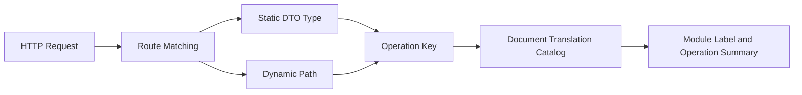

## Introduction

The `APIDocService` provides API document text query capabilities for source plugins and dynamic plugins. Source plugins access it through `services.APIDoc()`, while dynamic plugins declare `service: apidoc` in `plugin.yaml` and access it through the `pluginbridge.Default().APIDoc()` client. This service resolves route operation keys into localized module labels and operation summaries.

Typical consumers include operation logs, audit logs, and admin console filters. These features need to convert a request route into human-readable business semantics without accessing the host's `OpenAPI` generator internals.

**Capability Phase**: Runtime

**Supported Plugin Types**: Source plugins, Dynamic plugins

## Capability Design

### Operation Key Construction System

An operation key is a stable identifier. The same business operation should produce the same operation key regardless of path parameter values. The three route types use different construction strategies:

| Route Type | Construction Method | Example Semantics |
|------------|---------------------|-------------------|
| <span style={{whiteSpace: 'nowrap'}}><strong>Host Static Route</strong></span> | `BuildOperationKeyFromHandler` derives from the `DTO` type | `lina-core.backend.api.sys.user.ListReq` normalizes to `core.backend.api.sys.user.ListReq` |
| <span style={{whiteSpace: 'nowrap'}}><strong>Source Plugin Route</strong></span> | Source plugin package name normalizes to a `plugins.<plugin-id>` namespace | Avoids conflicts with host or other plugin operation keys |
| <span style={{whiteSpace: 'nowrap'}}><strong>Dynamic Plugin Route</strong></span> | `BuildOperationKeyFromPath` derives from the `/x/{pluginId}/...` path and `HTTP` method | Generates a `plugins.{pluginId}.paths.{method}.{path}` structure |

Operation keys correspond to entries in the translation catalog. `ResolveRouteText` looks up the translation catalog by operation key. When a match is found, it returns the localized `Title` and `Summary`; otherwise it returns the caller-provided fallback text.



### Translation Catalog Management

The translation catalog is managed by the host. `APIDocService` only handles lookups and fallbacks, and does not maintain translation entries. Plugin routes require namespacing. Both source plugin and dynamic plugin routes enter the `plugins.<plugin-id>` namespace to avoid conflicts.

## Interface Definitions

### Source Plugin Interface

| Method | Description |
|--------|-------------|
| `ResolveRouteText` | Resolves the localized module label and operation summary for a single route |
| `ResolveRouteTexts` | Batch resolves multiple route texts, suitable for bulk audit records |
| `FindRouteTitleOperationKeys` | Searches for matching module label operation keys by keyword |

Helper functions:

| Helper Function | Description |
|-----------------|-------------|
| `BuildOperationKeyFromHandler` | Derives an operation key from the request `DTO` type of a `GoFrame` strict route handler |
| `BuildOperationKeyFromPath` | Derives an operation key from a normalized path and `HTTP` method |
| `BuildDynamicOperationKey` | Entry point for dynamic plugin route operation key construction |

### Dynamic Plugin Interface

Dynamic plugins declare authorized methods through `hostServices.apidoc`:

| Dynamic Method | Description |
|----------------|-------------|
| `route_text.resolve` | Resolves the localized module label and operation summary for a single route |
| `route_texts.resolve` | Batch resolves multiple route texts |
| `route_title_operation_keys.find` | Searches for matching module label operation keys by keyword |

## Usage

### Source Plugin Usage

Source plugins resolve route text through `services.APIDoc()`. Typical scenarios include audit log recording and admin console filtering:

```go
// Resolve document text for a single route
text := services.APIDoc().ResolveRouteText(ctx, apidoccap.RouteTextInput{
    OperationKey:    operationKey,
    FallbackTitle:   fallbackTitle,
    FallbackSummary: fallbackSummary,
})

// Batch resolve multiple route texts
texts := services.APIDoc().ResolveRouteTexts(ctx, inputs)

// Search for matching operation keys by keyword
keys := services.APIDoc().FindRouteTitleOperationKeys(ctx, keyword)
```

Helper functions for building operation keys:

```go
// Build operation key from DTO type
key := apidoc.BuildOperationKeyFromHandler(handlerFunc)

// Build operation key from path
key := apidoc.BuildOperationKeyFromPath("/api/users", "GET")
```

### Dynamic Plugin Usage

Dynamic plugins declare the `apidoc` service and authorized methods in `plugin.yaml`:

```yaml
hostServices:
  - service: apidoc
    methods:
      - route_text.resolve
      - route_texts.resolve
```

Dynamic plugins call through the `pluginbridge.Default().APIDoc()` client:

```go
apiDocSvc := pluginbridge.Default().APIDoc()

// Resolve document text for a single route
text := apiDocSvc.ResolveRouteText(ctx, apidoccap.RouteTextInput{
    OperationKey:    operationKey,
    FallbackTitle:   fallbackTitle,
    FallbackSummary: fallbackSummary,
})

// Batch resolve multiple route texts
texts := apiDocSvc.ResolveRouteTexts(ctx, inputs)
```

## Design Constraints

- **Operation keys are stable identifiers.** The same business operation should produce the same operation key regardless of path parameter values.
- **The translation catalog is managed by the host.** `APIDocService` only handles lookups and fallbacks, and does not maintain translation entries.
- **Plugin routes require namespacing.** Both source plugin and dynamic plugin routes enter the `plugins.<plugin-id>` namespace to avoid conflicts.
- **Fallback text must be human-readable.** When a translation is not found, the caller's fallback text is returned, so audit logs still have displayable content.

## Related Services

- [Dynamic Route Capability](/docs/domain-capability-route)
- [Internationalization Capability](/docs/domain-capability-i18n)
- [Business Context Capability](/docs/domain-capability-bizctx)
