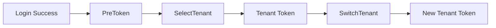

## Introduction

`services.Auth()` returns the authentication and authorization namespace. Source plugins access it through `services.Auth()`, while dynamic plugins declare `service: auth` in `plugin.yaml` and access it through the `pluginbridge.Default().Auth()` client. It contains two sub-capabilities:
- `Token()` handles tenant token selection, tenant switching, and platform admin impersonation token handoff.
- `Authz()` handles permission view reading, permission checking, and platform admin checking.

This namespace does not expose the host's `JWT` signing implementation, session storage, role tables, menu tables, or permission tables. Plugins only initiate token or authorization-related operations through stable domain contracts.

**Capability Phase**: Runtime

**Supported Plugin Types**: Source plugins, Dynamic plugins

## Capability Design

### Sub-Capability System

The `Auth` capability uses a dual sub-capability model, handling authentication tokens and authorization checks separately:



### Token Sub-Capability

`Token()` handles tenant token handoff, including host signing, token `ID`, online session state, and permission cache warm-up. Plugins must still complete business authorization and audit checks before calling.

### Authz Sub-Capability

`Authz()` handles authorization checks, returning only plugin-visible views or boolean results without exposing host role, menu, or permission table structures. Trusted source plugins that need to replace role permission sets should use `services.Admin().Auth().Authz().ReplaceRolePermissions`.

### Dynamic Plugin Identity Acquisition

After declaring `service: auth` in `plugin.yaml`, dynamic plugins access the `Token()` sub-capability through the `pluginbridge.Default().Auth()` client. The authentication result for dynamic route requests is also injected by the host into `BridgeRequestEnvelopeV1.Identity`.

## Interface Definitions

### Token Sub-Capability Interface

| Method | Description |
|--------|-------------|
| `SelectTenant` | Consumes a pre-login `PreToken` and issues an `AccessToken` and `RefreshToken` bound to the target tenant |
| `SwitchTenant` | Validates target tenant membership, revokes the current token, and issues a new tenant token |
| `IssueImpersonationToken` | Issues an impersonation token for a platform admin to enter the target tenant |
| `RevokeImpersonationToken` | Validates and revokes an impersonation access token |

### Authz Sub-Capability Interface

| Method | Description |
|--------|-------------|
| `BatchGetPermissions` | Batch reads visible permission views; missing results do not reveal specific reasons |
| `HasPermission` | Checks whether the current operator has the specified permission within the current scope |
| `IsPlatformAdmin` | Checks whether the specified user has the platform-wide data role |

### Dynamic Plugin Interface

Dynamic plugins declare authorized methods through `hostServices.auth`:

| Dynamic Method | Description |
|----------------|-------------|
| `tenant.select` | Consumes a pre-login `PreToken` and issues a token bound to the target tenant |
| `tenant.switch` | Validates target tenant membership, revokes the current token, and issues a new tenant token |
| `impersonation_token.issue` | Issues an impersonation token for a platform admin to enter the target tenant |
| `impersonation_token.revoke` | Validates and revokes an impersonation access token |

## Usage

### Source Plugin Usage

Source plugins access `Token()` and `Authz()` sub-capabilities through `services.Auth()`:

```go
// Tenant selection: issue a token bound to the target tenant
tenantToken, err := services.Auth().Token().SelectTenant(ctx, token.SelectTenantInput{
    PreToken: preToken,
    TenantID: tenantID,
})

// Tenant switching: validate membership and issue a new token
tenantToken, err = services.Auth().Token().SwitchTenant(ctx, token.SwitchTenantInput{
    BearerToken: bearerToken,
    TenantID:    targetTenantID,
})

// Permission check
has, err := services.Auth().Authz().HasPermission(ctx, capabilityCtx, permissionKey)

// Platform admin check
isAdmin, err := services.Auth().Authz().IsPlatformAdmin(ctx, capabilityCtx, userID)
```

Trusted source plugins that need to replace role permission sets:

```go
err := services.Admin().Auth().Authz().ReplaceRolePermissions(ctx, capabilityCtx, roleID, permissions)
```

### Dynamic Plugin Usage

Dynamic plugins declare the `auth` service and authorized methods in `plugin.yaml`:

```yaml
hostServices:
  - service: auth
    methods:
      - tenant.select
      - tenant.switch
```

Dynamic plugins call through the `pluginbridge.Default().Auth()` client:

```go
authSvc := pluginbridge.Default().Auth()

// Tenant selection: issue a token bound to the target tenant
tenantToken, err := authSvc.Token().SelectTenant(ctx, token.SelectTenantInput{
    PreToken: preToken,
    TenantID: tenantID,
})

// Tenant switching: validate membership and issue a new token
tenantToken, err = authSvc.Token().SwitchTenant(ctx, token.SwitchTenantInput{
    BearerToken: bearerToken,
    TenantID:    targetTenantID,
})
```

## Design Constraints

- **Plugins do not directly issue `JWT`s.** Signing, keys, expiration policies, and session registration are all controlled by the host authentication service.
- **Tenant switching must be validated.** `SwitchTenant` validates membership and revokes the old token. Clients must continue requests with the new token.
- **Authorization reads do not expose permission tables.** `Authz()` returns only plugin-visible views or boolean results without exposing host role, menu, or permission table structures.
- **Impersonation tokens require caller-side auditing.** Plugins should log who is impersonating into which tenant and for what reason.

## Related Services

- [Business Context Capability](/docs/domain-capability-bizctx)
- [Tenant Capability](/docs/domain-capability-tenant)
- [Online Sessions Capability](/docs/domain-capability-sessions)
